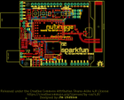
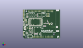
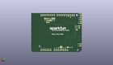
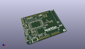

Contents
========

* [PROJ-SPAR-14997-STAN-01>LTE Cat M1 Shield](#proj-spar-14997-stan-01lte-cat-m1-shield)
	* [Images](#images)
	* [Interactive BOM](#interactive-bom)
	* [OOMP Parts](#oomp-parts)
	* [Tags](#tags)
  
![][im]
# PROJ-SPAR-14997-STAN-01>LTE Cat M1 Shield

- ID: PROJ-SPAR-14997-STAN-01
- Hex ID: PRS14997
- Name: LTE Cat M1 Shield
- Description: 

## Images
  
  

|eagleImage|kicadPcb3dFront|kicadPcb3dBack|kicadPcb3d|
| :---: | :---: | :---: | :---: |
|||||

## Interactive BOM

- Interactive BOM page: [ibom.html](kicad/bom/ibom.html)

## OOMP Parts
  

|OOMP Parts|
| :---: |
|UNMATCHED-UNMATCHED-X-UNMATCHED-01, B1, 30.479999999999997, 26.669999999999998, 270,B1, ARDUINO_UNO_R3_SHIELDNOLABELS, UNO_R3_SHIELD_NOLABELS, SparkFun-Boards, (1.2, 1.05), R270|
|CAPC-0603-X-UNMATCHED-01, C1, 7.619999999999999, 40.386, 0,C1, 1.0uF, 0603, SparkFun-Capacitors, (0.3, 1.59), R0|
|<table><tr><td></td><td> C2</td><td>[CAPC-0603-X-NF100-V50 SMD (0603) 100 nF Capacitor (Ceramic) 50v](https://github.com/oomlout/oomlout_OOMP_parts/tree/main/CAPC-0603-X-NF100-V50/)</td><td>[C6N100](https://github.com/oomlout/oomlout_OOMP_parts/tree/main/CAPC-0603-X-NF100-V50/)</td></tr></table>|
|CAPC-0603-X-UNMATCHED-01, C3, 7.619999999999999, 46.2534, 0,C3, 1.0uF, 0603, SparkFun-Capacitors, (0.3, 1.821), R0|
|<table><tr><td></td><td> C4</td><td>[CAPC-0603-X-NF100-V50 SMD (0603) 100 nF Capacitor (Ceramic) 50v](https://github.com/oomlout/oomlout_OOMP_parts/tree/main/CAPC-0603-X-NF100-V50/)</td><td>[C6N100](https://github.com/oomlout/oomlout_OOMP_parts/tree/main/CAPC-0603-X-NF100-V50/)</td></tr></table>|
|CAPC-0603-X-UNMATCHED-01, C5, 13.462, 11.049, 180,C5, 4.7uF, 0603, SparkFun-Capacitors, (0.53, 0.435), R180|
|CAPC-0603-X-UNMATCHED-01, C6, 12.7, 21.209, 0,C6, 4.7uF, 0603, SparkFun-Capacitors, (0.5, 0.835), R0|
|CAPC-0603-X-UNMATCHED-01, C7, 15.748, 18.415, 90,C7, 4.7uF, 0603, SparkFun-Capacitors, (0.62, 0.725), R90|
|<table><tr><td></td><td> C8</td><td>[CAPC-0603-X-NF100-V50 SMD (0603) 100 nF Capacitor (Ceramic) 50v](https://github.com/oomlout/oomlout_OOMP_parts/tree/main/CAPC-0603-X-NF100-V50/)</td><td>[C6N100](https://github.com/oomlout/oomlout_OOMP_parts/tree/main/CAPC-0603-X-NF100-V50/)</td></tr></table>|
|CAPC-0603-X-UNMATCHED-01, C9, 39.116, 22.86, 90,C9, 10nF, 0603, SparkFun-Capacitors, (1.54, 0.9), R90|
|CAPC-0603-X-UNMATCHED-01, C10, 40.64, 22.86, 90,C10, 15pF, 0603, SparkFun-Capacitors, (1.6, 0.9), R90|
|CAPE-0603-X-UNMATCHED-01, C11, 42.163999999999994, 22.86, 90,C11, 68pF, 0603, ublox, (1.66, 0.9), R90|
|CAPE-UNMATCHED-X-UNMATCHED-01, C12, 17.779999999999998, 19.049999999999997, 90,C12, 100uF, 1206-POLAR, ublox, (0.7, 0.75), R90|
|<table><tr><td></td><td> C13</td><td>[CAPC-0603-X-NF100-V50 SMD (0603) 100 nF Capacitor (Ceramic) 50v](https://github.com/oomlout/oomlout_OOMP_parts/tree/main/CAPC-0603-X-NF100-V50/)</td><td>[C6N100](https://github.com/oomlout/oomlout_OOMP_parts/tree/main/CAPC-0603-X-NF100-V50/)</td></tr></table>|
|CAPE-0603-X-UNMATCHED-01, C14, 26.669999999999998, 8.254999999999999, 270,C14, 47pF, 0603, SparkFun-Capacitors, (1.05, 0.325), R270|
|CAPC-0603-X-UNMATCHED-01, C15, 39.37, 27.179999996, 0,C15, 15pF, 0603, SparkFun-Capacitors, (1.55, 1.07007874), R0|
|UNMATCHED-0603-X-UNMATCHED-01, C16, 45.339, 30.479999999999997, 0,C16, DNP, 0603, SparkFun-Capacitors, (1.785, 1.2), R0|
|CAPE-0603-X-UNMATCHED-01, C17, 20.447, 8.254999999999999, 270,C17, 47pF, 0603, SparkFun-Capacitors, (0.805, 0.325), R270|
|CAPE-0603-X-UNMATCHED-01, C18, 21.971, 8.254999999999999, 270,C18, 47pF, 0603, SparkFun-Capacitors, (0.865, 0.325), R270|
|CAPC-0603-X-UNMATCHED-01, C19, 44.449999999999996, 27.179999996, 0,C19, 0, 0603, SparkFun-Resistors, (1.75, 1.07007874), R0|
|CAPE-0603-X-UNMATCHED-01, C20, 23.495, 8.254999999999999, 270,C20, 47pF, 0603, SparkFun-Capacitors, (0.925, 0.325), R270|
|UNMATCHED-UNMATCHED-X-UNMATCHED-01, D1, 8.254999999999999, 19.049999999999997, 0,D1, PRTR5V0U2F, SOT886, ublox, (0.325, 0.75), R0|
|UNMATCHED-0603-X-UNMATCHED-01, D2, 1.9049999999999998, 25.145999999999997, 0,D2, Yellow, LED-0603, SparkFun-LED, (0.075, 0.99), R0|
|UNMATCHED-UNMATCHED-X-UNMATCHED-01, D3, 17.525999999999996, 11.049, 0,D3, 1A/23V/620mV, SOD-323, SparkFun-DiscreteSemi, (0.69, 0.435), R0|
|UNMATCHED-0603-X-UNMATCHED-01, D4, 1.9049999999999998, 23.622, 180,D4, RED, LED-0603, SparkFun-LED, (0.075, 0.93), R180|
|UNMATCHED-0603-X-UNMATCHED-01, D5, 1.9049999999999998, 26.669999999999998, 0,D5, BLUE, LED-0603, SparkFun-LED, (0.075, 1.05), R0|
|UNMATCHED-UNMATCHED-X-UNMATCHED-01, D6, 31.75, 7.874, 90,D6, DT1042-04SO-7, SOT23-6L, ublox, (1.25, 0.31), R90|
|UNMATCHED-UNMATCHED-X-UNMATCHED-01, E1, 63.5, 32.638999999999996, 270,E1, MOLEX-146200, MOLEX_146200, ublox, (2.5, 1.285), R270|
|UNMATCHED-UNMATCHED-X-UNMATCHED-01, J1, 5.08, 18.923, 270,J1, USB-MICROB-PTH-MILL, SparkFun-Connectors, (0.2, 0.745), R270|
|UNMATCHED-UNMATCHED-X-UNMATCHED-01, J2, 3.556, 9.652, 90,J2, JST-2-SMD, SparkFun-Connectors, (0.14, 0.38), R90|
|UNMATCHED-UNMATCHED-X-UNMATCHED-01, J3, 5.08, 34.29, 270,J3, 1X04_1MM_RA, SparkFun-Connectors, (0.2, 1.35), R270|
|UNMATCHED-UNMATCHED-X-UNMATCHED-01, J4, 6.35, 30.479999999999997, 0,J4, 1X01_NO_SILK, SparkFun-Connectors, (0.25, 1.2), R0|
|UNMATCHED-UNMATCHED-X-UNMATCHED-01, J5, 1.27, 52.06999999999999, 270,J5, 1X06_NO_SILK, SparkFun-Connectors, (0.05, 2.05), R270|
|UNMATCHED-UNMATCHED-X-UNMATCHED-01, J6, 46.99, 40.64, 90,J6, 1X03_NO_SILK, SparkFun-Connectors, (1.85, 1.6), R90|
|UNMATCHED-UNMATCHED-X-UNMATCHED-01, J7, 44.449999999999996, 40.64, 90,J7, 1X03_NO_SILK, SparkFun-Connectors, (1.75, 1.6), R90|
|UNMATCHED-UNMATCHED-X-UNMATCHED-01, J8, 52.705, 27.179999996, 180,J8, U.FL, U.FL, SparkFun-Connectors, (2.075, 1.07007874), R180|
|UNMATCHED-UNMATCHED-X-UNMATCHED-01, J9, 26.669999999999998, 15.239999999999998, 90,J9, NANO_SIM, NANO_SIM_WURTH_693043020611, ublox, (1.05, 0.6), R90|
|UNMATCHED-UNMATCHED-X-UNMATCHED-01, J10, 3.175, 35.687, M270,J10, 1X02_NO_SILK, SparkFun-Connectors, (0.125, 1.405), MR270|
|UNMATCHED-UNMATCHED-X-UNMATCHED-01, J11, 1.27, 8.382, 90,J11, 1X02_NO_SILK, SparkFun-Connectors, (0.05, 0.33), R90|
|UNMATCHED-UNMATCHED-X-UNMATCHED-01, JP1, 27.94, 6.35, M0,JP1, IOREF-SEL, SMT-JUMPER_3_NO_SILK, SparkFun-Jumpers, (1.1, 0.25), MR0|
|UNMATCHED-UNMATCHED-X-UNMATCHED-01, JP2, 39.809999882, 45.72, M270,JP2, JUMPER-SMT_2_NC_TRACE_SILK, SMT-JUMPER_2_NC_TRACE_SILK, SparkFun-Jumpers, (1.56732283, 1.8), MR270|
|UNMATCHED-UNMATCHED-X-UNMATCHED-01, JP3, 37.269999882, 45.72, M270,JP3, JUMPER-SMT_2_NC_TRACE_SILK, SMT-JUMPER_2_NC_TRACE_SILK, SparkFun-Jumpers, (1.46732283, 1.8), MR270|
|UNMATCHED-UNMATCHED-X-UNMATCHED-01, JP4, 49.403, 45.72, M0,JP4, SMT-JUMPER_2_NC_TRACE_SILK, SparkFun-Jumpers, (1.945, 1.8), MR0|
|UNMATCHED-UNMATCHED-X-UNMATCHED-01, JP5, 42.037, 43.18, M180,JP5, SMT-JUMPER_2_NC_TRACE_SILK, SparkFun-Jumpers, (1.655, 1.7), MR180|
|UNMATCHED-UNMATCHED-X-UNMATCHED-01, JP6, 19.049999999999997, 6.35, M270,JP6, VUSB_DET, SMT-JUMPER_2_NO_SILK, SparkFun-Jumpers, (0.75, 0.25), MR270|
|UNMATCHED-UNMATCHED-X-UNMATCHED-01, JP7, 48.513999999999996, 26.288999999999998, 270,JP7, J-CHIP, SMT-JUMPER_2_NC_TRACE_NO-SILK, SparkFun-Jumpers, (1.91, 1.035), R270|
|UNMATCHED-UNMATCHED-X-UNMATCHED-01, JP8, 49.275999999999996, 27.176000004000002, 0,JP8, J-U.FL, SMT-JUMPER_2_NO_NO-SILK, SparkFun-Jumpers, (1.94, 1.06992126), R0|
|UNMATCHED-0603-X-UNMATCHED-01, L1, 41.91, 28.026000081999996, 270,L1, 39nH, 0603, ublox, (1.65, 1.10338583), R270|
|UNMATCHED-0603-X-UNMATCHED-01, L2, 46.901999922, 28.066999999999997, 90,L2, DNP, 0603, ublox, (1.84653543, 1.105), R90|
|UNMATCHED-UNMATCHED-X-UNMATCHED-01, Q1, 17.525999999999996, 13.589, 270,Q1, 2.5A/30V/105m?, SOT23-3, SparkFun-DiscreteSemi, (0.69, 0.535), R270|
|UNMATCHED-UNMATCHED-X-UNMATCHED-01, Q2, 3.8099999999999996, 29.209999999999997, 270,Q2, 600mA/40V, SOT23-3, SparkFun-DiscreteSemi, (0.15, 1.15), R270|
|<table><tr><td></td><td> R1</td><td>[RESE-0603-X-O473-01 SMD (0603) 47k Ohm Resistor](https://github.com/oomlout/oomlout_OOMP_parts/tree/main/RESE-0603-X-O473-01/)</td><td>[R6473](https://github.com/oomlout/oomlout_OOMP_parts/tree/main/RESE-0603-X-O473-01/)</td></tr></table>|
|RESE-0603-X-UNMATCHED-01, R2, 7.365999999999999, 25.145999999999997, 180,R2, 1k, 0603, SparkFun-Resistors, (0.29, 0.99), R180|
|RESE-0603-X-UNMATCHED-01, R3, 11.43, 13.97, 90,R3, 2.0k, 0603, SparkFun-Resistors, (0.45, 0.55), R90|
|<table><tr><td></td><td> R4</td><td>[RESE-0603-X-O103-01 SMD (0603) 10k Ohm Resistor](https://github.com/oomlout/oomlout_OOMP_parts/tree/main/RESE-0603-X-O103-01/)</td><td>[R6103](https://github.com/oomlout/oomlout_OOMP_parts/tree/main/RESE-0603-X-O103-01/)</td></tr></table>|
|RESE-0603-X-UNMATCHED-01, R5, 7.365999999999999, 23.622, 0,R5, 1k, 0603, SparkFun-Resistors, (0.29, 0.93), R0|
|<table><tr><td></td><td> R6</td><td>[RESE-0603-X-O103-01 SMD (0603) 10k Ohm Resistor](https://github.com/oomlout/oomlout_OOMP_parts/tree/main/RESE-0603-X-O103-01/)</td><td>[R6103](https://github.com/oomlout/oomlout_OOMP_parts/tree/main/RESE-0603-X-O103-01/)</td></tr></table>|
|RESE-0603-X-UNMATCHED-01, R7, 7.365999999999999, 26.669999999999998, 180,R7, 1k, 0603, SparkFun-Resistors, (0.29, 1.05), R180|
|RESE-0603-X-UNMATCHED-01, R8, 44.449999999999996, 32.892999999999994, 270,R8, DNP, 0603, SparkFun-Resistors, (1.75, 1.295), R270|
|UNMATCHED-UNMATCHED-X-UNMATCHED-01, S1, 37.465, 43.18, 180,S1, SWITCH_DPDT_SMD_AYZ0202, SparkFun-Switches, (1.475, 1.7), R180|
|UNMATCHED-UNMATCHED-X-UNMATCHED-01, S2, 13.258799999999999, 3.8099999999999996, 180,S2, SWITCH_DPDT_SMD_AYZ0202, SparkFun-Switches, (0.522, 0.15), R180|
|UNMATCHED-UNMATCHED-X-UNMATCHED-01, S3, 19.049999999999997, 43.18, 270,S3, PWR_ON, TACTILE_SWITCH_SMD_5.2MM, SparkFun-Switches, (0.75, 1.7), R270|
|UNMATCHED-UNMATCHED-X-UNMATCHED-01, S4, 12.7, 43.18, 270,S4, RESET, TACTILE_SWITCH_SMD_5.2MM, SparkFun-Switches, (0.5, 1.7), R270|
|UNMATCHED-UNMATCHED-X-UNMATCHED-01, U1, 30.479999999999997, 43.18, 0,U1, TXB0104, TSSOP14, SparkFun-IC-Comms, (1.2, 1.7), R0|
|UNMATCHED-UNMATCHED-X-UNMATCHED-01, U2, 7.619999999999999, 43.18, 0,U2, AP2112K-3.3, SOT23-5, SparkFun-IC-Power, (0.3, 1.7), R0|
|UNMATCHED-UNMATCHED-X-UNMATCHED-01, U3, 13.97, 13.97, 0,U3, MCP73831, SOT23-5, SparkFun-PowerIC, (0.55, 0.55), R0|
|UNMATCHED-UNMATCHED-X-UNMATCHED-01, U4, 24.13, 43.18, 90,U4, TCA9406DCU, VSSOP-8, ublox, (0.95, 1.7), R90|
|UNMATCHED-UNMATCHED-X-UNMATCHED-01, U5, 12.7, 18.541999999999998, 90,U5, AP7361C-33FGE, 8-UDFN, ublox, (0.5, 0.73), R90|
|UNMATCHED-UNMATCHED-X-UNMATCHED-01, U6, 22.86, 30.479999999999997, 180,U6, SARA-R410M-2B, SARA-LGA, ublox, (0.9, 1.2), R180|

## Tags

- hexID: PRS14997
- oompType: PROJ
- oompSize: SPAR
- oompColor: 14997
- oompDesc: STAN
- oompIndex: 01
- oompName: LTE Cat M1 Shield
- sources: All source files from https://github.com/sparkfun/LTE_Cat_M1_Shield (source licence details in srcLicense.md)
- linkBuyPage: https://www.sparkfun.com/products/14997
- oompID: PROJ-SPAR-14997-STAN-01
- oompPart: UNMATCHED-UNMATCHED-X-UNMATCHED-01, B1, 30.479999999999997, 26.669999999999998, 270
- oompPart: CAPC-0603-X-UNMATCHED-01, C1, 7.619999999999999, 40.386, 0
- oompPart: CAPC-0603-X-NF100-V50, C2, 26.669999999999998, 45.084999999999994, 270
- oompPart: CAPC-0603-X-UNMATCHED-01, C3, 7.619999999999999, 46.2534, 0
- oompPart: CAPC-0603-X-NF100-V50, C4, 26.669999999999998, 41.275, 90
- oompPart: CAPC-0603-X-UNMATCHED-01, C5, 13.462, 11.049, 180
- oompPart: CAPC-0603-X-UNMATCHED-01, C6, 12.7, 21.209, 0
- oompPart: CAPC-0603-X-UNMATCHED-01, C7, 15.748, 18.415, 90
- oompPart: CAPC-0603-X-NF100-V50, C8, 37.592, 22.86, 90
- oompPart: CAPC-0603-X-UNMATCHED-01, C9, 39.116, 22.86, 90
- oompPart: CAPC-0603-X-UNMATCHED-01, C10, 40.64, 22.86, 90
- oompPart: CAPE-0603-X-UNMATCHED-01, C11, 42.163999999999994, 22.86, 90
- oompPart: CAPE-UNMATCHED-X-UNMATCHED-01, C12, 17.779999999999998, 19.049999999999997, 90
- oompPart: CAPC-0603-X-NF100-V50, C13, 25.019, 8.254999999999999, 270
- oompPart: CAPE-0603-X-UNMATCHED-01, C14, 26.669999999999998, 8.254999999999999, 270
- oompPart: CAPC-0603-X-UNMATCHED-01, C15, 39.37, 27.179999996, 0
- oompPart: UNMATCHED-0603-X-UNMATCHED-01, C16, 45.339, 30.479999999999997, 0
- oompPart: CAPE-0603-X-UNMATCHED-01, C17, 20.447, 8.254999999999999, 270
- oompPart: CAPE-0603-X-UNMATCHED-01, C18, 21.971, 8.254999999999999, 270
- oompPart: CAPC-0603-X-UNMATCHED-01, C19, 44.449999999999996, 27.179999996, 0
- oompPart: CAPE-0603-X-UNMATCHED-01, C20, 23.495, 8.254999999999999, 270
- oompPart: UNMATCHED-UNMATCHED-X-UNMATCHED-01, D1, 8.254999999999999, 19.049999999999997, 0
- oompPart: UNMATCHED-0603-X-UNMATCHED-01, D2, 1.9049999999999998, 25.145999999999997, 0
- oompPart: UNMATCHED-UNMATCHED-X-UNMATCHED-01, D3, 17.525999999999996, 11.049, 0
- oompPart: UNMATCHED-0603-X-UNMATCHED-01, D4, 1.9049999999999998, 23.622, 180
- oompPart: UNMATCHED-0603-X-UNMATCHED-01, D5, 1.9049999999999998, 26.669999999999998, 0
- oompPart: UNMATCHED-UNMATCHED-X-UNMATCHED-01, D6, 31.75, 7.874, 90
- oompPart: UNMATCHED-UNMATCHED-X-UNMATCHED-01, E1, 63.5, 32.638999999999996, 270
- oompPart: SKIP-UNMATCHED-X-UNMATCHED-01, FD1, 67.437, 0.635, M0
- oompPart: SKIP-UNMATCHED-X-UNMATCHED-01, FD2, 3.175, 52.577999999999996, M0
- oompPart: SKIP-UNMATCHED-X-UNMATCHED-01, FD3, 3.175, 52.577999999999996, 0
- oompPart: SKIP-UNMATCHED-X-UNMATCHED-01, FD4, 67.437, 0.635, 0
- oompPart: UNMATCHED-UNMATCHED-X-UNMATCHED-01, J1, 5.08, 18.923, 270
- oompPart: UNMATCHED-UNMATCHED-X-UNMATCHED-01, J2, 3.556, 9.652, 90
- oompPart: UNMATCHED-UNMATCHED-X-UNMATCHED-01, J3, 5.08, 34.29, 270
- oompPart: UNMATCHED-UNMATCHED-X-UNMATCHED-01, J4, 6.35, 30.479999999999997, 0
- oompPart: UNMATCHED-UNMATCHED-X-UNMATCHED-01, J5, 1.27, 52.06999999999999, 270
- oompPart: UNMATCHED-UNMATCHED-X-UNMATCHED-01, J6, 46.99, 40.64, 90
- oompPart: UNMATCHED-UNMATCHED-X-UNMATCHED-01, J7, 44.449999999999996, 40.64, 90
- oompPart: UNMATCHED-UNMATCHED-X-UNMATCHED-01, J8, 52.705, 27.179999996, 180
- oompPart: UNMATCHED-UNMATCHED-X-UNMATCHED-01, J9, 26.669999999999998, 15.239999999999998, 90
- oompPart: UNMATCHED-UNMATCHED-X-UNMATCHED-01, J10, 3.175, 35.687, M270
- oompPart: UNMATCHED-UNMATCHED-X-UNMATCHED-01, J11, 1.27, 8.382, 90
- oompPart: UNMATCHED-UNMATCHED-X-UNMATCHED-01, JP1, 27.94, 6.35, M0
- oompPart: UNMATCHED-UNMATCHED-X-UNMATCHED-01, JP2, 39.809999882, 45.72, M270
- oompPart: UNMATCHED-UNMATCHED-X-UNMATCHED-01, JP3, 37.269999882, 45.72, M270
- oompPart: UNMATCHED-UNMATCHED-X-UNMATCHED-01, JP4, 49.403, 45.72, M0
- oompPart: UNMATCHED-UNMATCHED-X-UNMATCHED-01, JP5, 42.037, 43.18, M180
- oompPart: UNMATCHED-UNMATCHED-X-UNMATCHED-01, JP6, 19.049999999999997, 6.35, M270
- oompPart: UNMATCHED-UNMATCHED-X-UNMATCHED-01, JP7, 48.513999999999996, 26.288999999999998, 270
- oompPart: UNMATCHED-UNMATCHED-X-UNMATCHED-01, JP8, 49.275999999999996, 27.176000004000002, 0
- oompPart: UNMATCHED-0603-X-UNMATCHED-01, L1, 41.91, 28.026000081999996, 270
- oompPart: UNMATCHED-0603-X-UNMATCHED-01, L2, 46.901999922, 28.066999999999997, 90
- oompPart: UNMATCHED-UNMATCHED-X-UNMATCHED-01, Q1, 17.525999999999996, 13.589, 270
- oompPart: UNMATCHED-UNMATCHED-X-UNMATCHED-01, Q2, 3.8099999999999996, 29.209999999999997, 270
- oompPart: RESE-0603-X-O473-01, R1, 7.619999999999999, 38.862, 0
- oompPart: RESE-0603-X-UNMATCHED-01, R2, 7.365999999999999, 25.145999999999997, 180
- oompPart: RESE-0603-X-UNMATCHED-01, R3, 11.43, 13.97, 90
- oompPart: RESE-0603-X-O103-01, R4, 17.399, 9.524999999999999, 0
- oompPart: RESE-0603-X-UNMATCHED-01, R5, 7.365999999999999, 23.622, 0
- oompPart: RESE-0603-X-O103-01, R6, 1.27, 29.209999999999997, 270
- oompPart: RESE-0603-X-UNMATCHED-01, R7, 7.365999999999999, 26.669999999999998, 180
- oompPart: RESE-0603-X-UNMATCHED-01, R8, 44.449999999999996, 32.892999999999994, 270
- oompPart: UNMATCHED-UNMATCHED-X-UNMATCHED-01, S1, 37.465, 43.18, 180
- oompPart: UNMATCHED-UNMATCHED-X-UNMATCHED-01, S2, 13.258799999999999, 3.8099999999999996, 180
- oompPart: UNMATCHED-UNMATCHED-X-UNMATCHED-01, S3, 19.049999999999997, 43.18, 270
- oompPart: UNMATCHED-UNMATCHED-X-UNMATCHED-01, S4, 12.7, 43.18, 270
- oompPart: UNMATCHED-UNMATCHED-X-UNMATCHED-01, U1, 30.479999999999997, 43.18, 0
- oompPart: UNMATCHED-UNMATCHED-X-UNMATCHED-01, U2, 7.619999999999999, 43.18, 0
- oompPart: UNMATCHED-UNMATCHED-X-UNMATCHED-01, U3, 13.97, 13.97, 0
- oompPart: UNMATCHED-UNMATCHED-X-UNMATCHED-01, U4, 24.13, 43.18, 90
- oompPart: UNMATCHED-UNMATCHED-X-UNMATCHED-01, U5, 12.7, 18.541999999999998, 90
- oompPart: UNMATCHED-UNMATCHED-X-UNMATCHED-01, U6, 22.86, 30.479999999999997, 180
- rawPart: B1, ARDUINO_UNO_R3_SHIELDNOLABELS, UNO_R3_SHIELD_NOLABELS, SparkFun-Boards, (1.2, 1.05), R270
- rawPart: C1, 1.0uF, 0603, SparkFun-Capacitors, (0.3, 1.59), R0
- rawPart: C2, 0.1uF, 0603, SparkFun-Capacitors, (1.05, 1.775), R270
- rawPart: C3, 1.0uF, 0603, SparkFun-Capacitors, (0.3, 1.821), R0
- rawPart: C4, 0.1uF, 0603, SparkFun-Capacitors, (1.05, 1.625), R90
- rawPart: C5, 4.7uF, 0603, SparkFun-Capacitors, (0.53, 0.435), R180
- rawPart: C6, 4.7uF, 0603, SparkFun-Capacitors, (0.5, 0.835), R0
- rawPart: C7, 4.7uF, 0603, SparkFun-Capacitors, (0.62, 0.725), R90
- rawPart: C8, 0.1uF, 0603, SparkFun-Capacitors, (1.48, 0.9), R90
- rawPart: C9, 10nF, 0603, SparkFun-Capacitors, (1.54, 0.9), R90
- rawPart: C10, 15pF, 0603, SparkFun-Capacitors, (1.6, 0.9), R90
- rawPart: C11, 68pF, 0603, ublox, (1.66, 0.9), R90
- rawPart: C12, 100uF, 1206-POLAR, ublox, (0.7, 0.75), R90
- rawPart: C13, 0.1uF, 0603, SparkFun-Capacitors, (0.985, 0.325), R270
- rawPart: C14, 47pF, 0603, SparkFun-Capacitors, (1.05, 0.325), R270
- rawPart: C15, 15pF, 0603, SparkFun-Capacitors, (1.55, 1.07007874), R0
- rawPart: C16, DNP, 0603, SparkFun-Capacitors, (1.785, 1.2), R0
- rawPart: C17, 47pF, 0603, SparkFun-Capacitors, (0.805, 0.325), R270
- rawPart: C18, 47pF, 0603, SparkFun-Capacitors, (0.865, 0.325), R270
- rawPart: C19, 0, 0603, SparkFun-Resistors, (1.75, 1.07007874), R0
- rawPart: C20, 47pF, 0603, SparkFun-Capacitors, (0.925, 0.325), R270
- rawPart: D1, PRTR5V0U2F, SOT886, ublox, (0.325, 0.75), R0
- rawPart: D2, Yellow, LED-0603, SparkFun-LED, (0.075, 0.99), R0
- rawPart: D3, 1A/23V/620mV, SOD-323, SparkFun-DiscreteSemi, (0.69, 0.435), R0
- rawPart: D4, RED, LED-0603, SparkFun-LED, (0.075, 0.93), R180
- rawPart: D5, BLUE, LED-0603, SparkFun-LED, (0.075, 1.05), R0
- rawPart: D6, DT1042-04SO-7, SOT23-6L, ublox, (1.25, 0.31), R90
- rawPart: E1, MOLEX-146200, MOLEX_146200, ublox, (2.5, 1.285), R270
- rawPart: FD1, FIDUCIALUFIDUCIAL, FIDUCIAL-MICRO, SparkFun-Aesthetics, (2.655, 0.025), MR0
- rawPart: FD2, FIDUCIALUFIDUCIAL, FIDUCIAL-MICRO, SparkFun-Aesthetics, (0.125, 2.07), MR0
- rawPart: FD3, FIDUCIALUFIDUCIAL, FIDUCIAL-MICRO, SparkFun-Aesthetics, (0.125, 2.07), R0
- rawPart: FD4, FIDUCIALUFIDUCIAL, FIDUCIAL-MICRO, SparkFun-Aesthetics, (2.655, 0.025), R0
- rawPart: J1, USB-MICROB-PTH-MILL, SparkFun-Connectors, (0.2, 0.745), R270
- rawPart: J2, JST-2-SMD, SparkFun-Connectors, (0.14, 0.38), R90
- rawPart: J3, 1X04_1MM_RA, SparkFun-Connectors, (0.2, 1.35), R270
- rawPart: J4, 1X01_NO_SILK, SparkFun-Connectors, (0.25, 1.2), R0
- rawPart: J5, 1X06_NO_SILK, SparkFun-Connectors, (0.05, 2.05), R270
- rawPart: J6, 1X03_NO_SILK, SparkFun-Connectors, (1.85, 1.6), R90
- rawPart: J7, 1X03_NO_SILK, SparkFun-Connectors, (1.75, 1.6), R90
- rawPart: J8, U.FL, U.FL, SparkFun-Connectors, (2.075, 1.07007874), R180
- rawPart: J9, NANO_SIM, NANO_SIM_WURTH_693043020611, ublox, (1.05, 0.6), R90
- rawPart: J10, 1X02_NO_SILK, SparkFun-Connectors, (0.125, 1.405), MR270
- rawPart: J11, 1X02_NO_SILK, SparkFun-Connectors, (0.05, 0.33), R90
- rawPart: JP1, IOREF-SEL, SMT-JUMPER_3_NO_SILK, SparkFun-Jumpers, (1.1, 0.25), MR0
- rawPart: JP2, JUMPER-SMT_2_NC_TRACE_SILK, SMT-JUMPER_2_NC_TRACE_SILK, SparkFun-Jumpers, (1.56732283, 1.8), MR270
- rawPart: JP3, JUMPER-SMT_2_NC_TRACE_SILK, SMT-JUMPER_2_NC_TRACE_SILK, SparkFun-Jumpers, (1.46732283, 1.8), MR270
- rawPart: JP4, SMT-JUMPER_2_NC_TRACE_SILK, SparkFun-Jumpers, (1.945, 1.8), MR0
- rawPart: JP5, SMT-JUMPER_2_NC_TRACE_SILK, SparkFun-Jumpers, (1.655, 1.7), MR180
- rawPart: JP6, VUSB_DET, SMT-JUMPER_2_NO_SILK, SparkFun-Jumpers, (0.75, 0.25), MR270
- rawPart: JP7, J-CHIP, SMT-JUMPER_2_NC_TRACE_NO-SILK, SparkFun-Jumpers, (1.91, 1.035), R270
- rawPart: JP8, J-U.FL, SMT-JUMPER_2_NO_NO-SILK, SparkFun-Jumpers, (1.94, 1.06992126), R0
- rawPart: L1, 39nH, 0603, ublox, (1.65, 1.10338583), R270
- rawPart: L2, DNP, 0603, ublox, (1.84653543, 1.105), R90
- rawPart: Q1, 2.5A/30V/105m?, SOT23-3, SparkFun-DiscreteSemi, (0.69, 0.535), R270
- rawPart: Q2, 600mA/40V, SOT23-3, SparkFun-DiscreteSemi, (0.15, 1.15), R270
- rawPart: R1, 47k, 0603, SparkFun-Resistors, (0.3, 1.53), R0
- rawPart: R2, 1k, 0603, SparkFun-Resistors, (0.29, 0.99), R180
- rawPart: R3, 2.0k, 0603, SparkFun-Resistors, (0.45, 0.55), R90
- rawPart: R4, 10k, 0603, SparkFun-Resistors, (0.685, 0.375), R0
- rawPart: R5, 1k, 0603, SparkFun-Resistors, (0.29, 0.93), R0
- rawPart: R6, 10k, 0603, SparkFun-Resistors, (0.05, 1.15), R270
- rawPart: R7, 1k, 0603, SparkFun-Resistors, (0.29, 1.05), R180
- rawPart: R8, DNP, 0603, SparkFun-Resistors, (1.75, 1.295), R270
- rawPart: S1, SWITCH_DPDT_SMD_AYZ0202, SparkFun-Switches, (1.475, 1.7), R180
- rawPart: S2, SWITCH_DPDT_SMD_AYZ0202, SparkFun-Switches, (0.522, 0.15), R180
- rawPart: S3, PWR_ON, TACTILE_SWITCH_SMD_5.2MM, SparkFun-Switches, (0.75, 1.7), R270
- rawPart: S4, RESET, TACTILE_SWITCH_SMD_5.2MM, SparkFun-Switches, (0.5, 1.7), R270
- rawPart: U1, TXB0104, TSSOP14, SparkFun-IC-Comms, (1.2, 1.7), R0
- rawPart: U2, AP2112K-3.3, SOT23-5, SparkFun-IC-Power, (0.3, 1.7), R0
- rawPart: U3, MCP73831, SOT23-5, SparkFun-PowerIC, (0.55, 0.55), R0
- rawPart: U4, TCA9406DCU, VSSOP-8, ublox, (0.95, 1.7), R90
- rawPart: U5, AP7361C-33FGE, 8-UDFN, ublox, (0.5, 0.73), R90
- rawPart: U6, SARA-R410M-2B, SARA-LGA, ublox, (0.9, 1.2), R180

[im]: kicadPcb3d_450.png
