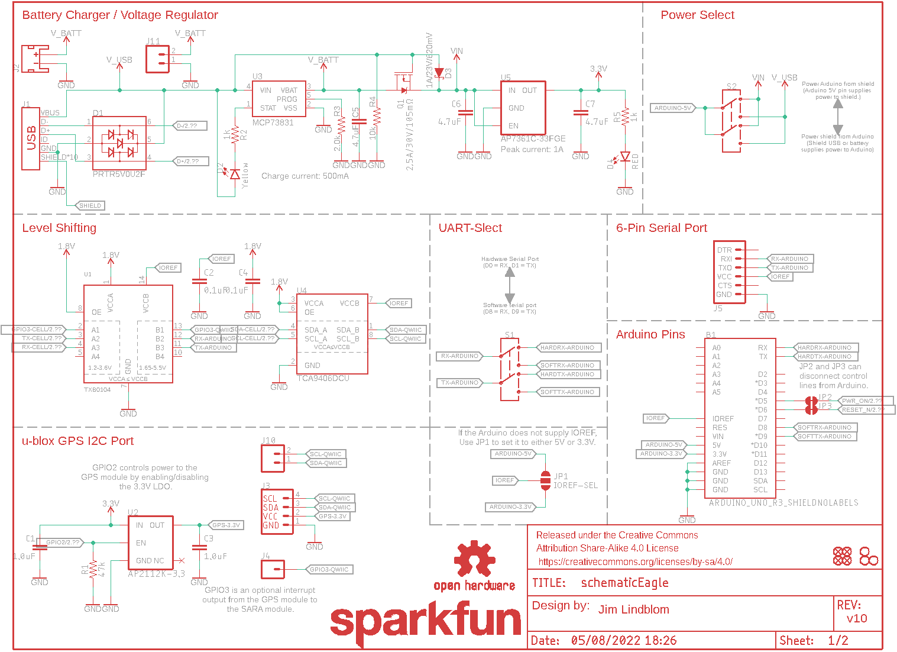
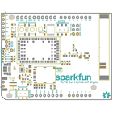
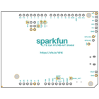
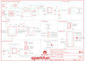
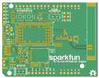
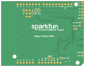

Contents
========

* [PRS14997 > LTE Cat M1 Shield](#prs14997--lte-cat-m1-shield)
	* [Schematic](#schematic)
	* [PCB](#pcb)
	* [Interactive BOM](#interactive-bom)
	* [OOMP Parts](#oomp-parts)
	* [Images](#images)
	* [Tags](#tags)
  
![][im]
# PRS14997 > LTE Cat M1 Shield

- ID: PROJ-SPAR-14997-STAN-01
- Hex ID: PRS14997
- Name: Sparkfun
- Description: Sparkfun
- Long Link: [http://oom.lt/PROJ-SPAR-14997-STAN-01](http://oom.lt/PROJ-SPAR-14997-STAN-01)
- Short Link: [http://oom.lt/PRS14997](http://oom.lt/PRS14997)

## Schematic
  

## PCB
  

## Interactive BOM

- Interactive BOM page: [ibom.html](https://htmlpreview.github.io/?https://github.com/oomlout/oomlout_OOMP_projects/blob/main/PROJ-SPAR-14997-STAN-01/kicad/bom/ibom.html)

## OOMP Parts
  

|OOMP Parts|
| :---: |
|UNMATCHED-UNMATCHED-X-UNMATCHED-01 B1, E1, J1, J2, J3, J8, J9, JP1, JP4, JP5, JP6, JP7, JP8, S1, S2, S3, S4, U1, U4, U5, U6|
|CAPC-0603-X-UNMATCHED-01 C1, C3|
|[CAPC-0603-X-NF100-V50  SMD (0603) 100 nF Capacitor (Ceramic) 50v  C2, C4, C8, C13, C19](https://github.com/oomlout/oomlout_OOMP_parts/tree/main/CAPC-0603-X-NF100-V50/)|
|[CAPC-0603-X-UF47D-V10  SMD (0603) 4.7 uF Capacitor (Ceramic) 10v  C5, C6, C7](https://github.com/oomlout/oomlout_OOMP_parts/tree/main/CAPC-0603-X-UF47D-V10/)|
|[CAPC-0603-X-NF10-V50  SMD (0603) 10 nF Capacitor (Ceramic) 50v  C9](https://github.com/oomlout/oomlout_OOMP_parts/tree/main/CAPC-0603-X-NF10-V50/)|
|[CAPC-0603-X-PF15-V50  SMD (0603) 15 pF Capacitor (Ceramic) 50v  C10, C15](https://github.com/oomlout/oomlout_OOMP_parts/tree/main/CAPC-0603-X-PF15-V50/)|
|CAPC-0603-X-PF68-01 C11|
|[CAPC-1206-X-UF100-V63D  SMD (1206) 100 uF Capacitor (Ceramic) 6.3v  C12](https://github.com/oomlout/oomlout_OOMP_parts/tree/main/CAPC-1206-X-UF100-V63D/)|
|CAPC-0603-X-PF47-01 C14, C17, C18, C20|
|DIOD-UNMATCHED-X-UNMATCHED-01 D1|
|[LEDS-0603-Y-STAN-01  SMD (0603) Yellow LED  D2](https://github.com/oomlout/oomlout_OOMP_parts/tree/main/LEDS-0603-Y-STAN-01/)|
|DIOD-S323-X-UNMATCHED-01 D3|
|[LEDS-0603-R-STAN-01  SMD (0603) Red LED  D4](https://github.com/oomlout/oomlout_OOMP_parts/tree/main/LEDS-0603-R-STAN-01/)|
|[LEDS-0603-L-STAN-01  SMD (0603) Blue LED  D5](https://github.com/oomlout/oomlout_OOMP_parts/tree/main/LEDS-0603-L-STAN-01/)|
|DIOD-SO23-X-UNMATCHED-01 D6|
|HEAD-I01-X-PI01-01 J4|
|[HEAD-I01-X-PI06-01  2.54 mm 6 Pin Header  J5](https://github.com/oomlout/oomlout_OOMP_parts/tree/main/HEAD-I01-X-PI06-01/)|
|[HEAD-I01-X-PI03-01  2.54 mm 3 Pin Header  J6, J7](https://github.com/oomlout/oomlout_OOMP_parts/tree/main/HEAD-I01-X-PI03-01/)|
|[HEAD-I01-X-PI02-01  2.54 mm 2 Pin Header  J10, J11](https://github.com/oomlout/oomlout_OOMP_parts/tree/main/HEAD-I01-X-PI02-01/)|
|UNMATCHED-0603-X-UNMATCHED-01 L1|
|MOSP-SO23-X-UNMATCHED-01 Q1|
|UNMATCHED-SO23-X-UNMATCHED-01 Q2|
|[RESE-0603-X-O473-01  SMD (0603) 47k Ohm Resistor  R1](https://github.com/oomlout/oomlout_OOMP_parts/tree/main/RESE-0603-X-O473-01/)|
|[RESE-0603-X-O102-01  SMD (0603) 1k Ohm Resistor  R2, R5, R7](https://github.com/oomlout/oomlout_OOMP_parts/tree/main/RESE-0603-X-O102-01/)|
|RESE-0603-X-UNMATCHED-01 R3, R8|
|[RESE-0603-X-O103-01  SMD (0603) 10k Ohm Resistor  R4, R6](https://github.com/oomlout/oomlout_OOMP_parts/tree/main/RESE-0603-X-O103-01/)|
|[VREG-SO235-X-KAP2112K-V33D  SMD (SOT-23-5) AP2112K Voltage Regulator 3.3v  U2](https://github.com/oomlout/oomlout_OOMP_parts/tree/main/VREG-SO235-X-KAP2112K-V33D/)|
|UNMATCHED-SO235-X-UNMATCHED-01 U3|

## Images
  
  

|bominteractivefront|bominteractiveback|kicadPcb3d|kicadPcb3dFront|kicadPcb3dBack|eagleImage|eagleSchemImage|pcbdraw|pcbdrawback|
| :---: | :---: | :---: | :---: | :---: | :---: | :---: | :---: | :---: |
||||||||||

## Tags

- hexID: PRS14997
- oompType: PROJ
- oompSize: SPAR
- oompColor: 14997
- oompDesc: STAN
- oompIndex: 01
- oompName: LTE Cat M1 Shield
- sources: All source files from https://github.com/sparkfun/LTE_Cat_M1_Shield (source licence details in srcLicense.md)
- linkBuyPage: https://www.sparkfun.com/products/14997
- oompID: PROJ-SPAR-14997-STAN-01
- oompParts: B1,UNMATCHED-UNMATCHED-X-UNMATCHED-01
- oompParts: C1,CAPC-0603-X-UNMATCHED-01
- oompParts: C2,CAPC-0603-X-NF100-V50
- oompParts: C3,CAPC-0603-X-UNMATCHED-01
- oompParts: C4,CAPC-0603-X-NF100-V50
- oompParts: C5,CAPC-0603-X-UF47D-V10
- oompParts: C6,CAPC-0603-X-UF47D-V10
- oompParts: C7,CAPC-0603-X-UF47D-V10
- oompParts: C8,CAPC-0603-X-NF100-V50
- oompParts: C9,CAPC-0603-X-NF10-V50
- oompParts: C10,CAPC-0603-X-PF15-V50
- oompParts: C11,CAPC-0603-X-PF68-01
- oompParts: C12,CAPC-1206-X-UF100-V63D
- oompParts: C13,CAPC-0603-X-NF100-V50
- oompParts: C14,CAPC-0603-X-PF47-01
- oompParts: C15,CAPC-0603-X-PF15-V50
- oompParts: C17,CAPC-0603-X-PF47-01
- oompParts: C18,CAPC-0603-X-PF47-01
- oompParts: C19,CAPC-0603-X-NF100-V50
- oompParts: C20,CAPC-0603-X-PF47-01
- oompParts: D1,DIOD-UNMATCHED-X-UNMATCHED-01
- oompParts: D2,LEDS-0603-Y-STAN-01
- oompParts: D3,DIOD-S323-X-UNMATCHED-01
- oompParts: D4,LEDS-0603-R-STAN-01
- oompParts: D5,LEDS-0603-L-STAN-01
- oompParts: D6,DIOD-SO23-X-UNMATCHED-01
- oompParts: E1,UNMATCHED-UNMATCHED-X-UNMATCHED-01
- oompParts: J1,UNMATCHED-UNMATCHED-X-UNMATCHED-01
- oompParts: J2,UNMATCHED-UNMATCHED-X-UNMATCHED-01
- oompParts: J3,UNMATCHED-UNMATCHED-X-UNMATCHED-01
- oompParts: J4,HEAD-I01-X-PI01-01
- oompParts: J5,HEAD-I01-X-PI06-01
- oompParts: J6,HEAD-I01-X-PI03-01
- oompParts: J7,HEAD-I01-X-PI03-01
- oompParts: J8,UNMATCHED-UNMATCHED-X-UNMATCHED-01
- oompParts: J9,UNMATCHED-UNMATCHED-X-UNMATCHED-01
- oompParts: J10,HEAD-I01-X-PI02-01
- oompParts: J11,HEAD-I01-X-PI02-01
- oompParts: JP1,UNMATCHED-UNMATCHED-X-UNMATCHED-01
- oompParts: JP4,UNMATCHED-UNMATCHED-X-UNMATCHED-01
- oompParts: JP5,UNMATCHED-UNMATCHED-X-UNMATCHED-01
- oompParts: JP6,UNMATCHED-UNMATCHED-X-UNMATCHED-01
- oompParts: JP7,UNMATCHED-UNMATCHED-X-UNMATCHED-01
- oompParts: JP8,UNMATCHED-UNMATCHED-X-UNMATCHED-01
- oompParts: L1,UNMATCHED-0603-X-UNMATCHED-01
- oompParts: Q1,MOSP-SO23-X-UNMATCHED-01
- oompParts: Q2,UNMATCHED-SO23-X-UNMATCHED-01
- oompParts: R1,RESE-0603-X-O473-01
- oompParts: R2,RESE-0603-X-O102-01
- oompParts: R3,RESE-0603-X-UNMATCHED-01
- oompParts: R4,RESE-0603-X-O103-01
- oompParts: R5,RESE-0603-X-O102-01
- oompParts: R6,RESE-0603-X-O103-01
- oompParts: R7,RESE-0603-X-O102-01
- oompParts: R8,RESE-0603-X-UNMATCHED-01
- oompParts: S1,UNMATCHED-UNMATCHED-X-UNMATCHED-01
- oompParts: S2,UNMATCHED-UNMATCHED-X-UNMATCHED-01
- oompParts: S3,UNMATCHED-UNMATCHED-X-UNMATCHED-01
- oompParts: S4,UNMATCHED-UNMATCHED-X-UNMATCHED-01
- oompParts: U1,UNMATCHED-UNMATCHED-X-UNMATCHED-01
- oompParts: U2,VREG-SO235-X-KAP2112K-V33D
- oompParts: U3,UNMATCHED-SO235-X-UNMATCHED-01
- oompParts: U4,UNMATCHED-UNMATCHED-X-UNMATCHED-01
- oompParts: U5,UNMATCHED-UNMATCHED-X-UNMATCHED-01
- oompParts: U6,UNMATCHED-UNMATCHED-X-UNMATCHED-01
- rawParts: B1,ARDUINO_UNO_R3_SHIELDNOLABELS,ARDUINO_UNO_R3_SHIELDNOLABELS,UNO_R3_SHIELD_NOLABELS,Arduino R3 Shield Footprint,,,,,
- rawParts: C1,1.0uF,1.0UF-0603-16V-10%,0603,1µF ceramic capacitors,CAP-00868,,,1.0uF,
- rawParts: C2,0.1uF,0.1UF-0603-25V-(+80/-20%),0603,0.1µF ceramic capacitors,CAP-00810,,,0.1uF,
- rawParts: C3,1.0uF,1.0UF-0603-16V-10%,0603,1µF ceramic capacitors,CAP-00868,,,1.0uF,
- rawParts: C4,0.1uF,0.1UF-0603-25V-(+80/-20%),0603,0.1µF ceramic capacitors,CAP-00810,,,0.1uF,
- rawParts: C5,4.7uF,4.7UF-0603-6.3V-(10%),0603,4.7µF ceramic capacitors,CAP-08280,,,4.7uF,
- rawParts: C6,4.7uF,4.7UF-0603-6.3V-(10%),0603,4.7µF ceramic capacitors,CAP-08280,,,4.7uF,
- rawParts: C7,4.7uF,4.7UF-0603-6.3V-(10%),0603,4.7µF ceramic capacitors,CAP-08280,,,4.7uF,
- rawParts: C8,0.1uF,0.1UF-0603-25V-(+80/-20%),0603,0.1µF ceramic capacitors,CAP-00810,,,0.1uF,
- rawParts: C9,10nF,10NF-0603-50V-10%,0603,0.01uF/10nF/10,000pF ceramic capacitors,CAP-00867,,,10nF,
- rawParts: C10,15pF,15PF-0603-50V-5%,0603,15pF ceramic capacitors,CAP-07881,,,15pF,
- rawParts: C11,68pF,68PF-0603-50V-5%,0603,68pF ceramic capacitors,CAP-14092,,,68pF,
- rawParts: C12,100uF,100UF-POLAR-1206-6.3V-20%,1206-POLAR,100µF polarized capacitors,CAP-14093,,,100uF,
- rawParts: C13,0.1uF,0.1UF-0603-25V-(+80/-20%),0603,0.1µF ceramic capacitors,CAP-00810,,,0.1uF,
- rawParts: C14,47pF,47PF-0603-50V-5%,0603,47pF ceramic capacitors,CAP-08913,,,47pF,
- rawParts: C15,15pF,15PF-0603-50V-5%,0603,15pF ceramic capacitors,CAP-07881,,,15pF,
- rawParts: C16,DNP,27PF-0603-50V-5%,0603,27pF ceramic capacitors,CAP-09989,,,27pF,
- rawParts: C17,47pF,47PF-0603-50V-5%,0603,47pF ceramic capacitors,CAP-08913,,,47pF,
- rawParts: C18,47pF,47PF-0603-50V-5%,0603,47pF ceramic capacitors,CAP-08913,,,47pF,
- rawParts: C19,0,0OHM-0603-1/10W-5%,0603,0Ω resistor,RES-08609,,,0,
- rawParts: C20,47pF,47PF-0603-50V-5%,0603,47pF ceramic capacitors,CAP-08913,,,47pF,
- rawParts: D1,PRTR5V0U2F,PRTR5V0U2F,SOT886,,DIO-14084,,,,
- rawParts: D2,Yellow,LED-YELLOW0603,LED-0603,Yellow SMD LED,DIO-09003,,,Yellow,
- rawParts: D3,1A/23V/620mV,DIODE-SCHOTTKY-BAT20J,SOD-323,Schottky diode,DIO-11623,,,1A/23V/620mV,
- rawParts: D4,RED,LED-RED0603,LED-0603,Red SMD LED,DIO-00819,,,RED,
- rawParts: D5,BLUE,LED-BLUE0603,LED-0603,Blue SMD LED,DIO-08575,,,BLUE,
- rawParts: D6,DT1042-04SO-7,TVS_DIODE_ARRAY_4DT1042-04SO-7,SOT23-6L,,DIO-14095,,,,
- rawParts: E1,MOLEX-146200,ANTENNA-GROUNDEDMOLEX-146200,MOLEX_146200,Antenna w/ Ground Connection,ANT-14096,,,,
- rawParts: FD1,FIDUCIALUFIDUCIAL,FIDUCIALUFIDUCIAL,FIDUCIAL-MICRO,Fiducial Alignment Points,,,,,
- rawParts: FD2,FIDUCIALUFIDUCIAL,FIDUCIALUFIDUCIAL,FIDUCIAL-MICRO,Fiducial Alignment Points,,,,,
- rawParts: FD3,FIDUCIALUFIDUCIAL,FIDUCIALUFIDUCIAL,FIDUCIAL-MICRO,Fiducial Alignment Points,,,,,
- rawParts: FD4,FIDUCIALUFIDUCIAL,FIDUCIALUFIDUCIAL,FIDUCIAL-MICRO,Fiducial Alignment Points,,,,,
- rawParts: FRAME1,FRAME-LETTER,FRAME-LETTER,CREATIVE_COMMONS,Schematic Frame - Letter,,,,,
- rawParts: FRAME2,FRAME-LETTER,FRAME-LETTER,CREATIVE_COMMONS,Schematic Frame - Letter,,,,,
- rawParts: H1,STAND-OFF,STAND-OFF,STAND-OFF,Stand Off,,,,,
- rawParts: H2,STAND-OFF,STAND-OFF,STAND-OFF,Stand Off,,,,,
- rawParts: H3,STAND-OFF,STAND-OFF,STAND-OFF,Stand Off,,,,,
- rawParts: J1,,USB_MICRO-B_HALF_PTH_MILL,USB-MICROB-PTH-MILL,USB Type Micro-B Connector,CONN-13711,,,,
- rawParts: J2,,JST_2MM_MALESMD,JST-2-SMD,JST 2MM MALE RA CONNECTOR,CONN-11443,PRT-08612,,,
- rawParts: J3,,QWIIC_CONNECTORJS-1MM,1X04_1MM_RA,SparkFun I2C Standard Qwiic Connector,CONN-13694,,,,
- rawParts: J4,,CONN_01PTH_NO_SILK_YES_STOP,1X01_NO_SILK,Single connection point. Often used as Generic Header-pin footprint for 0.1 inch spaced/style header connections,,,,,
- rawParts: J5,,6_PIN_SERIAL_TARGETNO_SILK,1X06_NO_SILK,6-pin header connection for use with the FTDI BASIC pinout - TARGET SIDE.,,,,,
- rawParts: J6,,CONN_031X03_NO_SILK,1X03_NO_SILK,Multi connection point. Often used as Generic Header-pin footprint for 0.1 inch spaced/style header connections,,,,,
- rawParts: J7,,CONN_031X03_NO_SILK,1X03_NO_SILK,Multi connection point. Often used as Generic Header-pin footprint for 0.1 inch spaced/style header connections,,,,,
- rawParts: J8,U.FL,U.FL,U.FL,SMD Antenna Connector - U.FL,CONN-09193,WRL-09144,,U.FL,
- rawParts: J9,NANO_SIM,NANO_SIMWURTH,NANO_SIM_WURTH_693043020611,,CONN-14097,,,,
- rawParts: J10,,CONN_021X02_NO_SILK,1X02_NO_SILK,Multi connection point. Often used as Generic Header-pin footprint for 0.1 inch spaced/style header connections,,,,,
- rawParts: J11,,CONN_021X02_NO_SILK,1X02_NO_SILK,Multi connection point. Often used as Generic Header-pin footprint for 0.1 inch spaced/style header connections,,,,,
- rawParts: JP1,IOREF-SEL,JUMPER-SMT_3_NO_SILK,SMT-JUMPER_3_NO_SILK,Normally open jumper,,,,,
- rawParts: JP2,JUMPER-SMT_2_NC_TRACE_SILK,JUMPER-SMT_2_NC_TRACE_SILK,SMT-JUMPER_2_NC_TRACE_SILK,Normally closed trace jumper,,,,,
- rawParts: JP3,JUMPER-SMT_2_NC_TRACE_SILK,JUMPER-SMT_2_NC_TRACE_SILK,SMT-JUMPER_2_NC_TRACE_SILK,Normally closed trace jumper,,,,,
- rawParts: JP4,,JUMPER-SMT_2_NC_TRACE_SILK,SMT-JUMPER_2_NC_TRACE_SILK,Normally closed trace jumper,,,,,
- rawParts: JP5,,JUMPER-SMT_2_NC_TRACE_SILK,SMT-JUMPER_2_NC_TRACE_SILK,Normally closed trace jumper,,,,,
- rawParts: JP6,VUSB_DET,JUMPER-SMT_2_NO_SILK,SMT-JUMPER_2_NO_SILK,Normally open jumper,,,,,
- rawParts: JP7,J-CHIP,JUMPER-SMT_2_NC_TRACE_NO-SILK,SMT-JUMPER_2_NC_TRACE_NO-SILK,Normally closed trace jumper,,,,,
- rawParts: JP8,J-U.FL,JUMPER-SMT_2_NO_NO-SILK,SMT-JUMPER_2_NO_NO-SILK,Normally open jumper,,,,,
- rawParts: L1,39nH,INDUCTOR-0603-39NH,0603,Inductors,NDUC-14091,,,39nH,
- rawParts: L2,DNP,INDUCTOR-0603-68NH,0603,Inductors,,,,68nH,
- rawParts: LOGO1,SFE_LOGO_NAME.2_INCH,SFE_LOGO_NAME.2_INCH,SFE_LOGO_NAME_.2,SparkFun Font Logo,,,,,
- rawParts: LOGO2,OSHW-LOGOM,OSHW-LOGOM,OSHW-LOGO-M,Open-Source Hardware (OSHW) Logo,,,,,
- rawParts: LOGO3,SFE_LOGO_NAME.2_INCH,SFE_LOGO_NAME.2_INCH,SFE_LOGO_NAME_.2,SparkFun Font Logo,,,,,
- rawParts: Q1,2.5A/30V/105mΩ,MOSFET_PCH-DMG2307L,SOT23-3,P-channel MOSFETs,TRANS-11308,,,2.5A/30V/105mΩ,
- rawParts: Q2,600mA/40V,TRANS_NPN-MMBT2222AL,SOT23-3,NPN transistor,TRANS-08049,,,600mA/40V,
- rawParts: R1,47k,47KOHM-0603-1/10W-1%,0603,47kΩ resistor,RES-07871,,,47k,
- rawParts: R2,1k,1KOHM-0603-1/10W-1%,0603,1kΩ resistor,RES-07856,,,1k,
- rawParts: R3,2.0k,2.0KOHM-0603-1/10W-5%,0603,2kΩ resistor,RES-08296,,,2.0k,
- rawParts: R4,10k,10KOHM-0603-1/10W-1%,0603,10kΩ resistor,RES-00824,,,10k,
- rawParts: R5,1k,1KOHM-0603-1/10W-1%,0603,1kΩ resistor,RES-07856,,,1k,
- rawParts: R6,10k,10KOHM-0603-1/10W-1%,0603,10kΩ resistor,RES-00824,,,10k,
- rawParts: R7,1k,1KOHM-0603-1/10W-1%,0603,1kΩ resistor,RES-07856,,,1k,
- rawParts: R8,DNP,10KOHM-0603-1/10W-1%,0603,10kΩ resistor,RES-00824,,,10k,
- rawParts: S1,,SWITCH-DPDT-SMD-AYZ0202,SWITCH_DPDT_SMD_AYZ0202,Double-Pole, Double-Throw (DPDT) Switch,SWCH-08179,,COM-00597,,
- rawParts: S2,,SWITCH-DPDT-SMD-AYZ0202,SWITCH_DPDT_SMD_AYZ0202,Double-Pole, Double-Throw (DPDT) Switch,SWCH-08179,,COM-00597,,
- rawParts: S3,PWR_ON,MOMENTARY-SWITCH-SPST-SMD-5.2-REDUNDANT,TACTILE_SWITCH_SMD_5.2MM,Momentary Switch (Pushbutton) - SPST,SWCH-08247,,COM-08720,,
- rawParts: S4,RESET,MOMENTARY-SWITCH-SPST-SMD-5.2-REDUNDANT,TACTILE_SWITCH_SMD_5.2MM,Momentary Switch (Pushbutton) - SPST,SWCH-08247,,COM-08720,,
- rawParts: U1,TXB0104,TXB0104PWR,TSSOP14,4-Bit Bi-Directional Level Shifter,IC-13929,,,TXB0104,
- rawParts: U2,AP2112K-3.3,V_REG_AP2112K-3.3V,SOT23-5,AP2112 - 600mA CMOS LDO Regulator w/ Enable,VREG-12457,,,3.3V,
- rawParts: U3,MCP73831,MCP73831,SOT23-5,Miniature single cell, fully integrated Li-Ion, Li-polymer charge management controller,IC-09995,,,,
- rawParts: U4,TCA9406DCU,TCA9406DCU,VSSOP-8,,IC-14098,,,,
- rawParts: U5,AP7361C-33FGE,AP7361C-33FGE,8-UDFN,AP7361C 3.3V LDO Regulator,VREG-14094,,,,
- rawParts: U6,SARA-R410M-2B,SARA-R4,SARA-LGA,,IC-14085,,,,

[im]: kicadPcb3d_450.png
