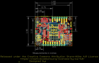
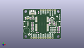
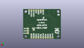
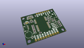

Contents
========

* [PROJ-SPAR-15005-STAN-01>Qwiic GPS-RTK](#proj-spar-15005-stan-01qwiic-gps-rtk)
	* [Images](#images)
	* [Interactive BOM](#interactive-bom)
	* [OOMP Parts](#oomp-parts)
	* [Tags](#tags)
  
![][im]
# PROJ-SPAR-15005-STAN-01>Qwiic GPS-RTK

- ID: PROJ-SPAR-15005-STAN-01
- Hex ID: PRS15005
- Name: Qwiic GPS-RTK
- Description: 

## Images
  
  

|eagleImage|kicadPcb3dFront|kicadPcb3dBack|kicadPcb3d|
| :---: | :---: | :---: | :---: |
|||||

## Interactive BOM

- Interactive BOM page: [ibom.html](kicad/bom/ibom.html)

## OOMP Parts
  

|OOMP Parts|
| :---: |
|UNMATCHED-UNMATCHED-X-UNMATCHED-01, B1, 3.8099999999999996, 8.889999999999999, 305,B1, 6.8MM_COIN_CELL, BATTCON-6.8MM, SparkFun-Batteries, (0.15, 0.35), R305|
|CAPE-0603-X-UNMATCHED-01, C1, 32.766, 18.668999999999997, 0,C1, 47pF, 0603, SparkFun-Capacitors, (1.29, 0.735), R0|
|CAPC-0603-X-UNMATCHED-01, C3, 10.16, 11.684, 0,C3, 1.0uF, 0603, SparkFun-Capacitors, (0.4, 0.46), R0|
|CAPC-0603-X-UNMATCHED-01, C4, 28.320999999999998, 16.128999999999998, 90,C4, 1.0uF, 0603, SparkFun-Capacitors, (1.115, 0.635), R90|
|<table><tr><td></td><td> C5</td><td>[CAPC-0603-X-NF100-V50 SMD (0603) 100 nF Capacitor (Ceramic) 50v](https://github.com/oomlout/oomlout_OOMP_parts/tree/main/CAPC-0603-X-NF100-V50/)</td><td>[C6N100](https://github.com/oomlout/oomlout_OOMP_parts/tree/main/CAPC-0603-X-NF100-V50/)</td></tr></table>|
|CAPC-0603-X-UNMATCHED-01, C6, 33.654999999999994, 16.128999999999998, 270,C6, 1.0uF, 0603, SparkFun-Capacitors, (1.325, 0.635), R270|
|UNMATCHED-0603-X-UNMATCHED-01, D1, 34.29, 10.795, 180,D1, Yellow, LED-0603, SparkFun-LED, (1.35, 0.425), R180|
|UNMATCHED-UNMATCHED-X-UNMATCHED-01, D2, 10.16, 8.382, 0,D2, 0.5A/40V/420mV, SOD-323, SparkFun-DiscreteSemi, (0.4, 0.33), R0|
|UNMATCHED-0603-X-UNMATCHED-01, D3, 34.29, 8.889999999999999, 180,D3, GREEN, LED-0603, SparkFun-LED, (1.35, 0.35), R180|
|UNMATCHED-0603-X-UNMATCHED-01, D4, 34.29, 6.985, 180,D4, BLUE, LED-0603, SparkFun-LED, (1.35, 0.275), R180|
|UNMATCHED-UNMATCHED-X-UNMATCHED-01, D5, 10.16, 25.145999999999997, 270,D5, PRTR5V0U2F, SOT886, funbit, (0.4, 0.99), R270|
|UNMATCHED-0603-X-UNMATCHED-01, FB1, 28.575, 21.081999999999997, 270,FB1, 30?/1.8A, 0603, SparkFun-Coils, (1.125, 0.83), R270|
|UNMATCHED-UNMATCHED-X-UNMATCHED-01, J1, 19.049999999999997, 31.75, 0,J1, 1X07_NO_SILK, SparkFun-Connectors, (0.75, 1.25), R0|
|UNMATCHED-UNMATCHED-X-UNMATCHED-01, J2, 5.08, 16.509999999999998, 270,J2, 1X04_1MM_RA, SparkFun-Connectors, (0.2, 0.65), R270|
|UNMATCHED-UNMATCHED-X-UNMATCHED-01, J3, 24.13, 1.27, 0,J3, PTH, 1X04_NO_SILK, SparkX, (0.95, 0.05), R0|
|UNMATCHED-UNMATCHED-X-UNMATCHED-01, J4, 35.559999999999995, 16.509999999999998, 90,J4, 1X04_1MM_RA, SparkFun-Connectors, (1.4, 0.65), R90|
|UNMATCHED-UNMATCHED-X-UNMATCHED-01, J6, 10.16, 27.94, 180,J6, USB-MICROB-PTH-MILL, SparkFun-Connectors, (0.4, 1.1), R180|
|UNMATCHED-UNMATCHED-X-UNMATCHED-01, J13, 31.369, 22.352, 180,J13, U.FL, U.FL, SparkFun-Connectors, (1.235, 0.88), R180|
|UNMATCHED-UNMATCHED-X-UNMATCHED-01, JP1, 35.559999999999995, 11.43, M0,JP1, SMT-JUMPER_2_NC_TRACE_SILK, SparkFun-Jumpers, (1.4, 0.45), MR0|
|UNMATCHED-UNMATCHED-X-UNMATCHED-01, JP2, 35.559999999999995, 8.889999999999999, M0,JP2, SMT-JUMPER_2_NC_TRACE_SILK, SparkFun-Jumpers, (1.4, 0.35), MR0|
|UNMATCHED-UNMATCHED-X-UNMATCHED-01, JP3, 35.559999999999995, 6.35, M0,JP3, SMT-JUMPER_2_NC_TRACE_SILK, SparkFun-Jumpers, (1.4, 0.25), MR0|
|UNMATCHED-UNMATCHED-X-UNMATCHED-01, JP4, 29.209999999999997, 10.16, M0,JP4, SMT-JUMPER_2_NO_SILK, SparkFun-Jumpers, (1.15, 0.4), MR0|
|UNMATCHED-UNMATCHED-X-UNMATCHED-01, JP5, 5.08, 22.86, 180,JP5, SMT-JUMPER_3_2-NC_TRACE_SILK, SparkFun-Jumpers, (0.2, 0.9), R180|
|<table><tr><td></td><td> JP15</td><td>[HEAD-I01-X-PI06-01 2.54 mm 6 Pin Header](https://github.com/oomlout/oomlout_OOMP_parts/tree/main/HEAD-I01-X-PI06-01/)</td><td>[H06](https://github.com/oomlout/oomlout_OOMP_parts/tree/main/HEAD-I01-X-PI06-01/)</td></tr></table>|
|UNMATCHED-0603-X-UNMATCHED-01, LED2, 34.29, 12.7, 180,LED2, RED, LED-0603, SparkFun-LED, (1.35, 0.5), R180|
|RESE-0603-X-UNMATCHED-01, R1, 38.099999999999994, 12.318999999999999, 0,R1, 1k, 0603, SparkFun-Resistors, (1.5, 0.485), R0|
|RESE-0603-X-UNMATCHED-01, R2, 10.16, 17.779999999999998, 180,R2, 33, 0603, SparkFun-Resistors, (0.4, 0.7), R180|
|RESE-0603-X-UNMATCHED-01, R3, 10.16, 14.731999999999998, 180,R3, 33, 0603, SparkFun-Resistors, (0.4, 0.58), R180|
|RESE-0603-X-UNMATCHED-01, R4, 10.16, 16.256, 180,R4, 33, 0603, SparkFun-Resistors, (0.4, 0.64), R180|
|RESE-0603-X-UNMATCHED-01, R5, 10.16, 10.16, 180,R5, 1k, 0603, SparkFun-Resistors, (0.4, 0.4), R180|
|RESE-0603-X-UNMATCHED-01, R6, 10.16, 13.208, 180,R6, 33, 0603, SparkFun-Resistors, (0.4, 0.52), R180|
|RESE-0603-X-UNMATCHED-01, R7, 2.54, 22.86, 90,R7, 2.2k, 0603, SparkFun-Resistors, (0.1, 0.9), R90|
|RESE-0603-X-UNMATCHED-01, R8, 7.619999999999999, 22.86, 90,R8, 2.2k, 0603, SparkFun-Resistors, (0.3, 0.9), R90|
|RESE-0603-X-UNMATCHED-01, R9, 9.524999999999999, 22.86, 270,R9, 27, 0603, SparkFun-Resistors, (0.375, 0.9), R270|
|RESE-0603-X-UNMATCHED-01, R10, 11.43, 22.86, 270,R10, 27, 0603, SparkFun-Resistors, (0.45, 0.9), R270|
|RESE-0603-X-UNMATCHED-01, R11, 38.099999999999994, 10.795, 0,R11, 1k, 0603, SparkFun-Resistors, (1.5, 0.425), R0|
|RESE-0603-X-UNMATCHED-01, R12, 38.099999999999994, 8.889999999999999, 0,R12, 1k, 0603, SparkFun-Resistors, (1.5, 0.35), R0|
|RESE-0603-X-UNMATCHED-01, R13, 38.099999999999994, 6.985, 0,R13, 1k, 0603, SparkFun-Resistors, (1.5, 0.275), R0|
|RESE-0603-X-UNMATCHED-01, R14, 29.463999999999995, 18.668999999999997, 180,R14, 10, 0603, SparkFun-Resistors, (1.16, 0.735), R180|
|<table><tr><td></td><td> R15</td><td>[RESE-0603-X-O104-01 SMD (0603) 100k Ohm Resistor](https://github.com/oomlout/oomlout_OOMP_parts/tree/main/RESE-0603-X-O104-01/)</td><td>[R6104](https://github.com/oomlout/oomlout_OOMP_parts/tree/main/RESE-0603-X-O104-01/)</td></tr></table>|
|UNMATCHED-UNMATCHED-X-UNMATCHED-01, U1, 20.32, 16.509999999999998, 0,U1, NEO-M8P, NEO-M8P, NEO-M8P, (0.8, 0.65), R0|
|UNMATCHED-UNMATCHED-X-UNMATCHED-01, U2, 30.987999999999996, 16.128999999999998, 90,U2, 3.3V, SOT23-5, SparkFun-IC-Power, (1.22, 0.635), R90|

## Tags

- hexID: PRS15005
- oompType: PROJ
- oompSize: SPAR
- oompColor: 15005
- oompDesc: STAN
- oompIndex: 01
- oompName: Qwiic GPS-RTK
- sources: All source files from https://github.com/sparkfun/Qwiic_GPS-RTK (source licence details in srcLicense.md)
- linkBuyPage: https://www.sparkfun.com/products/15005
- oompID: PROJ-SPAR-15005-STAN-01
- oompPart: UNMATCHED-UNMATCHED-X-UNMATCHED-01, B1, 3.8099999999999996, 8.889999999999999, 305
- oompPart: CAPE-0603-X-UNMATCHED-01, C1, 32.766, 18.668999999999997, 0
- oompPart: CAPC-0603-X-UNMATCHED-01, C3, 10.16, 11.684, 0
- oompPart: CAPC-0603-X-UNMATCHED-01, C4, 28.320999999999998, 16.128999999999998, 90
- oompPart: CAPC-0603-X-NF100-V50, C5, 15.239999999999998, 6.985, 180
- oompPart: CAPC-0603-X-UNMATCHED-01, C6, 33.654999999999994, 16.128999999999998, 270
- oompPart: UNMATCHED-0603-X-UNMATCHED-01, D1, 34.29, 10.795, 180
- oompPart: UNMATCHED-UNMATCHED-X-UNMATCHED-01, D2, 10.16, 8.382, 0
- oompPart: UNMATCHED-0603-X-UNMATCHED-01, D3, 34.29, 8.889999999999999, 180
- oompPart: UNMATCHED-0603-X-UNMATCHED-01, D4, 34.29, 6.985, 180
- oompPart: UNMATCHED-UNMATCHED-X-UNMATCHED-01, D5, 10.16, 25.145999999999997, 270
- oompPart: UNMATCHED-0603-X-UNMATCHED-01, FB1, 28.575, 21.081999999999997, 270
- oompPart: UNMATCHED-UNMATCHED-X-UNMATCHED-01, J1, 19.049999999999997, 31.75, 0
- oompPart: UNMATCHED-UNMATCHED-X-UNMATCHED-01, J2, 5.08, 16.509999999999998, 270
- oompPart: UNMATCHED-UNMATCHED-X-UNMATCHED-01, J3, 24.13, 1.27, 0
- oompPart: UNMATCHED-UNMATCHED-X-UNMATCHED-01, J4, 35.559999999999995, 16.509999999999998, 90
- oompPart: UNMATCHED-UNMATCHED-X-UNMATCHED-01, J6, 10.16, 27.94, 180
- oompPart: UNMATCHED-UNMATCHED-X-UNMATCHED-01, J13, 31.369, 22.352, 180
- oompPart: UNMATCHED-UNMATCHED-X-UNMATCHED-01, JP1, 35.559999999999995, 11.43, M0
- oompPart: UNMATCHED-UNMATCHED-X-UNMATCHED-01, JP2, 35.559999999999995, 8.889999999999999, M0
- oompPart: UNMATCHED-UNMATCHED-X-UNMATCHED-01, JP3, 35.559999999999995, 6.35, M0
- oompPart: UNMATCHED-UNMATCHED-X-UNMATCHED-01, JP4, 29.209999999999997, 10.16, M0
- oompPart: UNMATCHED-UNMATCHED-X-UNMATCHED-01, JP5, 5.08, 22.86, 180
- oompPart: HEAD-I01-X-PI06-01, JP15, 21.59, 1.27, 180
- oompPart: SKIP-UNMATCHED-X-UNMATCHED-01, JP21, 40.004999999999995, 0.635, 0
- oompPart: SKIP-UNMATCHED-X-UNMATCHED-01, JP61, 0.635, 32.385, 0
- oompPart: SKIP-UNMATCHED-X-UNMATCHED-01, JP71, 40.004999999999995, 0.635, M0
- oompPart: SKIP-UNMATCHED-X-UNMATCHED-01, JP81, 0.635, 32.385, M0
- oompPart: UNMATCHED-0603-X-UNMATCHED-01, LED2, 34.29, 12.7, 180
- oompPart: RESE-0603-X-UNMATCHED-01, R1, 38.099999999999994, 12.318999999999999, 0
- oompPart: RESE-0603-X-UNMATCHED-01, R2, 10.16, 17.779999999999998, 180
- oompPart: RESE-0603-X-UNMATCHED-01, R3, 10.16, 14.731999999999998, 180
- oompPart: RESE-0603-X-UNMATCHED-01, R4, 10.16, 16.256, 180
- oompPart: RESE-0603-X-UNMATCHED-01, R5, 10.16, 10.16, 180
- oompPart: RESE-0603-X-UNMATCHED-01, R6, 10.16, 13.208, 180
- oompPart: RESE-0603-X-UNMATCHED-01, R7, 2.54, 22.86, 90
- oompPart: RESE-0603-X-UNMATCHED-01, R8, 7.619999999999999, 22.86, 90
- oompPart: RESE-0603-X-UNMATCHED-01, R9, 9.524999999999999, 22.86, 270
- oompPart: RESE-0603-X-UNMATCHED-01, R10, 11.43, 22.86, 270
- oompPart: RESE-0603-X-UNMATCHED-01, R11, 38.099999999999994, 10.795, 0
- oompPart: RESE-0603-X-UNMATCHED-01, R12, 38.099999999999994, 8.889999999999999, 0
- oompPart: RESE-0603-X-UNMATCHED-01, R13, 38.099999999999994, 6.985, 0
- oompPart: RESE-0603-X-UNMATCHED-01, R14, 29.463999999999995, 18.668999999999997, 180
- oompPart: RESE-0603-X-O104-01, R15, 16.509999999999998, 29.209999999999997, 270
- oompPart: UNMATCHED-UNMATCHED-X-UNMATCHED-01, U1, 20.32, 16.509999999999998, 0
- oompPart: UNMATCHED-UNMATCHED-X-UNMATCHED-01, U2, 30.987999999999996, 16.128999999999998, 90
- rawPart: B1, 6.8MM_COIN_CELL, BATTCON-6.8MM, SparkFun-Batteries, (0.15, 0.35), R305
- rawPart: C1, 47pF, 0603, SparkFun-Capacitors, (1.29, 0.735), R0
- rawPart: C3, 1.0uF, 0603, SparkFun-Capacitors, (0.4, 0.46), R0
- rawPart: C4, 1.0uF, 0603, SparkFun-Capacitors, (1.115, 0.635), R90
- rawPart: C5, 0.1uF, 0603, SparkFun-Capacitors, (0.6, 0.275), R180
- rawPart: C6, 1.0uF, 0603, SparkFun-Capacitors, (1.325, 0.635), R270
- rawPart: D1, Yellow, LED-0603, SparkFun-LED, (1.35, 0.425), R180
- rawPart: D2, 0.5A/40V/420mV, SOD-323, SparkFun-DiscreteSemi, (0.4, 0.33), R0
- rawPart: D3, GREEN, LED-0603, SparkFun-LED, (1.35, 0.35), R180
- rawPart: D4, BLUE, LED-0603, SparkFun-LED, (1.35, 0.275), R180
- rawPart: D5, PRTR5V0U2F, SOT886, funbit, (0.4, 0.99), R270
- rawPart: FB1, 30?/1.8A, 0603, SparkFun-Coils, (1.125, 0.83), R270
- rawPart: J1, 1X07_NO_SILK, SparkFun-Connectors, (0.75, 1.25), R0
- rawPart: J2, 1X04_1MM_RA, SparkFun-Connectors, (0.2, 0.65), R270
- rawPart: J3, PTH, 1X04_NO_SILK, SparkX, (0.95, 0.05), R0
- rawPart: J4, 1X04_1MM_RA, SparkFun-Connectors, (1.4, 0.65), R90
- rawPart: J6, USB-MICROB-PTH-MILL, SparkFun-Connectors, (0.4, 1.1), R180
- rawPart: J13, U.FL, U.FL, SparkFun-Connectors, (1.235, 0.88), R180
- rawPart: JP1, SMT-JUMPER_2_NC_TRACE_SILK, SparkFun-Jumpers, (1.4, 0.45), MR0
- rawPart: JP2, SMT-JUMPER_2_NC_TRACE_SILK, SparkFun-Jumpers, (1.4, 0.35), MR0
- rawPart: JP3, SMT-JUMPER_2_NC_TRACE_SILK, SparkFun-Jumpers, (1.4, 0.25), MR0
- rawPart: JP4, SMT-JUMPER_2_NO_SILK, SparkFun-Jumpers, (1.15, 0.4), MR0
- rawPart: JP5, SMT-JUMPER_3_2-NC_TRACE_SILK, SparkFun-Jumpers, (0.2, 0.9), R180
- rawPart: JP15, 1X06_NO_SILK, SparkFun-Connectors, (0.85, 0.05), R180
- rawPart: JP21, FIDUCIALUFIDUCIAL, MICRO-FIDUCIAL, SparkFun, (1.575, 0.025), R0
- rawPart: JP61, FIDUCIALUFIDUCIAL, MICRO-FIDUCIAL, SparkFun, (0.025, 1.275), R0
- rawPart: JP71, FIDUCIALUFIDUCIAL, MICRO-FIDUCIAL, SparkFun, (1.575, 0.025), MR0
- rawPart: JP81, FIDUCIALUFIDUCIAL, MICRO-FIDUCIAL, SparkFun, (0.025, 1.275), MR0
- rawPart: LED2, RED, LED-0603, SparkFun-LED, (1.35, 0.5), R180
- rawPart: R1, 1k, 0603, SparkFun-Resistors, (1.5, 0.485), R0
- rawPart: R2, 33, 0603, SparkFun-Resistors, (0.4, 0.7), R180
- rawPart: R3, 33, 0603, SparkFun-Resistors, (0.4, 0.58), R180
- rawPart: R4, 33, 0603, SparkFun-Resistors, (0.4, 0.64), R180
- rawPart: R5, 1k, 0603, SparkFun-Resistors, (0.4, 0.4), R180
- rawPart: R6, 33, 0603, SparkFun-Resistors, (0.4, 0.52), R180
- rawPart: R7, 2.2k, 0603, SparkFun-Resistors, (0.1, 0.9), R90
- rawPart: R8, 2.2k, 0603, SparkFun-Resistors, (0.3, 0.9), R90
- rawPart: R9, 27, 0603, SparkFun-Resistors, (0.375, 0.9), R270
- rawPart: R10, 27, 0603, SparkFun-Resistors, (0.45, 0.9), R270
- rawPart: R11, 1k, 0603, SparkFun-Resistors, (1.5, 0.425), R0
- rawPart: R12, 1k, 0603, SparkFun-Resistors, (1.5, 0.35), R0
- rawPart: R13, 1k, 0603, SparkFun-Resistors, (1.5, 0.275), R0
- rawPart: R14, 10, 0603, SparkFun-Resistors, (1.16, 0.735), R180
- rawPart: R15, 100k, 0603, SparkFun-Resistors, (0.65, 1.15), R270
- rawPart: U1, NEO-M8P, NEO-M8P, NEO-M8P, (0.8, 0.65), R0
- rawPart: U2, 3.3V, SOT23-5, SparkFun-IC-Power, (1.22, 0.635), R90

[im]: kicadPcb3d_450.png
