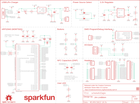

Contents
========

* [PRS15025 > nRF52840 Breakout MDBT50Q](#prs15025--nrf52840-breakout-mdbt50q)
	* [Schematic](#schematic)
	* [PCB](#pcb)
	* [Interactive BOM](#interactive-bom)
	* [Images](#images)
	* [Tags](#tags)
  
![][im]
# PRS15025 > nRF52840 Breakout MDBT50Q

- ID: PROJ-SPAR-15025-STAN-01
- Hex ID: PRS15025
- Name: Sparkfun
- Description: Sparkfun
- Long Link: [http://oom.lt/PROJ-SPAR-15025-STAN-01](http://oom.lt/PROJ-SPAR-15025-STAN-01)
- Short Link: [http://oom.lt/PRS15025](http://oom.lt/PRS15025)

## Schematic
  

## PCB
  

## Interactive BOM

- Interactive BOM page: [ibom.html](https://htmlpreview.github.io/?https://github.com/oomlout/oomlout_OOMP_projects/blob/main/PROJ-SPAR-15025-STAN-01/kicad/bom/ibom.html)

## Images
  
  

|bominteractivefront|bominteractiveback|kicadPcb3d|kicadPcb3dFront|kicadPcb3dBack|eagleImage|eagleSchemImage|pcbdraw|pcbdrawback|
| :---: | :---: | :---: | :---: | :---: | :---: | :---: | :---: | :---: |
||||||||||

## Tags

- hexID: PRS15025
- oompType: PROJ
- oompSize: SPAR
- oompColor: 15025
- oompDesc: STAN
- oompIndex: 01
- oompName: nRF52840 Breakout MDBT50Q
- sources: All source files from https://github.com/sparkfun/nRF52840_Breakout_MDBT50Q (source licence details in srcLicense.md)
- linkBuyPage: https://www.sparkfun.com/products/15025
- oompID: PROJ-SPAR-15025-STAN-01
- rawParts: C1,10uF,10UF-0603-6.3V-20%,0603,10.0µF ceramic capacitors,CAP-11015,,,10uF,
- rawParts: C2,0.1uF,0.1UF-0603-25V-(+80/-20%),0603,0.1µF ceramic capacitors,CAP-00810,,,0.1uF,
- rawParts: C3,15pF,15PF-0603-50V-5%,0603,15pF ceramic capacitors,CAP-07881,,,15pF,
- rawParts: C4,10uF,10UF-0603-6.3V-20%,0603,10.0µF ceramic capacitors,CAP-11015,,,10uF,
- rawParts: C5,4.7uF,4.7UF-0603-6.3V-(10%),0603,4.7µF ceramic capacitors,CAP-08280,,,4.7uF,
- rawParts: C6,4.7uF,4.7UF-0603-6.3V-(10%),0603,4.7µF ceramic capacitors,CAP-08280,,,4.7uF,
- rawParts: C7,15pF,15PF-0603-50V-5%,0603,15pF ceramic capacitors,CAP-07881,,,15pF,
- rawParts: C8,1.0uF,1.0UF-0603-16V-10%,0603,1µF ceramic capacitors,CAP-00868,,,1.0uF,
- rawParts: C9,1.0uF,1.0UF-0603-16V-10%,0603,1µF ceramic capacitors,CAP-00868,,,1.0uF,
- rawParts: C10,DNP,270PF-0603-50V-5%,0603,270pF/0.27nF ceramic capacitors,CAP-13339,,,270PF,
- rawParts: C11,DNP,270PF-0603-50V-5%,0603,270pF/0.27nF ceramic capacitors,CAP-13339,,,270PF,
- rawParts: D1,BLUE,LED-BLUE0603,LED-0603,Blue SMD LED,DIO-08575,,,BLUE,
- rawParts: D2,Yellow,LED-YELLOW0603,LED-0603,Yellow SMD LED,DIO-09003,,,Yellow,
- rawParts: D3,1A/23V/620mV,DIODE-SCHOTTKY-BAT20J,SOD-323,Schottky diode,DIO-11623,,,1A/23V/620mV,
- rawParts: D4,1A/23V/620mV,DIODE-SCHOTTKY-BAT20J,SOD-323,Schottky diode,DIO-11623,,,1A/23V/620mV,
- rawParts: D6,RED,LED-RED0603,LED-0603,Red SMD LED,DIO-00819,,,RED,
- rawParts: FD1,FIDUCIALUFIDUCIAL,FIDUCIALUFIDUCIAL,FIDUCIAL-MICRO,Fiducial Alignment Points,,,,,
- rawParts: FD2,FIDUCIALUFIDUCIAL,FIDUCIALUFIDUCIAL,FIDUCIAL-MICRO,Fiducial Alignment Points,,,,,
- rawParts: FD3,FIDUCIALUFIDUCIAL,FIDUCIALUFIDUCIAL,FIDUCIAL-MICRO,Fiducial Alignment Points,,,,,
- rawParts: FD4,FIDUCIALUFIDUCIAL,FIDUCIALUFIDUCIAL,FIDUCIAL-MICRO,Fiducial Alignment Points,,,,,
- rawParts: FRAME1,FRAME-LETTER,FRAME-LETTER,CREATIVE_COMMONS,Schematic Frame - Letter,,,,,
- rawParts: J1,,JST_2MM_MALESMD,JST-2-SMD,JST 2MM MALE RA CONNECTOR,CONN-11443,PRT-08612,,,
- rawParts: J2,,CONN_12NO_SILK,1X12_NO_SILK,Multi connection point. Often used as Generic Header-pin footprint for 0.1 inch spaced/style header connections,,,,,
- rawParts: J3,,QWIIC_CONNECTORJS-1MM,1X04_1MM_RA,SparkFun I2C Standard Qwiic Connector,CONN-13694,,,,
- rawParts: J4,,CONN_021X02_NO_SILK,1X02_NO_SILK,Multi connection point. Often used as Generic Header-pin footprint for 0.1 inch spaced/style header connections,,,,,
- rawParts: J5,,CONN_021X02_NO_SILK,1X02_NO_SILK,Multi connection point. Often used as Generic Header-pin footprint for 0.1 inch spaced/style header connections,,,,,
- rawParts: J6,,USB_MICRO-B_HALF_PTH_MILL,USB-MICROB-PTH-MILL,USB Type Micro-B Connector,CONN-13711,,,,
- rawParts: J7,,CONN_07NO_SILK,1X07_NO_SILK,Multi connection point. Often used as Generic Header-pin footprint for 0.1 inch spaced/style header connections,,,,,
- rawParts: J8,CORTEX_DEBUG_PTH,CORTEX_DEBUG_PTH,2X5-PTH-1.27MM,Cortex Debug Connector - 10 pin,,,,,
- rawParts: J9,,CONN_07NO_SILK,1X07_NO_SILK,Multi connection point. Often used as Generic Header-pin footprint for 0.1 inch spaced/style header connections,,,,,
- rawParts: J12,,CONN_021X02_NO_SILK,1X02_NO_SILK,Multi connection point. Often used as Generic Header-pin footprint for 0.1 inch spaced/style header connections,,,,,
- rawParts: J13,,CONN_12NO_SILK,1X12_NO_SILK,Multi connection point. Often used as Generic Header-pin footprint for 0.1 inch spaced/style header connections,,,,,
- rawParts: J14,,CONN_021X02_NO_SILK,1X02_NO_SILK,Multi connection point. Often used as Generic Header-pin footprint for 0.1 inch spaced/style header connections,,,,,
- rawParts: LOGO1,SFE_LOGO_NAME.2_INCH,SFE_LOGO_NAME.2_INCH,SFE_LOGO_NAME_.2,SparkFun Font Logo,,,,,
- rawParts: LOGO2,OSHW-LOGOS,OSHW-LOGOS,OSHW-LOGO-S,Open-Source Hardware (OSHW) Logo,,,,,
- rawParts: R1,27,27OHM-0603-1/10W-1%,0603,27Ω resistor,RES-09334,,,27,
- rawParts: R2,27,27OHM-0603-1/10W-1%,0603,27Ω resistor,RES-09334,,,27,
- rawParts: R3,1k,1KOHM-0603-1/10W-1%,0603,1kΩ resistor,RES-07856,,,1k,
- rawParts: R4,10k,10KOHM-0603-1/10W-1%,0603,10kΩ resistor,RES-00824,,,10k,
- rawParts: R5,2.0k,2.0KOHM-0603-1/10W-5%,0603,2kΩ resistor,RES-08296,,,2.0k,
- rawParts: R6,1k,1KOHM-0603-1/10W-1%,0603,1kΩ resistor,RES-07856,,,1k,
- rawParts: R7,10k,10KOHM-0603-1/10W-1%,0603,10kΩ resistor,RES-00824,,,10k,
- rawParts: R8,2.2k,2.2KOHM-0603-1/10W-1%,0603,2.2kΩ resistor,RES-08272,,,2.2k,
- rawParts: R9,2.2k,2.2KOHM-0603-1/10W-1%,0603,2.2kΩ resistor,RES-08272,,,2.2k,
- rawParts: R10,1k,1KOHM-0603-1/10W-1%,0603,1kΩ resistor,RES-07856,,,1k,
- rawParts: S1,RESET,MOMENTARY-SWITCH-SPST-SMD-RIGHT-ANGLE,TACTILE_SWITCH_SMD_RIGHT_ANGLE,Momentary Switch (Pushbutton) - SPST,COMP-12265,,,,
- rawParts: S2,,SWITCH-SPDT-SMD-RIGHT-ANGLE,SWITCH_SPST_SMD_A,Single Pole, Double Throw (SPDT) Switch,SWCH-10651,,COM-10860,,
- rawParts: S3,BOOTLOAD,MOMENTARY-SWITCH-SPST-SMD-RIGHT-ANGLE,TACTILE_SWITCH_SMD_RIGHT_ANGLE,Momentary Switch (Pushbutton) - SPST,COMP-12265,,,,
- rawParts: U1,MDBT50Q,MDBT50Q,MDBT50Q,,IC-14109,,,,
- rawParts: U2,MCP73831,MCP73831,SOT23-5,MCP73831T Li-Ion, Li-Pol Controller,IC-09995,,,,
- rawParts: U3,3.3V,V_REG_AP2112K-3.3V,SOT23-5,AP2112 - 600mA CMOS LDO Regulator w/ Enable,VREG-12457,,,3.3V,
- rawParts: Y1,32.768kHz,CRYSTAL-32.768KHZSMD-3.2X1.5,CRYSTAL-SMD-3.2X1.5MM,32.768kHz Crystal,XTAL-13062,,,32.768kHz,

[im]: kicadPcb3d_450.png
