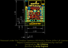
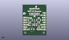
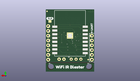
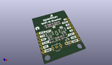

Contents
========

* [PROJ-SPAR-15031-STAN-01>ESP8266 WiFi IR Blaster](#proj-spar-15031-stan-01esp8266-wifi-ir-blaster)
	* [Images](#images)
	* [Interactive BOM](#interactive-bom)
	* [OOMP Parts](#oomp-parts)
	* [Tags](#tags)
  
![][im]
# PROJ-SPAR-15031-STAN-01>ESP8266 WiFi IR Blaster

- ID: PROJ-SPAR-15031-STAN-01
- Hex ID: PRS15031
- Name: ESP8266 WiFi IR Blaster
- Description: 

## Images
  
  

|eagleImage|kicadPcb3dFront|kicadPcb3dBack|kicadPcb3d|
| :---: | :---: | :---: | :---: |
|||||

## Interactive BOM

- Interactive BOM page: [ibom.html](kicad/bom/ibom.html)

## OOMP Parts
  

|OOMP Parts|
| :---: |
|CAPE-0603-X-UNMATCHED-01, C1, 17.525999999999996, 22.86, 90,C1, 1.0uF, 0603, SparkFun-Capacitors, (0.69, 0.9), R90|
|CAPE-0603-X-UNMATCHED-01, C2, 9.524999999999999, 22.86, 270,C2, 1.0uF, 0603, SparkFun-Capacitors, (0.375, 0.9), R270|
|CAPE-0603-X-UNMATCHED-01, C3, 12.827, 11.43, 90,C3, 1.0uF, 0603, SparkFun-Capacitors, (0.505, 0.45), R90|
|CAPE-0603-X-UF22D-01, C4, 6.858, 11.43, 90,C4, 2.2uF, 0603, SparkFun-Capacitors, (0.27, 0.45), R90|
|UNMATCHED-UNMATCHED-X-UNMATCHED-01, D1, 17.145, 6.604, 0,D1, IR-LED, LTE-302, SparkFun-LED, (0.675, 0.26), R0|
|UNMATCHED-0603-X-UNMATCHED-01, D2, 12.7, 22.86, 270,D2, GREEN, LED-0603, SparkFun-LED, (0.5, 0.9), R270|
|UNMATCHED-UNMATCHED-X-UNMATCHED-01, D3, 12.7, 15.239999999999998, 270,D3, 250mA/100V, SOD-323, SparkFun-DiscreteSemi, (0.5, 0.6), R270|
|UNMATCHED-UNMATCHED-X-UNMATCHED-01, FD1, 24.764999999999997, 32.004, 0,FD1, FIDUCIALUFIDUCIAL, FIDUCIAL-MICRO, SparkFun-Aesthetics, (0.975, 1.26), R0|
|UNMATCHED-UNMATCHED-X-UNMATCHED-01, FD2, 2.667, 7.619999999999999, 0,FD2, FIDUCIALUFIDUCIAL, FIDUCIAL-MICRO, SparkFun-Aesthetics, (0.105, 0.3), R0|
|UNMATCHED-UNMATCHED-X-UNMATCHED-01, FD3, 3.175, 6.35, M0,FD3, FIDUCIALUFIDUCIAL, FIDUCIAL-MICRO, SparkFun-Aesthetics, (0.125, 0.25), MR0|
|UNMATCHED-UNMATCHED-X-UNMATCHED-01, FD4, 24.764999999999997, 32.004, M0,FD4, FIDUCIALUFIDUCIAL, FIDUCIAL-MICRO, SparkFun-Aesthetics, (0.975, 1.26), MR0|
|UNMATCHED-UNMATCHED-X-UNMATCHED-01, J1, 1.27, 19.049999999999997, 270,J1, 1X06_NO_SILK, SparkFun-Connectors, (0.05, 0.75), R270|
|UNMATCHED-UNMATCHED-X-UNMATCHED-01, J2, 24.13, 6.35, 90,J2, 1X08_NO_SILK, SparkFun-Connectors, (0.95, 0.25), R90|
|UNMATCHED-UNMATCHED-X-UNMATCHED-01, JP1, 23.241, 26.669999999999998, M0,JP1, Deep-Sleep, SMT-JUMPER_2_NO_NO-SILK, SparkFun-Jumpers, (0.915, 1.05), MR0|
|UNMATCHED-UNMATCHED-X-UNMATCHED-01, Q1, 17.399, 11.43, 180,Q1, 600mA/40V, SOT23-3, SparkFun-DiscreteSemi, (0.685, 0.45), R180|
|<table><tr><td></td><td> R1</td><td>[RESE-0603-X-O103-01 SMD (0603) 10k Ohm Resistor](https://github.com/oomlout/oomlout_OOMP_parts/tree/main/RESE-0603-X-O103-01/)</td><td>[R6103](https://github.com/oomlout/oomlout_OOMP_parts/tree/main/RESE-0603-X-O103-01/)</td></tr></table>|
|<table><tr><td></td><td> R2</td><td>[RESE-0603-X-O103-01 SMD (0603) 10k Ohm Resistor](https://github.com/oomlout/oomlout_OOMP_parts/tree/main/RESE-0603-X-O103-01/)</td><td>[R6103](https://github.com/oomlout/oomlout_OOMP_parts/tree/main/RESE-0603-X-O103-01/)</td></tr></table>|
|RESE-0603-X-UNMATCHED-01, R3, 14.224, 22.86, 270,R3, 1k, 0603, SparkFun-Resistors, (0.56, 0.9), R270|
|<table><tr><td></td><td> R4</td><td>[RESE-0603-X-O103-01 SMD (0603) 10k Ohm Resistor](https://github.com/oomlout/oomlout_OOMP_parts/tree/main/RESE-0603-X-O103-01/)</td><td>[R6103](https://github.com/oomlout/oomlout_OOMP_parts/tree/main/RESE-0603-X-O103-01/)</td></tr></table>|
|RESE-0603-X-UNMATCHED-01, R5, 17.145, 13.97, 0,R5, 1k, 0603, SparkFun-Resistors, (0.675, 0.55), R0|
|RESE-0603-X-UNMATCHED-01, R6, 17.399, 8.762999999999998, 0,R6, 20, 0603, SparkFun-Resistors, (0.685, 0.345), R0|
|RESE-0603-X-UNMATCHED-01, R7, 14.858999999999998, 11.43, 90,R7, 1k, 0603, SparkFun-Resistors, (0.585, 0.45), R90|
|<table><tr><td></td><td> R8</td><td>[RESE-0603-X-O103-01 SMD (0603) 10k Ohm Resistor](https://github.com/oomlout/oomlout_OOMP_parts/tree/main/RESE-0603-X-O103-01/)</td><td>[R6103](https://github.com/oomlout/oomlout_OOMP_parts/tree/main/RESE-0603-X-O103-01/)</td></tr></table>|
|UNMATCHED-UNMATCHED-X-UNMATCHED-01, S1, 17.145, 16.383, 0,S1, GPIO0, TACTILE_SWITCH_SMD_4.6X2.8MM, SparkFun-Switches, (0.675, 0.645), R0|
|UNMATCHED-UNMATCHED-X-UNMATCHED-01, S2, 8.254999999999999, 16.383, 0,S2, RESET, TACTILE_SWITCH_SMD_4.6X2.8MM, SparkFun-Switches, (0.325, 0.645), R0|
|UNMATCHED-UNMATCHED-X-UNMATCHED-01, U1, 12.7, 20.32, M0,U1, ESP-12S, ESP-12S, SparkFun-RF, (0.5, 0.8), MR0|
|UNMATCHED-UNMATCHED-X-UNMATCHED-01, U2, 9.524999999999999, 6.604, 0,U2, 38kHz, TSOP382, SparkFun-Sensors, (0.375, 0.26), R0|
|UNMATCHED-UNMATCHED-X-UNMATCHED-01, U3, 9.779, 11.43, 90,U3, 3.3V, SOT23-5, SparkFun-IC-Power, (0.385, 0.45), R90|

## Tags

- hexID: PRS15031
- oompType: PROJ
- oompSize: SPAR
- oompColor: 15031
- oompDesc: STAN
- oompIndex: 01
- oompName: ESP8266 WiFi IR Blaster
- sources: All source files from https://github.com/sparkfun/ESP8266_WiFi_IR_Blaster (source licence details in srcLicense.md)
- linkBuyPage: https://www.sparkfun.com/products/15031
- oompPart: CAPE-0603-X-UNMATCHED-01, C1, 17.525999999999996, 22.86, 90
- oompPart: CAPE-0603-X-UNMATCHED-01, C2, 9.524999999999999, 22.86, 270
- oompPart: CAPE-0603-X-UNMATCHED-01, C3, 12.827, 11.43, 90
- oompPart: CAPE-0603-X-UF22D-01, C4, 6.858, 11.43, 90
- oompPart: UNMATCHED-UNMATCHED-X-UNMATCHED-01, D1, 17.145, 6.604, 0
- oompPart: UNMATCHED-0603-X-UNMATCHED-01, D2, 12.7, 22.86, 270
- oompPart: UNMATCHED-UNMATCHED-X-UNMATCHED-01, D3, 12.7, 15.239999999999998, 270
- oompPart: UNMATCHED-UNMATCHED-X-UNMATCHED-01, FD1, 24.764999999999997, 32.004, 0
- oompPart: UNMATCHED-UNMATCHED-X-UNMATCHED-01, FD2, 2.667, 7.619999999999999, 0
- oompPart: UNMATCHED-UNMATCHED-X-UNMATCHED-01, FD3, 3.175, 6.35, M0
- oompPart: UNMATCHED-UNMATCHED-X-UNMATCHED-01, FD4, 24.764999999999997, 32.004, M0
- oompPart: UNMATCHED-UNMATCHED-X-UNMATCHED-01, J1, 1.27, 19.049999999999997, 270
- oompPart: UNMATCHED-UNMATCHED-X-UNMATCHED-01, J2, 24.13, 6.35, 90
- oompPart: UNMATCHED-UNMATCHED-X-UNMATCHED-01, JP1, 23.241, 26.669999999999998, M0
- oompPart: UNMATCHED-UNMATCHED-X-UNMATCHED-01, Q1, 17.399, 11.43, 180
- oompPart: RESE-0603-X-O103-01, R1, 7.619999999999999, 13.97, 180
- oompPart: RESE-0603-X-O103-01, R2, 7.874, 22.86, 90
- oompPart: RESE-0603-X-UNMATCHED-01, R3, 14.224, 22.86, 270
- oompPart: RESE-0603-X-O103-01, R4, 15.875, 22.86, 90
- oompPart: RESE-0603-X-UNMATCHED-01, R5, 17.145, 13.97, 0
- oompPart: RESE-0603-X-UNMATCHED-01, R6, 17.399, 8.762999999999998, 0
- oompPart: RESE-0603-X-UNMATCHED-01, R7, 14.858999999999998, 11.43, 90
- oompPart: RESE-0603-X-O103-01, R8, 11.176, 22.86, 90
- oompPart: UNMATCHED-UNMATCHED-X-UNMATCHED-01, S1, 17.145, 16.383, 0
- oompPart: UNMATCHED-UNMATCHED-X-UNMATCHED-01, S2, 8.254999999999999, 16.383, 0
- oompPart: UNMATCHED-UNMATCHED-X-UNMATCHED-01, U1, 12.7, 20.32, M0
- oompPart: UNMATCHED-UNMATCHED-X-UNMATCHED-01, U2, 9.524999999999999, 6.604, 0
- oompPart: UNMATCHED-UNMATCHED-X-UNMATCHED-01, U3, 9.779, 11.43, 90
- rawPart: C1, 1.0uF, 0603, SparkFun-Capacitors, (0.69, 0.9), R90
- rawPart: C2, 1.0uF, 0603, SparkFun-Capacitors, (0.375, 0.9), R270
- rawPart: C3, 1.0uF, 0603, SparkFun-Capacitors, (0.505, 0.45), R90
- rawPart: C4, 2.2uF, 0603, SparkFun-Capacitors, (0.27, 0.45), R90
- rawPart: D1, IR-LED, LTE-302, SparkFun-LED, (0.675, 0.26), R0
- rawPart: D2, GREEN, LED-0603, SparkFun-LED, (0.5, 0.9), R270
- rawPart: D3, 250mA/100V, SOD-323, SparkFun-DiscreteSemi, (0.5, 0.6), R270
- rawPart: FD1, FIDUCIALUFIDUCIAL, FIDUCIAL-MICRO, SparkFun-Aesthetics, (0.975, 1.26), R0
- rawPart: FD2, FIDUCIALUFIDUCIAL, FIDUCIAL-MICRO, SparkFun-Aesthetics, (0.105, 0.3), R0
- rawPart: FD3, FIDUCIALUFIDUCIAL, FIDUCIAL-MICRO, SparkFun-Aesthetics, (0.125, 0.25), MR0
- rawPart: FD4, FIDUCIALUFIDUCIAL, FIDUCIAL-MICRO, SparkFun-Aesthetics, (0.975, 1.26), MR0
- rawPart: J1, 1X06_NO_SILK, SparkFun-Connectors, (0.05, 0.75), R270
- rawPart: J2, 1X08_NO_SILK, SparkFun-Connectors, (0.95, 0.25), R90
- rawPart: JP1, Deep-Sleep, SMT-JUMPER_2_NO_NO-SILK, SparkFun-Jumpers, (0.915, 1.05), MR0
- rawPart: Q1, 600mA/40V, SOT23-3, SparkFun-DiscreteSemi, (0.685, 0.45), R180
- rawPart: R1, 10k, 0603, SparkFun-Resistors, (0.3, 0.55), R180
- rawPart: R2, 10k, 0603, SparkFun-Resistors, (0.31, 0.9), R90
- rawPart: R3, 1k, 0603, SparkFun-Resistors, (0.56, 0.9), R270
- rawPart: R4, 10k, 0603, SparkFun-Resistors, (0.625, 0.9), R90
- rawPart: R5, 1k, 0603, SparkFun-Resistors, (0.675, 0.55), R0
- rawPart: R6, 20, 0603, SparkFun-Resistors, (0.685, 0.345), R0
- rawPart: R7, 1k, 0603, SparkFun-Resistors, (0.585, 0.45), R90
- rawPart: R8, 10k, 0603, SparkFun-Resistors, (0.44, 0.9), R90
- rawPart: S1, GPIO0, TACTILE_SWITCH_SMD_4.6X2.8MM, SparkFun-Switches, (0.675, 0.645), R0
- rawPart: S2, RESET, TACTILE_SWITCH_SMD_4.6X2.8MM, SparkFun-Switches, (0.325, 0.645), R0
- rawPart: U1, ESP-12S, ESP-12S, SparkFun-RF, (0.5, 0.8), MR0
- rawPart: U2, 38kHz, TSOP382, SparkFun-Sensors, (0.375, 0.26), R0
- rawPart: U3, 3.3V, SOT23-5, SparkFun-IC-Power, (0.385, 0.45), R90

[im]: kicadPcb3d_450.png
