Contents
========

* [PRS15035 > ATX Power Connector Breakout](#prs15035--atx-power-connector-breakout)
	* [Schematic](#schematic)
	* [PCB](#pcb)
	* [Interactive BOM](#interactive-bom)
	* [Images](#images)
	* [Tags](#tags)
  
![][im]
# PRS15035 > ATX Power Connector Breakout

- ID: PROJ-SPAR-15035-STAN-01
- Hex ID: PRS15035
- Name: Sparkfun
- Description: Sparkfun
- Long Link: [http://oom.lt/PROJ-SPAR-15035-STAN-01](http://oom.lt/PROJ-SPAR-15035-STAN-01)
- Short Link: [http://oom.lt/PRS15035](http://oom.lt/PRS15035)

## Schematic
  
[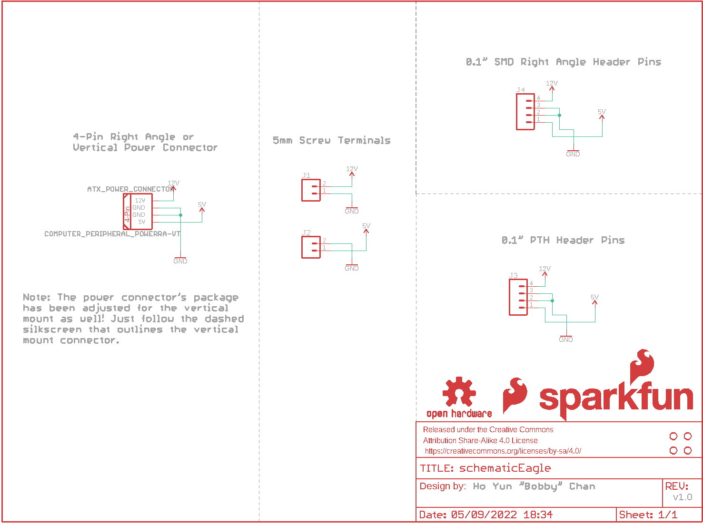](eagleSchemImage.png)
## PCB
  
[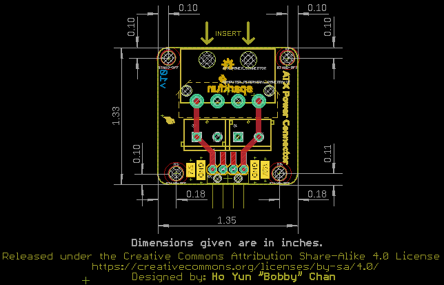](eagleImage.png)
## Interactive BOM

- Interactive BOM page: [ibom.html](https://htmlpreview.github.io/?https://github.com/oomlout/oomlout_OOMP_projects/blob/main/PROJ-SPAR-15035-STAN-01/kicad/bom/ibom.html)

## Images
  
  

|bominteractivefront|bominteractiveback|kicadPcb3d|kicadPcb3dFront|kicadPcb3dBack|eagleImage|eagleSchemImage|pcbdraw|pcbdrawback|
| :---: | :---: | :---: | :---: | :---: | :---: | :---: | :---: | :---: |
|[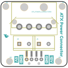](bomFront.png)|[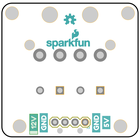](bomBack.png)|[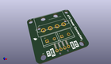](kicadPcb3d.png)|[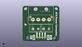](kicadPcb3dFront.png)|[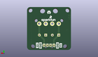](kicadPcb3dBack.png)|[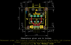](eagleImage.png)|[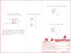](eagleSchemImage.png)|[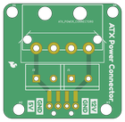](pcbdraw.png)|[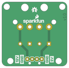](pcbdrawBack.png)|

## Tags

- hexID: PRS15035
- oompType: PROJ
- oompSize: SPAR
- oompColor: 15035
- oompDesc: STAN
- oompIndex: 01
- oompName: ATX Power Connector Breakout
- sources: All source files from https://github.com/sparkfun/ATX_Power_Connector_Breakout (source licence details in srcLicense.md)
- linkBuyPage: https://www.sparkfun.com/products/15035
- oompID: PROJ-SPAR-15035-STAN-01

[im]: kicadPcb3d_450.png
