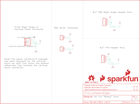

Contents
========

* [PRS15035 > ATX Power Connector Breakout](#prs15035--atx-power-connector-breakout)
	* [Schematic](#schematic)
	* [PCB](#pcb)
	* [Interactive BOM](#interactive-bom)
	* [Images](#images)
	* [Tags](#tags)
  
![][im]
# PRS15035 > ATX Power Connector Breakout

- ID: PROJ-SPAR-15035-STAN-01
- Hex ID: PRS15035
- Name: Sparkfun
- Description: Sparkfun
- Long Link: [http://oom.lt/PROJ-SPAR-15035-STAN-01](http://oom.lt/PROJ-SPAR-15035-STAN-01)
- Short Link: [http://oom.lt/PRS15035](http://oom.lt/PRS15035)

## Schematic
  

## PCB
  

## Interactive BOM

- Interactive BOM page: [ibom.html](https://htmlpreview.github.io/?https://github.com/oomlout/oomlout_OOMP_projects/blob/main/PROJ-SPAR-15035-STAN-01/kicad/bom/ibom.html)

## Images
  
  

|bominteractivefront|bominteractiveback|kicadPcb3d|kicadPcb3dFront|kicadPcb3dBack|eagleImage|eagleSchemImage|pcbdraw|pcbdrawback|
| :---: | :---: | :---: | :---: | :---: | :---: | :---: | :---: | :---: |
||||||||||

## Tags

- hexID: PRS15035
- oompType: PROJ
- oompSize: SPAR
- oompColor: 15035
- oompDesc: STAN
- oompIndex: 01
- oompName: ATX Power Connector Breakout
- sources: All source files from https://github.com/sparkfun/ATX_Power_Connector_Breakout (source licence details in srcLicense.md)
- linkBuyPage: https://www.sparkfun.com/products/15035
- oompID: PROJ-SPAR-15035-STAN-01
- rawParts: ATX_POWER_CONNECTOR,COMPUTER_PERIPHERAL_POWERRA-VT,COMPUTER_PERIPHERAL_POWERRA-VT,COMPUTER-PERIPHERAL-POWER-RA-VT,ATX 4-Pin Power Supply Connector - Right Angle and Vertical PTH Mount,PRT-15700,,,
- rawParts: FRAME1,FRAME-LETTER,FRAME-LETTER,CREATIVE_COMMONS,Schematic Frame - Letter,,,,
- rawParts: H1,STAND-OFF,STAND-OFF,STAND-OFF,Stand Off,,,,
- rawParts: H2,STAND-OFF,STAND-OFF,STAND-OFF,Stand Off,,,,
- rawParts: H3,STAND-OFF,STAND-OFF,STAND-OFF,Stand Off,,,,
- rawParts: H4,STAND-OFF,STAND-OFF,STAND-OFF,Stand Off,,,,
- rawParts: J1,,CONN_025MM,SCREWTERMINAL-5MM-2,Multi connection point. Often used as Generic Header-pin footprint for 0.1 inch spaced/style header connections,,,PRT-08432,
- rawParts: J2,,CONN_025MM,SCREWTERMINAL-5MM-2,Multi connection point. Often used as Generic Header-pin footprint for 0.1 inch spaced/style header connections,,,PRT-08432,
- rawParts: J3,,CONN_04,1X04,Multi connection point. Often used as Generic Header-pin footprint for 0.1 inch spaced/style header connections,CONN-09696,,,
- rawParts: J4,,CONN_04SMD,1X04_SMD_RA_MALE,Multi connection point. Often used as Generic Header-pin footprint for 0.1 inch spaced/style header connections,CONN-09140,PRT-12638,,
- rawParts: LOGO1,OSHW-LOGOS,OSHW-LOGOS,OSHW-LOGO-S,Open-Source Hardware (OSHW) Logo,,,,
- rawParts: LOGO2,SFE_LOGO_NAME_FLAME.1_INCH,SFE_LOGO_NAME_FLAME.1_INCH,SFE_LOGO_NAME_FLAME_.1,SparkFun Font Logo w/ Flame,,,,
- rawParts: LOGO3,SFE_LOGO_FLAME.1_INCH,SFE_LOGO_FLAME.1_INCH,SFE_LOGO_FLAME_.1,SparkFun Flame Logo,,,,

[im]: kicadPcb3d_450.png
