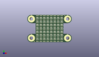
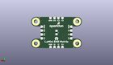
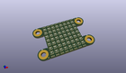

Contents
========

* [PROJ-SPAR-15047-STAN-01>Lumini 8x8](#proj-spar-15047-stan-01lumini-8x8)
	* [Images](#images)
	* [Interactive BOM](#interactive-bom)
	* [OOMP Parts](#oomp-parts)
	* [Tags](#tags)
  
![][im]
# PROJ-SPAR-15047-STAN-01>Lumini 8x8

- ID: PROJ-SPAR-15047-STAN-01
- Hex ID: PRS15047
- Name: Lumini 8x8
- Description: 

## Images
  
  

|eagleImage|kicadPcb3dFront|kicadPcb3dBack|kicadPcb3d|
| :---: | :---: | :---: | :---: |
|||||

## Interactive BOM

- Interactive BOM page: [ibom.html](kicad/bom/ibom.html)

## OOMP Parts
  

|OOMP Parts|
| :---: |
|UNMATCHED-UNMATCHED-X-UNMATCHED-01, C1, 20.32, 12.7, M270,C1, DNP, 1206, SparkFun-Capacitors, (0.8, 0.5), MR270|
|UNMATCHED-UNMATCHED-X-UNMATCHED-01, D1, 9.2075, 1.5875, 0,D1, APA102-2020, APA102-2020, SparkFun-LED, (0.3625, 0.0625), R0|
|UNMATCHED-UNMATCHED-X-UNMATCHED-01, D2, 12.382499999999999, 1.5875, 0,D2, APA102-2020, APA102-2020, SparkFun-LED, (0.4875, 0.0625), R0|
|UNMATCHED-UNMATCHED-X-UNMATCHED-01, D3, 15.557500000000001, 1.5875, 0,D3, APA102-2020, APA102-2020, SparkFun-LED, (0.6125, 0.0625), R0|
|UNMATCHED-UNMATCHED-X-UNMATCHED-01, D4, 18.7325, 1.5875, 0,D4, APA102-2020, APA102-2020, SparkFun-LED, (0.7375, 0.0625), R0|
|UNMATCHED-UNMATCHED-X-UNMATCHED-01, D5, 21.9075, 1.5875, 0,D5, APA102-2020, APA102-2020, SparkFun-LED, (0.8625, 0.0625), R0|
|UNMATCHED-UNMATCHED-X-UNMATCHED-01, D6, 25.0825, 1.5875, 0,D6, APA102-2020, APA102-2020, SparkFun-LED, (0.9875, 0.0625), R0|
|UNMATCHED-UNMATCHED-X-UNMATCHED-01, D7, 28.2575, 1.5875, 0,D7, APA102-2020, APA102-2020, SparkFun-LED, (1.1125, 0.0625), R0|
|UNMATCHED-UNMATCHED-X-UNMATCHED-01, D8, 31.4325, 1.5875, 0,D8, APA102-2020, APA102-2020, SparkFun-LED, (1.2375, 0.0625), R0|
|UNMATCHED-UNMATCHED-X-UNMATCHED-01, D9, 9.2075, 4.762499999999999, 0,D9, APA102-2020, APA102-2020, SparkFun-LED, (0.3625, 0.1875), R0|
|UNMATCHED-UNMATCHED-X-UNMATCHED-01, D10, 12.382499999999999, 4.762499999999999, 0,D10, APA102-2020, APA102-2020, SparkFun-LED, (0.4875, 0.1875), R0|
|UNMATCHED-UNMATCHED-X-UNMATCHED-01, D11, 15.557500000000001, 4.762499999999999, 0,D11, APA102-2020, APA102-2020, SparkFun-LED, (0.6125, 0.1875), R0|
|UNMATCHED-UNMATCHED-X-UNMATCHED-01, D12, 18.7325, 4.762499999999999, 0,D12, APA102-2020, APA102-2020, SparkFun-LED, (0.7375, 0.1875), R0|
|UNMATCHED-UNMATCHED-X-UNMATCHED-01, D13, 21.9075, 4.762499999999999, 0,D13, APA102-2020, APA102-2020, SparkFun-LED, (0.8625, 0.1875), R0|
|UNMATCHED-UNMATCHED-X-UNMATCHED-01, D14, 25.0825, 4.762499999999999, 0,D14, APA102-2020, APA102-2020, SparkFun-LED, (0.9875, 0.1875), R0|
|UNMATCHED-UNMATCHED-X-UNMATCHED-01, D15, 28.2575, 4.762499999999999, 0,D15, APA102-2020, APA102-2020, SparkFun-LED, (1.1125, 0.1875), R0|
|UNMATCHED-UNMATCHED-X-UNMATCHED-01, D16, 31.4325, 4.762499999999999, 0,D16, APA102-2020, APA102-2020, SparkFun-LED, (1.2375, 0.1875), R0|
|UNMATCHED-UNMATCHED-X-UNMATCHED-01, D17, 9.2075, 7.9375, 0,D17, APA102-2020, APA102-2020, SparkFun-LED, (0.3625, 0.3125), R0|
|UNMATCHED-UNMATCHED-X-UNMATCHED-01, D18, 12.382499999999999, 7.9375, 0,D18, APA102-2020, APA102-2020, SparkFun-LED, (0.4875, 0.3125), R0|
|UNMATCHED-UNMATCHED-X-UNMATCHED-01, D19, 15.557500000000001, 7.9375, 0,D19, APA102-2020, APA102-2020, SparkFun-LED, (0.6125, 0.3125), R0|
|UNMATCHED-UNMATCHED-X-UNMATCHED-01, D20, 18.7325, 7.9375, 0,D20, APA102-2020, APA102-2020, SparkFun-LED, (0.7375, 0.3125), R0|
|UNMATCHED-UNMATCHED-X-UNMATCHED-01, D21, 21.9075, 7.9375, 0,D21, APA102-2020, APA102-2020, SparkFun-LED, (0.8625, 0.3125), R0|
|UNMATCHED-UNMATCHED-X-UNMATCHED-01, D22, 25.0825, 7.9375, 0,D22, APA102-2020, APA102-2020, SparkFun-LED, (0.9875, 0.3125), R0|
|UNMATCHED-UNMATCHED-X-UNMATCHED-01, D23, 28.2575, 7.9375, 0,D23, APA102-2020, APA102-2020, SparkFun-LED, (1.1125, 0.3125), R0|
|UNMATCHED-UNMATCHED-X-UNMATCHED-01, D24, 31.4325, 7.9375, 0,D24, APA102-2020, APA102-2020, SparkFun-LED, (1.2375, 0.3125), R0|
|UNMATCHED-UNMATCHED-X-UNMATCHED-01, D25, 9.2075, 11.112499999999999, 0,D25, APA102-2020, APA102-2020, SparkFun-LED, (0.3625, 0.4375), R0|
|UNMATCHED-UNMATCHED-X-UNMATCHED-01, D26, 12.382499999999999, 11.112499999999999, 0,D26, APA102-2020, APA102-2020, SparkFun-LED, (0.4875, 0.4375), R0|
|UNMATCHED-UNMATCHED-X-UNMATCHED-01, D27, 15.557500000000001, 11.112499999999999, 0,D27, APA102-2020, APA102-2020, SparkFun-LED, (0.6125, 0.4375), R0|
|UNMATCHED-UNMATCHED-X-UNMATCHED-01, D28, 18.7325, 11.112499999999999, 0,D28, APA102-2020, APA102-2020, SparkFun-LED, (0.7375, 0.4375), R0|
|UNMATCHED-UNMATCHED-X-UNMATCHED-01, D29, 21.9075, 11.112499999999999, 0,D29, APA102-2020, APA102-2020, SparkFun-LED, (0.8625, 0.4375), R0|
|UNMATCHED-UNMATCHED-X-UNMATCHED-01, D30, 25.0825, 11.112499999999999, 0,D30, APA102-2020, APA102-2020, SparkFun-LED, (0.9875, 0.4375), R0|
|UNMATCHED-UNMATCHED-X-UNMATCHED-01, D31, 28.2575, 11.112499999999999, 0,D31, APA102-2020, APA102-2020, SparkFun-LED, (1.1125, 0.4375), R0|
|UNMATCHED-UNMATCHED-X-UNMATCHED-01, D32, 31.4325, 11.112499999999999, 0,D32, APA102-2020, APA102-2020, SparkFun-LED, (1.2375, 0.4375), R0|
|UNMATCHED-UNMATCHED-X-UNMATCHED-01, D33, 9.2075, 14.2875, 0,D33, APA102-2020, APA102-2020, SparkFun-LED, (0.3625, 0.5625), R0|
|UNMATCHED-UNMATCHED-X-UNMATCHED-01, D34, 12.382499999999999, 14.2875, 0,D34, APA102-2020, APA102-2020, SparkFun-LED, (0.4875, 0.5625), R0|
|UNMATCHED-UNMATCHED-X-UNMATCHED-01, D35, 15.557500000000001, 14.2875, 0,D35, APA102-2020, APA102-2020, SparkFun-LED, (0.6125, 0.5625), R0|
|UNMATCHED-UNMATCHED-X-UNMATCHED-01, D36, 18.7325, 14.2875, 0,D36, APA102-2020, APA102-2020, SparkFun-LED, (0.7375, 0.5625), R0|
|UNMATCHED-UNMATCHED-X-UNMATCHED-01, D37, 21.9075, 14.2875, 0,D37, APA102-2020, APA102-2020, SparkFun-LED, (0.8625, 0.5625), R0|
|UNMATCHED-UNMATCHED-X-UNMATCHED-01, D38, 25.0825, 14.2875, 0,D38, APA102-2020, APA102-2020, SparkFun-LED, (0.9875, 0.5625), R0|
|UNMATCHED-UNMATCHED-X-UNMATCHED-01, D39, 28.2575, 14.2875, 0,D39, APA102-2020, APA102-2020, SparkFun-LED, (1.1125, 0.5625), R0|
|UNMATCHED-UNMATCHED-X-UNMATCHED-01, D40, 31.4325, 14.2875, 0,D40, APA102-2020, APA102-2020, SparkFun-LED, (1.2375, 0.5625), R0|
|UNMATCHED-UNMATCHED-X-UNMATCHED-01, D41, 9.2075, 17.4625, 0,D41, APA102-2020, APA102-2020, SparkFun-LED, (0.3625, 0.6875), R0|
|UNMATCHED-UNMATCHED-X-UNMATCHED-01, D42, 12.382499999999999, 17.4625, 0,D42, APA102-2020, APA102-2020, SparkFun-LED, (0.4875, 0.6875), R0|
|UNMATCHED-UNMATCHED-X-UNMATCHED-01, D43, 15.557500000000001, 17.4625, 0,D43, APA102-2020, APA102-2020, SparkFun-LED, (0.6125, 0.6875), R0|
|UNMATCHED-UNMATCHED-X-UNMATCHED-01, D44, 18.7325, 17.4625, 0,D44, APA102-2020, APA102-2020, SparkFun-LED, (0.7375, 0.6875), R0|
|UNMATCHED-UNMATCHED-X-UNMATCHED-01, D45, 21.9075, 17.4625, 0,D45, APA102-2020, APA102-2020, SparkFun-LED, (0.8625, 0.6875), R0|
|UNMATCHED-UNMATCHED-X-UNMATCHED-01, D46, 25.0825, 17.4625, 0,D46, APA102-2020, APA102-2020, SparkFun-LED, (0.9875, 0.6875), R0|
|UNMATCHED-UNMATCHED-X-UNMATCHED-01, D47, 28.2575, 17.4625, 0,D47, APA102-2020, APA102-2020, SparkFun-LED, (1.1125, 0.6875), R0|
|UNMATCHED-UNMATCHED-X-UNMATCHED-01, D48, 31.4325, 17.4625, 0,D48, APA102-2020, APA102-2020, SparkFun-LED, (1.2375, 0.6875), R0|
|UNMATCHED-UNMATCHED-X-UNMATCHED-01, D49, 9.2075, 20.6375, 0,D49, APA102-2020, APA102-2020, SparkFun-LED, (0.3625, 0.8125), R0|
|UNMATCHED-UNMATCHED-X-UNMATCHED-01, D50, 12.382499999999999, 20.6375, 0,D50, APA102-2020, APA102-2020, SparkFun-LED, (0.4875, 0.8125), R0|
|UNMATCHED-UNMATCHED-X-UNMATCHED-01, D51, 15.557500000000001, 20.6375, 0,D51, APA102-2020, APA102-2020, SparkFun-LED, (0.6125, 0.8125), R0|
|UNMATCHED-UNMATCHED-X-UNMATCHED-01, D52, 18.7325, 20.6375, 0,D52, APA102-2020, APA102-2020, SparkFun-LED, (0.7375, 0.8125), R0|
|UNMATCHED-UNMATCHED-X-UNMATCHED-01, D53, 21.9075, 20.6375, 0,D53, APA102-2020, APA102-2020, SparkFun-LED, (0.8625, 0.8125), R0|
|UNMATCHED-UNMATCHED-X-UNMATCHED-01, D54, 25.0825, 20.6375, 0,D54, APA102-2020, APA102-2020, SparkFun-LED, (0.9875, 0.8125), R0|
|UNMATCHED-UNMATCHED-X-UNMATCHED-01, D55, 28.2575, 20.6375, 0,D55, APA102-2020, APA102-2020, SparkFun-LED, (1.1125, 0.8125), R0|
|UNMATCHED-UNMATCHED-X-UNMATCHED-01, D56, 31.4325, 20.6375, 0,D56, APA102-2020, APA102-2020, SparkFun-LED, (1.2375, 0.8125), R0|
|UNMATCHED-UNMATCHED-X-UNMATCHED-01, D57, 9.2075, 23.8125, 0,D57, APA102-2020, APA102-2020, SparkFun-LED, (0.3625, 0.9375), R0|
|UNMATCHED-UNMATCHED-X-UNMATCHED-01, D58, 12.382499999999999, 23.8125, 0,D58, APA102-2020, APA102-2020, SparkFun-LED, (0.4875, 0.9375), R0|
|UNMATCHED-UNMATCHED-X-UNMATCHED-01, D59, 15.557500000000001, 23.8125, 0,D59, APA102-2020, APA102-2020, SparkFun-LED, (0.6125, 0.9375), R0|
|UNMATCHED-UNMATCHED-X-UNMATCHED-01, D60, 18.7325, 23.8125, 0,D60, APA102-2020, APA102-2020, SparkFun-LED, (0.7375, 0.9375), R0|
|UNMATCHED-UNMATCHED-X-UNMATCHED-01, D61, 21.9075, 23.8125, 0,D61, APA102-2020, APA102-2020, SparkFun-LED, (0.8625, 0.9375), R0|
|UNMATCHED-UNMATCHED-X-UNMATCHED-01, D62, 25.0825, 23.8125, 0,D62, APA102-2020, APA102-2020, SparkFun-LED, (0.9875, 0.9375), R0|
|UNMATCHED-UNMATCHED-X-UNMATCHED-01, D63, 28.2575, 23.8125, 0,D63, APA102-2020, APA102-2020, SparkFun-LED, (1.1125, 0.9375), R0|
|UNMATCHED-UNMATCHED-X-UNMATCHED-01, D64, 31.4325, 23.8125, 0,D64, APA102-2020, APA102-2020, SparkFun-LED, (1.2375, 0.9375), R0|
|UNMATCHED-UNMATCHED-X-UNMATCHED-01, H1, 3.8099999999999996, 3.8099999999999996, 0,H1, STANDOFF_ELECTRICAL-NOTHERMALS, STANDOFF-ELECTRICAL-NOTHERMALS, SparkFun-Hardware, (0.15, 0.15), R0|
|UNMATCHED-UNMATCHED-X-UNMATCHED-01, H2, 3.8099999999999996, 21.59, 0,H2, STANDOFF_ELECTRICAL-NOTHERMALS, STANDOFF-ELECTRICAL-NOTHERMALS, SparkFun-Hardware, (0.15, 0.85), R0|
|UNMATCHED-UNMATCHED-X-UNMATCHED-01, H3, 36.83, 3.8099999999999996, 0,H3, STANDOFF_ELECTRICAL-NOTHERMALS, STANDOFF-ELECTRICAL-NOTHERMALS, SparkFun-Hardware, (1.45, 0.15), R0|
|UNMATCHED-UNMATCHED-X-UNMATCHED-01, H4, 36.83, 21.59, 0,H4, STANDOFF_ELECTRICAL-NOTHERMALS, STANDOFF-ELECTRICAL-NOTHERMALS, SparkFun-Hardware, (1.45, 0.85), R0|
|UNMATCHED-UNMATCHED-X-UNMATCHED-01, J1, 8.636000000000001, 7.9375, M90,J1, LED_PAD, CIRCULARPAD, SparkFun-Connectors, (0.34, 0.3125), MR90|
|UNMATCHED-UNMATCHED-X-UNMATCHED-01, J2, 32.004, 7.9375, M270,J2, LED_PAD, CIRCULARPAD, SparkFun-Connectors, (1.26, 0.3125), MR270|
|UNMATCHED-UNMATCHED-X-UNMATCHED-01, J3, 8.636000000000001, 17.4625, M90,J3, LED_PAD, CIRCULARPAD, SparkFun-Connectors, (0.34, 0.6875), MR90|
|UNMATCHED-UNMATCHED-X-UNMATCHED-01, J4, 32.004, 17.4625, M270,J4, LED_PAD, CIRCULARPAD, SparkFun-Connectors, (1.26, 0.6875), MR270|
|UNMATCHED-UNMATCHED-X-UNMATCHED-01, J5, 15.544799999999999, 1.016, M0,J5, LED_PAD, CIRCULARPAD, SparkFun-Connectors, (0.612, 0.04), MR0|
|UNMATCHED-UNMATCHED-X-UNMATCHED-01, J6, 25.145999999999997, 24.383999999999997, M180,J6, LED_PAD, CIRCULARPAD, SparkFun-Connectors, (0.99, 0.96), MR180|
|UNMATCHED-UNMATCHED-X-UNMATCHED-01, J7, 25.069799999999997, 1.016, M0,J7, LED_PAD, CIRCULARPAD, SparkFun-Connectors, (0.987, 0.04), MR0|
|UNMATCHED-UNMATCHED-X-UNMATCHED-01, J8, 15.557500000000001, 24.383999999999997, M180,J8, LED_PAD, CIRCULARPAD, SparkFun-Connectors, (0.6125, 0.96), MR180|
|UNMATCHED-UNMATCHED-X-UNMATCHED-01, J9, 8.636000000000001, 11.112499999999999, M90,J9, LED_PAD, CIRCULARPAD, SparkFun-Connectors, (0.34, 0.4375), MR90|
|UNMATCHED-UNMATCHED-X-UNMATCHED-01, J10, 18.7325, 1.016, M0,J10, LED_PAD, CIRCULARPAD, SparkFun-Connectors, (0.7375, 0.04), MR0|
|UNMATCHED-UNMATCHED-X-UNMATCHED-01, J11, 8.636000000000001, 14.2875, M90,J11, LED_PAD, CIRCULARPAD, SparkFun-Connectors, (0.34, 0.5625), MR90|
|UNMATCHED-UNMATCHED-X-UNMATCHED-01, J12, 21.9075, 1.016, M0,J12, LED_PAD, CIRCULARPAD, SparkFun-Connectors, (0.8625, 0.04), MR0|
|UNMATCHED-UNMATCHED-X-UNMATCHED-01, J13, 32.004, 11.112499999999999, M270,J13, LED_PAD, CIRCULARPAD, SparkFun-Connectors, (1.26, 0.4375), MR270|
|UNMATCHED-UNMATCHED-X-UNMATCHED-01, J14, 18.796, 24.383999999999997, M180,J14, LED_PAD, CIRCULARPAD, SparkFun-Connectors, (0.74, 0.96), MR180|
|UNMATCHED-UNMATCHED-X-UNMATCHED-01, J15, 32.004, 14.2875, M270,J15, LED_PAD, CIRCULARPAD, SparkFun-Connectors, (1.26, 0.5625), MR270|
|UNMATCHED-UNMATCHED-X-UNMATCHED-01, J16, 21.9075, 24.383999999999997, M180,J16, LED_PAD, CIRCULARPAD, SparkFun-Connectors, (0.8625, 0.96), MR180|

## Tags

- hexID: PRS15047
- oompType: PROJ
- oompSize: SPAR
- oompColor: 15047
- oompDesc: STAN
- oompIndex: 01
- oompName: Lumini 8x8
- sources: All source files from https://github.com/sparkfun/Lumini_8x8 (source licence details in srcLicense.md)
- linkBuyPage: https://www.sparkfun.com/products/15047
- oompID: PROJ-SPAR-15047-STAN-01
- oompPart: UNMATCHED-UNMATCHED-X-UNMATCHED-01, C1, 20.32, 12.7, M270
- oompPart: UNMATCHED-UNMATCHED-X-UNMATCHED-01, D1, 9.2075, 1.5875, 0
- oompPart: UNMATCHED-UNMATCHED-X-UNMATCHED-01, D2, 12.382499999999999, 1.5875, 0
- oompPart: UNMATCHED-UNMATCHED-X-UNMATCHED-01, D3, 15.557500000000001, 1.5875, 0
- oompPart: UNMATCHED-UNMATCHED-X-UNMATCHED-01, D4, 18.7325, 1.5875, 0
- oompPart: UNMATCHED-UNMATCHED-X-UNMATCHED-01, D5, 21.9075, 1.5875, 0
- oompPart: UNMATCHED-UNMATCHED-X-UNMATCHED-01, D6, 25.0825, 1.5875, 0
- oompPart: UNMATCHED-UNMATCHED-X-UNMATCHED-01, D7, 28.2575, 1.5875, 0
- oompPart: UNMATCHED-UNMATCHED-X-UNMATCHED-01, D8, 31.4325, 1.5875, 0
- oompPart: UNMATCHED-UNMATCHED-X-UNMATCHED-01, D9, 9.2075, 4.762499999999999, 0
- oompPart: UNMATCHED-UNMATCHED-X-UNMATCHED-01, D10, 12.382499999999999, 4.762499999999999, 0
- oompPart: UNMATCHED-UNMATCHED-X-UNMATCHED-01, D11, 15.557500000000001, 4.762499999999999, 0
- oompPart: UNMATCHED-UNMATCHED-X-UNMATCHED-01, D12, 18.7325, 4.762499999999999, 0
- oompPart: UNMATCHED-UNMATCHED-X-UNMATCHED-01, D13, 21.9075, 4.762499999999999, 0
- oompPart: UNMATCHED-UNMATCHED-X-UNMATCHED-01, D14, 25.0825, 4.762499999999999, 0
- oompPart: UNMATCHED-UNMATCHED-X-UNMATCHED-01, D15, 28.2575, 4.762499999999999, 0
- oompPart: UNMATCHED-UNMATCHED-X-UNMATCHED-01, D16, 31.4325, 4.762499999999999, 0
- oompPart: UNMATCHED-UNMATCHED-X-UNMATCHED-01, D17, 9.2075, 7.9375, 0
- oompPart: UNMATCHED-UNMATCHED-X-UNMATCHED-01, D18, 12.382499999999999, 7.9375, 0
- oompPart: UNMATCHED-UNMATCHED-X-UNMATCHED-01, D19, 15.557500000000001, 7.9375, 0
- oompPart: UNMATCHED-UNMATCHED-X-UNMATCHED-01, D20, 18.7325, 7.9375, 0
- oompPart: UNMATCHED-UNMATCHED-X-UNMATCHED-01, D21, 21.9075, 7.9375, 0
- oompPart: UNMATCHED-UNMATCHED-X-UNMATCHED-01, D22, 25.0825, 7.9375, 0
- oompPart: UNMATCHED-UNMATCHED-X-UNMATCHED-01, D23, 28.2575, 7.9375, 0
- oompPart: UNMATCHED-UNMATCHED-X-UNMATCHED-01, D24, 31.4325, 7.9375, 0
- oompPart: UNMATCHED-UNMATCHED-X-UNMATCHED-01, D25, 9.2075, 11.112499999999999, 0
- oompPart: UNMATCHED-UNMATCHED-X-UNMATCHED-01, D26, 12.382499999999999, 11.112499999999999, 0
- oompPart: UNMATCHED-UNMATCHED-X-UNMATCHED-01, D27, 15.557500000000001, 11.112499999999999, 0
- oompPart: UNMATCHED-UNMATCHED-X-UNMATCHED-01, D28, 18.7325, 11.112499999999999, 0
- oompPart: UNMATCHED-UNMATCHED-X-UNMATCHED-01, D29, 21.9075, 11.112499999999999, 0
- oompPart: UNMATCHED-UNMATCHED-X-UNMATCHED-01, D30, 25.0825, 11.112499999999999, 0
- oompPart: UNMATCHED-UNMATCHED-X-UNMATCHED-01, D31, 28.2575, 11.112499999999999, 0
- oompPart: UNMATCHED-UNMATCHED-X-UNMATCHED-01, D32, 31.4325, 11.112499999999999, 0
- oompPart: UNMATCHED-UNMATCHED-X-UNMATCHED-01, D33, 9.2075, 14.2875, 0
- oompPart: UNMATCHED-UNMATCHED-X-UNMATCHED-01, D34, 12.382499999999999, 14.2875, 0
- oompPart: UNMATCHED-UNMATCHED-X-UNMATCHED-01, D35, 15.557500000000001, 14.2875, 0
- oompPart: UNMATCHED-UNMATCHED-X-UNMATCHED-01, D36, 18.7325, 14.2875, 0
- oompPart: UNMATCHED-UNMATCHED-X-UNMATCHED-01, D37, 21.9075, 14.2875, 0
- oompPart: UNMATCHED-UNMATCHED-X-UNMATCHED-01, D38, 25.0825, 14.2875, 0
- oompPart: UNMATCHED-UNMATCHED-X-UNMATCHED-01, D39, 28.2575, 14.2875, 0
- oompPart: UNMATCHED-UNMATCHED-X-UNMATCHED-01, D40, 31.4325, 14.2875, 0
- oompPart: UNMATCHED-UNMATCHED-X-UNMATCHED-01, D41, 9.2075, 17.4625, 0
- oompPart: UNMATCHED-UNMATCHED-X-UNMATCHED-01, D42, 12.382499999999999, 17.4625, 0
- oompPart: UNMATCHED-UNMATCHED-X-UNMATCHED-01, D43, 15.557500000000001, 17.4625, 0
- oompPart: UNMATCHED-UNMATCHED-X-UNMATCHED-01, D44, 18.7325, 17.4625, 0
- oompPart: UNMATCHED-UNMATCHED-X-UNMATCHED-01, D45, 21.9075, 17.4625, 0
- oompPart: UNMATCHED-UNMATCHED-X-UNMATCHED-01, D46, 25.0825, 17.4625, 0
- oompPart: UNMATCHED-UNMATCHED-X-UNMATCHED-01, D47, 28.2575, 17.4625, 0
- oompPart: UNMATCHED-UNMATCHED-X-UNMATCHED-01, D48, 31.4325, 17.4625, 0
- oompPart: UNMATCHED-UNMATCHED-X-UNMATCHED-01, D49, 9.2075, 20.6375, 0
- oompPart: UNMATCHED-UNMATCHED-X-UNMATCHED-01, D50, 12.382499999999999, 20.6375, 0
- oompPart: UNMATCHED-UNMATCHED-X-UNMATCHED-01, D51, 15.557500000000001, 20.6375, 0
- oompPart: UNMATCHED-UNMATCHED-X-UNMATCHED-01, D52, 18.7325, 20.6375, 0
- oompPart: UNMATCHED-UNMATCHED-X-UNMATCHED-01, D53, 21.9075, 20.6375, 0
- oompPart: UNMATCHED-UNMATCHED-X-UNMATCHED-01, D54, 25.0825, 20.6375, 0
- oompPart: UNMATCHED-UNMATCHED-X-UNMATCHED-01, D55, 28.2575, 20.6375, 0
- oompPart: UNMATCHED-UNMATCHED-X-UNMATCHED-01, D56, 31.4325, 20.6375, 0
- oompPart: UNMATCHED-UNMATCHED-X-UNMATCHED-01, D57, 9.2075, 23.8125, 0
- oompPart: UNMATCHED-UNMATCHED-X-UNMATCHED-01, D58, 12.382499999999999, 23.8125, 0
- oompPart: UNMATCHED-UNMATCHED-X-UNMATCHED-01, D59, 15.557500000000001, 23.8125, 0
- oompPart: UNMATCHED-UNMATCHED-X-UNMATCHED-01, D60, 18.7325, 23.8125, 0
- oompPart: UNMATCHED-UNMATCHED-X-UNMATCHED-01, D61, 21.9075, 23.8125, 0
- oompPart: UNMATCHED-UNMATCHED-X-UNMATCHED-01, D62, 25.0825, 23.8125, 0
- oompPart: UNMATCHED-UNMATCHED-X-UNMATCHED-01, D63, 28.2575, 23.8125, 0
- oompPart: UNMATCHED-UNMATCHED-X-UNMATCHED-01, D64, 31.4325, 23.8125, 0
- oompPart: SKIP-UNMATCHED-X-UNMATCHED-01, FD1, 6.35, 0.6985, 0
- oompPart: SKIP-UNMATCHED-X-UNMATCHED-01, FD2, 6.35, 0.6985, M0
- oompPart: SKIP-UNMATCHED-X-UNMATCHED-01, FD3, 34.29, 24.7015, 0
- oompPart: SKIP-UNMATCHED-X-UNMATCHED-01, FD4, 34.29, 24.7015, M0
- oompPart: UNMATCHED-UNMATCHED-X-UNMATCHED-01, H1, 3.8099999999999996, 3.8099999999999996, 0
- oompPart: UNMATCHED-UNMATCHED-X-UNMATCHED-01, H2, 3.8099999999999996, 21.59, 0
- oompPart: UNMATCHED-UNMATCHED-X-UNMATCHED-01, H3, 36.83, 3.8099999999999996, 0
- oompPart: UNMATCHED-UNMATCHED-X-UNMATCHED-01, H4, 36.83, 21.59, 0
- oompPart: UNMATCHED-UNMATCHED-X-UNMATCHED-01, J1, 8.636000000000001, 7.9375, M90
- oompPart: UNMATCHED-UNMATCHED-X-UNMATCHED-01, J2, 32.004, 7.9375, M270
- oompPart: UNMATCHED-UNMATCHED-X-UNMATCHED-01, J3, 8.636000000000001, 17.4625, M90
- oompPart: UNMATCHED-UNMATCHED-X-UNMATCHED-01, J4, 32.004, 17.4625, M270
- oompPart: UNMATCHED-UNMATCHED-X-UNMATCHED-01, J5, 15.544799999999999, 1.016, M0
- oompPart: UNMATCHED-UNMATCHED-X-UNMATCHED-01, J6, 25.145999999999997, 24.383999999999997, M180
- oompPart: UNMATCHED-UNMATCHED-X-UNMATCHED-01, J7, 25.069799999999997, 1.016, M0
- oompPart: UNMATCHED-UNMATCHED-X-UNMATCHED-01, J8, 15.557500000000001, 24.383999999999997, M180
- oompPart: UNMATCHED-UNMATCHED-X-UNMATCHED-01, J9, 8.636000000000001, 11.112499999999999, M90
- oompPart: UNMATCHED-UNMATCHED-X-UNMATCHED-01, J10, 18.7325, 1.016, M0
- oompPart: UNMATCHED-UNMATCHED-X-UNMATCHED-01, J11, 8.636000000000001, 14.2875, M90
- oompPart: UNMATCHED-UNMATCHED-X-UNMATCHED-01, J12, 21.9075, 1.016, M0
- oompPart: UNMATCHED-UNMATCHED-X-UNMATCHED-01, J13, 32.004, 11.112499999999999, M270
- oompPart: UNMATCHED-UNMATCHED-X-UNMATCHED-01, J14, 18.796, 24.383999999999997, M180
- oompPart: UNMATCHED-UNMATCHED-X-UNMATCHED-01, J15, 32.004, 14.2875, M270
- oompPart: UNMATCHED-UNMATCHED-X-UNMATCHED-01, J16, 21.9075, 24.383999999999997, M180
- rawPart: C1, DNP, 1206, SparkFun-Capacitors, (0.8, 0.5), MR270
- rawPart: D1, APA102-2020, APA102-2020, SparkFun-LED, (0.3625, 0.0625), R0
- rawPart: D2, APA102-2020, APA102-2020, SparkFun-LED, (0.4875, 0.0625), R0
- rawPart: D3, APA102-2020, APA102-2020, SparkFun-LED, (0.6125, 0.0625), R0
- rawPart: D4, APA102-2020, APA102-2020, SparkFun-LED, (0.7375, 0.0625), R0
- rawPart: D5, APA102-2020, APA102-2020, SparkFun-LED, (0.8625, 0.0625), R0
- rawPart: D6, APA102-2020, APA102-2020, SparkFun-LED, (0.9875, 0.0625), R0
- rawPart: D7, APA102-2020, APA102-2020, SparkFun-LED, (1.1125, 0.0625), R0
- rawPart: D8, APA102-2020, APA102-2020, SparkFun-LED, (1.2375, 0.0625), R0
- rawPart: D9, APA102-2020, APA102-2020, SparkFun-LED, (0.3625, 0.1875), R0
- rawPart: D10, APA102-2020, APA102-2020, SparkFun-LED, (0.4875, 0.1875), R0
- rawPart: D11, APA102-2020, APA102-2020, SparkFun-LED, (0.6125, 0.1875), R0
- rawPart: D12, APA102-2020, APA102-2020, SparkFun-LED, (0.7375, 0.1875), R0
- rawPart: D13, APA102-2020, APA102-2020, SparkFun-LED, (0.8625, 0.1875), R0
- rawPart: D14, APA102-2020, APA102-2020, SparkFun-LED, (0.9875, 0.1875), R0
- rawPart: D15, APA102-2020, APA102-2020, SparkFun-LED, (1.1125, 0.1875), R0
- rawPart: D16, APA102-2020, APA102-2020, SparkFun-LED, (1.2375, 0.1875), R0
- rawPart: D17, APA102-2020, APA102-2020, SparkFun-LED, (0.3625, 0.3125), R0
- rawPart: D18, APA102-2020, APA102-2020, SparkFun-LED, (0.4875, 0.3125), R0
- rawPart: D19, APA102-2020, APA102-2020, SparkFun-LED, (0.6125, 0.3125), R0
- rawPart: D20, APA102-2020, APA102-2020, SparkFun-LED, (0.7375, 0.3125), R0
- rawPart: D21, APA102-2020, APA102-2020, SparkFun-LED, (0.8625, 0.3125), R0
- rawPart: D22, APA102-2020, APA102-2020, SparkFun-LED, (0.9875, 0.3125), R0
- rawPart: D23, APA102-2020, APA102-2020, SparkFun-LED, (1.1125, 0.3125), R0
- rawPart: D24, APA102-2020, APA102-2020, SparkFun-LED, (1.2375, 0.3125), R0
- rawPart: D25, APA102-2020, APA102-2020, SparkFun-LED, (0.3625, 0.4375), R0
- rawPart: D26, APA102-2020, APA102-2020, SparkFun-LED, (0.4875, 0.4375), R0
- rawPart: D27, APA102-2020, APA102-2020, SparkFun-LED, (0.6125, 0.4375), R0
- rawPart: D28, APA102-2020, APA102-2020, SparkFun-LED, (0.7375, 0.4375), R0
- rawPart: D29, APA102-2020, APA102-2020, SparkFun-LED, (0.8625, 0.4375), R0
- rawPart: D30, APA102-2020, APA102-2020, SparkFun-LED, (0.9875, 0.4375), R0
- rawPart: D31, APA102-2020, APA102-2020, SparkFun-LED, (1.1125, 0.4375), R0
- rawPart: D32, APA102-2020, APA102-2020, SparkFun-LED, (1.2375, 0.4375), R0
- rawPart: D33, APA102-2020, APA102-2020, SparkFun-LED, (0.3625, 0.5625), R0
- rawPart: D34, APA102-2020, APA102-2020, SparkFun-LED, (0.4875, 0.5625), R0
- rawPart: D35, APA102-2020, APA102-2020, SparkFun-LED, (0.6125, 0.5625), R0
- rawPart: D36, APA102-2020, APA102-2020, SparkFun-LED, (0.7375, 0.5625), R0
- rawPart: D37, APA102-2020, APA102-2020, SparkFun-LED, (0.8625, 0.5625), R0
- rawPart: D38, APA102-2020, APA102-2020, SparkFun-LED, (0.9875, 0.5625), R0
- rawPart: D39, APA102-2020, APA102-2020, SparkFun-LED, (1.1125, 0.5625), R0
- rawPart: D40, APA102-2020, APA102-2020, SparkFun-LED, (1.2375, 0.5625), R0
- rawPart: D41, APA102-2020, APA102-2020, SparkFun-LED, (0.3625, 0.6875), R0
- rawPart: D42, APA102-2020, APA102-2020, SparkFun-LED, (0.4875, 0.6875), R0
- rawPart: D43, APA102-2020, APA102-2020, SparkFun-LED, (0.6125, 0.6875), R0
- rawPart: D44, APA102-2020, APA102-2020, SparkFun-LED, (0.7375, 0.6875), R0
- rawPart: D45, APA102-2020, APA102-2020, SparkFun-LED, (0.8625, 0.6875), R0
- rawPart: D46, APA102-2020, APA102-2020, SparkFun-LED, (0.9875, 0.6875), R0
- rawPart: D47, APA102-2020, APA102-2020, SparkFun-LED, (1.1125, 0.6875), R0
- rawPart: D48, APA102-2020, APA102-2020, SparkFun-LED, (1.2375, 0.6875), R0
- rawPart: D49, APA102-2020, APA102-2020, SparkFun-LED, (0.3625, 0.8125), R0
- rawPart: D50, APA102-2020, APA102-2020, SparkFun-LED, (0.4875, 0.8125), R0
- rawPart: D51, APA102-2020, APA102-2020, SparkFun-LED, (0.6125, 0.8125), R0
- rawPart: D52, APA102-2020, APA102-2020, SparkFun-LED, (0.7375, 0.8125), R0
- rawPart: D53, APA102-2020, APA102-2020, SparkFun-LED, (0.8625, 0.8125), R0
- rawPart: D54, APA102-2020, APA102-2020, SparkFun-LED, (0.9875, 0.8125), R0
- rawPart: D55, APA102-2020, APA102-2020, SparkFun-LED, (1.1125, 0.8125), R0
- rawPart: D56, APA102-2020, APA102-2020, SparkFun-LED, (1.2375, 0.8125), R0
- rawPart: D57, APA102-2020, APA102-2020, SparkFun-LED, (0.3625, 0.9375), R0
- rawPart: D58, APA102-2020, APA102-2020, SparkFun-LED, (0.4875, 0.9375), R0
- rawPart: D59, APA102-2020, APA102-2020, SparkFun-LED, (0.6125, 0.9375), R0
- rawPart: D60, APA102-2020, APA102-2020, SparkFun-LED, (0.7375, 0.9375), R0
- rawPart: D61, APA102-2020, APA102-2020, SparkFun-LED, (0.8625, 0.9375), R0
- rawPart: D62, APA102-2020, APA102-2020, SparkFun-LED, (0.9875, 0.9375), R0
- rawPart: D63, APA102-2020, APA102-2020, SparkFun-LED, (1.1125, 0.9375), R0
- rawPart: D64, APA102-2020, APA102-2020, SparkFun-LED, (1.2375, 0.9375), R0
- rawPart: FD1, FIDUCIALUFIDUCIAL, FIDUCIAL-MICRO, SparkFun-Aesthetics, (0.25, 0.0275), R0
- rawPart: FD2, FIDUCIALUFIDUCIAL, FIDUCIAL-MICRO, SparkFun-Aesthetics, (0.25, 0.0275), MR0
- rawPart: FD3, FIDUCIALUFIDUCIAL, FIDUCIAL-MICRO, SparkFun-Aesthetics, (1.35, 0.9725), R0
- rawPart: FD4, FIDUCIALUFIDUCIAL, FIDUCIAL-MICRO, SparkFun-Aesthetics, (1.35, 0.9725), MR0
- rawPart: H1, STANDOFF_ELECTRICAL-NOTHERMALS, STANDOFF-ELECTRICAL-NOTHERMALS, SparkFun-Hardware, (0.15, 0.15), R0
- rawPart: H2, STANDOFF_ELECTRICAL-NOTHERMALS, STANDOFF-ELECTRICAL-NOTHERMALS, SparkFun-Hardware, (0.15, 0.85), R0
- rawPart: H3, STANDOFF_ELECTRICAL-NOTHERMALS, STANDOFF-ELECTRICAL-NOTHERMALS, SparkFun-Hardware, (1.45, 0.15), R0
- rawPart: H4, STANDOFF_ELECTRICAL-NOTHERMALS, STANDOFF-ELECTRICAL-NOTHERMALS, SparkFun-Hardware, (1.45, 0.85), R0
- rawPart: J1, LED_PAD, CIRCULARPAD, SparkFun-Connectors, (0.34, 0.3125), MR90
- rawPart: J2, LED_PAD, CIRCULARPAD, SparkFun-Connectors, (1.26, 0.3125), MR270
- rawPart: J3, LED_PAD, CIRCULARPAD, SparkFun-Connectors, (0.34, 0.6875), MR90
- rawPart: J4, LED_PAD, CIRCULARPAD, SparkFun-Connectors, (1.26, 0.6875), MR270
- rawPart: J5, LED_PAD, CIRCULARPAD, SparkFun-Connectors, (0.612, 0.04), MR0
- rawPart: J6, LED_PAD, CIRCULARPAD, SparkFun-Connectors, (0.99, 0.96), MR180
- rawPart: J7, LED_PAD, CIRCULARPAD, SparkFun-Connectors, (0.987, 0.04), MR0
- rawPart: J8, LED_PAD, CIRCULARPAD, SparkFun-Connectors, (0.6125, 0.96), MR180
- rawPart: J9, LED_PAD, CIRCULARPAD, SparkFun-Connectors, (0.34, 0.4375), MR90
- rawPart: J10, LED_PAD, CIRCULARPAD, SparkFun-Connectors, (0.7375, 0.04), MR0
- rawPart: J11, LED_PAD, CIRCULARPAD, SparkFun-Connectors, (0.34, 0.5625), MR90
- rawPart: J12, LED_PAD, CIRCULARPAD, SparkFun-Connectors, (0.8625, 0.04), MR0
- rawPart: J13, LED_PAD, CIRCULARPAD, SparkFun-Connectors, (1.26, 0.4375), MR270
- rawPart: J14, LED_PAD, CIRCULARPAD, SparkFun-Connectors, (0.74, 0.96), MR180
- rawPart: J15, LED_PAD, CIRCULARPAD, SparkFun-Connectors, (1.26, 0.5625), MR270
- rawPart: J16, LED_PAD, CIRCULARPAD, SparkFun-Connectors, (0.8625, 0.96), MR180

[im]: kicadPcb3d_450.png
