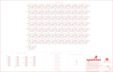

Contents
========

* [PRS15047 > Lumini 8x8](#prs15047--lumini-8x8)
	* [Schematic](#schematic)
	* [PCB](#pcb)
	* [Interactive BOM](#interactive-bom)
	* [Images](#images)
	* [Tags](#tags)
  
![][im]
# PRS15047 > Lumini 8x8

- ID: PROJ-SPAR-15047-STAN-01
- Hex ID: PRS15047
- Name: Sparkfun
- Description: Sparkfun
- Long Link: [http://oom.lt/PROJ-SPAR-15047-STAN-01](http://oom.lt/PROJ-SPAR-15047-STAN-01)
- Short Link: [http://oom.lt/PRS15047](http://oom.lt/PRS15047)

## Schematic
  

## PCB
  

## Interactive BOM

- Interactive BOM page: [ibom.html](https://htmlpreview.github.io/?https://github.com/oomlout/oomlout_OOMP_projects/blob/main/PROJ-SPAR-15047-STAN-01/kicad/bom/ibom.html)

## Images
  
  

|bominteractivefront|bominteractiveback|kicadPcb3d|kicadPcb3dFront|kicadPcb3dBack|eagleImage|eagleSchemImage|pcbdraw|pcbdrawback|
| :---: | :---: | :---: | :---: | :---: | :---: | :---: | :---: | :---: |
||||||||||

## Tags

- hexID: PRS15047
- oompType: PROJ
- oompSize: SPAR
- oompColor: 15047
- oompDesc: STAN
- oompIndex: 01
- oompName: Lumini 8x8
- sources: All source files from https://github.com/sparkfun/Lumini_8x8 (source licence details in srcLicense.md)
- linkBuyPage: https://www.sparkfun.com/products/15047
- oompID: PROJ-SPAR-15047-STAN-01
- rawParts: C1,DNP,4.7UF-1206-16V-(+80/-20%),1206,4.7µF ceramic capacitors,,CAP-10300,,4.7uF,
- rawParts: D1,APA102-2020,APA102-2020,APA102-2020,APA102 Addressable RGB LED,,DIO-13883,,,
- rawParts: D2,APA102-2020,APA102-2020,APA102-2020,APA102 Addressable RGB LED,,DIO-13883,,,
- rawParts: D3,APA102-2020,APA102-2020,APA102-2020,APA102 Addressable RGB LED,,DIO-13883,,,
- rawParts: D4,APA102-2020,APA102-2020,APA102-2020,APA102 Addressable RGB LED,,DIO-13883,,,
- rawParts: D5,APA102-2020,APA102-2020,APA102-2020,APA102 Addressable RGB LED,,DIO-13883,,,
- rawParts: D6,APA102-2020,APA102-2020,APA102-2020,APA102 Addressable RGB LED,,DIO-13883,,,
- rawParts: D7,APA102-2020,APA102-2020,APA102-2020,APA102 Addressable RGB LED,,DIO-13883,,,
- rawParts: D8,APA102-2020,APA102-2020,APA102-2020,APA102 Addressable RGB LED,,DIO-13883,,,
- rawParts: D9,APA102-2020,APA102-2020,APA102-2020,APA102 Addressable RGB LED,,DIO-13883,,,
- rawParts: D10,APA102-2020,APA102-2020,APA102-2020,APA102 Addressable RGB LED,,DIO-13883,,,
- rawParts: D11,APA102-2020,APA102-2020,APA102-2020,APA102 Addressable RGB LED,,DIO-13883,,,
- rawParts: D12,APA102-2020,APA102-2020,APA102-2020,APA102 Addressable RGB LED,,DIO-13883,,,
- rawParts: D13,APA102-2020,APA102-2020,APA102-2020,APA102 Addressable RGB LED,,DIO-13883,,,
- rawParts: D14,APA102-2020,APA102-2020,APA102-2020,APA102 Addressable RGB LED,,DIO-13883,,,
- rawParts: D15,APA102-2020,APA102-2020,APA102-2020,APA102 Addressable RGB LED,,DIO-13883,,,
- rawParts: D16,APA102-2020,APA102-2020,APA102-2020,APA102 Addressable RGB LED,,DIO-13883,,,
- rawParts: D17,APA102-2020,APA102-2020,APA102-2020,APA102 Addressable RGB LED,,DIO-13883,,,
- rawParts: D18,APA102-2020,APA102-2020,APA102-2020,APA102 Addressable RGB LED,,DIO-13883,,,
- rawParts: D19,APA102-2020,APA102-2020,APA102-2020,APA102 Addressable RGB LED,,DIO-13883,,,
- rawParts: D20,APA102-2020,APA102-2020,APA102-2020,APA102 Addressable RGB LED,,DIO-13883,,,
- rawParts: D21,APA102-2020,APA102-2020,APA102-2020,APA102 Addressable RGB LED,,DIO-13883,,,
- rawParts: D22,APA102-2020,APA102-2020,APA102-2020,APA102 Addressable RGB LED,,DIO-13883,,,
- rawParts: D23,APA102-2020,APA102-2020,APA102-2020,APA102 Addressable RGB LED,,DIO-13883,,,
- rawParts: D24,APA102-2020,APA102-2020,APA102-2020,APA102 Addressable RGB LED,,DIO-13883,,,
- rawParts: D25,APA102-2020,APA102-2020,APA102-2020,APA102 Addressable RGB LED,,DIO-13883,,,
- rawParts: D26,APA102-2020,APA102-2020,APA102-2020,APA102 Addressable RGB LED,,DIO-13883,,,
- rawParts: D27,APA102-2020,APA102-2020,APA102-2020,APA102 Addressable RGB LED,,DIO-13883,,,
- rawParts: D28,APA102-2020,APA102-2020,APA102-2020,APA102 Addressable RGB LED,,DIO-13883,,,
- rawParts: D29,APA102-2020,APA102-2020,APA102-2020,APA102 Addressable RGB LED,,DIO-13883,,,
- rawParts: D30,APA102-2020,APA102-2020,APA102-2020,APA102 Addressable RGB LED,,DIO-13883,,,
- rawParts: D31,APA102-2020,APA102-2020,APA102-2020,APA102 Addressable RGB LED,,DIO-13883,,,
- rawParts: D32,APA102-2020,APA102-2020,APA102-2020,APA102 Addressable RGB LED,,DIO-13883,,,
- rawParts: D33,APA102-2020,APA102-2020,APA102-2020,APA102 Addressable RGB LED,,DIO-13883,,,
- rawParts: D34,APA102-2020,APA102-2020,APA102-2020,APA102 Addressable RGB LED,,DIO-13883,,,
- rawParts: D35,APA102-2020,APA102-2020,APA102-2020,APA102 Addressable RGB LED,,DIO-13883,,,
- rawParts: D36,APA102-2020,APA102-2020,APA102-2020,APA102 Addressable RGB LED,,DIO-13883,,,
- rawParts: D37,APA102-2020,APA102-2020,APA102-2020,APA102 Addressable RGB LED,,DIO-13883,,,
- rawParts: D38,APA102-2020,APA102-2020,APA102-2020,APA102 Addressable RGB LED,,DIO-13883,,,
- rawParts: D39,APA102-2020,APA102-2020,APA102-2020,APA102 Addressable RGB LED,,DIO-13883,,,
- rawParts: D40,APA102-2020,APA102-2020,APA102-2020,APA102 Addressable RGB LED,,DIO-13883,,,
- rawParts: D41,APA102-2020,APA102-2020,APA102-2020,APA102 Addressable RGB LED,,DIO-13883,,,
- rawParts: D42,APA102-2020,APA102-2020,APA102-2020,APA102 Addressable RGB LED,,DIO-13883,,,
- rawParts: D43,APA102-2020,APA102-2020,APA102-2020,APA102 Addressable RGB LED,,DIO-13883,,,
- rawParts: D44,APA102-2020,APA102-2020,APA102-2020,APA102 Addressable RGB LED,,DIO-13883,,,
- rawParts: D45,APA102-2020,APA102-2020,APA102-2020,APA102 Addressable RGB LED,,DIO-13883,,,
- rawParts: D46,APA102-2020,APA102-2020,APA102-2020,APA102 Addressable RGB LED,,DIO-13883,,,
- rawParts: D47,APA102-2020,APA102-2020,APA102-2020,APA102 Addressable RGB LED,,DIO-13883,,,
- rawParts: D48,APA102-2020,APA102-2020,APA102-2020,APA102 Addressable RGB LED,,DIO-13883,,,
- rawParts: D49,APA102-2020,APA102-2020,APA102-2020,APA102 Addressable RGB LED,,DIO-13883,,,
- rawParts: D50,APA102-2020,APA102-2020,APA102-2020,APA102 Addressable RGB LED,,DIO-13883,,,
- rawParts: D51,APA102-2020,APA102-2020,APA102-2020,APA102 Addressable RGB LED,,DIO-13883,,,
- rawParts: D52,APA102-2020,APA102-2020,APA102-2020,APA102 Addressable RGB LED,,DIO-13883,,,
- rawParts: D53,APA102-2020,APA102-2020,APA102-2020,APA102 Addressable RGB LED,,DIO-13883,,,
- rawParts: D54,APA102-2020,APA102-2020,APA102-2020,APA102 Addressable RGB LED,,DIO-13883,,,
- rawParts: D55,APA102-2020,APA102-2020,APA102-2020,APA102 Addressable RGB LED,,DIO-13883,,,
- rawParts: D56,APA102-2020,APA102-2020,APA102-2020,APA102 Addressable RGB LED,,DIO-13883,,,
- rawParts: D57,APA102-2020,APA102-2020,APA102-2020,APA102 Addressable RGB LED,,DIO-13883,,,
- rawParts: D58,APA102-2020,APA102-2020,APA102-2020,APA102 Addressable RGB LED,,DIO-13883,,,
- rawParts: D59,APA102-2020,APA102-2020,APA102-2020,APA102 Addressable RGB LED,,DIO-13883,,,
- rawParts: D60,APA102-2020,APA102-2020,APA102-2020,APA102 Addressable RGB LED,,DIO-13883,,,
- rawParts: D61,APA102-2020,APA102-2020,APA102-2020,APA102 Addressable RGB LED,,DIO-13883,,,
- rawParts: D62,APA102-2020,APA102-2020,APA102-2020,APA102 Addressable RGB LED,,DIO-13883,,,
- rawParts: D63,APA102-2020,APA102-2020,APA102-2020,APA102 Addressable RGB LED,,DIO-13883,,,
- rawParts: D64,APA102-2020,APA102-2020,APA102-2020,APA102 Addressable RGB LED,,DIO-13883,,,
- rawParts: FD1,FIDUCIALUFIDUCIAL,FIDUCIALUFIDUCIAL,FIDUCIAL-MICRO,Fiducial Alignment Points,,,,,
- rawParts: FD2,FIDUCIALUFIDUCIAL,FIDUCIALUFIDUCIAL,FIDUCIAL-MICRO,Fiducial Alignment Points,,,,,
- rawParts: FD3,FIDUCIALUFIDUCIAL,FIDUCIALUFIDUCIAL,FIDUCIAL-MICRO,Fiducial Alignment Points,,,,,
- rawParts: FD4,FIDUCIALUFIDUCIAL,FIDUCIALUFIDUCIAL,FIDUCIAL-MICRO,Fiducial Alignment Points,,,,,
- rawParts: FRAME1,FRAME-LEDGER,FRAME-LEDGER,CREATIVE_COMMONS,Schematic Frame - Ledger,,,,,
- rawParts: H1,STANDOFF_ELECTRICAL-NOTHERMALS,STANDOFF_ELECTRICAL-NOTHERMALS,STANDOFF-ELECTRICAL-NOTHERMALS,Stand Off,,,,,
- rawParts: H2,STANDOFF_ELECTRICAL-NOTHERMALS,STANDOFF_ELECTRICAL-NOTHERMALS,STANDOFF-ELECTRICAL-NOTHERMALS,Stand Off,,,,,
- rawParts: H3,STANDOFF_ELECTRICAL-NOTHERMALS,STANDOFF_ELECTRICAL-NOTHERMALS,STANDOFF-ELECTRICAL-NOTHERMALS,Stand Off,,,,,
- rawParts: H4,STANDOFF_ELECTRICAL-NOTHERMALS,STANDOFF_ELECTRICAL-NOTHERMALS,STANDOFF-ELECTRICAL-NOTHERMALS,Stand Off,,,,,
- rawParts: J1,LED_PAD,LED_PAD,CIRCULARPAD,LuMini 8X8 Solder Pad,,,,,
- rawParts: J2,LED_PAD,LED_PAD,CIRCULARPAD,LuMini 8X8 Solder Pad,,,,,
- rawParts: J3,LED_PAD,LED_PAD,CIRCULARPAD,LuMini 8X8 Solder Pad,,,,,
- rawParts: J4,LED_PAD,LED_PAD,CIRCULARPAD,LuMini 8X8 Solder Pad,,,,,
- rawParts: J5,LED_PAD,LED_PAD,CIRCULARPAD,LuMini 8X8 Solder Pad,,,,,
- rawParts: J6,LED_PAD,LED_PAD,CIRCULARPAD,LuMini 8X8 Solder Pad,,,,,
- rawParts: J7,LED_PAD,LED_PAD,CIRCULARPAD,LuMini 8X8 Solder Pad,,,,,
- rawParts: J8,LED_PAD,LED_PAD,CIRCULARPAD,LuMini 8X8 Solder Pad,,,,,
- rawParts: J9,LED_PAD,LED_PAD,CIRCULARPAD,LuMini 8X8 Solder Pad,,,,,
- rawParts: J10,LED_PAD,LED_PAD,CIRCULARPAD,LuMini 8X8 Solder Pad,,,,,
- rawParts: J11,LED_PAD,LED_PAD,CIRCULARPAD,LuMini 8X8 Solder Pad,,,,,
- rawParts: J12,LED_PAD,LED_PAD,CIRCULARPAD,LuMini 8X8 Solder Pad,,,,,
- rawParts: J13,LED_PAD,LED_PAD,CIRCULARPAD,LuMini 8X8 Solder Pad,,,,,
- rawParts: J14,LED_PAD,LED_PAD,CIRCULARPAD,LuMini 8X8 Solder Pad,,,,,
- rawParts: J15,LED_PAD,LED_PAD,CIRCULARPAD,LuMini 8X8 Solder Pad,,,,,
- rawParts: J16,LED_PAD,LED_PAD,CIRCULARPAD,LuMini 8X8 Solder Pad,,,,,
- rawParts: LOGO1,SFE_LOGO_NAME_FLAME.1_INCH,SFE_LOGO_NAME_FLAME.1_INCH,SFE_LOGO_NAME_FLAME_.1,SparkFun Font Logo w/ Flame,,,,,
- rawParts: LOGO2,OSHW-LOGOS,OSHW-LOGOS,OSHW-LOGO-S,Open-Source Hardware (OSHW) Logo,,,,,

[im]: kicadPcb3d_450.png
