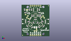
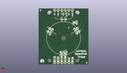
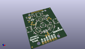

Contents
========

* [PROJ-SPAR-15050-STAN-01>Qwiic Spectral Sensor AS7265x](#proj-spar-15050-stan-01qwiic-spectral-sensor-as7265x)
	* [Images](#images)
	* [Interactive BOM](#interactive-bom)
	* [OOMP Parts](#oomp-parts)
	* [Tags](#tags)
  
![][im]
# PROJ-SPAR-15050-STAN-01>Qwiic Spectral Sensor AS7265x

- ID: PROJ-SPAR-15050-STAN-01
- Hex ID: PRS15050
- Name: Qwiic Spectral Sensor AS7265x
- Description: 

## Images
  
  

|eagleImage|kicadPcb3dFront|kicadPcb3dBack|kicadPcb3d|
| :---: | :---: | :---: | :---: |
|||||

## Interactive BOM

- Interactive BOM page: [ibom.html](kicad/bom/ibom.html)

## OOMP Parts
  

|OOMP Parts|
| :---: |
|UNMATCHED-UNMATCHED-X-UNMATCHED-01, BULB1, 7.366028194, 25.145968758, M120,BULB1, LED_5MM_NOSILK, SparkX, (0.29000111, 0.98999877), MR120|
|UNMATCHED-UNMATCHED-X-UNMATCHED-01, BULB2, 28.19395936, 25.018978156, M240,BULB2, LED_5MM_NOSILK, SparkX, (1.1099984, 0.98499914), MR240|
|UNMATCHED-UNMATCHED-X-UNMATCHED-01, BULB3, 17.779999999999998, 6.985050037999999, M0,BULB3, LED_5MM_NOSILK, SparkX, (0.7, 0.27500197), MR0|
|CAPE-0603-X-UNMATCHED-01, C1, 12.700012446, 34.289946914, 90,C1, 1.0uF, 0603, SparkFun-Capacitors, (0.50000049, 1.34999791), R90|
|CAPE-0603-X-NF100-01, C2, 17.779999999999998, 21.97095301, 180,C2, 0.1uF, 0603, SparkFun-Capacitors, (0.7, 0.86499815), R180|
|CAPE-0603-X-UNMATCHED-01, C3, 22.351968757999998, 26.669968757999996, 90,C3, 10uF, 0603, SparkFun-Capacitors, (0.87999877, 1.04999877), R90|
|CAPE-0603-X-NF100-01, C4, 20.319962408, 17.526024892, 240,C4, 0.1uF, 0603, SparkFun-Capacitors, (0.79999852, 0.69000098), R240|
|CAPE-0603-X-UNMATCHED-01, C5, 26.669956312, 19.049999999999997, 330,C5, 10uF, 0603, SparkFun-Capacitors, (1.04999828, 0.75), R330|
|CAPE-0603-X-NF100-01, C6, 13.47176884, 11.258018631999999, 210,C6, 0.1uF, 0603, SparkFun-Capacitors, (0.5303846, 0.44322908), R210|
|CAPE-0603-X-UNMATCHED-01, C7, 15.250340593999999, 17.589503048, 120,C7, 10uF, 0603, SparkFun-Capacitors, (0.60040711, 0.69250012), R120|
|UNMATCHED-0603-X-UNMATCHED-01, D1, 26.669975108, 30.47996571, 0,D1, BLUE, LED-0603, SparkFun-LED, (1.04999902, 1.19999865), R0|
|UNMATCHED-UNMATCHED-X-UNMATCHED-01, D2, 11.181109463999999, 22.859965709999997, 60,D2, 5700k, SUPER_BRIGHT_SMD_LED_3014, SparkFun-LED, (0.44020116, 0.89999865), R60|
|UNMATCHED-0603-X-UNMATCHED-01, D3, 24.383999999999997, 22.86, 300,D3, IR, LED-0603, SparkFun-LED, (0.96, 0.9), R300|
|UNMATCHED-0603-X-UNMATCHED-01, D4, 8.889999999999999, 30.479999999999997, 0,D4, RED, LED-0603, SparkFun-LED, (0.35, 1.2), R0|
|UNMATCHED-UNMATCHED-X-UNMATCHED-01, D5, 17.779999999999998, 11.43, 0,D5, UV, PLCC-2, SparkFun-LED, (0.7, 0.45), R0|
|UNMATCHED-UNMATCHED-X-UNMATCHED-01, FD1, 1.27, 1.27, 0,FD1, FIDUCIAL1X2, FIDUCIAL-1X2, SparkFun-Aesthetics, (0.05, 0.05), R0|
|UNMATCHED-UNMATCHED-X-UNMATCHED-01, FD2, 34.29, 39.37, 0,FD2, FIDUCIAL1X2, FIDUCIAL-1X2, SparkFun-Aesthetics, (1.35, 1.55), R0|
|UNMATCHED-UNMATCHED-X-UNMATCHED-01, FD3, 34.29, 39.37, M0,FD3, FIDUCIAL1X2, FIDUCIAL-1X2, SparkFun-Aesthetics, (1.35, 1.55), MR0|
|UNMATCHED-UNMATCHED-X-UNMATCHED-01, FD4, 1.27, 1.27, M0,FD4, FIDUCIAL1X2, FIDUCIAL-1X2, SparkFun-Aesthetics, (0.05, 0.05), MR0|
|UNMATCHED-UNMATCHED-X-UNMATCHED-01, J1, 5.08004699, 19.049999999999997, 270,J1, 1X04_1MM_RA, SparkFun-Connectors, (0.20000185, 0.75), R270|
|ERROR, J2 Serial Interface, 0, 0, 0,J2, Serial, Interface, 1X06_NO_SILK, SparkFun-Connectors, (0.94999975, 1.5499984), R180|
|UNMATCHED-UNMATCHED-X-UNMATCHED-01, J3, 13.970009398, 1.27004699, 180,J3, 1X02_NO_SILK, SparkFun-Connectors, (0.55000037, 0.05000185), R180|
|UNMATCHED-UNMATCHED-X-UNMATCHED-01, J4, 30.47995301, 19.049999999999997, 90,J4, 1X04_1MM_RA, SparkFun-Connectors, (1.19999815, 0.75), R90|
|ERROR, J5 Flash Programming, 0, 0, 0,J5, Flash, Programming, 2X3_TEST_POINTS, SparkFun-Connectors, (0.7, 1.34999815), MR270|
|UNMATCHED-UNMATCHED-X-UNMATCHED-01, J8, 24.129990602, 1.27004699, 180,J8, PTH, 1X04_NO_SILK, SparkFun-Connectors, (0.94999963, 0.05000185), R180|
|UNMATCHED-UNMATCHED-X-UNMATCHED-01, JP1, 6.985, 34.29, 0,JP1, SMT-JUMPER_3_2-NC_TRACE_SILK, SparkFun-Jumpers, (0.275, 1.35), R0|
|UNMATCHED-UNMATCHED-X-UNMATCHED-01, JP2, 10.16, 30.479999999999997, M180,JP2, SMT-JUMPER_2_NO_SILK, SparkFun-Jumpers, (0.4, 1.2), MR180|
|UNMATCHED-UNMATCHED-X-UNMATCHED-01, JP3, 19.049996951999997, 9.017009397999999, 270,JP3, SMT-JUMPER_2_NC_TRACE_NO-SILK, SparkFun-Jumpers, (0.74999988, 0.35500037), R270|
|UNMATCHED-UNMATCHED-X-UNMATCHED-01, JP4, 8.927134292, 22.730596906, 150,JP4, SMT-JUMPER_2_NC_TRACE_NO-SILK, SparkFun-Jumpers, (0.35146198, 0.89490539), R150|
|UNMATCHED-UNMATCHED-X-UNMATCHED-01, JP5, 25.584381139999998, 24.582387461999996, 30,JP5, SMT-JUMPER_2_NC_TRACE_NO-SILK, SparkFun-Jumpers, (1.0072591, 0.96781053), R30|
|UNMATCHED-UNMATCHED-X-UNMATCHED-01, JP7, 5.08, 27.94, 0,JP7, SMT-JUMPER_2_NC_TRACE_NO-SILK, SparkFun-Jumpers, (0.2, 1.1), R0|
|<table><tr><td></td><td> R1</td><td>[RESE-0603-X-O103-01 SMD (0603) 10k Ohm Resistor](https://github.com/oomlout/oomlout_OOMP_parts/tree/main/RESE-0603-X-O103-01/)</td><td>[R6103](https://github.com/oomlout/oomlout_OOMP_parts/tree/main/RESE-0603-X-O103-01/)</td></tr></table>|
|RESE-0603-X-UNMATCHED-01, R2, 5.08, 30.479999999999997, 180,R2, 1k, 0603, SparkFun-Resistors, (0.2, 1.2), R180|
|<table><tr><td></td><td> R3</td><td>[RESE-0603-X-O103-01 SMD (0603) 10k Ohm Resistor](https://github.com/oomlout/oomlout_OOMP_parts/tree/main/RESE-0603-X-O103-01/)</td><td>[R6103](https://github.com/oomlout/oomlout_OOMP_parts/tree/main/RESE-0603-X-O103-01/)</td></tr></table>|
|<table><tr><td></td><td> R4</td><td>[RESE-0603-X-O103-01 SMD (0603) 10k Ohm Resistor](https://github.com/oomlout/oomlout_OOMP_parts/tree/main/RESE-0603-X-O103-01/)</td><td>[R6103](https://github.com/oomlout/oomlout_OOMP_parts/tree/main/RESE-0603-X-O103-01/)</td></tr></table>|
|<table><tr><td></td><td> R5</td><td>[RESE-0603-X-O103-01 SMD (0603) 10k Ohm Resistor](https://github.com/oomlout/oomlout_OOMP_parts/tree/main/RESE-0603-X-O103-01/)</td><td>[R6103](https://github.com/oomlout/oomlout_OOMP_parts/tree/main/RESE-0603-X-O103-01/)</td></tr></table>|
|<table><tr><td></td><td> R7</td><td>[RESE-0603-X-O103-01 SMD (0603) 10k Ohm Resistor](https://github.com/oomlout/oomlout_OOMP_parts/tree/main/RESE-0603-X-O103-01/)</td><td>[R6103](https://github.com/oomlout/oomlout_OOMP_parts/tree/main/RESE-0603-X-O103-01/)</td></tr></table>|
|<table><tr><td></td><td> R8</td><td>[RESE-0603-X-O103-01 SMD (0603) 10k Ohm Resistor](https://github.com/oomlout/oomlout_OOMP_parts/tree/main/RESE-0603-X-O103-01/)</td><td>[R6103](https://github.com/oomlout/oomlout_OOMP_parts/tree/main/RESE-0603-X-O103-01/)</td></tr></table>|
|RESE-0603-X-UNMATCHED-01, R9, 24.129968757999997, 26.669962407999996, 270,R9, 2.2k, 0603, SparkFun-Resistors, (0.94999877, 1.04999852), R270|
|RESE-0603-X-UNMATCHED-01, R10, 22.859990602, 30.479959359999995, 0,R10, 2.2k, 0603, SparkFun-Resistors, (0.89999963, 1.1999984), R0|
|RESE-0603-X-UNMATCHED-01, R11, 3.8100281939999996, 34.289968758, 90,R11, 2.2k, 0603, SparkFun-Resistors, (0.15000111, 1.34999877), R90|
|RESE-0603-X-UNMATCHED-01, R12, 10.287012445999999, 34.289949962, 90,R12, 2.2k, 0603, SparkFun-Resistors, (0.40500049, 1.34999803), R90|
|UNMATCHED-UNMATCHED-X-UNMATCHED-01, TP1, 13.97, 26.669999999999998, M0,TP1, PAD.03X.03, SparkFun-Connectors, (0.55, 1.05), MR0|
|UNMATCHED-UNMATCHED-X-UNMATCHED-01, U1, 17.779999999999998, 26.669953009999997, 270,U1, AS72651, LGA20, Qwiic_Spectral_Sensor-AS7265x, (0.7, 1.04999815), R270|
|ERROR, U2 4MB Flash, 0, 0, 0,U2, 4MB, Flash, SO08, SparkFun-IC-Memory, (0.7, 1.34999815), R270|
|UNMATCHED-UNMATCHED-X-UNMATCHED-01, U3, 24.378890536, 15.240034289999999, 60,U3, AS72652, LGA20, Qwiic_Spectral_Sensor-AS7265x, (0.95979884, 0.60000135), R60|
|UNMATCHED-UNMATCHED-X-UNMATCHED-01, U4, 11.181118862, 15.240031242, 300,U4, AS72653, LGA20, Qwiic_Spectral_Sensor-AS7265x, (0.44020153, 0.60000123), R300|

## Tags

- hexID: PRS15050
- oompType: PROJ
- oompSize: SPAR
- oompColor: 15050
- oompDesc: STAN
- oompIndex: 01
- oompName: Qwiic Spectral Sensor AS7265x
- sources: All source files from https://github.com/sparkfun/Qwiic_Spectral_Sensor_AS7265x (source licence details in srcLicense.md)
- linkBuyPage: https://www.sparkfun.com/products/15050
- oompPart: UNMATCHED-UNMATCHED-X-UNMATCHED-01, BULB1, 7.366028194, 25.145968758, M120
- oompPart: UNMATCHED-UNMATCHED-X-UNMATCHED-01, BULB2, 28.19395936, 25.018978156, M240
- oompPart: UNMATCHED-UNMATCHED-X-UNMATCHED-01, BULB3, 17.779999999999998, 6.985050037999999, M0
- oompPart: CAPE-0603-X-UNMATCHED-01, C1, 12.700012446, 34.289946914, 90
- oompPart: CAPE-0603-X-NF100-01, C2, 17.779999999999998, 21.97095301, 180
- oompPart: CAPE-0603-X-UNMATCHED-01, C3, 22.351968757999998, 26.669968757999996, 90
- oompPart: CAPE-0603-X-NF100-01, C4, 20.319962408, 17.526024892, 240
- oompPart: CAPE-0603-X-UNMATCHED-01, C5, 26.669956312, 19.049999999999997, 330
- oompPart: CAPE-0603-X-NF100-01, C6, 13.47176884, 11.258018631999999, 210
- oompPart: CAPE-0603-X-UNMATCHED-01, C7, 15.250340593999999, 17.589503048, 120
- oompPart: UNMATCHED-0603-X-UNMATCHED-01, D1, 26.669975108, 30.47996571, 0
- oompPart: UNMATCHED-UNMATCHED-X-UNMATCHED-01, D2, 11.181109463999999, 22.859965709999997, 60
- oompPart: UNMATCHED-0603-X-UNMATCHED-01, D3, 24.383999999999997, 22.86, 300
- oompPart: UNMATCHED-0603-X-UNMATCHED-01, D4, 8.889999999999999, 30.479999999999997, 0
- oompPart: UNMATCHED-UNMATCHED-X-UNMATCHED-01, D5, 17.779999999999998, 11.43, 0
- oompPart: UNMATCHED-UNMATCHED-X-UNMATCHED-01, FD1, 1.27, 1.27, 0
- oompPart: UNMATCHED-UNMATCHED-X-UNMATCHED-01, FD2, 34.29, 39.37, 0
- oompPart: UNMATCHED-UNMATCHED-X-UNMATCHED-01, FD3, 34.29, 39.37, M0
- oompPart: UNMATCHED-UNMATCHED-X-UNMATCHED-01, FD4, 1.27, 1.27, M0
- oompPart: UNMATCHED-UNMATCHED-X-UNMATCHED-01, J1, 5.08004699, 19.049999999999997, 270
- oompPart: ERROR, J2 Serial Interface, 0, 0, 0
- oompPart: UNMATCHED-UNMATCHED-X-UNMATCHED-01, J3, 13.970009398, 1.27004699, 180
- oompPart: UNMATCHED-UNMATCHED-X-UNMATCHED-01, J4, 30.47995301, 19.049999999999997, 90
- oompPart: ERROR, J5 Flash Programming, 0, 0, 0
- oompPart: UNMATCHED-UNMATCHED-X-UNMATCHED-01, J8, 24.129990602, 1.27004699, 180
- oompPart: UNMATCHED-UNMATCHED-X-UNMATCHED-01, JP1, 6.985, 34.29, 0
- oompPart: UNMATCHED-UNMATCHED-X-UNMATCHED-01, JP2, 10.16, 30.479999999999997, M180
- oompPart: UNMATCHED-UNMATCHED-X-UNMATCHED-01, JP3, 19.049996951999997, 9.017009397999999, 270
- oompPart: UNMATCHED-UNMATCHED-X-UNMATCHED-01, JP4, 8.927134292, 22.730596906, 150
- oompPart: UNMATCHED-UNMATCHED-X-UNMATCHED-01, JP5, 25.584381139999998, 24.582387461999996, 30
- oompPart: UNMATCHED-UNMATCHED-X-UNMATCHED-01, JP7, 5.08, 27.94, 0
- oompPart: RESE-0603-X-O103-01, R1, 22.351962408, 11.430031241999998, 330
- oompPart: RESE-0603-X-UNMATCHED-01, R2, 5.08, 30.479999999999997, 180
- oompPart: RESE-0603-X-O103-01, R3, 13.208037592, 26.669968757999996, 270
- oompPart: RESE-0603-X-O103-01, R4, 22.859990602, 34.289949962, 90
- oompPart: RESE-0603-X-O103-01, R5, 28.194000000000003, 13.081, 240
- oompPart: RESE-0603-X-O103-01, R7, 8.890043688, 19.049999999999997, 210
- oompPart: RESE-0603-X-O103-01, R8, 7.3314062159999995, 13.017503048, 120
- oompPart: RESE-0603-X-UNMATCHED-01, R9, 24.129968757999997, 26.669962407999996, 270
- oompPart: RESE-0603-X-UNMATCHED-01, R10, 22.859990602, 30.479959359999995, 0
- oompPart: RESE-0603-X-UNMATCHED-01, R11, 3.8100281939999996, 34.289968758, 90
- oompPart: RESE-0603-X-UNMATCHED-01, R12, 10.287012445999999, 34.289949962, 90
- oompPart: UNMATCHED-UNMATCHED-X-UNMATCHED-01, TP1, 13.97, 26.669999999999998, M0
- oompPart: UNMATCHED-UNMATCHED-X-UNMATCHED-01, U1, 17.779999999999998, 26.669953009999997, 270
- oompPart: ERROR, U2 4MB Flash, 0, 0, 0
- oompPart: UNMATCHED-UNMATCHED-X-UNMATCHED-01, U3, 24.378890536, 15.240034289999999, 60
- oompPart: UNMATCHED-UNMATCHED-X-UNMATCHED-01, U4, 11.181118862, 15.240031242, 300
- rawPart: BULB1, LED_5MM_NOSILK, SparkX, (0.29000111, 0.98999877), MR120
- rawPart: BULB2, LED_5MM_NOSILK, SparkX, (1.1099984, 0.98499914), MR240
- rawPart: BULB3, LED_5MM_NOSILK, SparkX, (0.7, 0.27500197), MR0
- rawPart: C1, 1.0uF, 0603, SparkFun-Capacitors, (0.50000049, 1.34999791), R90
- rawPart: C2, 0.1uF, 0603, SparkFun-Capacitors, (0.7, 0.86499815), R180
- rawPart: C3, 10uF, 0603, SparkFun-Capacitors, (0.87999877, 1.04999877), R90
- rawPart: C4, 0.1uF, 0603, SparkFun-Capacitors, (0.79999852, 0.69000098), R240
- rawPart: C5, 10uF, 0603, SparkFun-Capacitors, (1.04999828, 0.75), R330
- rawPart: C6, 0.1uF, 0603, SparkFun-Capacitors, (0.5303846, 0.44322908), R210
- rawPart: C7, 10uF, 0603, SparkFun-Capacitors, (0.60040711, 0.69250012), R120
- rawPart: D1, BLUE, LED-0603, SparkFun-LED, (1.04999902, 1.19999865), R0
- rawPart: D2, 5700k, SUPER_BRIGHT_SMD_LED_3014, SparkFun-LED, (0.44020116, 0.89999865), R60
- rawPart: D3, IR, LED-0603, SparkFun-LED, (0.96, 0.9), R300
- rawPart: D4, RED, LED-0603, SparkFun-LED, (0.35, 1.2), R0
- rawPart: D5, UV, PLCC-2, SparkFun-LED, (0.7, 0.45), R0
- rawPart: FD1, FIDUCIAL1X2, FIDUCIAL-1X2, SparkFun-Aesthetics, (0.05, 0.05), R0
- rawPart: FD2, FIDUCIAL1X2, FIDUCIAL-1X2, SparkFun-Aesthetics, (1.35, 1.55), R0
- rawPart: FD3, FIDUCIAL1X2, FIDUCIAL-1X2, SparkFun-Aesthetics, (1.35, 1.55), MR0
- rawPart: FD4, FIDUCIAL1X2, FIDUCIAL-1X2, SparkFun-Aesthetics, (0.05, 0.05), MR0
- rawPart: J1, 1X04_1MM_RA, SparkFun-Connectors, (0.20000185, 0.75), R270
- rawPart: J2, Serial, Interface, 1X06_NO_SILK, SparkFun-Connectors, (0.94999975, 1.5499984), R180
- rawPart: J3, 1X02_NO_SILK, SparkFun-Connectors, (0.55000037, 0.05000185), R180
- rawPart: J4, 1X04_1MM_RA, SparkFun-Connectors, (1.19999815, 0.75), R90
- rawPart: J5, Flash, Programming, 2X3_TEST_POINTS, SparkFun-Connectors, (0.7, 1.34999815), MR270
- rawPart: J8, PTH, 1X04_NO_SILK, SparkFun-Connectors, (0.94999963, 0.05000185), R180
- rawPart: JP1, SMT-JUMPER_3_2-NC_TRACE_SILK, SparkFun-Jumpers, (0.275, 1.35), R0
- rawPart: JP2, SMT-JUMPER_2_NO_SILK, SparkFun-Jumpers, (0.4, 1.2), MR180
- rawPart: JP3, SMT-JUMPER_2_NC_TRACE_NO-SILK, SparkFun-Jumpers, (0.74999988, 0.35500037), R270
- rawPart: JP4, SMT-JUMPER_2_NC_TRACE_NO-SILK, SparkFun-Jumpers, (0.35146198, 0.89490539), R150
- rawPart: JP5, SMT-JUMPER_2_NC_TRACE_NO-SILK, SparkFun-Jumpers, (1.0072591, 0.96781053), R30
- rawPart: JP7, SMT-JUMPER_2_NC_TRACE_NO-SILK, SparkFun-Jumpers, (0.2, 1.1), R0
- rawPart: R1, 10k, 0603, SparkFun-Resistors, (0.87999852, 0.45000123), R330
- rawPart: R2, 1k, 0603, SparkFun-Resistors, (0.2, 1.2), R180
- rawPart: R3, 10k, 0603, SparkFun-Resistors, (0.52000148, 1.04999877), R270
- rawPart: R4, 10k, 0603, SparkFun-Resistors, (0.89999963, 1.34999803), R90
- rawPart: R5, 10k, 0603, SparkFun-Resistors, (1.11, 0.515), R240
- rawPart: R7, 10k, 0603, SparkFun-Resistors, (0.35000172, 0.75), R210
- rawPart: R8, 10k, 0603, SparkFun-Resistors, (0.28863804, 0.51250012), R120
- rawPart: R9, 2.2k, 0603, SparkFun-Resistors, (0.94999877, 1.04999852), R270
- rawPart: R10, 2.2k, 0603, SparkFun-Resistors, (0.89999963, 1.1999984), R0
- rawPart: R11, 2.2k, 0603, SparkFun-Resistors, (0.15000111, 1.34999877), R90
- rawPart: R12, 2.2k, 0603, SparkFun-Resistors, (0.40500049, 1.34999803), R90
- rawPart: TP1, PAD.03X.03, SparkFun-Connectors, (0.55, 1.05), MR0
- rawPart: U1, AS72651, LGA20, Qwiic_Spectral_Sensor-AS7265x, (0.7, 1.04999815), R270
- rawPart: U2, 4MB, Flash, SO08, SparkFun-IC-Memory, (0.7, 1.34999815), R270
- rawPart: U3, AS72652, LGA20, Qwiic_Spectral_Sensor-AS7265x, (0.95979884, 0.60000135), R60
- rawPart: U4, AS72653, LGA20, Qwiic_Spectral_Sensor-AS7265x, (0.44020153, 0.60000123), R300

[im]: kicadPcb3d_450.png
