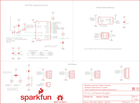

Contents
========

* [PRS15050 > Qwiic Spectral Sensor AS7265x](#prs15050--qwiic-spectral-sensor-as7265x)
	* [Schematic](#schematic)
	* [PCB](#pcb)
	* [Interactive BOM](#interactive-bom)
	* [Images](#images)
	* [Tags](#tags)
  
![][im]
# PRS15050 > Qwiic Spectral Sensor AS7265x

- ID: PROJ-SPAR-15050-STAN-01
- Hex ID: PRS15050
- Name: Sparkfun
- Description: Sparkfun
- Long Link: [http://oom.lt/PROJ-SPAR-15050-STAN-01](http://oom.lt/PROJ-SPAR-15050-STAN-01)
- Short Link: [http://oom.lt/PRS15050](http://oom.lt/PRS15050)

## Schematic
  

## PCB
  

## Interactive BOM

- Interactive BOM page: [ibom.html](https://htmlpreview.github.io/?https://github.com/oomlout/oomlout_OOMP_projects/blob/main/PROJ-SPAR-15050-STAN-01/kicad/bom/ibom.html)

## Images
  
  

|bominteractivefront|bominteractiveback|kicadPcb3d|kicadPcb3dFront|kicadPcb3dBack|eagleImage|eagleSchemImage|pcbdraw|pcbdrawback|
| :---: | :---: | :---: | :---: | :---: | :---: | :---: | :---: | :---: |
||||||||||

## Tags

- hexID: PRS15050
- oompType: PROJ
- oompSize: SPAR
- oompColor: 15050
- oompDesc: STAN
- oompIndex: 01
- oompName: Qwiic Spectral Sensor AS7265x
- sources: All source files from https://github.com/sparkfun/Qwiic_Spectral_Sensor_AS7265x (source licence details in srcLicense.md)
- linkBuyPage: https://www.sparkfun.com/products/15050
- oompID: PROJ-SPAR-15050-STAN-01
- rawParts: BULB1,,LEDNS,LED_5MM_NOSILK,,,,,,
- rawParts: BULB2,,LEDNS,LED_5MM_NOSILK,,,,,,
- rawParts: BULB3,,LEDNS,LED_5MM_NOSILK,,,,,,
- rawParts: C1,1.0uF,1.0UF-0603-16V-10%,0603,1µF ceramic capacitors,,CAP-00868,,1.0uF,
- rawParts: C2,0.1uF,0.1UF-0603-25V-(+80/-20%),0603,0.1µF ceramic capacitors,,CAP-00810,,0.1uF,
- rawParts: C3,10uF,10UF-0603-6.3V-20%,0603,10.0µF ceramic capacitors,,CAP-11015,,10uF,
- rawParts: C4,0.1uF,0.1UF-0603-25V-(+80/-20%),0603,0.1µF ceramic capacitors,,CAP-00810,,0.1uF,
- rawParts: C5,10uF,10UF-0603-6.3V-20%,0603,10.0µF ceramic capacitors,,CAP-11015,,10uF,
- rawParts: C6,0.1uF,0.1UF-0603-25V-(+80/-20%),0603,0.1µF ceramic capacitors,,CAP-00810,,0.1uF,
- rawParts: C7,10uF,10UF-0603-6.3V-20%,0603,10.0µF ceramic capacitors,,CAP-11015,,10uF,
- rawParts: D1,BLUE,LED-BLUE0603,LED-0603,Blue SMD LED,,DIO-08575,,BLUE,
- rawParts: D2,5700k,LED-WHITE3014,SUPER_BRIGHT_SMD_LED_3014,White SMD LED,,DIO-13728,,White, 60mA,
- rawParts: D3,IR,LED-IR0603,LED-0603,Infrared LED (IR),,DIO-14125,,,
- rawParts: D4,RED,LED-RED0603,LED-0603,Red SMD LED,,DIO-00819,,RED,
- rawParts: D5,UV,LED-UVPLCC,PLCC-2,,,DIO-14126,,,
- rawParts: FD1,FIDUCIAL1X2,FIDUCIAL1X2,FIDUCIAL-1X2,Fiducial Alignment Points,,,,,
- rawParts: FD2,FIDUCIAL1X2,FIDUCIAL1X2,FIDUCIAL-1X2,Fiducial Alignment Points,,,,,
- rawParts: FD3,FIDUCIAL1X2,FIDUCIAL1X2,FIDUCIAL-1X2,Fiducial Alignment Points,,,,,
- rawParts: FD4,FIDUCIAL1X2,FIDUCIAL1X2,FIDUCIAL-1X2,Fiducial Alignment Points,,,,,
- rawParts: FRAME1,FRAME-LETTER,FRAME-LETTER,CREATIVE_COMMONS,Schematic Frame - Letter,,,,,
- rawParts: FRAME3,FRAME-LETTER,FRAME-LETTER,CREATIVE_COMMONS,Schematic Frame,,,,,
- rawParts: H1,STAND-OFF,STAND-OFF,STAND-OFF,Stand Off,,,,,
- rawParts: H2,STAND-OFF,STAND-OFF,STAND-OFF,Stand Off,,,,,
- rawParts: H3,STAND-OFF,STAND-OFF,STAND-OFF,Stand Off,,,,,
- rawParts: H4,STAND-OFF,STAND-OFF,STAND-OFF,Stand Off,,,,,
- rawParts: J1,,QWIIC_CONNECTORJS-1MM,1X04_1MM_RA,SparkFun I2C Standard Qwiic Connector,,CONN-13694,,,
- rawParts: J2,Serial Interface,CONN_06NO_SILK_FEMALE_PTH,1X06_NO_SILK,Multi connection point. Often used as Generic Header-pin footprint for 0.1 inch spaced/style header connections,,CONN-08437,,,
- rawParts: J3,,CONN_021X02_NO_SILK,1X02_NO_SILK,Multi connection point. Often used as Generic Header-pin footprint for 0.1 inch spaced/style header connections,,,,,
- rawParts: J4,,QWIIC_CONNECTORJS-1MM,1X04_1MM_RA,SparkFun I2C Standard Qwiic Connector,,CONN-13694,,,
- rawParts: J5,Flash Programming,AVR_SPI_PROG_3X2TESTPOINTS,2X3_TEST_POINTS,AVR ISP 6 Pin,,,,,
- rawParts: J8,PTH,I2C_STANDARD_NO_SILK,1X04_NO_SILK,SparkFun I2C Standard Pinout Header,,,,,
- rawParts: JP1,,JUMPER-SMT_3_2-NC_TRACE_SILK,SMT-JUMPER_3_2-NC_TRACE_SILK,Normally closed trace jumper (2 of 2 connections),,,,,
- rawParts: JP2,,JUMPER-SMT_2_NO_SILK,SMT-JUMPER_2_NO_SILK,Normally open jumper,,,,,
- rawParts: JP3,,JUMPER-SMT_2_NC_TRACE_NO-SILK,SMT-JUMPER_2_NC_TRACE_NO-SILK,Normally closed trace jumper,,,,,
- rawParts: JP4,,JUMPER-SMT_2_NC_TRACE_NO-SILK,SMT-JUMPER_2_NC_TRACE_NO-SILK,Normally closed trace jumper,,,,,
- rawParts: JP5,,JUMPER-SMT_2_NC_TRACE_NO-SILK,SMT-JUMPER_2_NC_TRACE_NO-SILK,Normally closed trace jumper,,,,,
- rawParts: JP7,,JUMPER-SMT_2_NC_TRACE_NO-SILK,SMT-JUMPER_2_NC_TRACE_NO-SILK,Normally closed trace jumper,,,,,
- rawParts: LOGO1,SFE_LOGO_NAME_FLAME.1_INCH,SFE_LOGO_NAME_FLAME.1_INCH,SFE_LOGO_NAME_FLAME_.1,SparkFun Font Logo w/ Flame,,,,,
- rawParts: LOGO4,OSHW-LOGOS,OSHW-LOGOS,OSHW-LOGO-S,Open-Source Hardware (OSHW) Logo,,,,,
- rawParts: R1,10k,10KOHM-0603-1/10W-1%,0603,10kΩ resistor,,RES-00824,,10k,
- rawParts: R2,1k,1KOHM-0603-1/10W-1%,0603,1kΩ resistor,,RES-07856,,1k,
- rawParts: R3,10k,10KOHM-0603-1/10W-1%,0603,10kΩ resistor,,RES-00824,,10k,
- rawParts: R4,10k,10KOHM-0603-1/10W-1%,0603,10kΩ resistor,,RES-00824,,10k,
- rawParts: R5,10k,10KOHM-0603-1/10W-1%,0603,10kΩ resistor,,RES-00824,,10k,
- rawParts: R7,10k,10KOHM-0603-1/10W-1%,0603,10kΩ resistor,,RES-00824,,10k,
- rawParts: R8,10k,10KOHM-0603-1/10W-1%,0603,10kΩ resistor,,RES-00824,,10k,
- rawParts: R9,2.2k,2.2KOHM-0603-1/10W-1%,0603,2.2kΩ resistor,,RES-08272,,2.2k,
- rawParts: R10,2.2k,2.2KOHM-0603-1/10W-1%,0603,2.2kΩ resistor,,RES-08272,,2.2k,
- rawParts: R11,2.2k,2.2KOHM-0603-1/10W-1%,0603,2.2kΩ resistor,,RES-08272,,2.2k,
- rawParts: R12,2.2k,2.2KOHM-0603-1/10W-1%,0603,2.2kΩ resistor,,RES-08272,,2.2k,
- rawParts: TP1,,TEST-POINT3,PAD.03X.03,SparkFun Test Points,,,,,
- rawParts: U1,AS72651,AS72651,LGA20,,,IC-14127,,,
- rawParts: U2,4MB Flash,AT25SF041,SO08,AT25SF041 4Mb Serial Flash Memory,,IC-12455,,4MB Flash,
- rawParts: U3,AS72652,AS72652,LGA20,,,IC-14128,,,
- rawParts: U4,AS72653,AS72653,LGA20,,,IC-14129,,,

[im]: kicadPcb3d_450.png
