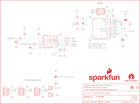

Contents
========

* [PRS15083 > Qwiic Twist](#prs15083--qwiic-twist)
	* [Schematic](#schematic)
	* [PCB](#pcb)
	* [Interactive BOM](#interactive-bom)
	* [Images](#images)
	* [Tags](#tags)
  
![][im]
# PRS15083 > Qwiic Twist

- ID: PROJ-SPAR-15083-STAN-01
- Hex ID: PRS15083
- Name: Sparkfun
- Description: Sparkfun
- Long Link: [http://oom.lt/PROJ-SPAR-15083-STAN-01](http://oom.lt/PROJ-SPAR-15083-STAN-01)
- Short Link: [http://oom.lt/PRS15083](http://oom.lt/PRS15083)

## Schematic
  

## PCB
  

## Interactive BOM

- Interactive BOM page: [ibom.html](https://htmlpreview.github.io/?https://github.com/oomlout/oomlout_OOMP_projects/blob/main/PROJ-SPAR-15083-STAN-01/kicad/bom/ibom.html)

## Images
  
  

|bominteractivefront|bominteractiveback|kicadPcb3d|kicadPcb3dFront|kicadPcb3dBack|eagleImage|eagleSchemImage|pcbdraw|pcbdrawback|
| :---: | :---: | :---: | :---: | :---: | :---: | :---: | :---: | :---: |
||||||||||

## Tags

- hexID: PRS15083
- oompType: PROJ
- oompSize: SPAR
- oompColor: 15083
- oompDesc: STAN
- oompIndex: 01
- oompName: Qwiic Twist
- sources: All source files from https://github.com/sparkfun/Qwiic_Twist (source licence details in srcLicense.md)
- linkBuyPage: https://www.sparkfun.com/products/15083
- oompID: PROJ-SPAR-15083-STAN-01
- rawParts: C1,10nF,10NF-0603-50V-10%,0603,0.01uF/10nF/10,000pF ceramic capacitors,,CAP-00867,,,10nF,
- rawParts: C2,0.1uF,0.1UF-0603-25V-(+80/-20%),0603,0.1µF ceramic capacitors,,CAP-00810,,,0.1uF,
- rawParts: C3,10nF,10NF-0603-50V-10%,0603,0.01uF/10nF/10,000pF ceramic capacitors,,CAP-00867,,,10nF,
- rawParts: D1,RED,LED-RED0603,LED-0603,Red SMD LED,,DIO-00819,,,RED,
- rawParts: FRAME1,FRAME-LETTER,FRAME-LETTER,CREATIVE_COMMONS,Schematic Frame - Letter,,,,,,
- rawParts: INT,,JUMPER-SMT_2_NC_TRACE_SILK,SMT-JUMPER_2_NC_TRACE_SILK,Normally closed trace jumper,,,,,,
- rawParts: J2,,QWIIC_CONNECTORJS-1MM,1X04_1MM_RA,SparkFun I2C Standard Qwiic Connector,,CONN-13694,,,,
- rawParts: J3,PTH,I2C_STANDARD_NO_SILK,1X04_NO_SILK,SparkFun I2C Standard Pinout Header,,,,,,
- rawParts: J4,,QWIIC_CONNECTORJS-1MM,1X04_1MM_RA,SparkFun I2C Standard Qwiic Connector,,CONN-13694,,,,
- rawParts: J5,,CONN_01PTH_NO_SILK_YES_STOP,1X01_NO_SILK,Single connection point. Often used as Generic Header-pin footprint for 0.1 inch spaced/style header connections,,,,,,
- rawParts: J7,ISP,AVR_SPI_PROG_3X2TESTPOINTS,2X3_TEST_POINTS,AVR ISP 6 Pin,,,,,,
- rawParts: J10,,CONN_01PTH_NO_SILK_YES_STOP,1X01_NO_SILK,Single connection point. Often used as Generic Header-pin footprint for 0.1 inch spaced/style header connections,,,,,,
- rawParts: JP1,FIDUCIALUFIDUCIAL,FIDUCIALUFIDUCIAL,MICRO-FIDUCIAL,Fiducial Alignment Points,,,,,,
- rawParts: JP2,FIDUCIALUFIDUCIAL,FIDUCIALUFIDUCIAL,MICRO-FIDUCIAL,Fiducial Alignment Points,,,,,,
- rawParts: JP3,STAND-OFF,STAND-OFF,STAND-OFF,Stand Off,,,,,,
- rawParts: JP4,STAND-OFF,STAND-OFF,STAND-OFF,Stand Off,,,,,,
- rawParts: JP5,FIDUCIALUFIDUCIAL,FIDUCIALUFIDUCIAL,MICRO-FIDUCIAL,Fiducial Alignment Points,,,,,,
- rawParts: JP6,FIDUCIALUFIDUCIAL,FIDUCIALUFIDUCIAL,MICRO-FIDUCIAL,Fiducial Alignment Points,,,,,,
- rawParts: JP7,ADR,JUMPER-SMT_2_NO_SILK,SMT-JUMPER_2_NO_SILK,Normally open jumper,,,,,,
- rawParts: JP9,,JUMPER-SMT_3_2-NC_TRACE_SILK,SMT-JUMPER_3_2-NC_TRACE_SILK,Normally closed trace jumper (2 of 2 connections),,,,,,
- rawParts: JP11,STAND-OFF,STAND-OFF,STAND-OFF,Stand Off,,,,,,
- rawParts: JP13,STAND-OFF,STAND-OFF,STAND-OFF,Stand Off,,,,,,
- rawParts: LOGO1,OSHW-LOGOMINI,OSHW-LOGOMINI,OSHW-LOGO-MINI,Open-Source Hardware (OSHW) Logo,,,,,,
- rawParts: LOGO2,SFE_LOGO_NAME_FLAME.1_INCH,SFE_LOGO_NAME_FLAME.1_INCH,SFE_LOGO_NAME_FLAME_.1,SparkFun Font Logo w/ Flame,,,,,,
- rawParts: LOGO3,SFE_LOGO_FLAME.1EXP,SFE_LOGO_FLAME.1EXP,SFE_LOGO_FLAME_COPPER_EXPOSED_.1,SparkFun Flame Logo,,,,,,
- rawParts: R1,10k,10KOHM-0603-1/10W-1%,0603,10kΩ resistor,,RES-00824,,,10k,
- rawParts: R2,2.2k,2.2KOHM-0603-1/10W-1%,0603,2.2kΩ resistor,,RES-08272,,,2.2k,
- rawParts: R3,1k,1KOHM-0603-1/10W-1%,0603,1kΩ resistor,,RES-07856,,,1k,
- rawParts: R4,10k,10KOHM-0603-1/10W-1%,0603,10kΩ resistor,,RES-00824,,,10k,
- rawParts: R5,10k,10KOHM-0603-1/10W-1%,0603,10kΩ resistor,,RES-00824,,,10k,
- rawParts: R6,2.2k,2.2KOHM-0603-1/10W-1%,0603,2.2kΩ resistor,,RES-08272,,,2.2k,
- rawParts: R7,10k,10KOHM-0603-1/10W-1%,0603,10kΩ resistor,,RES-00824,,,10k,
- rawParts: R8,10k,10KOHM-0603-1/10W-1%,0603,10kΩ resistor,,RES-00824,,,10k,
- rawParts: R9,10k,10KOHM-0603-1/10W-1%,0603,10kΩ resistor,,RES-00824,,,10k,
- rawParts: R10,DNP,10KOHM-0603-1/10W-1%,0603,10kΩ resistor,,RES-00824,,,10k,
- rawParts: R11,10k,10KOHM-0603-1/10W-1%,0603,10kΩ resistor,,RES-00824,,,10k,
- rawParts: R12,10,10OHM-0603-1/10W-1%,0603,10Ω resistor,,RES-12581,,,10,
- rawParts: R13,10,10OHM-0603-1/10W-1%,0603,10Ω resistor,,RES-12581,,,10,
- rawParts: R14,10,10OHM-0603-1/10W-1%,0603,10Ω resistor,,RES-12581,,,10,
- rawParts: SW1,Rotary Encoder,ENCODER-RGB-SWITCHKIT,ENCODER_LED_3_KIT,Illuminated Rotary Encoder w/ RGB LED and select switch,,RES-10859,,COM-10982,,
- rawParts: U4,ATTINY84-ARDUINO,ATTINY84-ARDUINO,SO14,,,IC-14155,,,,

[im]: kicadPcb3d_450.png
