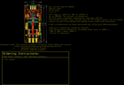
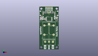
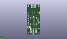
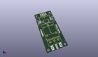

Contents
========

* [PROJ-SPAR-15093-STAN-01>Qwiic Relay](#proj-spar-15093-stan-01qwiic-relay)
	* [Images](#images)
	* [Interactive BOM](#interactive-bom)
	* [OOMP Parts](#oomp-parts)
	* [Tags](#tags)
  
![][im]
# PROJ-SPAR-15093-STAN-01>Qwiic Relay

- ID: PROJ-SPAR-15093-STAN-01
- Hex ID: PRS15093
- Name: Qwiic Relay
- Description: 

## Images
  
  

|eagleImage|kicadPcb3dFront|kicadPcb3dBack|kicadPcb3d|
| :---: | :---: | :---: | :---: |
|||||

## Interactive BOM

- Interactive BOM page: [ibom.html](kicad/bom/ibom.html)

## OOMP Parts
  

|OOMP Parts|
| :---: |
|CAPC-0603-X-UNMATCHED-01, C1, 7.619999999999999, 49.529999999999994, 90,C1, 10uF, 0603, SparkFun-Capacitors, (0.3, 1.95), R90|
|UNMATCHED-UNMATCHED-X-UNMATCHED-01, D1, 2.54, 39.37, 0,D1, 1A/23V/620mV, SOD-323, SparkFun-DiscreteSemi, (0.1, 1.55), R0|
|UNMATCHED-0603-X-UNMATCHED-01, D2, 22.86, 43.18, 180,D2, BLUE, LED-0603, SparkFun-LED, (0.9, 1.7), R180|
|UNMATCHED-0603-X-UNMATCHED-01, D3, 2.54, 41.91, 180,D3, RED, LED-0603, SparkFun-LED, (0.1, 1.65), R180|
|UNMATCHED-UNMATCHED-X-UNMATCHED-01, J1, 16.509999999999998, 55.88, 180,J1, 1X04_NO_SILK, SparkFun-Connectors, (0.65, 2.2), R180|
|UNMATCHED-UNMATCHED-X-UNMATCHED-01, J2, 20.32, 48.26, 90,J2, 1X04_1MM_RA, SparkFun-Connectors, (0.8, 1.9), R90|
|UNMATCHED-UNMATCHED-X-UNMATCHED-01, J3, 5.08, 48.26, 270,J3, 1X04_1MM_RA, SparkFun-Connectors, (0.2, 1.9), R270|
|UNMATCHED-UNMATCHED-X-UNMATCHED-01, J5, 17.779999999999998, 10.16, 180,J5, SCREWTERMINAL-5MM-3, SparkFun-Connectors, (0.7, 0.4), R180|
|UNMATCHED-UNMATCHED-X-UNMATCHED-01, JP7, 12.7, 49.529999999999994, 0,JP7, JUMPER-SMT_3_2-NC_TRACE_NO-SILK, SMT-JUMPER_3_2-NC_TRACE_NO-SILK, SparkFun-Jumpers, (0.5, 1.95), R0|
|UNMATCHED-UNMATCHED-X-UNMATCHED-01, JP10, 3.8099999999999996, 41.401999999999994, M0,JP10, JUMPER-SMT_2_NO_NO-SILK, SMT-JUMPER_2_NO_NO-SILK, SparkFun-Jumpers, (0.15, 1.63), MR0|
|UNMATCHED-UNMATCHED-X-UNMATCHED-01, K1, 12.7, 25.4, 90,K1, RELAY-SPDT, RELAY_G5LE, SparkFun-Electromechanical, (0.5, 1), R90|
|UNMATCHED-UNMATCHED-X-UNMATCHED-01, Q4, 22.86, 39.37, 270,Q4, 600mA/40V, SOT23-3, SparkFun-DiscreteSemi, (0.9, 1.55), R270|
|RESE-0603-X-UNMATCHED-01, R1, 2.54, 40.64, 0,R1, 10, 0603, SparkFun-Resistors, (0.1, 1.6), R0|
|<table><tr><td></td><td> R2</td><td>[RESE-0603-X-O331-01 SMD (0603) 330 Ohm Resistor](https://github.com/oomlout/oomlout_OOMP_parts/tree/main/RESE-0603-X-O331-01/)</td><td>[R6331](https://github.com/oomlout/oomlout_OOMP_parts/tree/main/RESE-0603-X-O331-01/)</td></tr></table>|
|<table><tr><td></td><td> R4</td><td>[RESE-0603-X-O331-01 SMD (0603) 330 Ohm Resistor](https://github.com/oomlout/oomlout_OOMP_parts/tree/main/RESE-0603-X-O331-01/)</td><td>[R6331](https://github.com/oomlout/oomlout_OOMP_parts/tree/main/RESE-0603-X-O331-01/)</td></tr></table>|
|RESE-0603-X-UNMATCHED-01, R6, 15.239999999999998, 49.529999999999994, 90,R6, 2.2k, 0603, SparkFun-Resistors, (0.6, 1.95), R90|
|RESE-0603-X-UNMATCHED-01, R7, 10.16, 49.529999999999994, 90,R7, 2.2k, 0603, SparkFun-Resistors, (0.4, 1.95), R90|
|<table><tr><td></td><td> R8</td><td>[RESE-0603-X-O103-01 SMD (0603) 10k Ohm Resistor](https://github.com/oomlout/oomlout_OOMP_parts/tree/main/RESE-0603-X-O103-01/)</td><td>[R6103](https://github.com/oomlout/oomlout_OOMP_parts/tree/main/RESE-0603-X-O103-01/)</td></tr></table>|
|RESE-0603-X-UNMATCHED-01, R9, 2.54, 43.18, 0,R9, 1k, 0603, SparkFun-Resistors, (0.1, 1.7), R0|
|UNMATCHED-UNMATCHED-X-UNMATCHED-01, U3, 12.7, 40.64, 0,U3, ATTINY85, ATTINY85, SparkFun-IC-Microcontroller, (0.5, 1.6), R0|

## Tags

- hexID: PRS15093
- oompType: PROJ
- oompSize: SPAR
- oompColor: 15093
- oompDesc: STAN
- oompIndex: 01
- oompName: Qwiic Relay
- sources: All source files from https://github.com/sparkfun/Qwiic_Relay (source licence details in srcLicense.md)
- linkBuyPage: https://www.sparkfun.com/products/15093
- oompID: PROJ-SPAR-15093-STAN-01
- oompPart: CAPC-0603-X-UNMATCHED-01, C1, 7.619999999999999, 49.529999999999994, 90
- oompPart: UNMATCHED-UNMATCHED-X-UNMATCHED-01, D1, 2.54, 39.37, 0
- oompPart: UNMATCHED-0603-X-UNMATCHED-01, D2, 22.86, 43.18, 180
- oompPart: UNMATCHED-0603-X-UNMATCHED-01, D3, 2.54, 41.91, 180
- oompPart: UNMATCHED-UNMATCHED-X-UNMATCHED-01, J1, 16.509999999999998, 55.88, 180
- oompPart: UNMATCHED-UNMATCHED-X-UNMATCHED-01, J2, 20.32, 48.26, 90
- oompPart: UNMATCHED-UNMATCHED-X-UNMATCHED-01, J3, 5.08, 48.26, 270
- oompPart: SKIP-UNMATCHED-X-UNMATCHED-01, J4, 12.7, 41.91, M90
- oompPart: UNMATCHED-UNMATCHED-X-UNMATCHED-01, J5, 17.779999999999998, 10.16, 180
- oompPart: SKIP-UNMATCHED-X-UNMATCHED-01, JP2, 0.7619999999999999, 56.515, M0
- oompPart: SKIP-UNMATCHED-X-UNMATCHED-01, JP6, 24.764999999999997, 5.715, M0
- oompPart: UNMATCHED-UNMATCHED-X-UNMATCHED-01, JP7, 12.7, 49.529999999999994, 0
- oompPart: SKIP-UNMATCHED-X-UNMATCHED-01, JP8, 24.764999999999997, 5.715, 0
- oompPart: SKIP-UNMATCHED-X-UNMATCHED-01, JP9, 0.7619999999999999, 56.515, 0
- oompPart: UNMATCHED-UNMATCHED-X-UNMATCHED-01, JP10, 3.8099999999999996, 41.401999999999994, M0
- oompPart: UNMATCHED-UNMATCHED-X-UNMATCHED-01, K1, 12.7, 25.4, 90
- oompPart: UNMATCHED-UNMATCHED-X-UNMATCHED-01, Q4, 22.86, 39.37, 270
- oompPart: RESE-0603-X-UNMATCHED-01, R1, 2.54, 40.64, 0
- oompPart: RESE-0603-X-O331-01, R2, 7.112, 40.64, 270
- oompPart: RESE-0603-X-O331-01, R4, 22.86, 41.91, 180
- oompPart: RESE-0603-X-UNMATCHED-01, R6, 15.239999999999998, 49.529999999999994, 90
- oompPart: RESE-0603-X-UNMATCHED-01, R7, 10.16, 49.529999999999994, 90
- oompPart: RESE-0603-X-O103-01, R8, 17.779999999999998, 49.529999999999994, 270
- oompPart: RESE-0603-X-UNMATCHED-01, R9, 2.54, 43.18, 0
- oompPart: UNMATCHED-UNMATCHED-X-UNMATCHED-01, U3, 12.7, 40.64, 0
- rawPart: C1, 10uF, 0603, SparkFun-Capacitors, (0.3, 1.95), R90
- rawPart: D1, 1A/23V/620mV, SOD-323, SparkFun-DiscreteSemi, (0.1, 1.55), R0
- rawPart: D2, BLUE, LED-0603, SparkFun-LED, (0.9, 1.7), R180
- rawPart: D3, RED, LED-0603, SparkFun-LED, (0.1, 1.65), R180
- rawPart: J1, 1X04_NO_SILK, SparkFun-Connectors, (0.65, 2.2), R180
- rawPart: J2, 1X04_1MM_RA, SparkFun-Connectors, (0.8, 1.9), R90
- rawPart: J3, 1X04_1MM_RA, SparkFun-Connectors, (0.2, 1.9), R270
- rawPart: J4, AVR_SPI_PROG_3X2TESTPOINTS, 2X3_TEST_POINTS, SparkFun-Connectors, (0.5, 1.65), MR90
- rawPart: J5, SCREWTERMINAL-5MM-3, SparkFun-Connectors, (0.7, 0.4), R180
- rawPart: JP2, FIDUCIALUFIDUCIAL, MICRO-FIDUCIAL, SparkFun, (0.03, 2.225), MR0
- rawPart: JP6, FIDUCIALUFIDUCIAL, MICRO-FIDUCIAL, SparkFun, (0.975, 0.225), MR0
- rawPart: JP7, JUMPER-SMT_3_2-NC_TRACE_NO-SILK, SMT-JUMPER_3_2-NC_TRACE_NO-SILK, SparkFun-Jumpers, (0.5, 1.95), R0
- rawPart: JP8, FIDUCIALUFIDUCIAL, MICRO-FIDUCIAL, SparkFun, (0.975, 0.225), R0
- rawPart: JP9, FIDUCIALUFIDUCIAL, MICRO-FIDUCIAL, SparkFun, (0.03, 2.225), R0
- rawPart: JP10, JUMPER-SMT_2_NO_NO-SILK, SMT-JUMPER_2_NO_NO-SILK, SparkFun-Jumpers, (0.15, 1.63), MR0
- rawPart: K1, RELAY-SPDT, RELAY_G5LE, SparkFun-Electromechanical, (0.5, 1), R90
- rawPart: Q4, 600mA/40V, SOT23-3, SparkFun-DiscreteSemi, (0.9, 1.55), R270
- rawPart: R1, 10, 0603, SparkFun-Resistors, (0.1, 1.6), R0
- rawPart: R2, 330, 0603, SparkFun-Resistors, (0.28, 1.6), R270
- rawPart: R4, 330, 0603, SparkFun-Resistors, (0.9, 1.65), R180
- rawPart: R6, 2.2k, 0603, SparkFun-Resistors, (0.6, 1.95), R90
- rawPart: R7, 2.2k, 0603, SparkFun-Resistors, (0.4, 1.95), R90
- rawPart: R8, 10k, 0603, SparkFun-Resistors, (0.7, 1.95), R270
- rawPart: R9, 1k, 0603, SparkFun-Resistors, (0.1, 1.7), R0
- rawPart: U3, ATTINY85, ATTINY85, SparkFun-IC-Microcontroller, (0.5, 1.6), R0

[im]: kicadPcb3d_450.png
