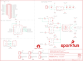

Contents
========

* [PRS15110 > SparkFun ESP32 Thing Plus DMX to LED Shield](#prs15110--sparkfun-esp32-thing-plus-dmx-to-led-shield)
	* [Schematic](#schematic)
	* [PCB](#pcb)
	* [Interactive BOM](#interactive-bom)
	* [Images](#images)
	* [Tags](#tags)
  
![][im]
# PRS15110 > SparkFun ESP32 Thing Plus DMX to LED Shield

- ID: PROJ-SPAR-15110-STAN-01
- Hex ID: PRS15110
- Name: Sparkfun
- Description: Sparkfun
- Long Link: [http://oom.lt/PROJ-SPAR-15110-STAN-01](http://oom.lt/PROJ-SPAR-15110-STAN-01)
- Short Link: [http://oom.lt/PRS15110](http://oom.lt/PRS15110)

## Schematic
  

## PCB
  

## Interactive BOM

- Interactive BOM page: [ibom.html](https://htmlpreview.github.io/?https://github.com/oomlout/oomlout_OOMP_projects/blob/main/PROJ-SPAR-15110-STAN-01/kicad/bom/ibom.html)

## Images
  
  

|bominteractivefront|bominteractiveback|kicadPcb3d|kicadPcb3dFront|kicadPcb3dBack|eagleImage|eagleSchemImage|pcbdraw|pcbdrawback|
| :---: | :---: | :---: | :---: | :---: | :---: | :---: | :---: | :---: |
||||||||||

## Tags

- hexID: PRS15110
- oompType: PROJ
- oompSize: SPAR
- oompColor: 15110
- oompDesc: STAN
- oompIndex: 01
- oompName: SparkFun ESP32 Thing Plus DMX to LED Shield
- sources: All source files from https://github.com/sparkfun/SparkFun_ESP32_Thing_Plus_DMX_to_LED_Shield (source licence details in srcLicense.md)
- linkBuyPage: https://www.sparkfun.com/products/15110
- oompID: PROJ-SPAR-15110-STAN-01
- rawParts: C1,4.7uF,4.7UF-0603-6.3V-(10%),0603,4.7µF ceramic capacitors,CAP-08280,4.7uF,
- rawParts: C2,0.1uF,0.1UF-0603-25V-(+80/-20%),0603,0.1µF ceramic capacitors,CAP-00810,0.1uF,
- rawParts: C3,0.1uF,0.1UF-0603-25V-(+80/-20%),0603,0.1µF ceramic capacitors,CAP-00810,0.1uF,
- rawParts: C4,0.1uF,0.1UF-0603-25V-(+80/-20%),0603,0.1µF ceramic capacitors,CAP-00810,0.1uF,
- rawParts: FD1,FIDUCIALUFIDUCIAL,FIDUCIALUFIDUCIAL,FIDUCIAL-MICRO,Fiducial Alignment Points,,,
- rawParts: FD2,FIDUCIALUFIDUCIAL,FIDUCIALUFIDUCIAL,FIDUCIAL-MICRO,Fiducial Alignment Points,,,
- rawParts: FD3,FIDUCIALUFIDUCIAL,FIDUCIALUFIDUCIAL,FIDUCIAL-MICRO,Fiducial Alignment Points,,,
- rawParts: FD4,FIDUCIALUFIDUCIAL,FIDUCIALUFIDUCIAL,FIDUCIAL-MICRO,Fiducial Alignment Points,,,
- rawParts: FRAME1,FRAME-LETTER,FRAME-LETTER,CREATIVE_COMMONS,Schematic Frame - Letter,,,
- rawParts: H1,STAND-OFFTIGHT,STAND-OFFTIGHT,STAND-OFF-TIGHT,Stand Off,,,
- rawParts: H2,STAND-OFFTIGHT,STAND-OFFTIGHT,STAND-OFF-TIGHT,Stand Off,,,
- rawParts: H3,STAND-OFFTIGHT,STAND-OFFTIGHT,STAND-OFF-TIGHT,Stand Off,,,
- rawParts: J1,,CONN_16LOCK_NO_SILK,1X16_LOCK_NO_SILK,Multi connection point. Often used as Generic Header-pin footprint for 0.1 inch spaced/style header connections,,,
- rawParts: J3,XLR-3-FEMALE,XLR-3-FEMALE,XLR-3_FEMALE,Neutrik XLR-3 Jack - XLR-3 Jack for DMX,CONN-14142,,
- rawParts: J4,XLR-3-MALE,XLR-3-MALE,XLR-3_MALE,Neutrik XLR-3 Jack - XLR-3 Jack for DMX,CONN-14141,,
- rawParts: J5,,CONN_02SMALL_POKEHOME,1X02_POKEHOME,Multi connection point. Often used as Generic Header-pin footprint for 0.1 inch spaced/style header connections,CONN-13512,,
- rawParts: J6,,CONN_02SMALL_POKEHOME,1X02_POKEHOME,Multi connection point. Often used as Generic Header-pin footprint for 0.1 inch spaced/style header connections,CONN-13512,,
- rawParts: J7,,CONN_12LOCK_NO_SILK,1X12_LOCK_NO_SILK,Multi connection point. Often used as Generic Header-pin footprint for 0.1 inch spaced/style header connections,,,
- rawParts: J8,,CONN_02SMALL_POKEHOME,1X02_POKEHOME,Multi connection point. Often used as Generic Header-pin footprint for 0.1 inch spaced/style header connections,CONN-13512,,
- rawParts: J9,,CONN_02SMALL_POKEHOME,1X02_POKEHOME,Multi connection point. Often used as Generic Header-pin footprint for 0.1 inch spaced/style header connections,CONN-13512,,
- rawParts: J10,,CONN_02SMALL_POKEHOME,1X02_POKEHOME,Multi connection point. Often used as Generic Header-pin footprint for 0.1 inch spaced/style header connections,CONN-13512,,
- rawParts: J11,,CONN_02SMALL_POKEHOME,1X02_POKEHOME,Multi connection point. Often used as Generic Header-pin footprint for 0.1 inch spaced/style header connections,CONN-13512,,
- rawParts: J12,,CONN_023.5MM,SCREWTERMINAL-3.5MM-2,Multi connection point. Often used as Generic Header-pin footprint for 0.1 inch spaced/style header connections,CONN-08399,,
- rawParts: LOGO1,SFE_LOGO_NAME_FLAME.2_INCH,SFE_LOGO_NAME_FLAME.2_INCH,SFE_LOGO_NAME_FLAME_.2,SparkFun Font Logo w/ Flame,,,
- rawParts: LOGO2,SFE_LOGO_NAME_FLAME.2_INCH,SFE_LOGO_NAME_FLAME.2_INCH,SFE_LOGO_NAME_FLAME_.2,SparkFun Font Logo w/ Flame,,,
- rawParts: LOGO3,OSHW-LOGOS,OSHW-LOGOS,OSHW-LOGO-S,Open-Source Hardware (OSHW) Logo,,,
- rawParts: R1,DNP,100OHM-HORIZ_KIT-1/4W-1%,AXIAL-0.3EZ,100Ω resistor,RES-12181,100,
- rawParts: R2,680,680OHM-0603-1/10W-5%,0603,680Ω resistor,RES-09333,680,
- rawParts: R3,680,680OHM-0603-1/10W-5%,0603,680Ω resistor,RES-09333,680,
- rawParts: R4,470,470OHM-0603-1/10W-1%,0603,470Ω resistor,RES-07869,470,
- rawParts: R5,470,470OHM-0603-1/10W-1%,0603,470Ω resistor,RES-07869,470,
- rawParts: R6,470,470OHM-0603-1/10W-1%,0603,470Ω resistor,RES-07869,470,
- rawParts: R7,330,330OHM-0603-1/10W-1%,0603,330Ω resistor,RES-00818,330,
- rawParts: R8,330,330OHM-0603-1/10W-1%,0603,330Ω resistor,RES-00818,330,
- rawParts: R9,470,470OHM-0603-1/10W-1%,0603,470Ω resistor,RES-07869,470,
- rawParts: TP1,TEST-POINT3,TEST-POINT3,PAD.03X.03,SparkFun Test Points,,,
- rawParts: TP2,TEST-POINT3,TEST-POINT3,PAD.03X.03,SparkFun Test Points,,,
- rawParts: TP3,TEST-POINT3,TEST-POINT3,PAD.03X.03,SparkFun Test Points,,,
- rawParts: TP4,TEST-POINT3,TEST-POINT3,PAD.03X.03,SparkFun Test Points,,,
- rawParts: U1, MAX3485CSA,RS485SOIC,SO08,RS-485 Transceiver,IC-09388, MAX3485CSA,
- rawParts: U2,TXB0104,TXB0104PWR,TSSOP14,4-Bit Bi-Directional Level Shifter,IC-13929,TXB0104,
- rawParts: U3,6N137S,6N137S,8-SMD,Lite-On 6N137 - High Speed Opto Isolator,IC-14151,,
- rawParts: U4,6N137S,6N137S,8-SMD,Lite-On 6N137 - High Speed Opto Isolator,IC-14151,,
- rawParts: U5,6N137S,6N137S,8-SMD,Lite-On 6N137 - High Speed Opto Isolator,IC-14151,,
- rawParts: U6,RFB-0505S,RFB-0505S,RFB-0505S,Recom Power RFB-0505S 1W DC/DC Converter,IC-14143,,

[im]: kicadPcb3d_450.png
