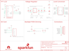

Contents
========

* [PRS15143 > LCD TFT Breakout 1in8 128x160](#prs15143--lcd-tft-breakout-1in8-128x160)
	* [Schematic](#schematic)
	* [PCB](#pcb)
	* [Interactive BOM](#interactive-bom)
	* [Images](#images)
	* [Tags](#tags)
  
![][im]
# PRS15143 > LCD TFT Breakout 1in8 128x160

- ID: PROJ-SPAR-15143-STAN-01
- Hex ID: PRS15143
- Name: Sparkfun
- Description: Sparkfun
- Long Link: [http://oom.lt/PROJ-SPAR-15143-STAN-01](http://oom.lt/PROJ-SPAR-15143-STAN-01)
- Short Link: [http://oom.lt/PRS15143](http://oom.lt/PRS15143)

## Schematic
  

## PCB
  

## Interactive BOM

- Interactive BOM page: [ibom.html](https://htmlpreview.github.io/?https://github.com/oomlout/oomlout_OOMP_projects/blob/main/PROJ-SPAR-15143-STAN-01/kicad/bom/ibom.html)

## Images
  
  

|bominteractivefront|bominteractiveback|kicadPcb3d|kicadPcb3dFront|kicadPcb3dBack|eagleImage|eagleSchemImage|pcbdraw|pcbdrawback|
| :---: | :---: | :---: | :---: | :---: | :---: | :---: | :---: | :---: |
||||||||||

## Tags

- hexID: PRS15143
- oompType: PROJ
- oompSize: SPAR
- oompColor: 15143
- oompDesc: STAN
- oompIndex: 01
- oompName: LCD TFT Breakout 1in8 128x160
- sources: All source files from https://github.com/sparkfun/LCD_TFT_Breakout_1in8_128x160 (source licence details in srcLicense.md)
- linkBuyPage: https://www.sparkfun.com/products/15143
- oompID: PROJ-SPAR-15143-STAN-01
- rawParts: C1,1.0uF,1.0UF-0603-16V-10%,0603,1µF ceramic capacitors,,CAP-00868,,,1.0uF,
- rawParts: C2,0.1uF,0.1UF-0603-100V-10%,0603,0.1µF ceramic capacitors,,CAP-08390,,,0.1uF,
- rawParts: C3,4.7uF,4.7UF-0603-6.3V-(10%),0603,4.7µF ceramic capacitors,,CAP-08280,,,4.7uF,
- rawParts: C4,1.0uF,1.0UF-0603-16V-10%,0603,1µF ceramic capacitors,,CAP-00868,,,1.0uF,
- rawParts: C5,0.1uF,0.1UF-0603-100V-10%,0603,0.1µF ceramic capacitors,,CAP-08390,,,0.1uF,
- rawParts: D1,RED,LED-RED0603,LED-0603,Red SMD LED,,DIO-00819,,,RED,
- rawParts: FD1,FIDUCIAL1X2,FIDUCIAL1X2,FIDUCIAL-1X2,Fiducial Alignment Points,,,,,,
- rawParts: FD2,FIDUCIAL1X2,FIDUCIAL1X2,FIDUCIAL-1X2,Fiducial Alignment Points,,,,,,
- rawParts: FD3,FIDUCIAL1X2,FIDUCIAL1X2,FIDUCIAL-1X2,Fiducial Alignment Points,,,,,,
- rawParts: FD4,FIDUCIAL1X2,FIDUCIAL1X2,FIDUCIAL-1X2,Fiducial Alignment Points,,,,,,
- rawParts: FRAME1,FRAME-LETTER,FRAME-LETTER,CREATIVE_COMMONS,Schematic Frame - Letter,Owen Lyke,,,v10,,
- rawParts: H1,STAND-OFF,STAND-OFF,STAND-OFF,Stand Off,,,,,,
- rawParts: H2,STAND-OFF,STAND-OFF,STAND-OFF,Stand Off,,,,,,
- rawParts: H3,STAND-OFF,STAND-OFF,STAND-OFF,Stand Off,,,,,,
- rawParts: H4,STAND-OFF,STAND-OFF,STAND-OFF,Stand Off,,,,,,
- rawParts: J1,MICRO-SD_CARD_SOCKETTINY,MICRO-SD_CARD_SOCKETTINY,MICROSD_TINY,microSD Socket for Transflash,,CONN-13500,,,,
- rawParts: J2,,CONN_10NO_SILK_PTH_FEMALE,1X10_NO_SILK,Multi connection point. Often used as Generic Header-pin footprint for 0.1 inch spaced/style header connections,,CONN-11563,,,,
- rawParts: JP1,LED,JUMPER-SMT_2_NC_TRACE_SILK,SMT-JUMPER_2_NC_TRACE_SILK,Normally closed trace jumper,,,,,,
- rawParts: LOGO1,SFE_LOGO_NAME_FLAME.3_INCH,SFE_LOGO_NAME_FLAME.3_INCH,SFE_LOGO_NAME_FLAME_.3,SparkFun Font Logo w/ Flame,,,,,,
- rawParts: LOGO2,SPECIAL_INSTRUCTIONS-PRODUCTION,SPECIAL_INSTRUCTIONS-PRODUCTION,PRODUCTION_INSTRUCTIONS,Special Ordering/Production Instructions Alert,,,,,,
- rawParts: LOGO3,OSHW-LOGOS,OSHW-LOGOS,OSHW-LOGO-S,Open-Source Hardware (OSHW) Logo,,,,,,
- rawParts: Q1,220mA/50V/3.5Ω,MOSFET-NCH-BSS138,SOT23-3,N-channel MOSFETs,,TRANS-00830,,,220mA/50V/3.5Ω,
- rawParts: R1,10k,10KOHM-0603-1/10W-1%,0603,10kΩ resistor,,RES-00824,,,10k,
- rawParts: R2,10k,10KOHM-0603-1/10W-1%,0603,10kΩ resistor,,RES-00824,,,10k,
- rawParts: R3,1,1OHM-0603-1/10W-1%,0603,1Ω resistor,,RES-08269,,,1,
- rawParts: R4,1,1OHM-0603-1/10W-1%,0603,1Ω resistor,,RES-08269,,,1,
- rawParts: R5,10k,10KOHM-0603-1/10W-1%,0603,10kΩ resistor,,RES-00824,,,10k,
- rawParts: R6,1k,1KOHM-0603-1/10W-1%,0603,1kΩ resistor,,RES-07856,,,1k,
- rawParts: U$33,EXTERNAL_DISP-KWH018ST14-F01,EXTERNAL_DISP-KWH018ST14-F01,KWH018ST14-F01_HOLES,External Display Device,,LCD-14196,,,,
- rawParts: U1,,KWH018ST14-F01_4WSPI-BOTTOM,FPC05040-17204,Fomike KWH018ST14-F01 TFT LCD Module Using 4WSPI Interface,,CONN-14082,LCD-14196,,,
- rawParts: U2,TXB0108DQSR,TXB0108,UFDFN-20,8-Bit Bi-Directional Level Shifter,,IC-12292,,,TXB0108DQSR,
- rawParts: U3,3.3V,V_REG_AP2112K-3.3V,SOT23-5,AP2112 - 600mA CMOS LDO Regulator w/ Enable,,VREG-12457,,,3.3V,

[im]: kicadPcb3d_450.png
