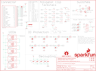

Contents
========

* [PRS15162 > gator bit](#prs15162--gator-bit)
	* [Schematic](#schematic)
	* [PCB](#pcb)
	* [Interactive BOM](#interactive-bom)
	* [Images](#images)
	* [Tags](#tags)
  
![][im]
# PRS15162 > gator bit

- ID: PROJ-SPAR-15162-STAN-01
- Hex ID: PRS15162
- Name: Sparkfun
- Description: Sparkfun
- Long Link: [http://oom.lt/PROJ-SPAR-15162-STAN-01](http://oom.lt/PROJ-SPAR-15162-STAN-01)
- Short Link: [http://oom.lt/PRS15162](http://oom.lt/PRS15162)

## Schematic
  

## PCB
  

## Interactive BOM

- Interactive BOM page: [ibom.html](https://htmlpreview.github.io/?https://github.com/oomlout/oomlout_OOMP_projects/blob/main/PROJ-SPAR-15162-STAN-01/kicad/bom/ibom.html)

## Images
  
  

|bominteractivefront|bominteractiveback|kicadPcb3d|kicadPcb3dFront|kicadPcb3dBack|eagleImage|eagleSchemImage|pcbdraw|pcbdrawback|
| :---: | :---: | :---: | :---: | :---: | :---: | :---: | :---: | :---: |
||||||||||

## Tags

- hexID: PRS15162
- oompType: PROJ
- oompSize: SPAR
- oompColor: 15162
- oompDesc: STAN
- oompIndex: 01
- oompName: gator bit
- sources: All source files from https://github.com/sparkfun/gator_bit (source licence details in srcLicense.md)
- linkBuyPage: https://www.sparkfun.com/products/15162
- oompID: PROJ-SPAR-15162-STAN-01
- rawParts: C1,0.1uF,0.1UF-0603-25V-(+80/-20%),0603,0.1µF ceramic capacitors,CAP-00810,,,0.1uF,
- rawParts: C2,0.1uF,0.1UF-0603-25V-(+80/-20%),0603,0.1µF ceramic capacitors,CAP-00810,,,0.1uF,
- rawParts: C3,0.1uF,0.1UF-0603-25V-(+80/-20%),0603,0.1µF ceramic capacitors,CAP-00810,,,0.1uF,
- rawParts: C4,0.1uF,0.1UF-0603-25V-(+80/-20%),0603,0.1µF ceramic capacitors,CAP-00810,,,0.1uF,
- rawParts: C5,0.1uF,0.1UF-0603-25V-(+80/-20%),0603,0.1µF ceramic capacitors,CAP-00810,,,0.1uF,
- rawParts: C6,10uF,10UF-0603-6.3V-20%,0603,10.0µF ceramic capacitors,CAP-11015,,,10uF,
- rawParts: C8,0.1uF,0.1UF-0603-25V-(+80/-20%),0603,0.1µF ceramic capacitors,CAP-00810,,,0.1uF,
- rawParts: C9,22uF,22UF-0805-6.3V-20%,0805,22µF ceramic capacitors,CAP-08402,,,22uF,
- rawParts: C10,10uF,10UF-0805-10V-10%,0805,10.0µF ceramic capacitors,CAP-11330,,,10uF,
- rawParts: C11,0.1uF,0.1UF-0603-25V-(+80/-20%),0603,0.1µF ceramic capacitors,CAP-00810,,,0.1uF,
- rawParts: C12,10uF,10UF-POLAR-EIA3216-16V-10%(TANT),EIA3216,10.0µF polarized capacitors,CAP-00811,,,10uF,
- rawParts: C13,10uF,10UF-0805-10V-10%,0805,10.0µF ceramic capacitors,CAP-11330,,,10uF,
- rawParts: C14,10uF,10UF-0603-6.3V-20%,0603,10.0µF ceramic capacitors,CAP-11015,,,10uF,
- rawParts: C15,22uF,22UF-0805-6.3V-20%,0805,22µF ceramic capacitors,CAP-08402,,,22uF,
- rawParts: C16,22uF,22UF-0805-6.3V-20%,0805,22µF ceramic capacitors,CAP-08402,,,22uF,
- rawParts: D1,WS2812B,WS2812B,WS2812B,WS2812B SMD addressable RGB LED,DIO-12503,,,WS2812B,
- rawParts: D2,WS2812B,WS2812B,WS2812B,WS2812B SMD addressable RGB LED,DIO-12503,,,WS2812B,
- rawParts: D3,WS2812B,WS2812B,WS2812B,WS2812B SMD addressable RGB LED,DIO-12503,,,WS2812B,
- rawParts: D4,WS2812B,WS2812B,WS2812B,WS2812B SMD addressable RGB LED,DIO-12503,,,WS2812B,
- rawParts: D5,WS2812B,WS2812B,WS2812B,WS2812B SMD addressable RGB LED,DIO-12503,,,WS2812B,
- rawParts: D6,3A/10V/280mV,DIODE-SCHOTTKY-BAT60A,SOD-323,Schottky diode,DIO-14072,,,3A/10V/280mV,
- rawParts: D7,RED,LED-RED0603,LED-0603,Red SMD LED,DIO-00819,,,RED,
- rawParts: D8,3.6V,DIODE-ZENER-BZT52C3V6S,SOD-323,Zener Diode,DIO-08199,,,3.6V,
- rawParts: D9,RED,LED-RED0603,LED-0603,Red SMD LED,DIO-00819,,,RED,
- rawParts: D10,3.6V,DIODE-ZENER-BZT52C3V6S,SOD-323,Zener Diode,DIO-08199,,,3.6V,
- rawParts: D11,RED,LED-RED0603,LED-0603,Red SMD LED,DIO-00819,,,RED,
- rawParts: D12,3.6V,DIODE-ZENER-BZT52C3V6S,SOD-323,Zener Diode,DIO-08199,,,3.6V,
- rawParts: D13,3.6V,DIODE-ZENER-BZT52C3V6S,SOD-323,Zener Diode,DIO-08199,,,3.6V,
- rawParts: D14,3A/10V/280mV,DIODE-SCHOTTKY-BAT60A,SOD-323,Schottky diode,DIO-14072,,,3A/10V/280mV,
- rawParts: D15,3.6V,DIODE-ZENER-BZT52C3V6S,SOD-323,Zener Diode,DIO-08199,,,3.6V,
- rawParts: D16,3A/10V/280mV,DIODE-SCHOTTKY-BAT60A,SOD-323,Schottky diode,DIO-14072,,,3A/10V/280mV,
- rawParts: D17,3.6V,DIODE-ZENER-BZT52C3V6S,SOD-323,Zener Diode,DIO-08199,,,3.6V,
- rawParts: D18,120mA/40V/370mV,DIODE-SCHOTTKY-RB751S40,SOD-523,Schottky diode,DIO-11018,,,120mA/40V/370mV,
- rawParts: D19,3.6V,DIODE-ZENER-BZT52C3V6S,SOD-323,Zener Diode,DIO-08199,,,3.6V,
- rawParts: FD1,FIDUCIAL1X2,FIDUCIAL1X2,FIDUCIAL-1X2,Fiducial Alignment Points,,,,,
- rawParts: FD2,FIDUCIAL1X2,FIDUCIAL1X2,FIDUCIAL-1X2,Fiducial Alignment Points,,,,,
- rawParts: FD3,FIDUCIAL1X2,FIDUCIAL1X2,FIDUCIAL-1X2,Fiducial Alignment Points,,,,,
- rawParts: FD4,FIDUCIAL1X2,FIDUCIAL1X2,FIDUCIAL-1X2,Fiducial Alignment Points,,,,,
- rawParts: FRAME1,FRAME-LETTER,FRAME-LETTER,CREATIVE_COMMONS,Schematic Frame - Letter,,,,,
- rawParts: FRAME3,FRAME-LETTER,FRAME-LETTER,CREATIVE_COMMONS,Schematic Frame - Letter,,,,,
- rawParts: H1,STAND-OFF,STAND-OFF,STAND-OFF,Stand Off,,,,,
- rawParts: H2,STAND-OFF,STAND-OFF,STAND-OFF,Stand Off,,,,,
- rawParts: J1,GATOR,GATOR,GATOR,,,,,,
- rawParts: J2,GATOR,GATOR,GATOR,,,,,,
- rawParts: J3,GATOR,GATOR,GATOR,,,,,,
- rawParts: J4,GATOR,GATOR,GATOR,,,,,,
- rawParts: J6,GATOR,GATOR,GATOR,,,,,,
- rawParts: J7,GATOR,GATOR,GATOR,,,,,,
- rawParts: J8,GATOR,GATOR,GATOR,,,,,,
- rawParts: J9,GATOR,GATOR,GATOR,,,,,,
- rawParts: J10,GATOR,GATOR,GATOR,,,,,,
- rawParts: J11,GATOR,GATOR,GATOR,,,,,,
- rawParts: J12,GATOR,GATOR,GATOR,,,,,,
- rawParts: J13,GATOR,GATOR,GATOR,,,,,,
- rawParts: J14,GATOR,GATOR,GATOR,,,,,,
- rawParts: J15,GATOR,GATOR,GATOR,,,,,,
- rawParts: J16,GATOR,GATOR,GATOR,,,,,,
- rawParts: J17,GATOR,GATOR,GATOR,,,,,,
- rawParts: J18,GATOR,GATOR,GATOR,,,,,,
- rawParts: J19,POWER_JACKPTH_LOCK,POWER_JACKPTH_LOCK,POWER_JACK_PTH_LOCK,Power Jack Connector,CONN-08197,PRT-00119,,,
- rawParts: L1,1.5uH,INDUCTOR-XFL40201.5UH,XFL4020,,INDUC-13855,,,1.5uH,
- rawParts: LOGO1,SFE_LOGO_NAME_FLAME.3_INCH,SFE_LOGO_NAME_FLAME.3_INCH,SFE_LOGO_NAME_FLAME_.3,SparkFun Font Logo w/ Flame,,,,,
- rawParts: LOGO2,OSHW-LOGOM,OSHW-LOGOM,OSHW-LOGO-M,Open-Source Hardware (OSHW) Logo,,,,,
- rawParts: LOGO3,REVISION,REVISION,REVISION,Revision By Text,,,,,
- rawParts: LS1,BUZZER-SMD,BUZZER-SMD,BUZZER-CCV,Buzzer,COMP-08568,,,,
- rawParts: Q1,600mA/40V,TRANS_NPN-MMBT2222AL,SOT23-3,NPN transistor,TRANS-08049,,,600mA/40V,
- rawParts: R1,100k,100KOHM-0603-1/10W-1%,0603,100kΩ resistor,RES-07828,,,100k,
- rawParts: R2,10.2K,10.2KOHM,0603,https://www.digikey.com/product-detail/en/yageo/RC0603FR-0710K2L/311-10.2KHRTR-ND/726883,RES-13856,,,10.2K,
- rawParts: R3,523k,523KOHMOHMS-0603-1/10W-1%,0603,,RES-13864,,,523k,
- rawParts: R4,100k,100KOHM-0603-1/10W-1%,0603,100kΩ resistor,RES-07828,,,100k,
- rawParts: R5,390,390OHM-0603-1/10W-1%,0603,390Ω resistor,RES-07864,,,390,
- rawParts: R6,100,100OHM-0603-1/10W-1%,0603,100Ω resistor,RES-07863,,,100,
- rawParts: R7,100,100OHM-0603-1/10W-1%,0603,100Ω resistor,RES-07863,,,100,
- rawParts: R8,10k,10KOHM-0603-1/10W-1%,0603,10kΩ resistor,RES-00824,,,10k,
- rawParts: R9,100,100OHM-0603-1/10W-1%,0603,100Ω resistor,RES-07863,,,100,
- rawParts: R11,100,100OHM-0603-1/10W-1%,0603,100Ω resistor,RES-07863,,,100,
- rawParts: R12,240,240OHM-0603-1/10W-1%,0603,240Ω resistor,RES-07849,,,240,
- rawParts: R13,100,100OHM-0603-1/10W-1%,0603,100Ω resistor,RES-07863,,,100,
- rawParts: R15,100,100OHM-0603-1/10W-1%,0603,100Ω resistor,RES-07863,,,100,
- rawParts: R17,100,100OHM-0603-1/10W-1%,0603,100Ω resistor,RES-07863,,,100,
- rawParts: R19,100,100OHM-0603-1/10W-1%,0603,100Ω resistor,RES-07863,,,100,
- rawParts: R21,1k,1KOHM-0603-1/10W-1%,0603,1kΩ resistor,RES-07856,,,1k,
- rawParts: R22,1k,1KOHM-0603-1/10W-1%,0603,1kΩ resistor,RES-07856,,,1k,
- rawParts: R23,1k,1KOHM-0603-1/10W-1%,0603,1kΩ resistor,RES-07856,,,1k,
- rawParts: S1,,SWITCH-DPDT-SMD-AYZ0202,SWITCH_DPDT_SMD_AYZ0202,Double-Pole, Double-Throw (DPDT) Switch,SWCH-08179,,COM-00597,,
- rawParts: S3,,SWITCH-SPDT-SMD-AYZ0202,SWITCH_DPDT_SMD_AYZ0202,Single Pole, Double Throw (SPDT) Switch,SWCH-08179,COM-00597,,,
- rawParts: U1,TPS63070,TPS63070RNM,TPS63070RNM,The TPS6307x is a high efficiency, low quiescent,IC-13858,,,TPS63070,
- rawParts: U2,micro:bit,MICRO:BITLEDS_UP,MICRO:BIT_RA_PTH,BBC MICRO_BIT with 5x5 LED array facing the direction noted in the variant.,CONN-13452,,,micro:bit,
- rawParts: U3,TXB0104,TXB0104PWR,TSSOP14,4-Bit Bi-Directional Level Shifter,IC-13929,,,TXB0104,
- rawParts: U4,ADJ REG 1.5A,GATORBIT_LM317,SOT223,,VREG-12029,,,ADJ REG 1.5A,

[im]: kicadPcb3d_450.png
