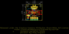
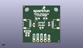
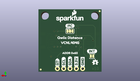
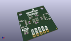

Contents
========

* [PROJ-SPAR-15177-STAN-01>Qwiic Proximity Sensor](#proj-spar-15177-stan-01qwiic-proximity-sensor)
	* [Images](#images)
	* [Interactive BOM](#interactive-bom)
	* [OOMP Parts](#oomp-parts)
	* [Tags](#tags)
  
![][im]
# PROJ-SPAR-15177-STAN-01>Qwiic Proximity Sensor

- ID: PROJ-SPAR-15177-STAN-01
- Hex ID: PRS15177
- Name: Qwiic Proximity Sensor
- Description: 

## Images
  
  

|eagleImage|kicadPcb3dFront|kicadPcb3dBack|kicadPcb3d|
| :---: | :---: | :---: | :---: |
|||||

## Interactive BOM

- Interactive BOM page: [ibom.html](kicad/bom/ibom.html)

## OOMP Parts
  

|OOMP Parts|
| :---: |
|CAPC-0603-X-UF22D-01, C1, 17.779999999999998, 12.7, 270,C1, 2.2uF, 0603, SparkFun-Capacitors, (0.7, 0.5), R270|
|<table><tr><td></td><td> C4</td><td>[CAPC-0603-X-NF100-V50 SMD (0603) 100 nF Capacitor (Ceramic) 50v](https://github.com/oomlout/oomlout_OOMP_parts/tree/main/CAPC-0603-X-NF100-V50/)</td><td>[C6N100](https://github.com/oomlout/oomlout_OOMP_parts/tree/main/CAPC-0603-X-NF100-V50/)</td></tr></table>|
|UNMATCHED-0603-X-UNMATCHED-01, D1, 3.175, 6.095999999999999, 0,D1, RED, LED-0603, SparkFun-LED, (0.125, 0.24), R0|
|UNMATCHED-UNMATCHED-X-UNMATCHED-01, I2C, 12.7, 16.509999999999998, M0,I2C, SMT-JUMPER_3_2-NC_TRACE_SILK, SparkFun-Jumpers, (0.5, 0.65), MR0|
|UNMATCHED-UNMATCHED-X-UNMATCHED-01, J2, 5.08, 12.7, 270,J2, 1X04_1MM_RA, SparkFun-Connectors, (0.2, 0.5), R270|
|UNMATCHED-UNMATCHED-X-UNMATCHED-01, J3, 7.619999999999999, 1.27, 0,J3, PTH, 1X04_NO_SILK, SparkX, (0.3, 0.05), R0|
|UNMATCHED-UNMATCHED-X-UNMATCHED-01, J4, 20.32, 12.7, 90,J4, 1X04_1MM_RA, SparkFun-Connectors, (0.8, 0.5), R90|
|UNMATCHED-UNMATCHED-X-UNMATCHED-01, J5, 17.779999999999998, 1.27, 0,J5, 1X01_NO_SILK, SparkFun-Connectors, (0.7, 0.05), R0|
|<table><tr><td></td><td> R1</td><td>[RESE-0603-X-O103-01 SMD (0603) 10k Ohm Resistor](https://github.com/oomlout/oomlout_OOMP_parts/tree/main/RESE-0603-X-O103-01/)</td><td>[R6103](https://github.com/oomlout/oomlout_OOMP_parts/tree/main/RESE-0603-X-O103-01/)</td></tr></table>|
|RESE-0603-X-UNMATCHED-01, R3, 3.175, 4.699, 0,R3, 1k, 0603, SparkFun-Resistors, (0.125, 0.185), R0|
|RESE-0603-X-UNMATCHED-01, R4, 10.16, 16.509999999999998, 180,R4, 2.2k, 0603, SparkFun-Resistors, (0.4, 0.65), R180|
|RESE-0603-X-UNMATCHED-01, R5, 15.239999999999998, 16.509999999999998, 0,R5, 2.2k, 0603, SparkFun-Resistors, (0.6, 0.65), R0|
|UNMATCHED-UNMATCHED-X-UNMATCHED-01, U2, 12.7, 12.7, 270,U2, VCNL4040, SPARKX_VCNL4040, SparkFun-Sensors, (0.5, 0.5), R270|

## Tags

- hexID: PRS15177
- oompType: PROJ
- oompSize: SPAR
- oompColor: 15177
- oompDesc: STAN
- oompIndex: 01
- oompName: Qwiic Proximity Sensor
- sources: All source files from https://github.com/sparkfun/Qwiic_Proximity_Sensor (source licence details in srcLicense.md)
- linkBuyPage: https://www.sparkfun.com/products/15177
- oompPart: CAPC-0603-X-UF22D-01, C1, 17.779999999999998, 12.7, 270
- oompPart: CAPC-0603-X-NF100-V50, C4, 12.7, 10.16, 180
- oompPart: UNMATCHED-0603-X-UNMATCHED-01, D1, 3.175, 6.095999999999999, 0
- oompPart: UNMATCHED-UNMATCHED-X-UNMATCHED-01, I2C, 12.7, 16.509999999999998, M0
- oompPart: UNMATCHED-UNMATCHED-X-UNMATCHED-01, J2, 5.08, 12.7, 270
- oompPart: UNMATCHED-UNMATCHED-X-UNMATCHED-01, J3, 7.619999999999999, 1.27, 0
- oompPart: UNMATCHED-UNMATCHED-X-UNMATCHED-01, J4, 20.32, 12.7, 90
- oompPart: UNMATCHED-UNMATCHED-X-UNMATCHED-01, J5, 17.779999999999998, 1.27, 0
- oompPart: SKIP-UNMATCHED-X-UNMATCHED-01, JP1, 0.7619999999999999, 24.637999999999998, M0
- oompPart: SKIP-UNMATCHED-X-UNMATCHED-01, JP2, 24.511, 0.889, 0
- oompPart: SKIP-UNMATCHED-X-UNMATCHED-01, JP5, 24.511, 0.889, M0
- oompPart: SKIP-UNMATCHED-X-UNMATCHED-01, JP6, 0.7619999999999999, 24.637999999999998, 0
- oompPart: SKIP-UNMATCHED-X-UNMATCHED-01, JP9, 3.8099999999999996, 6.35, M0
- oompPart: RESE-0603-X-O103-01, R1, 7.619999999999999, 12.065, 90
- oompPart: RESE-0603-X-UNMATCHED-01, R3, 3.175, 4.699, 0
- oompPart: RESE-0603-X-UNMATCHED-01, R4, 10.16, 16.509999999999998, 180
- oompPart: RESE-0603-X-UNMATCHED-01, R5, 15.239999999999998, 16.509999999999998, 0
- oompPart: UNMATCHED-UNMATCHED-X-UNMATCHED-01, U2, 12.7, 12.7, 270
- rawPart: C1, 2.2uF, 0603, SparkFun-Capacitors, (0.7, 0.5), R270
- rawPart: C4, 0.1uF, 0603, SparkFun-Capacitors, (0.5, 0.4), R180
- rawPart: D1, RED, LED-0603, SparkFun-LED, (0.125, 0.24), R0
- rawPart: I2C, SMT-JUMPER_3_2-NC_TRACE_SILK, SparkFun-Jumpers, (0.5, 0.65), MR0
- rawPart: J2, 1X04_1MM_RA, SparkFun-Connectors, (0.2, 0.5), R270
- rawPart: J3, PTH, 1X04_NO_SILK, SparkX, (0.3, 0.05), R0
- rawPart: J4, 1X04_1MM_RA, SparkFun-Connectors, (0.8, 0.5), R90
- rawPart: J5, 1X01_NO_SILK, SparkFun-Connectors, (0.7, 0.05), R0
- rawPart: JP1, FIDUCIALUFIDUCIAL, MICRO-FIDUCIAL, SparkFun, (0.03, 0.97), MR0
- rawPart: JP2, FIDUCIALUFIDUCIAL, MICRO-FIDUCIAL, SparkFun, (0.965, 0.035), R0
- rawPart: JP5, FIDUCIALUFIDUCIAL, MICRO-FIDUCIAL, SparkFun, (0.965, 0.035), MR0
- rawPart: JP6, FIDUCIALUFIDUCIAL, MICRO-FIDUCIAL, SparkFun, (0.03, 0.97), R0
- rawPart: JP9, INT, PAD-JUMPER-2-NC_BY_TRACE_YES_SILK, SparkFun-Passives, (0.15, 0.25), MR0
- rawPart: R1, 10k, 0603, SparkFun-Resistors, (0.3, 0.475), R90
- rawPart: R3, 1k, 0603, SparkFun-Resistors, (0.125, 0.185), R0
- rawPart: R4, 2.2k, 0603, SparkFun-Resistors, (0.4, 0.65), R180
- rawPart: R5, 2.2k, 0603, SparkFun-Resistors, (0.6, 0.65), R0
- rawPart: U2, VCNL4040, SPARKX_VCNL4040, SparkFun-Sensors, (0.5, 0.5), R270
- oompID: PROJ-SPAR-15177-STAN-01

[im]: kicadPcb3d_450.png
