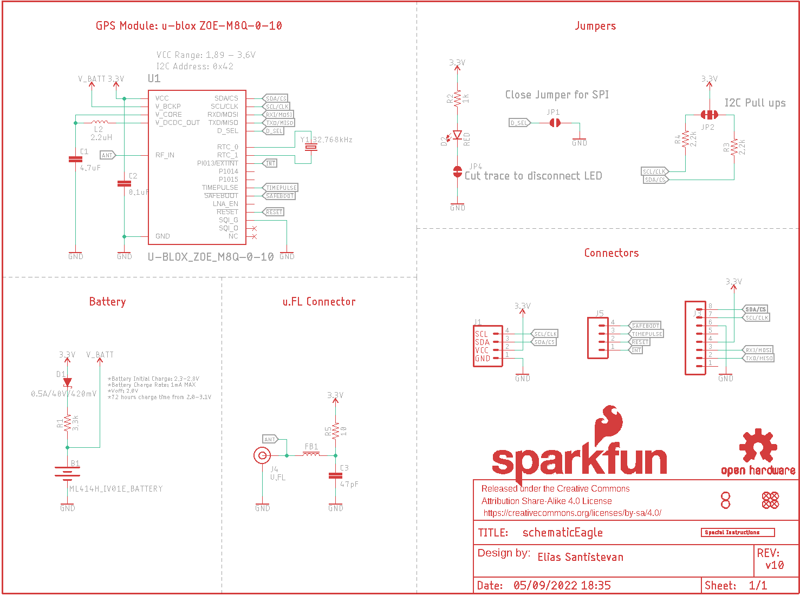
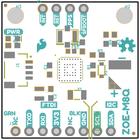
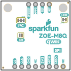
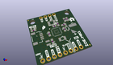
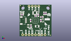
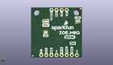
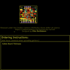
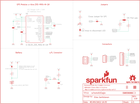
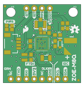
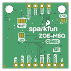

Contents
========

* [PRS15193 > SparkFun u-blox ZOE-M8Q](#prs15193--sparkfun-u-blox-zoe-m8q)
	* [Schematic](#schematic)
	* [PCB](#pcb)
	* [Interactive BOM](#interactive-bom)
	* [Images](#images)
	* [Tags](#tags)
  
![][im]
# PRS15193 > SparkFun u-blox ZOE-M8Q

- ID: PROJ-SPAR-15193-STAN-01
- Hex ID: PRS15193
- Name: Sparkfun
- Description: Sparkfun
- Long Link: [http://oom.lt/PROJ-SPAR-15193-STAN-01](http://oom.lt/PROJ-SPAR-15193-STAN-01)
- Short Link: [http://oom.lt/PRS15193](http://oom.lt/PRS15193)

## Schematic
  

## PCB
  

## Interactive BOM

- Interactive BOM page: [ibom.html](https://htmlpreview.github.io/?https://github.com/oomlout/oomlout_OOMP_projects/blob/main/PROJ-SPAR-15193-STAN-01/kicad/bom/ibom.html)

## Images
  
  

|bominteractivefront|bominteractiveback|kicadPcb3d|kicadPcb3dFront|kicadPcb3dBack|eagleImage|eagleSchemImage|pcbdraw|pcbdrawback|
| :---: | :---: | :---: | :---: | :---: | :---: | :---: | :---: | :---: |
||||||||||

## Tags

- hexID: PRS15193
- oompType: PROJ
- oompSize: SPAR
- oompColor: 15193
- oompDesc: STAN
- oompIndex: 01
- oompName: SparkFun u-blox ZOE-M8Q
- sources: All source files from https://github.com/sparkfun/SparkFun_u-blox_ZOE-M8Q (source licence details in srcLicense.md)
- linkBuyPage: https://www.sparkfun.com/products/15193
- oompID: PROJ-SPAR-15193-STAN-01
- rawParts: B1,ML414H_IV01E_BATTERY,ML414H_IV01E_BATTERY,ML414H_IV01E,SEIKO ML414H-IV01E Reflowable Lithium Battery,,,BATT-14267,,,,
- rawParts: C1,4.7uF,4.7UF-0603-6.3V-(10%),0603,4.7µF ceramic capacitors,,,CAP-08280,,,4.7uF,
- rawParts: C2,0.1uF,0.1UF-0603-25V-(+80/-20%),0603,0.1µF ceramic capacitors,,,CAP-00810,,,0.1uF,
- rawParts: C3,47pF,47PF-0603-50V-5%,0603,47pF ceramic capacitors,,,CAP-08913,,,47pF,
- rawParts: D1,0.5A/40V/420mV,DIODE-SCHOTTKY-PMEG4005EJ,SOD-323,Schottky diode,,,DIO-10955,,,0.5A/40V/420mV,
- rawParts: D2,RED,LED-RED0603,LED-0603,Red SMD LED,,,DIO-00819,,,RED,
- rawParts: FB1,FERRITE_BEAD-120_OHM-0402,FERRITE_BEAD-120_OHM-0402,0402,Ferrite Bead (blocks, cores, rings, chokes, etc.),,BLM15HB121SN1D,NDUC-14206,,,,
- rawParts: FD1,FIDUCIALUFIDUCIAL,FIDUCIALUFIDUCIAL,FIDUCIAL-MICRO,Fiducial Alignment Points,,,,,,,
- rawParts: FD2,FIDUCIALUFIDUCIAL,FIDUCIALUFIDUCIAL,FIDUCIAL-MICRO,Fiducial Alignment Points,,,,,,,
- rawParts: FD3,FIDUCIALUFIDUCIAL,FIDUCIALUFIDUCIAL,FIDUCIAL-MICRO,Fiducial Alignment Points,,,,,,,
- rawParts: FD4,FIDUCIALUFIDUCIAL,FIDUCIALUFIDUCIAL,FIDUCIAL-MICRO,Fiducial Alignment Points,,,,,,,
- rawParts: FRAME1,FRAME-LETTER,FRAME-LETTER,CREATIVE_COMMONS,Schematic Frame - Letter,,,,,,,
- rawParts: H2,STAND-OFFTIGHT,STAND-OFFTIGHT,STAND-OFF-TIGHT,Stand Off,,,,,,,
- rawParts: H3,STAND-OFFTIGHT,STAND-OFFTIGHT,STAND-OFF-TIGHT,Stand Off,,,,,,,
- rawParts: J1,,QWIIC_CONNECTORJS-1MM,JST04_1MM_RA,SparkFun I2C Standard Qwiic Connector,,,CONN-13694,,,,
- rawParts: J3,,CONN_08NO_SILK_FEMALE_PTH,1X08_NO_SILK,Multi connection point. Often used as Generic Header-pin footprint for 0.1 inch spaced/style header connections,,,CONN-08438,,,,
- rawParts: J4,U.FL,U.FL2PIN,U.FL,SMD Antenna Connector - U.FL,,,CONN-09193,,WRL-09144,U.FL,
- rawParts: J5,,CONN_041X04_NO_SILK,1X04_NO_SILK,Multi connection point. Often used as Generic Header-pin footprint for 0.1 inch spaced/style header connections,,,CONN-09696,,,,
- rawParts: JP1,JUMPER-SMT_2_NO_SILK,JUMPER-SMT_2_NO_SILK,SMT-JUMPER_2_NO_SILK,Normally open jumper,,,,,,,
- rawParts: JP2,JUMPER-SMT_3_2-NC_TRACE_SILK,JUMPER-SMT_3_2-NC_TRACE_SILK,SMT-JUMPER_3_2-NC_TRACE_SILK,Normally closed trace jumper (2 of 2 connections),,,,,,,
- rawParts: JP4,JUMPER-SMT_2_NC_TRACE_SILK,JUMPER-SMT_2_NC_TRACE_SILK,SMT-JUMPER_2_NC_TRACE_SILK,Normally closed trace jumper,,,,,,,
- rawParts: L2,2.2uH,2.2μH_SHIELDED_INDUCTOR,0806,Murata 2.2uH Inductor,,,NDUC-14257,,,,
- rawParts: LOGO1,SFE_LOGO_NAME_FLAME.1_INCH,SFE_LOGO_NAME_FLAME.1_INCH,SFE_LOGO_NAME_FLAME_.1,SparkFun Font Logo w/ Flame,,,,,,,
- rawParts: LOGO2,OSHW-LOGOS,OSHW-LOGOS,OSHW-LOGO-S,Open-Source Hardware (OSHW) Logo,,,,,,,
- rawParts: LOGO3,SFE_LOGO_FLAME.1_INCH,SFE_LOGO_FLAME.1_INCH,SFE_LOGO_FLAME_.1,SparkFun Flame Logo,,,,,,,
- rawParts: LOGO4,SPECIAL_INSTRUCTIONS-ORDERING,SPECIAL_INSTRUCTIONS-ORDERING,ORDERING_INSTRUCTIONS,Special Ordering/Production Instructions Alert,,,,,,,
- rawParts: R1,3.3k,3.3KOHM-0603-1/10W-1%,0603,3.3kΩ resistor,,,RES-07851,,,3.3k,
- rawParts: R2,1k,1KOHM-0603-1/10W-1%,0603,1kΩ resistor,,,RES-07856,,,1k,
- rawParts: R3,2.2k,2.2KOHM-0603-1/10W-1%,0603,2.2kΩ resistor,,,RES-08272,,,2.2k,
- rawParts: R4,2.2k,2.2KOHM-0603-1/10W-1%,0603,2.2kΩ resistor,,,RES-08272,,,2.2k,
- rawParts: R5,10,10OHM-0603-1/10W-1%,0603,10Ω resistor,,,RES-12581,,,10,
- rawParts: U1,U-BLOX_ZOE_M8Q-0-10,U-BLOX_ZOE_M8Q-0-10,UBLOX_ZOE_M8-0-10,UBLOX ZOE-M8Q-0-10,,,IC-14251,,,,
- rawParts: Y1,32.768kHz,CRYSTAL-32.768KHZSMD-3.2X1.5,CRYSTAL-SMD-3.2X1.5MM,32.768kHz Crystal,,,XTAL-13062,,,32.768kHz,

[im]: kicadPcb3d_450.png
