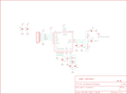
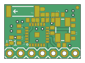

Contents
========

* [PRS152 > nRF2401A Transceiver-Chip Antenna](#prs152--nrf2401a-transceiver-chip-antenna)
	* [Schematic](#schematic)
	* [PCB](#pcb)
	* [Interactive BOM](#interactive-bom)
	* [OOMP Parts](#oomp-parts)
	* [Images](#images)
	* [Tags](#tags)
  
![][im]
# PRS152 > nRF2401A Transceiver-Chip Antenna

- ID: PROJ-SPAR-152-STAN-01
- Hex ID: PRS152
- Name: Sparkfun 152
- Description: Sparkfun 152
- Long Link: [http://oom.lt/PROJ-SPAR-152-STAN-01](http://oom.lt/PROJ-SPAR-152-STAN-01)
- Short Link: [http://oom.lt/PRS152](http://oom.lt/PRS152)

## Schematic
  

## PCB
  

## Interactive BOM

- Interactive BOM page: [ibom.html](https://htmlpreview.github.io/?https://github.com/oomlout/oomlout_OOMP_projects/blob/main/PROJ-SPAR-152-STAN-01/kicad/bom/ibom.html)

## OOMP Parts
  

|OOMP ID|Name|Identifier|
| :---: | :---: | :---: |
|[CAPC-0402-X-PF22-V50](https://github.com/oomlout/oomlout_OOMP_parts/tree/main/CAPC-0402-X-PF22-V50/)|[SMD (0402) 22 pF Capacitor (Ceramic) 50v](https://github.com/oomlout/oomlout_OOMP_parts/tree/main/CAPC-0402-X-PF22-V50/)|[C1, C2, C5](https://github.com/oomlout/oomlout_OOMP_parts/tree/main/CAPC-0402-X-PF22-V50/)|
|CAPC-0402-X-NF33-01||C3|
|[CAPC-0402-X-PF22D-V50](https://github.com/oomlout/oomlout_OOMP_parts/tree/main/CAPC-0402-X-PF22D-V50/)|[SMD (0402) 2.2 pF Capacitor (Ceramic) 50v](https://github.com/oomlout/oomlout_OOMP_parts/tree/main/CAPC-0402-X-PF22D-V50/)|[C4](https://github.com/oomlout/oomlout_OOMP_parts/tree/main/CAPC-0402-X-PF22D-V50/)|
|CAPC-0402-X-UNMATCHED-01||C6, C7|
|[CAPC-0402-X-NF10-V50](https://github.com/oomlout/oomlout_OOMP_parts/tree/main/CAPC-0402-X-NF10-V50/)|[SMD (0402) 10 nF Capacitor (Ceramic) 50v](https://github.com/oomlout/oomlout_OOMP_parts/tree/main/CAPC-0402-X-NF10-V50/)|[C8](https://github.com/oomlout/oomlout_OOMP_parts/tree/main/CAPC-0402-X-NF10-V50/)|
|[CAPC-0402-X-NF1-V50](https://github.com/oomlout/oomlout_OOMP_parts/tree/main/CAPC-0402-X-NF1-V50/)|[SMD (0402) 1 nF Capacitor (Ceramic) 50v](https://github.com/oomlout/oomlout_OOMP_parts/tree/main/CAPC-0402-X-NF1-V50/)|[C9](https://github.com/oomlout/oomlout_OOMP_parts/tree/main/CAPC-0402-X-NF1-V50/)|
|[HEAD-I01-X-PI07-01](https://github.com/oomlout/oomlout_OOMP_parts/tree/main/HEAD-I01-X-PI07-01/)|[2.54 mm 7 Pin Header](https://github.com/oomlout/oomlout_OOMP_parts/tree/main/HEAD-I01-X-PI07-01/)|[JP1](https://github.com/oomlout/oomlout_OOMP_parts/tree/main/HEAD-I01-X-PI07-01/)|
|UNMATCHED-0402-X-UNMATCHED-01||L1, L2|
|UNMATCHED-UNMATCHED-X-UNMATCHED-01||Q1, U1, Y1|
|[RESE-0402-X-O105-01](https://github.com/oomlout/oomlout_OOMP_parts/tree/main/RESE-0402-X-O105-01/)|[SMD (0402) 1M Ohm Resistor](https://github.com/oomlout/oomlout_OOMP_parts/tree/main/RESE-0402-X-O105-01/)|[R1](https://github.com/oomlout/oomlout_OOMP_parts/tree/main/RESE-0402-X-O105-01/)|
|[RESE-0402-X-O223-01](https://github.com/oomlout/oomlout_OOMP_parts/tree/main/RESE-0402-X-O223-01/)|[SMD (0402) 22k Ohm Resistor](https://github.com/oomlout/oomlout_OOMP_parts/tree/main/RESE-0402-X-O223-01/)|[R2](https://github.com/oomlout/oomlout_OOMP_parts/tree/main/RESE-0402-X-O223-01/)|

## Images
  
  

|bominteractivefront|bominteractiveback|kicadPcb3d|kicadPcb3dFront|kicadPcb3dBack|kicadSchem|eagleImage|eagleSchemImage|pcbdraw|pcbdrawback|
| :---: | :---: | :---: | :---: | :---: | :---: | :---: | :---: | :---: | :---: |
|||||||||||

## Tags

- hexID: PRS152
- oompType: PROJ
- oompSize: SPAR
- oompColor: 152
- oompDesc: STAN
- oompIndex: 01
- oompName: nRF2401A Transceiver-Chip Antenna
- sources: All source files from https://github.com/sparkfun/nRF2401A_Transceiver-Chip_Antenna (source licence details in srcLicense.md)
- linkBuyPage: https://www.sparkfun.com/products/152
- oompID: PROJ-SPAR-152-STAN-01
- oompParts: C1,CAPC-0402-X-PF22-V50
- oompParts: C2,CAPC-0402-X-PF22-V50
- oompParts: C3,CAPC-0402-X-NF33-01
- oompParts: C4,CAPC-0402-X-PF22D-V50
- oompParts: C5,CAPC-0402-X-PF22-V50
- oompParts: C6,CAPC-0402-X-UNMATCHED-01
- oompParts: C7,CAPC-0402-X-UNMATCHED-01
- oompParts: C8,CAPC-0402-X-NF10-V50
- oompParts: C9,CAPC-0402-X-NF1-V50
- oompParts: JP1,HEAD-I01-X-PI07-01
- oompParts: L1,UNMATCHED-0402-X-UNMATCHED-01
- oompParts: L2,UNMATCHED-0402-X-UNMATCHED-01
- oompParts: Q1,UNMATCHED-UNMATCHED-X-UNMATCHED-01
- oompParts: R1,RESE-0402-X-O105-01
- oompParts: R2,RESE-0402-X-O223-01
- oompParts: U1,UNMATCHED-UNMATCHED-X-UNMATCHED-01
- oompParts: Y1,UNMATCHED-UNMATCHED-X-UNMATCHED-01
- rawParts: C1,22pF,CAP0402,C0402,Capacitor,,
- rawParts: C2,22pF,CAP0402,C0402,Capacitor,,
- rawParts: C3,33nF,CAP0402,C0402,Capacitor,,
- rawParts: C4,2.2nF,CAP0402,C0402,Capacitor,,
- rawParts: C5,22pF,CAP0402,C0402,Capacitor,,
- rawParts: C6,1.0pF,CAP0402,C0402,Capacitor,,
- rawParts: C7,1.0pF,CAP0402,C0402,Capacitor,,
- rawParts: C8,10nF,CAP0402,C0402,Capacitor,,
- rawParts: C9,1nF,CAP0402,C0402,Capacitor,,
- rawParts: JP1,,M07,1X07,Header 7,,
- rawParts: JP2,FIDUCIALUFIDUCIAL,FIDUCIALUFIDUCIAL,MICRO-FIDUCIAL,Fiducial Alignment Points,,
- rawParts: JP3,FIDUCIALUFIDUCIAL,FIDUCIALUFIDUCIAL,MICRO-FIDUCIAL,Fiducial Alignment Points,,
- rawParts: L1,3.3nH,INDUCTOR0402,C0402,Inductors,,
- rawParts: L2,33nH,INDUCTOR0402,C0402,Inductors,,
- rawParts: Q1,16MHz,CRYSTAL5X3,CRYSTAL-SMD-5X3,Crystals,,
- rawParts: R1,1M,RESISTOR0402,C0402,Resistor,,
- rawParts: R2,22K,RESISTOR0402,C0402,Resistor,,
- rawParts: U$1,LOGO-SFESK,LOGO-SFESK,SFE-LOGO-FLAME,Spark Fun Electronics PCB Logo,,
- rawParts: U1,NRF2401A,NRF2401ASMD,MLP-24,2.4GHz Transceiver,,
- rawParts: Y1,ANTENNA2SMD5,ANTENNA2SMD5,ANTENNA-CHIP5,Antenna,,

[im]: kicadPcb3d_450.png
