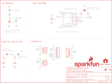

Contents
========

* [PRS15210 > SparkFun u-blox SAM-M8Q](#prs15210--sparkfun-u-blox-sam-m8q)
	* [Schematic](#schematic)
	* [PCB](#pcb)
	* [Interactive BOM](#interactive-bom)
	* [Images](#images)
	* [Tags](#tags)
  
![][im]
# PRS15210 > SparkFun u-blox SAM-M8Q

- ID: PROJ-SPAR-15210-STAN-01
- Hex ID: PRS15210
- Name: Sparkfun
- Description: Sparkfun
- Long Link: [http://oom.lt/PROJ-SPAR-15210-STAN-01](http://oom.lt/PROJ-SPAR-15210-STAN-01)
- Short Link: [http://oom.lt/PRS15210](http://oom.lt/PRS15210)

## Schematic
  

## PCB
  

## Interactive BOM

- Interactive BOM page: [ibom.html](https://htmlpreview.github.io/?https://github.com/oomlout/oomlout_OOMP_projects/blob/main/PROJ-SPAR-15210-STAN-01/kicad/bom/ibom.html)

## Images
  
  

|bominteractivefront|bominteractiveback|kicadPcb3d|kicadPcb3dFront|kicadPcb3dBack|eagleImage|eagleSchemImage|pcbdraw|pcbdrawback|
| :---: | :---: | :---: | :---: | :---: | :---: | :---: | :---: | :---: |
||||||||||

## Tags

- hexID: PRS15210
- oompType: PROJ
- oompSize: SPAR
- oompColor: 15210
- oompDesc: STAN
- oompIndex: 01
- oompName: SparkFun u-blox SAM-M8Q
- sources: All source files from https://github.com/sparkfun/SparkFun_u-blox_SAM-M8Q (source licence details in srcLicense.md)
- linkBuyPage: https://www.sparkfun.com/products/15210
- oompID: PROJ-SPAR-15210-STAN-01
- rawParts: BT1,6.8MM_COIN_CELL,ML414H_IV01E_BATTERY,ML414H_IV01E,SEIKO ML414H-IV01E Reflowable Lithium Battery,,BATT-14267,,,
- rawParts: C1,1.0uF,1.0UF-0603-16V-10%,0603,1µF ceramic capacitors,,CAP-00868,,1.0uF,
- rawParts: C2,1.0uF,1.0UF-0603-16V-10%,0603,1µF ceramic capacitors,,CAP-00868,,1.0uF,
- rawParts: D1,Yellow,LED-YELLOW0603,LED-0603,Yellow SMD LED,,DIO-09003,,Yellow,
- rawParts: D2,0.5A/40V/420mV,DIODE-SCHOTTKY-PMEG4005EJ,SOD-323,Schottky diode,,DIO-10955,,0.5A/40V/420mV,
- rawParts: D3,RED,LED-RED0603,LED-0603,Red SMD LED,,DIO-00819,,RED,
- rawParts: FD1,FIDUCIALUFIDUCIAL,FIDUCIALUFIDUCIAL,FIDUCIAL-MICRO,Fiducial Alignment Points,,,,,
- rawParts: FD2,FIDUCIALUFIDUCIAL,FIDUCIALUFIDUCIAL,FIDUCIAL-MICRO,Fiducial Alignment Points,,,,,
- rawParts: FD3,FIDUCIALUFIDUCIAL,FIDUCIALUFIDUCIAL,FIDUCIAL-MICRO,Fiducial Alignment Points,,,,,
- rawParts: FD4,FIDUCIALUFIDUCIAL,FIDUCIALUFIDUCIAL,FIDUCIAL-MICRO,Fiducial Alignment Points,,,,,
- rawParts: FRAME1,FRAME-LETTER,FRAME-LETTER,CREATIVE_COMMONS,Schematic Frame - Letter,,,,,
- rawParts: H1,STAND-OFF,STAND-OFF,STAND-OFF,Stand Off,,,,,
- rawParts: H2,STAND-OFF,STAND-OFF,STAND-OFF,Stand Off,,,,,
- rawParts: H3,STAND-OFF,STAND-OFF,STAND-OFF,Stand Off,,,,,
- rawParts: H4,STAND-OFF,STAND-OFF,STAND-OFF,Stand Off,,,,,
- rawParts: J1,Qwiic Right Angle,I2C_STANDARDQWIIC,JST04_1MM_RA,SparkFun I2C Standard Pinout Header,,CONN-13694,,Qwiic Right Angle,
- rawParts: J2,Qwiic Right Angle,I2C_STANDARDQWIIC,JST04_1MM_RA,SparkFun I2C Standard Pinout Header,,CONN-13694,,Qwiic Right Angle,
- rawParts: J3,,CONN_08NO_SILK_FEMALE_PTH,1X08_NO_SILK,Multi connection point. Often used as Generic Header-pin footprint for 0.1 inch spaced/style header connections,,CONN-08438,,,
- rawParts: J4,BOOT,CONN_06NO_SILK_NO_POP,1X06_NO_SILK,Multi connection point. Often used as Generic Header-pin footprint for 0.1 inch spaced/style header connections,,,,,
- rawParts: JP1,,JUMPER-SMT_2_NC_TRACE_SILK,SMT-JUMPER_2_NC_TRACE_SILK,Normally closed trace jumper,,,,,
- rawParts: JP2,JUMPER-SMT_2_NC_TRACE_SILK,JUMPER-SMT_2_NC_TRACE_SILK,SMT-JUMPER_2_NC_TRACE_SILK,Normally closed trace jumper,,,,,
- rawParts: JP3,JUMPER-SMT_3_2-NC_TRACE_SILK,JUMPER-SMT_3_2-NC_TRACE_SILK,SMT-JUMPER_3_2-NC_TRACE_SILK,Normally closed trace jumper (2 of 2 connections),,,,,
- rawParts: LOGO1,SFE_LOGO_NAME_FLAME.2_INCH,SFE_LOGO_NAME_FLAME.2_INCH,SFE_LOGO_NAME_FLAME_.2,SparkFun Font Logo w/ Flame,,,,,
- rawParts: LOGO2,OSHW-LOGOM,OSHW-LOGOM,OSHW-LOGO-M,Open-Source Hardware (OSHW) Logo,,,,,
- rawParts: R1,1k,1KOHM-0603-1/10W-1%,0603,1kΩ resistor,,RES-07856,,1k,
- rawParts: R2,3.3k,3.3KOHM-0603-1/10W-1%,0603,3.3kΩ resistor,,RES-07851,,3.3k,
- rawParts: R3,1k,1KOHM-0603-1/10W-1%,0603,1kΩ resistor,,RES-07856,,1k,
- rawParts: R4,22,22OHM-0603-1/10W-1%,0603,22Ω resistor,,RES-08698,,22,
- rawParts: R5,22,22OHM-0603-1/10W-1%,0603,22Ω resistor,,RES-08698,,22,
- rawParts: R6,470,470OHM-0603-1/10W-1%,0603,470Ω resistor,,RES-07869,,470,
- rawParts: R7,470,470OHM-0603-1/10W-1%,0603,470Ω resistor,,RES-07869,,470,
- rawParts: R8,2.2k,2.2KOHM-0603-1/10W-1%,0603,2.2kΩ resistor,,RES-08272,,2.2k,
- rawParts: R9,2.2k,2.2KOHM-0603-1/10W-1%,0603,2.2kΩ resistor,,RES-08272,,2.2k,
- rawParts: U1,UBLOX_SAM_M8Q-0-10,UBLOX_SAM_M8Q-0-10,SAM-M8Q,u-blox SAM-M8Q,,IC-14070,,,

[im]: kicadPcb3d_450.png
