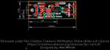
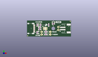
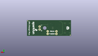
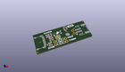

Contents
========

* [PROJ-SPAR-15217-STAN-01>LiPo Charger Plus](#proj-spar-15217-stan-01lipo-charger-plus)
	* [Images](#images)
	* [Interactive BOM](#interactive-bom)
	* [OOMP Parts](#oomp-parts)
	* [Tags](#tags)
  
![][im]
# PROJ-SPAR-15217-STAN-01>LiPo Charger Plus

- ID: PROJ-SPAR-15217-STAN-01
- Hex ID: PRS15217
- Name: LiPo Charger Plus
- Description: 

## Images
  
  

|eagleImage|kicadPcb3dFront|kicadPcb3dBack|kicadPcb3d|
| :---: | :---: | :---: | :---: |
|||||

## Interactive BOM

- Interactive BOM page: [ibom.html](kicad/bom/ibom.html)

## OOMP Parts
  

|OOMP Parts|
| :---: |
|CAPC-0603-X-UNMATCHED-01, C1, 11.811, 10.033, 270,C1, 10uF, 0603, SparkFun-Capacitors, (0.465, 0.395), R270|
|CAPC-0603-X-UNMATCHED-01, C2, 18.796, 10.033, 90,C2, 10uF, 0603, SparkFun-Capacitors, (0.74, 0.395), R90|
|UNMATCHED-0603-X-UNMATCHED-01, D1, 22.86, 12.572999999999999, 0,D1, RED, LED-0603, SparkFun-LED, (0.9, 0.495), R0|
|UNMATCHED-0603-X-UNMATCHED-01, D2, 10.16, 3.429, 90,D2, GREEN, LED-0603, SparkFun-LED, (0.4, 0.135), R90|
|UNMATCHED-0603-X-UNMATCHED-01, D3, 10.16, 10.033, 270,D3, Yellow, LED-0603, SparkFun-LED, (0.4, 0.395), R270|
|UNMATCHED-UNMATCHED-X-UNMATCHED-01, J1, 34.671, 6.985, 270,J1, JST-2-SMD, SparkFun-Connectors, (1.365, 0.275), R270|
|UNMATCHED-UNMATCHED-X-UNMATCHED-01, J2, 6.223, 6.985, 270,J2, USB-C-16P, SparkFun-Connectors, (0.245, 0.275), R270|
|UNMATCHED-UNMATCHED-X-UNMATCHED-01, J3, 27.178, 5.715, 90,J3, 1X02_NO_SILK, SparkFun-Connectors, (1.07, 0.225), R90|
|RESE-0603-X-UNMATCHED-01, R1, 11.049, 7.619999999999999, 0,R1, 1.5k, 0603, SparkFun-Resistors, (0.435, 0.3), R0|
|RESE-0603-X-UNMATCHED-01, R2, 11.049, 6.095999999999999, 0,R2, 1.5k, 0603, SparkFun-Resistors, (0.435, 0.24), R0|
|RESE-0603-X-UNMATCHED-01, R3, 22.86, 11.049, 180,R3, 1.5k, 0603, SparkFun-Resistors, (0.9, 0.435), R180|
|RESE-0603-X-UNMATCHED-01, R4, 16.383, 4.064, 0,R4, 1k, 0603, SparkFun-Resistors, (0.645, 0.16), R0|
|RESE-UNMATCHED-X-UNMATCHED-01, R5, 16.383, 4.064, 0,R5, PROG, AXIAL-0.3, SparkFun-Resistors, (0.645, 0.16), R0|
|<table><tr><td></td><td> R6</td><td>[RESE-0603-X-O103-01 SMD (0603) 10k Ohm Resistor](https://github.com/oomlout/oomlout_OOMP_parts/tree/main/RESE-0603-X-O103-01/)</td><td>[R6103](https://github.com/oomlout/oomlout_OOMP_parts/tree/main/RESE-0603-X-O103-01/)</td></tr></table>|
|RESE-UNMATCHED-X-UNMATCHED-01, R7, 16.383, 1.778, 0,R7, THERM, AXIAL-0.3, SparkFun-Resistors, (0.645, 0.07), R0|
|RESE-0603-X-UNMATCHED-01, R8, 8.762999999999998, 3.429, 90,R8, 5.1k, 0603, SparkFun-Resistors, (0.345, 0.135), R90|
|RESE-0603-X-UNMATCHED-01, R9, 8.762999999999998, 10.033, 270,R9, 5.1k, 0603, SparkFun-Resistors, (0.345, 0.395), R270|
|UNMATCHED-UNMATCHED-X-UNMATCHED-01, U1, 15.748, 6.985, 0,U1, MCP73833, DFN-10, SparkFun-IC-Power, (0.62, 0.275), R0|

## Tags

- hexID: PRS15217
- oompType: PROJ
- oompSize: SPAR
- oompColor: 15217
- oompDesc: STAN
- oompIndex: 01
- oompName: LiPo Charger Plus
- sources: All source files from https://github.com/sparkfun/LiPo_Charger_Plus (source licence details in srcLicense.md)
- linkBuyPage: https://www.sparkfun.com/products/15217
- oompPart: CAPC-0603-X-UNMATCHED-01, C1, 11.811, 10.033, 270
- oompPart: CAPC-0603-X-UNMATCHED-01, C2, 18.796, 10.033, 90
- oompPart: UNMATCHED-0603-X-UNMATCHED-01, D1, 22.86, 12.572999999999999, 0
- oompPart: UNMATCHED-0603-X-UNMATCHED-01, D2, 10.16, 3.429, 90
- oompPart: UNMATCHED-0603-X-UNMATCHED-01, D3, 10.16, 10.033, 270
- oompPart: SKIP-UNMATCHED-X-UNMATCHED-01, FD1, 0.635, 0.635, 0
- oompPart: SKIP-UNMATCHED-X-UNMATCHED-01, FD2, 0.635, 0.635, M0
- oompPart: SKIP-UNMATCHED-X-UNMATCHED-01, FD3, 37.465, 13.334999999999999, 0
- oompPart: SKIP-UNMATCHED-X-UNMATCHED-01, FD4, 37.465, 13.334999999999999, M0
- oompPart: UNMATCHED-UNMATCHED-X-UNMATCHED-01, J1, 34.671, 6.985, 270
- oompPart: UNMATCHED-UNMATCHED-X-UNMATCHED-01, J2, 6.223, 6.985, 270
- oompPart: UNMATCHED-UNMATCHED-X-UNMATCHED-01, J3, 27.178, 5.715, 90
- oompPart: RESE-0603-X-UNMATCHED-01, R1, 11.049, 7.619999999999999, 0
- oompPart: RESE-0603-X-UNMATCHED-01, R2, 11.049, 6.095999999999999, 0
- oompPart: RESE-0603-X-UNMATCHED-01, R3, 22.86, 11.049, 180
- oompPart: RESE-0603-X-UNMATCHED-01, R4, 16.383, 4.064, 0
- oompPart: RESE-UNMATCHED-X-UNMATCHED-01, R5, 16.383, 4.064, 0
- oompPart: RESE-0603-X-O103-01, R6, 16.383, 1.778, 0
- oompPart: RESE-UNMATCHED-X-UNMATCHED-01, R7, 16.383, 1.778, 0
- oompPart: RESE-0603-X-UNMATCHED-01, R8, 8.762999999999998, 3.429, 90
- oompPart: RESE-0603-X-UNMATCHED-01, R9, 8.762999999999998, 10.033, 270
- oompPart: UNMATCHED-UNMATCHED-X-UNMATCHED-01, U1, 15.748, 6.985, 0
- rawPart: C1, 10uF, 0603, SparkFun-Capacitors, (0.465, 0.395), R270
- rawPart: C2, 10uF, 0603, SparkFun-Capacitors, (0.74, 0.395), R90
- rawPart: D1, RED, LED-0603, SparkFun-LED, (0.9, 0.495), R0
- rawPart: D2, GREEN, LED-0603, SparkFun-LED, (0.4, 0.135), R90
- rawPart: D3, Yellow, LED-0603, SparkFun-LED, (0.4, 0.395), R270
- rawPart: FD1, FIDUCIALUFIDUCIAL, FIDUCIAL-MICRO, SparkFun-Aesthetics, (0.025, 0.025), R0
- rawPart: FD2, FIDUCIALUFIDUCIAL, FIDUCIAL-MICRO, SparkFun-Aesthetics, (0.025, 0.025), MR0
- rawPart: FD3, FIDUCIALUFIDUCIAL, FIDUCIAL-MICRO, SparkFun-Aesthetics, (1.475, 0.525), R0
- rawPart: FD4, FIDUCIALUFIDUCIAL, FIDUCIAL-MICRO, SparkFun-Aesthetics, (1.475, 0.525), MR0
- rawPart: J1, JST-2-SMD, SparkFun-Connectors, (1.365, 0.275), R270
- rawPart: J2, USB-C-16P, SparkFun-Connectors, (0.245, 0.275), R270
- rawPart: J3, 1X02_NO_SILK, SparkFun-Connectors, (1.07, 0.225), R90
- rawPart: R1, 1.5k, 0603, SparkFun-Resistors, (0.435, 0.3), R0
- rawPart: R2, 1.5k, 0603, SparkFun-Resistors, (0.435, 0.24), R0
- rawPart: R3, 1.5k, 0603, SparkFun-Resistors, (0.9, 0.435), R180
- rawPart: R4, 1k, 0603, SparkFun-Resistors, (0.645, 0.16), R0
- rawPart: R5, PROG, AXIAL-0.3, SparkFun-Resistors, (0.645, 0.16), R0
- rawPart: R6, 10k, 0603, SparkFun-Resistors, (0.645, 0.07), R0
- rawPart: R7, THERM, AXIAL-0.3, SparkFun-Resistors, (0.645, 0.07), R0
- rawPart: R8, 5.1k, 0603, SparkFun-Resistors, (0.345, 0.135), R90
- rawPart: R9, 5.1k, 0603, SparkFun-Resistors, (0.345, 0.395), R270
- rawPart: U1, MCP73833, DFN-10, SparkFun-IC-Power, (0.62, 0.275), R0
- oompID: PROJ-SPAR-15217-STAN-01

[im]: kicadPcb3d_450.png
