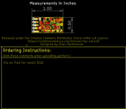
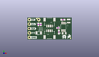
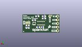
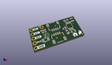

Contents
========

* [PROJ-SPAR-15219-STAN-01>SparkFun Pulse Oximeter Heart Rate Sensor](#proj-spar-15219-stan-01sparkfun-pulse-oximeter-heart-rate-sensor)
	* [Images](#images)
	* [Interactive BOM](#interactive-bom)
	* [OOMP Parts](#oomp-parts)
	* [Tags](#tags)
  
![][im]
# PROJ-SPAR-15219-STAN-01>SparkFun Pulse Oximeter Heart Rate Sensor

- ID: PROJ-SPAR-15219-STAN-01
- Hex ID: PRS15219
- Name: SparkFun Pulse Oximeter Heart Rate Sensor
- Description: 

## Images
  
  

|eagleImage|kicadPcb3dFront|kicadPcb3dBack|kicadPcb3d|
| :---: | :---: | :---: | :---: |
|||||

## Interactive BOM

- Interactive BOM page: [ibom.html](kicad/bom/ibom.html)

## OOMP Parts
  

|OOMP Parts|
| :---: |
|CAPC-0603-X-UNMATCHED-01, C1, 14.622781269999999, 3.761740508, M180,C1, 10uF, 0603, SparkFun-Capacitors, (0.57570005, 0.14810002), MR180|
|CAPC-0402-X-NF100-V50, C2, 11.684, 3.8099999999999996, M0,C2, 0.1uF, 0402, SparkFun-Capacitors, (0.46, 0.15), MR0|
|CAPC-0603-X-UNMATCHED-01, C3, 20.32, 11.43, 180,C3, 10uF, 0603, SparkFun-Capacitors, (0.8, 0.45), R180|
|CAPE-0805-X-UNMATCHED-01, C4, 21.081999999999997, 3.556, 0,C4, 22uF, 0805, SparkFun-Capacitors, (0.83, 0.14), R0|
|CAPC-0603-X-UNMATCHED-01, C5, 17.525999999999996, 8.636000000000001, M0,C5, 1.0uF, 0603, SparkFun-Capacitors, (0.69, 0.34), MR0|
|CAPC-0402-X-UNMATCHED-01, C6, 6.380478222, 8.742681269999999, 90,C6, 1.0uF, 0402, SparkFun-Capacitors, (0.25119993, 0.34420005), R90|
|CAPC-0402-X-UNMATCHED-01, C7, 7.746999999999999, 8.737599999999999, 90,C7, 1.0uF, 0402, SparkFun-Capacitors, (0.305, 0.344), R90|
|UNMATCHED-UNMATCHED-X-UNMATCHED-01, J1, 12.7, 7.7978, 180,J1, JST04_1MM_RA, SparkFun-Connectors, (0.5, 0.307), R180|
|UNMATCHED-UNMATCHED-X-UNMATCHED-01, J2, 12.7, 5.08, 0,J2, JST04_1MM_RA, SparkFun-Connectors, (0.5, 0.2), R0|
|UNMATCHED-UNMATCHED-X-UNMATCHED-01, J3, 1.27, 1.27, 90,J3, 1X05_NO_SILK, SparkFun-Connectors, (0.05, 0.05), R90|
|UNMATCHED-UNMATCHED-X-UNMATCHED-01, J4, 6.604, 11.43, 0,J4, 1X01_NO_SILK, SparkFun-Connectors, (0.26, 0.45), R0|
|UNMATCHED-UNMATCHED-X-UNMATCHED-01, JP1, 21.843999999999998, 6.858, M0,JP1, JUMPER-SMT_3_2-NC_TRACE_SILK, SMT-JUMPER_3_2-NC_TRACE_SILK, SparkFun-Jumpers, (0.86, 0.27), MR0|
|UNMATCHED-UNMATCHED-X-UNMATCHED-01, L1, 23.622, 10.668, 270,L1, 2.2?H, 0806, SparkFun-Coils, (0.93, 0.42), R270|
|RESE-0603-X-UNMATCHED-01, R1, 10.668, 9.906, M0,R1, 4.7k, 0603, SparkFun-Resistors, (0.42, 0.39), MR0|
|RESE-0603-X-UNMATCHED-01, R2, 10.668, 11.43, M0,R2, 4.7k, 0603, SparkFun-Resistors, (0.42, 0.45), MR0|
|RESE-0603-X-O754-01, R3, 18.034, 4.3180000000000005, 270,R3, 750K, 0603, SparkFun-Resistors, (0.71, 0.17), R270|
|<table><tr><td></td><td> R4</td><td>[RESE-0402-X-O104-01 SMD (0402) 100k Ohm Resistor](https://github.com/oomlout/oomlout_OOMP_parts/tree/main/RESE-0402-X-O104-01/)</td><td>[R42104](https://github.com/oomlout/oomlout_OOMP_parts/tree/main/RESE-0402-X-O104-01/)</td></tr></table>|
|RESE-0603-X-UNMATCHED-01, R5, 15.239999999999998, 11.43, M0,R5, 4.7k, 0603, SparkFun-Resistors, (0.6, 0.45), MR0|
|RESE-0603-X-UNMATCHED-01, R6, 21.0566, 4.064, M90,R6, 4.7k, 0603, SparkFun-Resistors, (0.829, 0.16), MR90|
|RESE-0603-X-UNMATCHED-01, R7, 22.682199999999998, 4.064, M90,R7, 4.7k, 0603, SparkFun-Resistors, (0.893, 0.16), MR90|
|UNMATCHED-UNMATCHED-X-UNMATCHED-01, U$2, 20.574, 7.365999999999999, 180,U$2, PAM2401, MSOP8, SparkFun-IC-Power, (0.81, 0.29), R180|
|UNMATCHED-UNMATCHED-X-UNMATCHED-01, U1, 12.7, 6.604, M270,U1, MAX30101EFD, 14_PIN_OESIP, SparkFun-IC-Special-Function, (0.5, 0.26), MR270|
|UNMATCHED-UNMATCHED-X-UNMATCHED-01, U2, 7.874, 6.095999999999999, 90,U2, MAX32664GWEA, 16_PIN_WLP, SparkFun-IC-Special-Function, (0.31, 0.24), R90|
|UNMATCHED-UNMATCHED-X-UNMATCHED-01, U3, 17.424400000000002, 6.35, M0,U3, 1.8V/100mA, SC70, SparkFun-IC-Power, (0.686, 0.25), MR0|
|UNMATCHED-UNMATCHED-X-UNMATCHED-01, Y1, 6.5786, 3.8099999999999996, 180,Y1, 32.768kHz, CRYSTAL-SMD-3.2X1.5MM, SparkFun-Clocks, (0.259, 0.15), R180|

## Tags

- hexID: PRS15219
- oompType: PROJ
- oompSize: SPAR
- oompColor: 15219
- oompDesc: STAN
- oompIndex: 01
- oompName: SparkFun Pulse Oximeter Heart Rate Sensor
- sources: All source files from https://github.com/sparkfun/SparkFun_Pulse_Oximeter_Heart_Rate_Sensor (source licence details in srcLicense.md)
- linkBuyPage: https://www.sparkfun.com/products/15219
- oompPart: CAPC-0603-X-UNMATCHED-01, C1, 14.622781269999999, 3.761740508, M180
- oompPart: CAPC-0402-X-NF100-V50, C2, 11.684, 3.8099999999999996, M0
- oompPart: CAPC-0603-X-UNMATCHED-01, C3, 20.32, 11.43, 180
- oompPart: CAPE-0805-X-UNMATCHED-01, C4, 21.081999999999997, 3.556, 0
- oompPart: CAPC-0603-X-UNMATCHED-01, C5, 17.525999999999996, 8.636000000000001, M0
- oompPart: CAPC-0402-X-UNMATCHED-01, C6, 6.380478222, 8.742681269999999, 90
- oompPart: CAPC-0402-X-UNMATCHED-01, C7, 7.746999999999999, 8.737599999999999, 90
- oompPart: SKIP-UNMATCHED-X-UNMATCHED-01, FD1, 5.262878221999999, 12.082778222, M0
- oompPart: SKIP-UNMATCHED-X-UNMATCHED-01, FD2, 5.265421777999999, 12.082778222, 0
- oompPart: SKIP-UNMATCHED-X-UNMATCHED-01, FD3, 24.637999999999998, 0.7619999999999999, M0
- oompPart: SKIP-UNMATCHED-X-UNMATCHED-01, FD4, 24.637999999999998, 0.7619999999999999, 0
- oompPart: UNMATCHED-UNMATCHED-X-UNMATCHED-01, J1, 12.7, 7.7978, 180
- oompPart: UNMATCHED-UNMATCHED-X-UNMATCHED-01, J2, 12.7, 5.08, 0
- oompPart: UNMATCHED-UNMATCHED-X-UNMATCHED-01, J3, 1.27, 1.27, 90
- oompPart: UNMATCHED-UNMATCHED-X-UNMATCHED-01, J4, 6.604, 11.43, 0
- oompPart: UNMATCHED-UNMATCHED-X-UNMATCHED-01, JP1, 21.843999999999998, 6.858, M0
- oompPart: UNMATCHED-UNMATCHED-X-UNMATCHED-01, L1, 23.622, 10.668, 270
- oompPart: RESE-0603-X-UNMATCHED-01, R1, 10.668, 9.906, M0
- oompPart: RESE-0603-X-UNMATCHED-01, R2, 10.668, 11.43, M0
- oompPart: RESE-0603-X-O754-01, R3, 18.034, 4.3180000000000005, 270
- oompPart: RESE-0402-X-O104-01, R4, 17.531081269999998, 6.690359491999999, 0
- oompPart: RESE-0603-X-UNMATCHED-01, R5, 15.239999999999998, 11.43, M0
- oompPart: RESE-0603-X-UNMATCHED-01, R6, 21.0566, 4.064, M90
- oompPart: RESE-0603-X-UNMATCHED-01, R7, 22.682199999999998, 4.064, M90
- oompPart: UNMATCHED-UNMATCHED-X-UNMATCHED-01, U$2, 20.574, 7.365999999999999, 180
- oompPart: UNMATCHED-UNMATCHED-X-UNMATCHED-01, U1, 12.7, 6.604, M270
- oompPart: UNMATCHED-UNMATCHED-X-UNMATCHED-01, U2, 7.874, 6.095999999999999, 90
- oompPart: UNMATCHED-UNMATCHED-X-UNMATCHED-01, U3, 17.424400000000002, 6.35, M0
- oompPart: UNMATCHED-UNMATCHED-X-UNMATCHED-01, Y1, 6.5786, 3.8099999999999996, 180
- rawPart: C1, 10uF, 0603, SparkFun-Capacitors, (0.57570005, 0.14810002), MR180
- rawPart: C2, 0.1uF, 0402, SparkFun-Capacitors, (0.46, 0.15), MR0
- rawPart: C3, 10uF, 0603, SparkFun-Capacitors, (0.8, 0.45), R180
- rawPart: C4, 22uF, 0805, SparkFun-Capacitors, (0.83, 0.14), R0
- rawPart: C5, 1.0uF, 0603, SparkFun-Capacitors, (0.69, 0.34), MR0
- rawPart: C6, 1.0uF, 0402, SparkFun-Capacitors, (0.25119993, 0.34420005), R90
- rawPart: C7, 1.0uF, 0402, SparkFun-Capacitors, (0.305, 0.344), R90
- rawPart: FD1, FIDUCIALUFIDUCIAL, FIDUCIAL-MICRO, SparkFun-Aesthetics, (0.20719993, 0.47569993), MR0
- rawPart: FD2, FIDUCIALUFIDUCIAL, FIDUCIAL-MICRO, SparkFun-Aesthetics, (0.20730007, 0.47569993), R0
- rawPart: FD3, FIDUCIALUFIDUCIAL, FIDUCIAL-MICRO, SparkFun-Aesthetics, (0.97, 0.03), MR0
- rawPart: FD4, FIDUCIALUFIDUCIAL, FIDUCIAL-MICRO, SparkFun-Aesthetics, (0.97, 0.03), R0
- rawPart: J1, JST04_1MM_RA, SparkFun-Connectors, (0.5, 0.307), R180
- rawPart: J2, JST04_1MM_RA, SparkFun-Connectors, (0.5, 0.2), R0
- rawPart: J3, 1X05_NO_SILK, SparkFun-Connectors, (0.05, 0.05), R90
- rawPart: J4, 1X01_NO_SILK, SparkFun-Connectors, (0.26, 0.45), R0
- rawPart: JP1, JUMPER-SMT_3_2-NC_TRACE_SILK, SMT-JUMPER_3_2-NC_TRACE_SILK, SparkFun-Jumpers, (0.86, 0.27), MR0
- rawPart: L1, 2.2?H, 0806, SparkFun-Coils, (0.93, 0.42), R270
- rawPart: R1, 4.7k, 0603, SparkFun-Resistors, (0.42, 0.39), MR0
- rawPart: R2, 4.7k, 0603, SparkFun-Resistors, (0.42, 0.45), MR0
- rawPart: R3, 750K, 0603, SparkFun-Resistors, (0.71, 0.17), R270
- rawPart: R4, 100K, 0402, SparkFun-Resistors, (0.69020005, 0.26339998), R0
- rawPart: R5, 4.7k, 0603, SparkFun-Resistors, (0.6, 0.45), MR0
- rawPart: R6, 4.7k, 0603, SparkFun-Resistors, (0.829, 0.16), MR90
- rawPart: R7, 4.7k, 0603, SparkFun-Resistors, (0.893, 0.16), MR90
- rawPart: U$2, PAM2401, MSOP8, SparkFun-IC-Power, (0.81, 0.29), R180
- rawPart: U1, MAX30101EFD, 14_PIN_OESIP, SparkFun-IC-Special-Function, (0.5, 0.26), MR270
- rawPart: U2, MAX32664GWEA, 16_PIN_WLP, SparkFun-IC-Special-Function, (0.31, 0.24), R90
- rawPart: U3, 1.8V/100mA, SC70, SparkFun-IC-Power, (0.686, 0.25), MR0
- rawPart: Y1, 32.768kHz, CRYSTAL-SMD-3.2X1.5MM, SparkFun-Clocks, (0.259, 0.15), R180
- oompID: PROJ-SPAR-15219-STAN-01

[im]: kicadPcb3d_450.png
