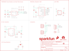

Contents
========

* [PRS15219 > SparkFun Pulse Oximeter Heart Rate Sensor](#prs15219--sparkfun-pulse-oximeter-heart-rate-sensor)
	* [Schematic](#schematic)
	* [PCB](#pcb)
	* [Interactive BOM](#interactive-bom)
	* [Images](#images)
	* [Tags](#tags)
  
![][im]
# PRS15219 > SparkFun Pulse Oximeter Heart Rate Sensor

- ID: PROJ-SPAR-15219-STAN-01
- Hex ID: PRS15219
- Name: Sparkfun
- Description: Sparkfun
- Long Link: [http://oom.lt/PROJ-SPAR-15219-STAN-01](http://oom.lt/PROJ-SPAR-15219-STAN-01)
- Short Link: [http://oom.lt/PRS15219](http://oom.lt/PRS15219)

## Schematic
  

## PCB
  

## Interactive BOM

- Interactive BOM page: [ibom.html](https://htmlpreview.github.io/?https://github.com/oomlout/oomlout_OOMP_projects/blob/main/PROJ-SPAR-15219-STAN-01/kicad/bom/ibom.html)

## Images
  
  

|bominteractivefront|bominteractiveback|kicadPcb3d|kicadPcb3dFront|kicadPcb3dBack|eagleImage|eagleSchemImage|pcbdraw|pcbdrawback|
| :---: | :---: | :---: | :---: | :---: | :---: | :---: | :---: | :---: |
||||||||||

## Tags

- hexID: PRS15219
- oompType: PROJ
- oompSize: SPAR
- oompColor: 15219
- oompDesc: STAN
- oompIndex: 01
- oompName: SparkFun Pulse Oximeter Heart Rate Sensor
- sources: All source files from https://github.com/sparkfun/SparkFun_Pulse_Oximeter_Heart_Rate_Sensor (source licence details in srcLicense.md)
- linkBuyPage: https://www.sparkfun.com/products/15219
- oompID: PROJ-SPAR-15219-STAN-01
- rawParts: C1,10uF,10UF-0603-6.3V-20%,0603,10.0µF ceramic capacitors,,CAP-11015,,10uF,
- rawParts: C2,0.1uF,0.1UF-0402-16V-10%,0402,0.1µF ceramic capacitors,,CAP-12416,,0.1uF,
- rawParts: C3,10uF,10UF-0603-6.3V-20%,0603,10.0µF ceramic capacitors,,CAP-11015,,10uF,
- rawParts: C4,22uF,22UF-0805-6.3V-20%,0805,22µF ceramic capacitors,,CAP-08402,,22uF,
- rawParts: C5,1.0uF,1.0UF-0603-16V-10%,0603,1µF ceramic capacitors,,CAP-00868,,1.0uF,
- rawParts: C6,1.0uF,1.0UF-0402-16V-10%,0402,1µF ceramic capacitors,,CAP-12417,,1.0uF,
- rawParts: C7,1.0uF,1.0UF-0402-16V-10%,0402,1µF ceramic capacitors,,CAP-12417,,1.0uF,
- rawParts: FD1,FIDUCIALUFIDUCIAL,FIDUCIALUFIDUCIAL,FIDUCIAL-MICRO,Fiducial Alignment Points,,,,,
- rawParts: FD2,FIDUCIALUFIDUCIAL,FIDUCIALUFIDUCIAL,FIDUCIAL-MICRO,Fiducial Alignment Points,,,,,
- rawParts: FD3,FIDUCIALUFIDUCIAL,FIDUCIALUFIDUCIAL,FIDUCIAL-MICRO,Fiducial Alignment Points,,,,,
- rawParts: FD4,FIDUCIALUFIDUCIAL,FIDUCIALUFIDUCIAL,FIDUCIAL-MICRO,Fiducial Alignment Points,,,,,
- rawParts: FRAME1,FRAME-LETTER,FRAME-LETTER,CREATIVE_COMMONS,Schematic Frame - Letter,,,,,
- rawParts: J1,,QWIIC_CONNECTORJS-1MM,JST04_1MM_RA,SparkFun I2C Standard Qwiic Connector,,CONN-13694,,,
- rawParts: J2,,QWIIC_CONNECTORJS-1MM,JST04_1MM_RA,SparkFun I2C Standard Qwiic Connector,,CONN-13694,,,
- rawParts: J3,,CONN_05NO_SILK,1X05_NO_SILK,Multi connection point. Often used as Generic Header-pin footprint for 0.1 inch spaced/style header connections,,,,,
- rawParts: J4,,CONN_01PTH_NO_SILK_YES_STOP,1X01_NO_SILK,Single connection point. Often used as Generic Header-pin footprint for 0.1 inch spaced/style header connections,,,,,
- rawParts: JP1,JUMPER-SMT_3_2-NC_TRACE_SILK,JUMPER-SMT_3_2-NC_TRACE_SILK,SMT-JUMPER_3_2-NC_TRACE_SILK,Normally closed trace jumper (2 of 2 connections),,,,,
- rawParts: L1,2.2μH,2.2μH_SHIELDED_INDUCTOR,0806,Murata 2.2uH Inductor,,NDUC-14257,,,
- rawParts: LOGO1,SFE_LOGO_FLAME.1_INCH,SFE_LOGO_FLAME.1_INCH,SFE_LOGO_FLAME_.1,SparkFun Flame Logo,,,,,
- rawParts: LOGO2,OSHW-LOGOMINI,OSHW-LOGOMINI,OSHW-LOGO-MINI,Open-Source Hardware (OSHW) Logo,,,,,
- rawParts: LOGO3,SFE_LOGO_NAME.1_INCH,SFE_LOGO_NAME.1_INCH,SFE_LOGO_NAME_.1,SparkFun Font Logo,,,,,
- rawParts: LOGO4,SPECIAL_INSTRUCTIONS-ORDERING,SPECIAL_INSTRUCTIONS-ORDERING,ORDERING_INSTRUCTIONS,Special Ordering/Production Instructions Alert,,,,,
- rawParts: R1,4.7k,4.7KOHM-0603-1/10W-1%,0603,4.7kΩ resistor,,RES-07857,,4.7k,
- rawParts: R2,4.7k,4.7KOHM-0603-1/10W-1%,0603,4.7kΩ resistor,,RES-07857,,4.7k,
- rawParts: R3,750K,750KOHM-0603-1/10W-1%,0603,750Ω resistor,,RES-13768,,750K,
- rawParts: R4,100K,100KOHM-0402-1/16W-1%,0402,100kΩ resistor,,RES-13495,,100K,
- rawParts: R5,4.7k,4.7KOHM-0603-1/10W-1%,0603,4.7kΩ resistor,,RES-07857,,4.7k,
- rawParts: R6,4.7k,4.7KOHM-0603-1/10W-1%,0603,4.7kΩ resistor,,RES-07857,,4.7k,
- rawParts: R7,4.7k,4.7KOHM-0603-1/10W-1%,0603,4.7kΩ resistor,,RES-07857,,4.7k,
- rawParts: U$2,PAM2401,PAM2401,MSOP8,PAM2401 - Boost PMIC,,IC-13769,,PAM2401,
- rawParts: U1,MAX30101EFD,MAX30101EFD,14_PIN_OESIP,MAX30101 High-Sensitivity Pulse Oximeter and,,IC-14270,,,
- rawParts: U2,MAX32664GWEA,MAX32664GWEA,16_PIN_WLP,Maxim MAX32664 Biometric Sensor Hub,,IC-14271,,,
- rawParts: U3,1.8V/100mA,V_REG_SP6214-1.8V,SC70,Voltage Regulator - SP6214,,VREG-08428,,1.8V/100mA,
- rawParts: Y1,32.768kHz,CRYSTAL-32.768KHZSMD-3.2X1.5,CRYSTAL-SMD-3.2X1.5MM,32.768kHz Crystal,,XTAL-13062,,32.768kHz,

[im]: kicadPcb3d_450.png
