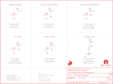

Contents
========

* [PRS15247 > GNSS Chip Antenna Evaluation Board](#prs15247--gnss-chip-antenna-evaluation-board)
	* [Schematic](#schematic)
	* [PCB](#pcb)
	* [Interactive BOM](#interactive-bom)
	* [OOMP Parts](#oomp-parts)
	* [Images](#images)
	* [Tags](#tags)
  
![][im]
# PRS15247 > GNSS Chip Antenna Evaluation Board

- ID: PROJ-SPAR-15247-STAN-01
- Hex ID: PRS15247
- Name: Sparkfun
- Description: Sparkfun
- Long Link: [http://oom.lt/PROJ-SPAR-15247-STAN-01](http://oom.lt/PROJ-SPAR-15247-STAN-01)
- Short Link: [http://oom.lt/PRS15247](http://oom.lt/PRS15247)

## Schematic
  

## PCB
  

## Interactive BOM

- Interactive BOM page: [ibom.html](https://htmlpreview.github.io/?https://github.com/oomlout/oomlout_OOMP_projects/blob/main/PROJ-SPAR-15247-STAN-01/kicad/bom/ibom.html)

## OOMP Parts
  

|OOMP ID|Name|Identifier|
| :---: | :---: | :---: |
|UNMATCHED-UNMATCHED-X-UNMATCHED-01||J1, J2, J3, J4, J5, J6, Y2, Y3, Y4, Y5, Y6, Y7|
|RESE-0402-X-UNMATCHED-01||R1|

## Images
  
  

|bominteractivefront|bominteractiveback|kicadPcb3d|kicadPcb3dFront|kicadPcb3dBack|eagleImage|eagleSchemImage|pcbdraw|pcbdrawback|
| :---: | :---: | :---: | :---: | :---: | :---: | :---: | :---: | :---: |
||||||||||

## Tags

- hexID: PRS15247
- oompType: PROJ
- oompSize: SPAR
- oompColor: 15247
- oompDesc: STAN
- oompIndex: 01
- oompName: GNSS Chip Antenna Evaluation Board
- sources: All source files from https://github.com/sparkfun/GNSS_Chip_Antenna_Evaluation_Board (source licence details in srcLicense.md)
- linkBuyPage: https://www.sparkfun.com/products/15247
- oompID: PROJ-SPAR-15247-STAN-01
- oompParts: J1,UNMATCHED-UNMATCHED-X-UNMATCHED-01
- oompParts: J2,UNMATCHED-UNMATCHED-X-UNMATCHED-01
- oompParts: J3,UNMATCHED-UNMATCHED-X-UNMATCHED-01
- oompParts: J4,UNMATCHED-UNMATCHED-X-UNMATCHED-01
- oompParts: J5,UNMATCHED-UNMATCHED-X-UNMATCHED-01
- oompParts: J6,UNMATCHED-UNMATCHED-X-UNMATCHED-01
- oompParts: R1,RESE-0402-X-UNMATCHED-01
- oompParts: Y2,UNMATCHED-UNMATCHED-X-UNMATCHED-01
- oompParts: Y3,UNMATCHED-UNMATCHED-X-UNMATCHED-01
- oompParts: Y4,UNMATCHED-UNMATCHED-X-UNMATCHED-01
- oompParts: Y5,UNMATCHED-UNMATCHED-X-UNMATCHED-01
- oompParts: Y6,UNMATCHED-UNMATCHED-X-UNMATCHED-01
- oompParts: Y7,UNMATCHED-UNMATCHED-X-UNMATCHED-01
- rawParts: FRAME1,FRAME-LETTER,FRAME-LETTER,CREATIVE_COMMONS,Schematic Frame - Letter,,,,,,
- rawParts: J1,U.FL,U.FL2PIN,U.FL,SMD Antenna Connector - U.FL,,CONN-09193,,WRL-09144,U.FL,
- rawParts: J2,U.FL,U.FL2PIN,U.FL,SMD Antenna Connector - U.FL,,CONN-09193,,WRL-09144,U.FL,
- rawParts: J3,U.FL,U.FL2PIN,U.FL,SMD Antenna Connector - U.FL,,CONN-09193,,WRL-09144,U.FL,
- rawParts: J4,U.FL,U.FL2PIN,U.FL,SMD Antenna Connector - U.FL,,CONN-09193,,WRL-09144,U.FL,
- rawParts: J5,U.FL,U.FL2PIN,U.FL,SMD Antenna Connector - U.FL,,CONN-09193,,WRL-09144,U.FL,
- rawParts: J6,U.FL,U.FL2PIN,U.FL,SMD Antenna Connector - U.FL,,CONN-09193,,WRL-09144,U.FL,
- rawParts: JP5,STAND-OFF,STAND-OFF,STAND-OFF,Stand Off,,,,,,
- rawParts: JP6,STAND-OFF,STAND-OFF,STAND-OFF,Stand Off,,,,,,
- rawParts: JP8,FIDUCIAL1X2,FIDUCIAL1X2,FIDUCIAL-1X2,Fiducial Alignment Points,,,,,,
- rawParts: JP9,FIDUCIAL1X2,FIDUCIAL1X2,FIDUCIAL-1X2,Fiducial Alignment Points,,,,,,
- rawParts: LOGO1,SFE_LOGO_FLAME.1EXP,SFE_LOGO_FLAME.1EXP,SFE_LOGO_FLAME_COPPER_EXPOSED_.1,SparkFun Flame Logo,,,,,,
- rawParts: LOGO2,SFE_LOGO_FLAME.1EXP,SFE_LOGO_FLAME.1EXP,SFE_LOGO_FLAME_COPPER_EXPOSED_.1,SparkFun Flame Logo,,,,,,
- rawParts: LOGO3,SFE_LOGO_FLAME.1EXP,SFE_LOGO_FLAME.1EXP,SFE_LOGO_FLAME_COPPER_EXPOSED_.1,SparkFun Flame Logo,,,,,,
- rawParts: LOGO4,SFE_LOGO_FLAME.1EXP,SFE_LOGO_FLAME.1EXP,SFE_LOGO_FLAME_COPPER_EXPOSED_.1,SparkFun Flame Logo,,,,,,
- rawParts: LOGO5,SFE_LOGO_FLAME.1EXP,SFE_LOGO_FLAME.1EXP,SFE_LOGO_FLAME_COPPER_EXPOSED_.1,SparkFun Flame Logo,,,,,,
- rawParts: LOGO6,SFE_LOGO_FLAME.1EXP,SFE_LOGO_FLAME.1EXP,SFE_LOGO_FLAME_COPPER_EXPOSED_.1,SparkFun Flame Logo,,,,,,
- rawParts: R1,0,0OHM-0402-1/10W,0402,0Ω resistor,,RES-14244,,,0,
- rawParts: U$16,OSHW-LOGOS,OSHW-LOGOS,OSHW-LOGO-S,Open-Source Hardware (OSHW) Logo,,,,,,
- rawParts: Y2,PUCK,GPS_CHIP_ANTENNAPUCK,TE_PUCK,,,ANT-14308,,,,
- rawParts: Y3,CUBE,GPS_CHIP_ANTENNACUBE,MOLEX_GNSS_CUBE,,,ANT-14307,,,,
- rawParts: Y4,CHIP,GPS_CHIP_ANTENNA2042830001,MOLEX_GNSS_CHIP,,,ANT-14306,,,,
- rawParts: Y5,MOLDED,GPS_CHIP_ANTENNA_NOGNDMOLDED,MLOEX_GNSS_MOLDED,,,ANT-14303,,,,
- rawParts: Y6,W3062A,GPS_CHIP_ANTENNAW3062A,W3062A,,,ANT-14305,,,,
- rawParts: Y7,W3011,GPS_CHIP_ANTENNAW3011,W3011,,,ANT-14304,,,,

[im]: kicadPcb3d_450.png
