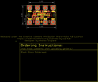
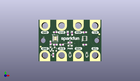
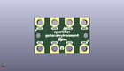
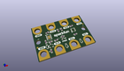

Contents
========

* [PROJ-SPAR-15269-STAN-01>gator environment](#proj-spar-15269-stan-01gator-environment)
	* [Images](#images)
	* [Interactive BOM](#interactive-bom)
	* [OOMP Parts](#oomp-parts)
	* [Tags](#tags)
  
![][im]
# PROJ-SPAR-15269-STAN-01>gator environment

- ID: PROJ-SPAR-15269-STAN-01
- Hex ID: PRS15269
- Name: gator environment
- Description: 

## Images
  
  

|eagleImage|kicadPcb3dFront|kicadPcb3dBack|kicadPcb3d|
| :---: | :---: | :---: | :---: |
|||||

## Interactive BOM

- Interactive BOM page: [ibom.html](kicad/bom/ibom.html)

## OOMP Parts
  

|OOMP Parts|
| :---: |
|<table><tr><td></td><td> C1</td><td>[CAPC-0603-X-NF100-V50 SMD (0603) 100 nF Capacitor (Ceramic) 50v](https://github.com/oomlout/oomlout_OOMP_parts/tree/main/CAPC-0603-X-NF100-V50/)</td><td>[C6N100](https://github.com/oomlout/oomlout_OOMP_parts/tree/main/CAPC-0603-X-NF100-V50/)</td></tr></table>|
|CAPC-0603-X-UNMATCHED-01, C2, 10.16, 10.16, 180,C2, 1.0uF, 0603, SparkFun-Capacitors, (0.4, 0.4), R180|
|UNMATCHED-UNMATCHED-X-UNMATCHED-01, D1, 29.209999999999997, 3.8099999999999996, 270,D1, 3.6V, SOD-323, SparkFun-DiscreteSemi, (1.15, 0.15), R270|
|UNMATCHED-UNMATCHED-X-UNMATCHED-01, D2, 19.049999999999997, 3.8099999999999996, 270,D2, 3.6V, SOD-323, SparkFun-DiscreteSemi, (0.75, 0.15), R270|
|UNMATCHED-UNMATCHED-X-UNMATCHED-01, D3, 7.238999999999999, 7.365999999999999, 270,D3, 3.6V, SOD-323, SparkFun-DiscreteSemi, (0.285, 0.29), R270|
|UNMATCHED-0603-X-UNMATCHED-01, D4, 19.049999999999997, 9.524999999999999, 0,D4, RED, LED-0603, SparkFun-LED, (0.75, 0.375), R0|
|UNMATCHED-UNMATCHED-X-UNMATCHED-01, Q1, 9.779, 7.365999999999999, 0,Q1, 2.5A/30V/105m?, SOT23-3, SparkFun-DiscreteSemi, (0.385, 0.29), R0|
|RESE-0603-X-UNMATCHED-01, R1, 19.049999999999997, 11.43, 0,R1, 1k, 0603, SparkFun-Resistors, (0.75, 0.45), R0|
|RESE-0603-X-UNMATCHED-01, R2, 7.238999999999999, 11.176, 270,R2, 4.7k, 0603, SparkFun-Resistors, (0.285, 0.44), R270|
|<table><tr><td></td><td> R3</td><td>[RESE-0603-X-O104-01 SMD (0603) 100k Ohm Resistor](https://github.com/oomlout/oomlout_OOMP_parts/tree/main/RESE-0603-X-O104-01/)</td><td>[R6104](https://github.com/oomlout/oomlout_OOMP_parts/tree/main/RESE-0603-X-O104-01/)</td></tr></table>|
|<table><tr><td></td><td> R4</td><td>[RESE-0603-X-O104-01 SMD (0603) 100k Ohm Resistor](https://github.com/oomlout/oomlout_OOMP_parts/tree/main/RESE-0603-X-O104-01/)</td><td>[R6104](https://github.com/oomlout/oomlout_OOMP_parts/tree/main/RESE-0603-X-O104-01/)</td></tr></table>|
|<table><tr><td></td><td> R5</td><td>[RESE-0603-X-O103-01 SMD (0603) 10k Ohm Resistor](https://github.com/oomlout/oomlout_OOMP_parts/tree/main/RESE-0603-X-O103-01/)</td><td>[R6103](https://github.com/oomlout/oomlout_OOMP_parts/tree/main/RESE-0603-X-O103-01/)</td></tr></table>|
|<table><tr><td></td><td> R6</td><td>[RESE-0603-X-O104-01 SMD (0603) 100k Ohm Resistor](https://github.com/oomlout/oomlout_OOMP_parts/tree/main/RESE-0603-X-O104-01/)</td><td>[R6104](https://github.com/oomlout/oomlout_OOMP_parts/tree/main/RESE-0603-X-O104-01/)</td></tr></table>|
|<table><tr><td></td><td> R13</td><td>[RESE-0603-X-O103-01 SMD (0603) 10k Ohm Resistor](https://github.com/oomlout/oomlout_OOMP_parts/tree/main/RESE-0603-X-O103-01/)</td><td>[R6103](https://github.com/oomlout/oomlout_OOMP_parts/tree/main/RESE-0603-X-O103-01/)</td></tr></table>|
|<table><tr><td></td><td> R14</td><td>[RESE-0603-X-O103-01 SMD (0603) 10k Ohm Resistor](https://github.com/oomlout/oomlout_OOMP_parts/tree/main/RESE-0603-X-O103-01/)</td><td>[R6103](https://github.com/oomlout/oomlout_OOMP_parts/tree/main/RESE-0603-X-O103-01/)</td></tr></table>|
|UNMATCHED-UNMATCHED-X-UNMATCHED-01, U2, 10.16, 13.97, 0,U2, CCS811, LGA10, SparkFun-Sensors, (0.4, 0.55), R0|
|UNMATCHED-UNMATCHED-X-UNMATCHED-01, U3, 27.94, 13.97, 90,U3, BME280, LGA-8-2.5X2.5, SparkFun-Sensors, (1.1, 0.55), R90|

## Tags

- hexID: PRS15269
- oompType: PROJ
- oompSize: SPAR
- oompColor: 15269
- oompDesc: STAN
- oompIndex: 01
- oompName: gator environment
- sources: All source files from https://github.com/sparkfun/gator_environment (source licence details in srcLicense.md)
- linkBuyPage: https://www.sparkfun.com/products/15269
- oompID: PROJ-SPAR-15269-STAN-01
- oompPart: CAPC-0603-X-NF100-V50, C1, 27.94, 10.16, 180
- oompPart: CAPC-0603-X-UNMATCHED-01, C2, 10.16, 10.16, 180
- oompPart: UNMATCHED-UNMATCHED-X-UNMATCHED-01, D1, 29.209999999999997, 3.8099999999999996, 270
- oompPart: UNMATCHED-UNMATCHED-X-UNMATCHED-01, D2, 19.049999999999997, 3.8099999999999996, 270
- oompPart: UNMATCHED-UNMATCHED-X-UNMATCHED-01, D3, 7.238999999999999, 7.365999999999999, 270
- oompPart: UNMATCHED-0603-X-UNMATCHED-01, D4, 19.049999999999997, 9.524999999999999, 0
- oompPart: SKIP-UNMATCHED-X-UNMATCHED-01, FD1, 36.83, 16.509999999999998, 0
- oompPart: SKIP-UNMATCHED-X-UNMATCHED-01, FD2, 1.27, 8.889999999999999, 0
- oompPart: SKIP-UNMATCHED-X-UNMATCHED-01, FD3, 1.27, 8.889999999999999, M0
- oompPart: SKIP-UNMATCHED-X-UNMATCHED-01, FD4, 36.83, 16.509999999999998, M0
- oompPart: SKIP-UNMATCHED-X-UNMATCHED-01, J1, 34.29, 3.8099999999999996, 0
- oompPart: SKIP-UNMATCHED-X-UNMATCHED-01, J2, 24.13, 3.8099999999999996, 0
- oompPart: SKIP-UNMATCHED-X-UNMATCHED-01, J3, 13.97, 3.8099999999999996, 0
- oompPart: SKIP-UNMATCHED-X-UNMATCHED-01, J4, 3.8099999999999996, 3.8099999999999996, 0
- oompPart: SKIP-UNMATCHED-X-UNMATCHED-01, J5, 3.8099999999999996, 21.59, 180
- oompPart: SKIP-UNMATCHED-X-UNMATCHED-01, J6, 13.97, 21.59, 180
- oompPart: SKIP-UNMATCHED-X-UNMATCHED-01, J7, 24.13, 21.59, 180
- oompPart: SKIP-UNMATCHED-X-UNMATCHED-01, J8, 34.29, 21.59, 180
- oompPart: UNMATCHED-UNMATCHED-X-UNMATCHED-01, Q1, 9.779, 7.365999999999999, 0
- oompPart: RESE-0603-X-UNMATCHED-01, R1, 19.049999999999997, 11.43, 0
- oompPart: RESE-0603-X-UNMATCHED-01, R2, 7.238999999999999, 11.176, 270
- oompPart: RESE-0603-X-O104-01, R3, 27.94, 17.779999999999998, 180
- oompPart: RESE-0603-X-O104-01, R4, 13.97, 10.16, 180
- oompPart: RESE-0603-X-O103-01, R5, 8.889999999999999, 3.8099999999999996, 90
- oompPart: RESE-0603-X-O104-01, R6, 10.16, 17.779999999999998, 0
- oompPart: RESE-0603-X-O103-01, R13, 20.32, 17.145, 90
- oompPart: RESE-0603-X-O103-01, R14, 17.779999999999998, 17.145, 90
- oompPart: UNMATCHED-UNMATCHED-X-UNMATCHED-01, U2, 10.16, 13.97, 0
- oompPart: UNMATCHED-UNMATCHED-X-UNMATCHED-01, U3, 27.94, 13.97, 90
- rawPart: C1, 0.1uF, 0603, SparkFun-Capacitors, (1.1, 0.4), R180
- rawPart: C2, 1.0uF, 0603, SparkFun-Capacitors, (0.4, 0.4), R180
- rawPart: D1, 3.6V, SOD-323, SparkFun-DiscreteSemi, (1.15, 0.15), R270
- rawPart: D2, 3.6V, SOD-323, SparkFun-DiscreteSemi, (0.75, 0.15), R270
- rawPart: D3, 3.6V, SOD-323, SparkFun-DiscreteSemi, (0.285, 0.29), R270
- rawPart: D4, RED, LED-0603, SparkFun-LED, (0.75, 0.375), R0
- rawPart: FD1, FIDUCIAL1X2, FIDUCIAL-1X2, SparkFun-Aesthetics, (1.45, 0.65), R0
- rawPart: FD2, FIDUCIAL1X2, FIDUCIAL-1X2, SparkFun-Aesthetics, (0.05, 0.35), R0
- rawPart: FD3, FIDUCIAL1X2, FIDUCIAL-1X2, SparkFun-Aesthetics, (0.05, 0.35), MR0
- rawPart: FD4, FIDUCIAL1X2, FIDUCIAL-1X2, SparkFun-Aesthetics, (1.45, 0.65), MR0
- rawPart: J1, GATORGATOR_MINI, GATOR_MINI, SparkFun-Connectors, (1.35, 0.15), R0
- rawPart: J2, GATORGATOR_MINI, GATOR_MINI, SparkFun-Connectors, (0.95, 0.15), R0
- rawPart: J3, GATORGATOR_MINI, GATOR_MINI, SparkFun-Connectors, (0.55, 0.15), R0
- rawPart: J4, GATORGATOR_MINI, GATOR_MINI, SparkFun-Connectors, (0.15, 0.15), R0
- rawPart: J5, GATORGATOR_MINI, GATOR_MINI, SparkFun-Connectors, (0.15, 0.85), R180
- rawPart: J6, GATORGATOR_MINI, GATOR_MINI, SparkFun-Connectors, (0.55, 0.85), R180
- rawPart: J7, GATORGATOR_MINI, GATOR_MINI, SparkFun-Connectors, (0.95, 0.85), R180
- rawPart: J8, GATORGATOR_MINI, GATOR_MINI, SparkFun-Connectors, (1.35, 0.85), R180
- rawPart: Q1, 2.5A/30V/105m?, SOT23-3, SparkFun-DiscreteSemi, (0.385, 0.29), R0
- rawPart: R1, 1k, 0603, SparkFun-Resistors, (0.75, 0.45), R0
- rawPart: R2, 4.7k, 0603, SparkFun-Resistors, (0.285, 0.44), R270
- rawPart: R3, 100k, 0603, SparkFun-Resistors, (1.1, 0.7), R180
- rawPart: R4, 100k, 0603, SparkFun-Resistors, (0.55, 0.4), R180
- rawPart: R5, 10k, 0603, SparkFun-Resistors, (0.35, 0.15), R90
- rawPart: R6, 100k, 0603, SparkFun-Resistors, (0.4, 0.7), R0
- rawPart: R13, 10k, 0603, SparkFun-Resistors, (0.8, 0.675), R90
- rawPart: R14, 10k, 0603, SparkFun-Resistors, (0.7, 0.675), R90
- rawPart: U2, CCS811, LGA10, SparkFun-Sensors, (0.4, 0.55), R0
- rawPart: U3, BME280, LGA-8-2.5X2.5, SparkFun-Sensors, (1.1, 0.55), R90

[im]: kicadPcb3d_450.png
