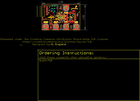
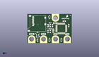
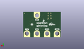
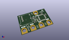

Contents
========

* [PROJ-SPAR-15270-STAN-01>gator log](#proj-spar-15270-stan-01gator-log)
	* [Images](#images)
	* [Interactive BOM](#interactive-bom)
	* [OOMP Parts](#oomp-parts)
	* [Tags](#tags)
  
![][im]
# PROJ-SPAR-15270-STAN-01>gator log

- ID: PROJ-SPAR-15270-STAN-01
- Hex ID: PRS15270
- Name: gator log
- Description: 

## Images
  
  

|eagleImage|kicadPcb3dFront|kicadPcb3dBack|kicadPcb3d|
| :---: | :---: | :---: | :---: |
|||||

## Interactive BOM

- Interactive BOM page: [ibom.html](kicad/bom/ibom.html)

## OOMP Parts
  

|OOMP Parts|
| :---: |
|<table><tr><td></td><td> C2</td><td>[CAPC-0603-X-NF100-V50 SMD (0603) 100 nF Capacitor (Ceramic) 50v](https://github.com/oomlout/oomlout_OOMP_parts/tree/main/CAPC-0603-X-NF100-V50/)</td><td>[C6N100](https://github.com/oomlout/oomlout_OOMP_parts/tree/main/CAPC-0603-X-NF100-V50/)</td></tr></table>|
|<table><tr><td></td><td> C3</td><td>[CAPC-0603-X-NF100-V50 SMD (0603) 100 nF Capacitor (Ceramic) 50v](https://github.com/oomlout/oomlout_OOMP_parts/tree/main/CAPC-0603-X-NF100-V50/)</td><td>[C6N100](https://github.com/oomlout/oomlout_OOMP_parts/tree/main/CAPC-0603-X-NF100-V50/)</td></tr></table>|
|UNMATCHED-0603-X-UNMATCHED-01, D1, 19.685, 15.239999999999998, 90,D1, BLUE, LED-0603, SparkFun-LED, (0.775, 0.6), R90|
|UNMATCHED-UNMATCHED-X-UNMATCHED-01, D2, 29.209999999999997, 2.54, 270,D2, 3.6V, SOD-323, SparkFun-DiscreteSemi, (1.15, 0.1), R270|
|UNMATCHED-0603-X-UNMATCHED-01, D3, 19.685, 10.16, 90,D3, GREEN, LED-0603, SparkFun-LED, (0.775, 0.4), R90|
|UNMATCHED-UNMATCHED-X-UNMATCHED-01, D4, 19.049999999999997, 2.54, 270,D4, 3.6V, SOD-323, SparkFun-DiscreteSemi, (0.75, 0.1), R270|
|UNMATCHED-UNMATCHED-X-UNMATCHED-01, D5, 8.889999999999999, 5.715, 180,D5, 3.6V, SOD-323, SparkFun-DiscreteSemi, (0.35, 0.225), R180|
|UNMATCHED-UNMATCHED-X-UNMATCHED-01, D6, 19.049999999999997, 22.86, 90,D6, 3.6V, SOD-323, SparkFun-DiscreteSemi, (0.75, 0.9), R90|
|UNMATCHED-UNMATCHED-X-UNMATCHED-01, Q1, 22.260559492, 10.83818127, 90,Q1, 16MHZ, RESONATOR-SMD, SparkFun-FreqCtrl, (0.87639998, 0.42670005), R90|
|UNMATCHED-UNMATCHED-X-UNMATCHED-01, Q3, 8.889999999999999, 8.254999999999999, 0,Q3, 2.5A/30V/105m?, SOT23-3, SparkFun-DiscreteSemi, (0.35, 0.325), R0|
|RESE-0603-X-UNMATCHED-01, R1, 17.779999999999998, 15.239999999999998, 270,R1, 1k, 0603, SparkFun-Resistors, (0.7, 0.6), R270|
|<table><tr><td></td><td> R2</td><td>[RESE-0603-X-O103-01 SMD (0603) 10k Ohm Resistor](https://github.com/oomlout/oomlout_OOMP_parts/tree/main/RESE-0603-X-O103-01/)</td><td>[R6103](https://github.com/oomlout/oomlout_OOMP_parts/tree/main/RESE-0603-X-O103-01/)</td></tr></table>|
|<table><tr><td></td><td> R3</td><td>[RESE-0603-X-O103-01 SMD (0603) 10k Ohm Resistor](https://github.com/oomlout/oomlout_OOMP_parts/tree/main/RESE-0603-X-O103-01/)</td><td>[R6103](https://github.com/oomlout/oomlout_OOMP_parts/tree/main/RESE-0603-X-O103-01/)</td></tr></table>|
|<table><tr><td></td><td> R6</td><td>[RESE-0603-X-O331-01 SMD (0603) 330 Ohm Resistor](https://github.com/oomlout/oomlout_OOMP_parts/tree/main/RESE-0603-X-O331-01/)</td><td>[R6331](https://github.com/oomlout/oomlout_OOMP_parts/tree/main/RESE-0603-X-O331-01/)</td></tr></table>|
|UNMATCHED-UNMATCHED-X-UNMATCHED-01, U1, 29.209999999999997, 12.7, 0,U1, ATMEGA328P_TQFP, TQFP32-08, SparkFun-DigitalIC, (1.15, 0.5), R0|
|ERROR, U3 microSD Socket, 0, 0, 0,U3, microSD, Socket, MICROSD_1:1, SparkFun-Connectors, (0.625, 0.4), R90|

## Tags

- hexID: PRS15270
- oompType: PROJ
- oompSize: SPAR
- oompColor: 15270
- oompDesc: STAN
- oompIndex: 01
- oompName: gator log
- sources: All source files from https://github.com/sparkfun/gator_log (source licence details in srcLicense.md)
- linkBuyPage: https://www.sparkfun.com/products/15270
- oompID: PROJ-SPAR-15270-STAN-01
- oompPart: CAPC-0603-X-NF100-V50, C2, 31.75, 19.049999999999997, 0
- oompPart: CAPC-0603-X-NF100-V50, C3, 21.59, 15.239999999999998, 270
- oompPart: UNMATCHED-0603-X-UNMATCHED-01, D1, 19.685, 15.239999999999998, 90
- oompPart: UNMATCHED-UNMATCHED-X-UNMATCHED-01, D2, 29.209999999999997, 2.54, 270
- oompPart: UNMATCHED-0603-X-UNMATCHED-01, D3, 19.685, 10.16, 90
- oompPart: UNMATCHED-UNMATCHED-X-UNMATCHED-01, D4, 19.049999999999997, 2.54, 270
- oompPart: UNMATCHED-UNMATCHED-X-UNMATCHED-01, D5, 8.889999999999999, 5.715, 180
- oompPart: UNMATCHED-UNMATCHED-X-UNMATCHED-01, D6, 19.049999999999997, 22.86, 90
- oompPart: SKIP-UNMATCHED-X-UNMATCHED-01, FID1, 0.635, 6.35, 180
- oompPart: SKIP-UNMATCHED-X-UNMATCHED-01, FID2, 36.83, 24.13, 0
- oompPart: SKIP-UNMATCHED-X-UNMATCHED-01, FID3, 0.635, 6.35, M270
- oompPart: SKIP-UNMATCHED-X-UNMATCHED-01, FID4, 36.83, 24.13, M180
- oompPart: SKIP-UNMATCHED-X-UNMATCHED-01, J2, 11.43, 21.59, M90
- oompPart: SKIP-UNMATCHED-X-UNMATCHED-01, J5, 24.13, 21.59, 180
- oompPart: SKIP-UNMATCHED-X-UNMATCHED-01, J6, 3.8099999999999996, 3.8099999999999996, 0
- oompPart: SKIP-UNMATCHED-X-UNMATCHED-01, J7, 13.97, 3.8099999999999996, 0
- oompPart: SKIP-UNMATCHED-X-UNMATCHED-01, J8, 24.13, 3.8099999999999996, 0
- oompPart: SKIP-UNMATCHED-X-UNMATCHED-01, J9, 34.29, 3.8099999999999996, 0
- oompPart: UNMATCHED-UNMATCHED-X-UNMATCHED-01, Q1, 22.260559492, 10.83818127, 90
- oompPart: UNMATCHED-UNMATCHED-X-UNMATCHED-01, Q3, 8.889999999999999, 8.254999999999999, 0
- oompPart: RESE-0603-X-UNMATCHED-01, R1, 17.779999999999998, 15.239999999999998, 270
- oompPart: RESE-0603-X-O103-01, R2, 35.559999999999995, 15.239999999999998, 270
- oompPart: RESE-0603-X-O103-01, R3, 8.889999999999999, 2.54, 90
- oompPart: RESE-0603-X-O331-01, R6, 17.779999999999998, 10.16, 270
- oompPart: UNMATCHED-UNMATCHED-X-UNMATCHED-01, U1, 29.209999999999997, 12.7, 0
- oompPart: ERROR, U3 microSD Socket, 0, 0, 0
- rawPart: C2, 0.1uF, 0603, SparkFun-Capacitors, (1.25, 0.75), R0
- rawPart: C3, 0.1uF, 0603, SparkFun-Capacitors, (0.85, 0.6), R270
- rawPart: D1, BLUE, LED-0603, SparkFun-LED, (0.775, 0.6), R90
- rawPart: D2, 3.6V, SOD-323, SparkFun-DiscreteSemi, (1.15, 0.1), R270
- rawPart: D3, GREEN, LED-0603, SparkFun-LED, (0.775, 0.4), R90
- rawPart: D4, 3.6V, SOD-323, SparkFun-DiscreteSemi, (0.75, 0.1), R270
- rawPart: D5, 3.6V, SOD-323, SparkFun-DiscreteSemi, (0.35, 0.225), R180
- rawPart: D6, 3.6V, SOD-323, SparkFun-DiscreteSemi, (0.75, 0.9), R90
- rawPart: FID1, FIDUCIALUFIDUCIAL, FIDUCIAL-MICRO, SparkFun-Aesthetics, (0.025, 0.25), R180
- rawPart: FID2, FIDUCIALUFIDUCIAL, FIDUCIAL-MICRO, SparkFun-Aesthetics, (1.45, 0.95), R0
- rawPart: FID3, FIDUCIALUFIDUCIAL, FIDUCIAL-MICRO, SparkFun-Aesthetics, (0.025, 0.25), MR270
- rawPart: FID4, FIDUCIALUFIDUCIAL, FIDUCIAL-MICRO, SparkFun-Aesthetics, (1.45, 0.95), MR180
- rawPart: J2, ISP, 2X3_TEST_POINTS, SparkFun-Connectors, (0.45, 0.85), MR90
- rawPart: J5, GATORGATOR_MINI, GATOR_MINI, SparkFun-Connectors, (0.95, 0.85), R180
- rawPart: J6, GATORGATOR_MINI, GATOR_MINI, SparkFun-Connectors, (0.15, 0.15), R0
- rawPart: J7, GATORGATOR_MINI, GATOR_MINI, SparkFun-Connectors, (0.55, 0.15), R0
- rawPart: J8, GATORGATOR_MINI, GATOR_MINI, SparkFun-Connectors, (0.95, 0.15), R0
- rawPart: J9, GATORGATOR_MINI, GATOR_MINI, SparkFun-Connectors, (1.35, 0.15), R0
- rawPart: Q1, 16MHZ, RESONATOR-SMD, SparkFun-FreqCtrl, (0.87639998, 0.42670005), R90
- rawPart: Q3, 2.5A/30V/105m?, SOT23-3, SparkFun-DiscreteSemi, (0.35, 0.325), R0
- rawPart: R1, 1k, 0603, SparkFun-Resistors, (0.7, 0.6), R270
- rawPart: R2, 10k, 0603, SparkFun-Resistors, (1.4, 0.6), R270
- rawPart: R3, 10k, 0603, SparkFun-Resistors, (0.35, 0.1), R90
- rawPart: R6, 330, 0603, SparkFun-Resistors, (0.7, 0.4), R270
- rawPart: U1, ATMEGA328P_TQFP, TQFP32-08, SparkFun-DigitalIC, (1.15, 0.5), R0
- rawPart: U3, microSD, Socket, MICROSD_1:1, SparkFun-Connectors, (0.625, 0.4), R90

[im]: kicadPcb3d_450.png
