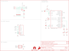

Contents
========

* [PRS15270 > gator log](#prs15270--gator-log)
	* [Schematic](#schematic)
	* [PCB](#pcb)
	* [Interactive BOM](#interactive-bom)
	* [OOMP Parts](#oomp-parts)
	* [Images](#images)
	* [Tags](#tags)
  
![][im]
# PRS15270 > gator log

- ID: PROJ-SPAR-15270-STAN-01
- Hex ID: PRS15270
- Name: Sparkfun
- Description: Sparkfun
- Long Link: [http://oom.lt/PROJ-SPAR-15270-STAN-01](http://oom.lt/PROJ-SPAR-15270-STAN-01)
- Short Link: [http://oom.lt/PRS15270](http://oom.lt/PRS15270)

## Schematic
  

## PCB
  

## Interactive BOM

- Interactive BOM page: [ibom.html](https://htmlpreview.github.io/?https://github.com/oomlout/oomlout_OOMP_projects/blob/main/PROJ-SPAR-15270-STAN-01/kicad/bom/ibom.html)

## OOMP Parts
  

|OOMP ID|Name|Identifier|
| :---: | :---: | :---: |
|[CAPC-0603-X-NF100-V50](https://github.com/oomlout/oomlout_OOMP_parts/tree/main/CAPC-0603-X-NF100-V50/)|[SMD (0603) 100 nF Capacitor (Ceramic) 50v](https://github.com/oomlout/oomlout_OOMP_parts/tree/main/CAPC-0603-X-NF100-V50/)|[C2, C3](https://github.com/oomlout/oomlout_OOMP_parts/tree/main/CAPC-0603-X-NF100-V50/)|
|[LEDS-0603-L-STAN-01](https://github.com/oomlout/oomlout_OOMP_parts/tree/main/LEDS-0603-L-STAN-01/)|[SMD (0603) Blue LED](https://github.com/oomlout/oomlout_OOMP_parts/tree/main/LEDS-0603-L-STAN-01/)|[D1](https://github.com/oomlout/oomlout_OOMP_parts/tree/main/LEDS-0603-L-STAN-01/)|
|DIOD-S323-X-UNMATCHED-01||D2, D4, D5, D6|
|[LEDS-0603-G-STAN-01](https://github.com/oomlout/oomlout_OOMP_parts/tree/main/LEDS-0603-G-STAN-01/)|[SMD (0603) Green LED](https://github.com/oomlout/oomlout_OOMP_parts/tree/main/LEDS-0603-G-STAN-01/)|[D3](https://github.com/oomlout/oomlout_OOMP_parts/tree/main/LEDS-0603-G-STAN-01/)|
|UNMATCHED-UNMATCHED-X-UNMATCHED-01||Q1, U1, U3|
|MOSP-SO23-X-UNMATCHED-01||Q3|
|[RESE-0603-X-O102-01](https://github.com/oomlout/oomlout_OOMP_parts/tree/main/RESE-0603-X-O102-01/)|[SMD (0603) 1k Ohm Resistor](https://github.com/oomlout/oomlout_OOMP_parts/tree/main/RESE-0603-X-O102-01/)|[R1](https://github.com/oomlout/oomlout_OOMP_parts/tree/main/RESE-0603-X-O102-01/)|
|[RESE-0603-X-O103-01](https://github.com/oomlout/oomlout_OOMP_parts/tree/main/RESE-0603-X-O103-01/)|[SMD (0603) 10k Ohm Resistor](https://github.com/oomlout/oomlout_OOMP_parts/tree/main/RESE-0603-X-O103-01/)|[R2, R3](https://github.com/oomlout/oomlout_OOMP_parts/tree/main/RESE-0603-X-O103-01/)|
|[RESE-0603-X-O331-01](https://github.com/oomlout/oomlout_OOMP_parts/tree/main/RESE-0603-X-O331-01/)|[SMD (0603) 330 Ohm Resistor](https://github.com/oomlout/oomlout_OOMP_parts/tree/main/RESE-0603-X-O331-01/)|[R6](https://github.com/oomlout/oomlout_OOMP_parts/tree/main/RESE-0603-X-O331-01/)|

## Images
  
  

|bominteractivefront|bominteractiveback|kicadPcb3d|kicadPcb3dFront|kicadPcb3dBack|kicadSchem|eagleImage|eagleSchemImage|pcbdraw|pcbdrawback|
| :---: | :---: | :---: | :---: | :---: | :---: | :---: | :---: | :---: | :---: |
|||||||||||

## Tags

- hexID: PRS15270
- oompType: PROJ
- oompSize: SPAR
- oompColor: 15270
- oompDesc: STAN
- oompIndex: 01
- oompName: gator log
- sources: All source files from https://github.com/sparkfun/gator_log (source licence details in srcLicense.md)
- linkBuyPage: https://www.sparkfun.com/products/15270
- oompID: PROJ-SPAR-15270-STAN-01
- oompParts: C2,CAPC-0603-X-NF100-V50
- oompParts: C3,CAPC-0603-X-NF100-V50
- oompParts: D1,LEDS-0603-L-STAN-01
- oompParts: D2,DIOD-S323-X-UNMATCHED-01
- oompParts: D3,LEDS-0603-G-STAN-01
- oompParts: D4,DIOD-S323-X-UNMATCHED-01
- oompParts: D5,DIOD-S323-X-UNMATCHED-01
- oompParts: D6,DIOD-S323-X-UNMATCHED-01
- oompParts: Q1,UNMATCHED-UNMATCHED-X-UNMATCHED-01
- oompParts: Q3,MOSP-SO23-X-UNMATCHED-01
- oompParts: R1,RESE-0603-X-O102-01
- oompParts: R2,RESE-0603-X-O103-01
- oompParts: R3,RESE-0603-X-O103-01
- oompParts: R6,RESE-0603-X-O331-01
- oompParts: U1,UNMATCHED-UNMATCHED-X-UNMATCHED-01
- oompParts: U3,UNMATCHED-UNMATCHED-X-UNMATCHED-01
- rawParts: C2,0.1uF,0.1UF-0603-25V-5%,0603,0.1µF ceramic capacitors,,CAP-08604,,0.1uF,
- rawParts: C3,0.1uF,0.1UF-0603-25V-5%,0603,0.1µF ceramic capacitors,,CAP-08604,,0.1uF,
- rawParts: D1,BLUE,LED-BLUE0603,LED-0603,Blue SMD LED,,DIO-08575,,BLUE,
- rawParts: D2,3.6V,DIODE-ZENER-BZT52C3V6S,SOD-323,Zener Diode,,DIO-08199,,3.6V,
- rawParts: D3,GREEN,LED-GREEN0603,LED-0603,Green SMD LED,,DIO-00821,,GREEN,
- rawParts: D4,3.6V,DIODE-ZENER-BZT52C3V6S,SOD-323,Zener Diode,,DIO-08199,,3.6V,
- rawParts: D5,3.6V,DIODE-ZENER-BZT52C3V6S,SOD-323,Zener Diode,,DIO-08199,,3.6V,
- rawParts: D6,3.6V,DIODE-ZENER-BZT52C3V6S,SOD-323,Zener Diode,,DIO-08199,,3.6V,
- rawParts: FID1,FIDUCIALUFIDUCIAL,FIDUCIALUFIDUCIAL,FIDUCIAL-MICRO,Fiducial Alignment Points,,,,,
- rawParts: FID2,FIDUCIALUFIDUCIAL,FIDUCIALUFIDUCIAL,FIDUCIAL-MICRO,Fiducial Alignment Points,,,,,
- rawParts: FID3,FIDUCIALUFIDUCIAL,FIDUCIALUFIDUCIAL,FIDUCIAL-MICRO,Fiducial Alignment Points,,,,,
- rawParts: FID4,FIDUCIALUFIDUCIAL,FIDUCIALUFIDUCIAL,FIDUCIAL-MICRO,Fiducial Alignment Points,,,,,
- rawParts: FRAME1,FRAME-LETTER,FRAME-LETTER,CREATIVE_COMMONS,Schematic Frame - Letter,,,,,
- rawParts: J2,ISP,AVR_SPI_PROG_3X2TESTPOINTS,2X3_TEST_POINTS,AVR ISP 6 Pin,,,,,
- rawParts: J5,GATORGATOR_MINI,GATORGATOR_MINI,GATOR_MINI,,,,,,
- rawParts: J6,GATORGATOR_MINI,GATORGATOR_MINI,GATOR_MINI,,,,,,
- rawParts: J7,GATORGATOR_MINI,GATORGATOR_MINI,GATOR_MINI,,,,,,
- rawParts: J8,GATORGATOR_MINI,GATORGATOR_MINI,GATOR_MINI,,,,,,
- rawParts: J9,GATORGATOR_MINI,GATORGATOR_MINI,GATOR_MINI,,,,,,
- rawParts: LOGO1,SFE_LOGO_FLAME.1_INCH,SFE_LOGO_FLAME.1_INCH,SFE_LOGO_FLAME_.1,SparkFun Flame Logo,,,,,
- rawParts: LOGO2,OSHW-LOGOMINI,OSHW-LOGOMINI,OSHW-LOGO-MINI,Open-Source Hardware (OSHW) Logo,,,,,
- rawParts: Q1,16MHZ,RESONATOR16MHZ,RESONATOR-SMD,Resonator,,XTAL-08900,,16MHZ,
- rawParts: Q3,2.5A/30V/105mΩ,MOSFET_PCH-DMG2307L,SOT23-3,P-channel MOSFETs,,TRANS-11308,,2.5A/30V/105mΩ,
- rawParts: R1,1k,1KOHM-0603-1/10W-1%,0603,1kΩ resistor,,RES-07856,,1k,
- rawParts: R2,10k,10KOHM-0603-1/10W-1%,0603,10kΩ resistor,,RES-00824,,10k,
- rawParts: R3,10k,10KOHM-0603-1/10W-1%,0603,10kΩ resistor,,RES-00824,,10k,
- rawParts: R6,330,330OHM-0603-1/10W-1%,0603,330Ω resistor,,RES-00818,,330,
- rawParts: U1,ATMEGA328P_TQFP,ATMEGA328P_TQFP,TQFP32-08,,,IC-09069,,ATMEGA328P_TQFP,
- rawParts: U3,microSD Socket,USD-SOCKET,MICROSD_1:1,microSD Socket,,CONN-07820,,,

[im]: kicadPcb3d_450.png
