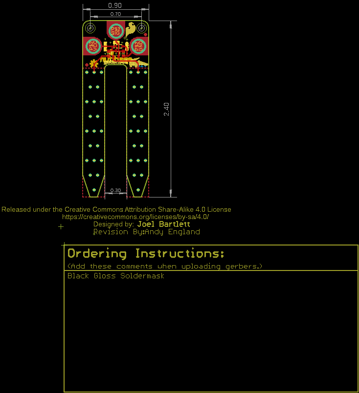
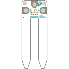
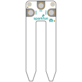
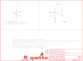
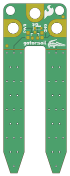
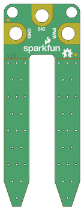

Contents
========

* [PRS15272 > gator soil](#prs15272--gator-soil)
	* [Schematic](#schematic)
	* [PCB](#pcb)
	* [Interactive BOM](#interactive-bom)
	* [Images](#images)
	* [Tags](#tags)
  
![][im]
# PRS15272 > gator soil

- ID: PROJ-SPAR-15272-STAN-01
- Hex ID: PRS15272
- Name: Sparkfun
- Description: Sparkfun
- Long Link: [http://oom.lt/PROJ-SPAR-15272-STAN-01](http://oom.lt/PROJ-SPAR-15272-STAN-01)
- Short Link: [http://oom.lt/PRS15272](http://oom.lt/PRS15272)

## Schematic
  

## PCB
  

## Interactive BOM

- Interactive BOM page: [ibom.html](https://htmlpreview.github.io/?https://github.com/oomlout/oomlout_OOMP_projects/blob/main/PROJ-SPAR-15272-STAN-01/kicad/bom/ibom.html)

## Images
  
  

|bominteractivefront|bominteractiveback|kicadPcb3d|kicadPcb3dFront|kicadPcb3dBack|eagleImage|eagleSchemImage|pcbdraw|pcbdrawback|
| :---: | :---: | :---: | :---: | :---: | :---: | :---: | :---: | :---: |
||||||||||

## Tags

- hexID: PRS15272
- oompType: PROJ
- oompSize: SPAR
- oompColor: 15272
- oompDesc: STAN
- oompIndex: 01
- oompName: gator soil
- sources: All source files from https://github.com/sparkfun/gator_soil (source licence details in srcLicense.md)
- linkBuyPage: https://www.sparkfun.com/products/15272
- oompID: PROJ-SPAR-15272-STAN-01
- rawParts: D2,3.6V,DIODE-ZENER-BZT52C3V6S,SOD-323,Zener Diode,,DIO-08199,3.6V,,
- rawParts: FID1,FIDUCIAL1X2,FIDUCIAL1X2,FIDUCIAL-1X2,Fiducial Alignment Points,,,,,
- rawParts: FID2,FIDUCIAL1X2,FIDUCIAL1X2,FIDUCIAL-1X2,Fiducial Alignment Points,,,,,
- rawParts: FID3,FIDUCIAL1X2,FIDUCIAL1X2,FIDUCIAL-1X2,Fiducial Alignment Points,,,,,
- rawParts: FID4,FIDUCIAL1X2,FIDUCIAL1X2,FIDUCIAL-1X2,Fiducial Alignment Points,,,,,
- rawParts: FRAME1,,FRAME-LETTER,CREATIVE_COMMONS,Schematic Frame,Joel Bartlett,,,v10,
- rawParts: J1,GATORGATOR_MINI,GATORGATOR_MINI,GATOR_MINI,,,,,,
- rawParts: J2,GATORGATOR_MINI,GATORGATOR_MINI,GATOR_MINI,,,,,,
- rawParts: J3,GATORGATOR_MINI,GATORGATOR_MINI,GATOR_MINI,,,,,,
- rawParts: LOGO1,SFE_LOGO_NAME_FLAME.1_INCH,SFE_LOGO_NAME_FLAME.1_INCH,SFE_LOGO_NAME_FLAME_.1,SFE Logo, name and flame,,,,,
- rawParts: LOGO2,OSHW-LOGOS,OSHW-LOGOS,OSHW-LOGO-S,Open Source Hardware Logo,,,,,
- rawParts: LOGO3,REVISION,REVISION,REVISION,Revision By Text,,,,,
- rawParts: Q1,2N3904,TRANSISTOR_NPNMMBT2222A,SOT23-3@1,Generic NPN BJT,,TRANS-08049,MMBT2222A,,
- rawParts: R1,10k,10KOHM-0603-1/10W-1%,0603,10kΩ resistor,,RES-00824,10k,,
- rawParts: R2,100,100OHM-0603-1/10W-1%,0603,100Ω resistor,,RES-07863,100,,
- rawParts: STANDOFF1,STAND-OFF,STAND-OFF,STAND-OFF,#4 Stand Off,,,,,
- rawParts: STANDOFF2,STAND-OFF,STAND-OFF,STAND-OFF,#4 Stand Off,,,,,

[im]: kicadPcb3d_450.png
