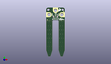
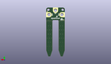
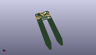

Contents
========

* [PROJ-SPAR-15272-STAN-01>gator soil](#proj-spar-15272-stan-01gator-soil)
	* [Images](#images)
	* [Interactive BOM](#interactive-bom)
	* [OOMP Parts](#oomp-parts)
	* [Tags](#tags)
  
![][im]
# PROJ-SPAR-15272-STAN-01>gator soil

- ID: PROJ-SPAR-15272-STAN-01
- Hex ID: PRS15272
- Name: gator soil
- Description: 

## Images
  
  

|eagleImage|kicadPcb3dFront|kicadPcb3dBack|kicadPcb3d|
| :---: | :---: | :---: | :---: |
|||||

## Interactive BOM

- Interactive BOM page: [ibom.html](kicad/bom/ibom.html)

## OOMP Parts
  

|OOMP Parts|
| :---: |
|UNMATCHED-UNMATCHED-X-UNMATCHED-01, D2, 12.572999999999999, 52.06999999999999, 0,D2, 3.6V, SOD-323, SparkFun-DiscreteSemi, (0.495, 2.05), R0|
|UNMATCHED-UNMATCHED-X-UNMATCHED-01, Q1, 11.43, 49.529999999999994, 0,Q1, 2N3904, SOT23-3@1, SparkFun-DiscreteSemi, (0.45, 1.95), R0|
|<table><tr><td></td><td> R1</td><td>[RESE-0603-X-O103-01 SMD (0603) 10k Ohm Resistor](https://github.com/oomlout/oomlout_OOMP_parts/tree/main/RESE-0603-X-O103-01/)</td><td>[R6103](https://github.com/oomlout/oomlout_OOMP_parts/tree/main/RESE-0603-X-O103-01/)</td></tr></table>|
|RESE-0603-X-UNMATCHED-01, R2, 8.889999999999999, 49.529999999999994, 90,R2, 100, 0603, SparkFun-Resistors, (0.35, 1.95), R90|

## Tags

- hexID: PRS15272
- oompType: PROJ
- oompSize: SPAR
- oompColor: 15272
- oompDesc: STAN
- oompIndex: 01
- oompName: gator soil
- sources: All source files from https://github.com/sparkfun/gator_soil (source licence details in srcLicense.md)
- linkBuyPage: https://www.sparkfun.com/products/15272
- oompPart: UNMATCHED-UNMATCHED-X-UNMATCHED-01, D2, 12.572999999999999, 52.06999999999999, 0
- oompPart: SKIP-UNMATCHED-X-UNMATCHED-01, FID1, 21.59, 56.13399999999999, 0
- oompPart: SKIP-UNMATCHED-X-UNMATCHED-01, FID2, 1.27, 45.72, 0
- oompPart: SKIP-UNMATCHED-X-UNMATCHED-01, FID3, 1.27, 45.72, M0
- oompPart: SKIP-UNMATCHED-X-UNMATCHED-01, FID4, 21.59, 56.13399999999999, M0
- oompPart: SKIP-UNMATCHED-X-UNMATCHED-01, J1, 3.8099999999999996, 52.06999999999999, 270
- oompPart: SKIP-UNMATCHED-X-UNMATCHED-01, J2, 19.049999999999997, 52.06999999999999, 90
- oompPart: SKIP-UNMATCHED-X-UNMATCHED-01, J3, 11.43, 57.15, 180
- oompPart: UNMATCHED-UNMATCHED-X-UNMATCHED-01, Q1, 11.43, 49.529999999999994, 0
- oompPart: RESE-0603-X-O103-01, R1, 13.97, 49.529999999999994, 90
- oompPart: RESE-0603-X-UNMATCHED-01, R2, 8.889999999999999, 49.529999999999994, 90
- rawPart: D2, 3.6V, SOD-323, SparkFun-DiscreteSemi, (0.495, 2.05), R0
- rawPart: FID1, FIDUCIAL1X2, FIDUCIAL-1X2, SparkFun-Aesthetics, (0.85, 2.21), R0
- rawPart: FID2, FIDUCIAL1X2, FIDUCIAL-1X2, SparkFun-Aesthetics, (0.05, 1.8), R0
- rawPart: FID3, FIDUCIAL1X2, FIDUCIAL-1X2, SparkFun-Aesthetics, (0.05, 1.8), MR0
- rawPart: FID4, FIDUCIAL1X2, FIDUCIAL-1X2, SparkFun-Aesthetics, (0.85, 2.21), MR0
- rawPart: J1, GATORGATOR_MINI, GATOR_MINI, SparkFun-Connectors, (0.15, 2.05), R270
- rawPart: J2, GATORGATOR_MINI, GATOR_MINI, SparkFun-Connectors, (0.75, 2.05), R90
- rawPart: J3, GATORGATOR_MINI, GATOR_MINI, SparkFun-Connectors, (0.45, 2.25), R180
- rawPart: Q1, 2N3904, SOT23-3@1, SparkFun-DiscreteSemi, (0.45, 1.95), R0
- rawPart: R1, 10k, 0603, SparkFun-Resistors, (0.55, 1.95), R90
- rawPart: R2, 100, 0603, SparkFun-Resistors, (0.35, 1.95), R90
- oompID: PROJ-SPAR-15272-STAN-01

[im]: kicadPcb3d_450.png
