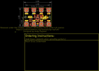
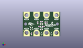
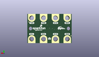
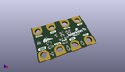

Contents
========

* [PROJ-SPAR-15273-STAN-01>gator UV](#proj-spar-15273-stan-01gator-uv)
	* [Images](#images)
	* [Interactive BOM](#interactive-bom)
	* [OOMP Parts](#oomp-parts)
	* [Tags](#tags)
  
![][im]
# PROJ-SPAR-15273-STAN-01>gator UV

- ID: PROJ-SPAR-15273-STAN-01
- Hex ID: PRS15273
- Name: gator UV
- Description: 

## Images
  
  

|eagleImage|kicadPcb3dFront|kicadPcb3dBack|kicadPcb3d|
| :---: | :---: | :---: | :---: |
|||||

## Interactive BOM

- Interactive BOM page: [ibom.html](kicad/bom/ibom.html)

## OOMP Parts
  

|OOMP Parts|
| :---: |
|<table><tr><td></td><td> C4</td><td>[CAPC-0603-X-NF100-V50 SMD (0603) 100 nF Capacitor (Ceramic) 50v](https://github.com/oomlout/oomlout_OOMP_parts/tree/main/CAPC-0603-X-NF100-V50/)</td><td>[C6N100](https://github.com/oomlout/oomlout_OOMP_parts/tree/main/CAPC-0603-X-NF100-V50/)</td></tr></table>|
|UNMATCHED-0603-X-UNMATCHED-01, D1, 19.049999999999997, 6.985, 180,D1, RED, LED-0603, SparkFun-LED, (0.75, 0.275), R180|
|UNMATCHED-UNMATCHED-X-UNMATCHED-01, D2, 8.889999999999999, 7.112, 180,D2, 3.6V, SOD-323, SparkFun-DiscreteSemi, (0.35, 0.28), R180|
|UNMATCHED-UNMATCHED-X-UNMATCHED-01, D3, 19.049999999999997, 2.54, 270,D3, 3.6V, SOD-323, SparkFun-DiscreteSemi, (0.75, 0.1), R270|
|UNMATCHED-UNMATCHED-X-UNMATCHED-01, D4, 29.209999999999997, 2.54, 270,D4, 3.6V, SOD-323, SparkFun-DiscreteSemi, (1.15, 0.1), R270|
|UNMATCHED-UNMATCHED-X-UNMATCHED-01, Q1, 8.889999999999999, 10.16, 0,Q1, 2.5A/30V/105m?, SOT23-3, SparkFun-DiscreteSemi, (0.35, 0.4), R0|
|<table><tr><td></td><td> R1</td><td>[RESE-0603-X-O103-01 SMD (0603) 10k Ohm Resistor](https://github.com/oomlout/oomlout_OOMP_parts/tree/main/RESE-0603-X-O103-01/)</td><td>[R6103](https://github.com/oomlout/oomlout_OOMP_parts/tree/main/RESE-0603-X-O103-01/)</td></tr></table>|
|<table><tr><td></td><td> R2</td><td>[RESE-0603-X-O103-01 SMD (0603) 10k Ohm Resistor](https://github.com/oomlout/oomlout_OOMP_parts/tree/main/RESE-0603-X-O103-01/)</td><td>[R6103](https://github.com/oomlout/oomlout_OOMP_parts/tree/main/RESE-0603-X-O103-01/)</td></tr></table>|
|RESE-0603-X-UNMATCHED-01, R3, 20.955, 10.16, 180,R3, 1k, 0603, SparkFun-Resistors, (0.825, 0.4), R180|
|<table><tr><td></td><td> R4</td><td>[RESE-0603-X-O103-01 SMD (0603) 10k Ohm Resistor](https://github.com/oomlout/oomlout_OOMP_parts/tree/main/RESE-0603-X-O103-01/)</td><td>[R6103](https://github.com/oomlout/oomlout_OOMP_parts/tree/main/RESE-0603-X-O103-01/)</td></tr></table>|
|<table><tr><td></td><td> R5</td><td>[RESE-0603-X-O103-01 SMD (0603) 10k Ohm Resistor](https://github.com/oomlout/oomlout_OOMP_parts/tree/main/RESE-0603-X-O103-01/)</td><td>[R6103](https://github.com/oomlout/oomlout_OOMP_parts/tree/main/RESE-0603-X-O103-01/)</td></tr></table>|
|RESE-0603-X-O304-01, R6, 19.049999999999997, 15.239999999999998, 180,R6, 300k, 0603, SparkFun-Resistors, (0.75, 0.6), R180|
|UNMATCHED-UNMATCHED-X-UNMATCHED-01, U1, 19.049999999999997, 12.7, 180,U1, VEML6070, VEML6070, SparkFun-Sensors, (0.75, 0.5), R180|

## Tags

- hexID: PRS15273
- oompType: PROJ
- oompSize: SPAR
- oompColor: 15273
- oompDesc: STAN
- oompIndex: 01
- oompName: gator UV
- sources: All source files from https://github.com/sparkfun/gator_UV (source licence details in srcLicense.md)
- linkBuyPage: https://www.sparkfun.com/products/15273
- oompPart: CAPC-0603-X-NF100-V50, C4, 17.145, 10.16, 180
- oompPart: UNMATCHED-0603-X-UNMATCHED-01, D1, 19.049999999999997, 6.985, 180
- oompPart: UNMATCHED-UNMATCHED-X-UNMATCHED-01, D2, 8.889999999999999, 7.112, 180
- oompPart: UNMATCHED-UNMATCHED-X-UNMATCHED-01, D3, 19.049999999999997, 2.54, 270
- oompPart: UNMATCHED-UNMATCHED-X-UNMATCHED-01, D4, 29.209999999999997, 2.54, 270
- oompPart: SKIP-UNMATCHED-X-UNMATCHED-01, J1, 34.29, 3.8099999999999996, 0
- oompPart: SKIP-UNMATCHED-X-UNMATCHED-01, J2, 24.13, 3.8099999999999996, 0
- oompPart: SKIP-UNMATCHED-X-UNMATCHED-01, J3, 13.97, 3.8099999999999996, 0
- oompPart: SKIP-UNMATCHED-X-UNMATCHED-01, J4, 3.8099999999999996, 3.8099999999999996, 0
- oompPart: SKIP-UNMATCHED-X-UNMATCHED-01, J5, 3.8099999999999996, 21.59, 180
- oompPart: SKIP-UNMATCHED-X-UNMATCHED-01, J6, 13.97, 21.59, 180
- oompPart: SKIP-UNMATCHED-X-UNMATCHED-01, J7, 24.13, 21.59, 180
- oompPart: SKIP-UNMATCHED-X-UNMATCHED-01, J8, 34.29, 21.59, 180
- oompPart: SKIP-UNMATCHED-X-UNMATCHED-01, JP2, 0.635, 6.35, M0
- oompPart: SKIP-UNMATCHED-X-UNMATCHED-01, JP5, 0.635, 6.35, 0
- oompPart: SKIP-UNMATCHED-X-UNMATCHED-01, JP6, 36.83, 18.415, 0
- oompPart: SKIP-UNMATCHED-X-UNMATCHED-01, JP7, 36.83, 18.415, M0
- oompPart: UNMATCHED-UNMATCHED-X-UNMATCHED-01, Q1, 8.889999999999999, 10.16, 0
- oompPart: RESE-0603-X-O103-01, R1, 22.86, 13.97, 90
- oompPart: RESE-0603-X-O103-01, R2, 15.239999999999998, 13.97, 90
- oompPart: RESE-0603-X-UNMATCHED-01, R3, 20.955, 10.16, 180
- oompPart: RESE-0603-X-O103-01, R4, 8.889999999999999, 2.54, 90
- oompPart: RESE-0603-X-O103-01, R5, 24.764999999999997, 13.97, 90
- oompPart: RESE-0603-X-O304-01, R6, 19.049999999999997, 15.239999999999998, 180
- oompPart: UNMATCHED-UNMATCHED-X-UNMATCHED-01, U1, 19.049999999999997, 12.7, 180
- rawPart: C4, 0.1uF, 0603, SparkFun-Capacitors, (0.675, 0.4), R180
- rawPart: D1, RED, LED-0603, SparkFun-LED, (0.75, 0.275), R180
- rawPart: D2, 3.6V, SOD-323, SparkFun-DiscreteSemi, (0.35, 0.28), R180
- rawPart: D3, 3.6V, SOD-323, SparkFun-DiscreteSemi, (0.75, 0.1), R270
- rawPart: D4, 3.6V, SOD-323, SparkFun-DiscreteSemi, (1.15, 0.1), R270
- rawPart: J1, GATORGATOR_MINI, GATOR_MINI, SparkFun-Connectors, (1.35, 0.15), R0
- rawPart: J2, GATORGATOR_MINI, GATOR_MINI, SparkFun-Connectors, (0.95, 0.15), R0
- rawPart: J3, GATORGATOR_MINI, GATOR_MINI, SparkFun-Connectors, (0.55, 0.15), R0
- rawPart: J4, GATORGATOR_MINI, GATOR_MINI, SparkFun-Connectors, (0.15, 0.15), R0
- rawPart: J5, GATORGATOR_MINI, GATOR_MINI, SparkFun-Connectors, (0.15, 0.85), R180
- rawPart: J6, GATORGATOR_MINI, GATOR_MINI, SparkFun-Connectors, (0.55, 0.85), R180
- rawPart: J7, GATORGATOR_MINI, GATOR_MINI, SparkFun-Connectors, (0.95, 0.85), R180
- rawPart: J8, GATORGATOR_MINI, GATOR_MINI, SparkFun-Connectors, (1.35, 0.85), R180
- rawPart: JP2, FIDUCIALUFIDUCIAL, MICRO-FIDUCIAL, SparkFun, (0.025, 0.25), MR0
- rawPart: JP5, FIDUCIALUFIDUCIAL, MICRO-FIDUCIAL, SparkFun, (0.025, 0.25), R0
- rawPart: JP6, FIDUCIALUFIDUCIAL, MICRO-FIDUCIAL, SparkFun, (1.45, 0.725), R0
- rawPart: JP7, FIDUCIALUFIDUCIAL, MICRO-FIDUCIAL, SparkFun, (1.45, 0.725), MR0
- rawPart: Q1, 2.5A/30V/105m?, SOT23-3, SparkFun-DiscreteSemi, (0.35, 0.4), R0
- rawPart: R1, 10k, 0603, SparkFun-Resistors, (0.9, 0.55), R90
- rawPart: R2, 10k, 0603, SparkFun-Resistors, (0.6, 0.55), R90
- rawPart: R3, 1k, 0603, SparkFun-Resistors, (0.825, 0.4), R180
- rawPart: R4, 10k, 0603, SparkFun-Resistors, (0.35, 0.1), R90
- rawPart: R5, 10k, 0603, SparkFun-Resistors, (0.975, 0.55), R90
- rawPart: R6, 300k, 0603, SparkFun-Resistors, (0.75, 0.6), R180
- rawPart: U1, VEML6070, VEML6070, SparkFun-Sensors, (0.75, 0.5), R180
- oompID: PROJ-SPAR-15273-STAN-01

[im]: kicadPcb3d_450.png
