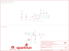

Contents
========

* [PRS15273 > gator UV](#prs15273--gator-uv)
	* [Schematic](#schematic)
	* [PCB](#pcb)
	* [Interactive BOM](#interactive-bom)
	* [Images](#images)
	* [Tags](#tags)
  
![][im]
# PRS15273 > gator UV

- ID: PROJ-SPAR-15273-STAN-01
- Hex ID: PRS15273
- Name: Sparkfun
- Description: Sparkfun
- Long Link: [http://oom.lt/PROJ-SPAR-15273-STAN-01](http://oom.lt/PROJ-SPAR-15273-STAN-01)
- Short Link: [http://oom.lt/PRS15273](http://oom.lt/PRS15273)

## Schematic
  

## PCB
  

## Interactive BOM

- Interactive BOM page: [ibom.html](https://htmlpreview.github.io/?https://github.com/oomlout/oomlout_OOMP_projects/blob/main/PROJ-SPAR-15273-STAN-01/kicad/bom/ibom.html)

## Images
  
  

|bominteractivefront|bominteractiveback|kicadPcb3d|kicadPcb3dFront|kicadPcb3dBack|eagleImage|eagleSchemImage|pcbdraw|pcbdrawback|
| :---: | :---: | :---: | :---: | :---: | :---: | :---: | :---: | :---: |
||||||||||

## Tags

- hexID: PRS15273
- oompType: PROJ
- oompSize: SPAR
- oompColor: 15273
- oompDesc: STAN
- oompIndex: 01
- oompName: gator UV
- sources: All source files from https://github.com/sparkfun/gator_UV (source licence details in srcLicense.md)
- linkBuyPage: https://www.sparkfun.com/products/15273
- oompID: PROJ-SPAR-15273-STAN-01
- rawParts: C4,0.1uF,0.1UF-0603-25V-(+80/-20%),0603,0.1µF ceramic capacitors,,CAP-00810,,0.1uF,
- rawParts: D1,RED,LED-RED0603,LED-0603,Red SMD LED,,DIO-00819,,RED,
- rawParts: D2,3.6V,DIODE-ZENER-BZT52C3V6S,SOD-323,Zener Diode,,DIO-08199,,3.6V,
- rawParts: D3,3.6V,DIODE-ZENER-BZT52C3V6S,SOD-323,Zener Diode,,DIO-08199,,3.6V,
- rawParts: D4,3.6V,DIODE-ZENER-BZT52C3V6S,SOD-323,Zener Diode,,DIO-08199,,3.6V,
- rawParts: FRAME1,FRAME-LETTER,FRAME-LETTER,CREATIVE_COMMONS,Schematic Frame - Letter,,,,,
- rawParts: J1,GATORGATOR_MINI,GATORGATOR_MINI,GATOR_MINI,,,,,,
- rawParts: J2,GATORGATOR_MINI,GATORGATOR_MINI,GATOR_MINI,,,,,,
- rawParts: J3,GATORGATOR_MINI,GATORGATOR_MINI,GATOR_MINI,,,,,,
- rawParts: J4,GATORGATOR_MINI,GATORGATOR_MINI,GATOR_MINI,,,,,,
- rawParts: J5,GATORGATOR_MINI,GATORGATOR_MINI,GATOR_MINI,,,,,,
- rawParts: J6,GATORGATOR_MINI,GATORGATOR_MINI,GATOR_MINI,,,,,,
- rawParts: J7,GATORGATOR_MINI,GATORGATOR_MINI,GATOR_MINI,,,,,,
- rawParts: J8,GATORGATOR_MINI,GATORGATOR_MINI,GATOR_MINI,,,,,,
- rawParts: JP2,FIDUCIALUFIDUCIAL,FIDUCIALUFIDUCIAL,MICRO-FIDUCIAL,Fiducial Alignment Points,,,,,
- rawParts: JP3,STAND-OFF,STAND-OFF,STAND-OFF,Stand Off,,,,,
- rawParts: JP4,STAND-OFF,STAND-OFF,STAND-OFF,Stand Off,,,,,
- rawParts: JP5,FIDUCIALUFIDUCIAL,FIDUCIALUFIDUCIAL,MICRO-FIDUCIAL,Fiducial Alignment Points,,,,,
- rawParts: JP6,FIDUCIALUFIDUCIAL,FIDUCIALUFIDUCIAL,MICRO-FIDUCIAL,Fiducial Alignment Points,,,,,
- rawParts: JP7,FIDUCIALUFIDUCIAL,FIDUCIALUFIDUCIAL,MICRO-FIDUCIAL,Fiducial Alignment Points,,,,,
- rawParts: LOGO1,OSHW-LOGOMINI,OSHW-LOGOMINI,OSHW-LOGO-MINI,Open-Source Hardware (OSHW) Logo,,,,,
- rawParts: Q1,2.5A/30V/105mΩ,MOSFET_PCH-DMG2307L,SOT23-3,P-channel MOSFETs,,TRANS-11308,,2.5A/30V/105mΩ,
- rawParts: R1,10k,10KOHM-0603-1/10W-1%,0603,10kΩ resistor,,RES-00824,,10k,
- rawParts: R2,10k,10KOHM-0603-1/10W-1%,0603,10kΩ resistor,,RES-00824,,10k,
- rawParts: R3,1k,1KOHM-0603-1/10W-1%,0603,1kΩ resistor,,RES-07856,,1k,
- rawParts: R4,10k,10KOHM-0603-1/10W-1%,0603,10kΩ resistor,,RES-00824,,10k,
- rawParts: R5,10k,10KOHM-0603-1/10W-1%,0603,10kΩ resistor,,RES-00824,,10k,
- rawParts: R6,300k,300KOHM-0603-1/10W-1%,0603,300kΩ resistor,,RES-10809,,300k,
- rawParts: U$1,SFE_LOGO_NAME_FLAME.1_INCH,SFE_LOGO_NAME_FLAME.1_INCH,SFE_LOGO_NAME_FLAME_.1,SparkFun Font Logo w/ Flame,,,,,
- rawParts: U$2,SFE_LOGO_NAME_FLAME.1_INCH,SFE_LOGO_NAME_FLAME.1_INCH,SFE_LOGO_NAME_FLAME_.1,SparkFun Font Logo w/ Flame,,,,,
- rawParts: U1,VEML6070,VEML6070,VEML6070,,,SEN-14367,,VEML6070,

[im]: kicadPcb3d_450.png
