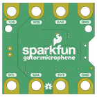

Contents
========

* [PRS15289 > gator microphone](#prs15289--gator-microphone)
	* [Schematic](#schematic)
	* [PCB](#pcb)
	* [Interactive BOM](#interactive-bom)
	* [OOMP Parts](#oomp-parts)
	* [Images](#images)
	* [Tags](#tags)
  
![][im]
# PRS15289 > gator microphone

- ID: PROJ-SPAR-15289-STAN-01
- Hex ID: PRS15289
- Name: Sparkfun
- Description: Sparkfun
- Long Link: [http://oom.lt/PROJ-SPAR-15289-STAN-01](http://oom.lt/PROJ-SPAR-15289-STAN-01)
- Short Link: [http://oom.lt/PRS15289](http://oom.lt/PRS15289)

## Schematic
  

## PCB
  

## Interactive BOM

- Interactive BOM page: [ibom.html](https://htmlpreview.github.io/?https://github.com/oomlout/oomlout_OOMP_projects/blob/main/PROJ-SPAR-15289-STAN-01/kicad/bom/ibom.html)

## OOMP Parts
  

|OOMP ID|Name|Identifier|
| :---: | :---: | :---: |
|CAPC-UNMATCHED-X-UF10-01||C1, C2|
|CAPC-0603-X-UNMATCHED-01||C3, C4|
|[CAPC-0603-X-NF100-V50](https://github.com/oomlout/oomlout_OOMP_parts/tree/main/CAPC-0603-X-NF100-V50/)|[SMD (0603) 100 nF Capacitor (Ceramic) 50v](https://github.com/oomlout/oomlout_OOMP_parts/tree/main/CAPC-0603-X-NF100-V50/)|[C5](https://github.com/oomlout/oomlout_OOMP_parts/tree/main/CAPC-0603-X-NF100-V50/)|
|DIOD-UNMATCHED-X-UNMATCHED-01||D1, D2|
|[LEDS-0603-R-STAN-01](https://github.com/oomlout/oomlout_OOMP_parts/tree/main/LEDS-0603-R-STAN-01/)|[SMD (0603) Red LED](https://github.com/oomlout/oomlout_OOMP_parts/tree/main/LEDS-0603-R-STAN-01/)|[D3](https://github.com/oomlout/oomlout_OOMP_parts/tree/main/LEDS-0603-R-STAN-01/)|
|DIOD-S323-X-UNMATCHED-01||D4, D5, D6|
|UNMATCHED-UNMATCHED-X-UNMATCHED-01||MIC1, S1, U1, U2|
|MOSP-SO23-X-UNMATCHED-01||Q1|
|[RESE-0603-X-O222-01](https://github.com/oomlout/oomlout_OOMP_parts/tree/main/RESE-0603-X-O222-01/)|[SMD (0603) 2.2k Ohm Resistor](https://github.com/oomlout/oomlout_OOMP_parts/tree/main/RESE-0603-X-O222-01/)|[R1](https://github.com/oomlout/oomlout_OOMP_parts/tree/main/RESE-0603-X-O222-01/)|
|[RESE-0603-X-O102-01](https://github.com/oomlout/oomlout_OOMP_parts/tree/main/RESE-0603-X-O102-01/)|[SMD (0603) 1k Ohm Resistor](https://github.com/oomlout/oomlout_OOMP_parts/tree/main/RESE-0603-X-O102-01/)|[R2, R10, R13, R16](https://github.com/oomlout/oomlout_OOMP_parts/tree/main/RESE-0603-X-O102-01/)|
|RESE-0603-X-O1003-01||R3, R11, R14|
|[RESE-0603-X-O103-01](https://github.com/oomlout/oomlout_OOMP_parts/tree/main/RESE-0603-X-O103-01/)|[SMD (0603) 10k Ohm Resistor](https://github.com/oomlout/oomlout_OOMP_parts/tree/main/RESE-0603-X-O103-01/)|[R4, R5, R6, R9, R17, R21, R22, R23](https://github.com/oomlout/oomlout_OOMP_parts/tree/main/RESE-0603-X-O103-01/)|
|[RESE-0603-X-O223-01](https://github.com/oomlout/oomlout_OOMP_parts/tree/main/RESE-0603-X-O223-01/)|[SMD (0603) 22k Ohm Resistor](https://github.com/oomlout/oomlout_OOMP_parts/tree/main/RESE-0603-X-O223-01/)|[R7](https://github.com/oomlout/oomlout_OOMP_parts/tree/main/RESE-0603-X-O223-01/)|
|[RESE-0603-X-O101-01](https://github.com/oomlout/oomlout_OOMP_parts/tree/main/RESE-0603-X-O101-01/)|[SMD (0603) 100 Ohm Resistor](https://github.com/oomlout/oomlout_OOMP_parts/tree/main/RESE-0603-X-O101-01/)|[R8, R15, R18, R19](https://github.com/oomlout/oomlout_OOMP_parts/tree/main/RESE-0603-X-O101-01/)|
|RESE-0603-X-UNMATCHED-01||R12|
|[RESE-0603-X-O105-01](https://github.com/oomlout/oomlout_OOMP_parts/tree/main/RESE-0603-X-O105-01/)|[SMD (0603) 1M Ohm Resistor](https://github.com/oomlout/oomlout_OOMP_parts/tree/main/RESE-0603-X-O105-01/)|[R20](https://github.com/oomlout/oomlout_OOMP_parts/tree/main/RESE-0603-X-O105-01/)|

## Images
  
  

|bominteractivefront|bominteractiveback|kicadPcb3d|kicadPcb3dFront|kicadPcb3dBack|kicadSchem|eagleImage|eagleSchemImage|pcbdraw|pcbdrawback|
| :---: | :---: | :---: | :---: | :---: | :---: | :---: | :---: | :---: | :---: |
|||||||||||

## Tags

- hexID: PRS15289
- oompType: PROJ
- oompSize: SPAR
- oompColor: 15289
- oompDesc: STAN
- oompIndex: 01
- oompName: gator microphone
- sources: All source files from https://github.com/sparkfun/gator_microphone (source licence details in srcLicense.md)
- linkBuyPage: https://www.sparkfun.com/products/15289
- oompID: PROJ-SPAR-15289-STAN-01
- oompParts: C1,CAPC-UNMATCHED-X-UF10-01
- oompParts: C2,CAPC-UNMATCHED-X-UF10-01
- oompParts: C3,CAPC-0603-X-UNMATCHED-01
- oompParts: C4,CAPC-0603-X-UNMATCHED-01
- oompParts: C5,CAPC-0603-X-NF100-V50
- oompParts: D1,DIOD-UNMATCHED-X-UNMATCHED-01
- oompParts: D2,DIOD-UNMATCHED-X-UNMATCHED-01
- oompParts: D3,LEDS-0603-R-STAN-01
- oompParts: D4,DIOD-S323-X-UNMATCHED-01
- oompParts: D5,DIOD-S323-X-UNMATCHED-01
- oompParts: D6,DIOD-S323-X-UNMATCHED-01
- oompParts: MIC1,UNMATCHED-UNMATCHED-X-UNMATCHED-01
- oompParts: Q1,MOSP-SO23-X-UNMATCHED-01
- oompParts: R1,RESE-0603-X-O222-01
- oompParts: R2,RESE-0603-X-O102-01
- oompParts: R3,RESE-0603-X-O1003-01
- oompParts: R4,RESE-0603-X-O103-01
- oompParts: R5,RESE-0603-X-O103-01
- oompParts: R6,RESE-0603-X-O103-01
- oompParts: R7,RESE-0603-X-O223-01
- oompParts: R8,RESE-0603-X-O101-01
- oompParts: R9,RESE-0603-X-O103-01
- oompParts: R10,RESE-0603-X-O102-01
- oompParts: R11,RESE-0603-X-O1003-01
- oompParts: R12,RESE-0603-X-UNMATCHED-01
- oompParts: R13,RESE-0603-X-O102-01
- oompParts: R14,RESE-0603-X-O1003-01
- oompParts: R15,RESE-0603-X-O101-01
- oompParts: R16,RESE-0603-X-O102-01
- oompParts: R17,RESE-0603-X-O103-01
- oompParts: R18,RESE-0603-X-O101-01
- oompParts: R19,RESE-0603-X-O101-01
- oompParts: R20,RESE-0603-X-O105-01
- oompParts: R21,RESE-0603-X-O103-01
- oompParts: R22,RESE-0603-X-O103-01
- oompParts: R23,RESE-0603-X-O103-01
- oompParts: S1,UNMATCHED-UNMATCHED-X-UNMATCHED-01
- oompParts: U1,UNMATCHED-UNMATCHED-X-UNMATCHED-01
- oompParts: U2,UNMATCHED-UNMATCHED-X-UNMATCHED-01
- rawParts: C1,10uF,10UF-6.3V-20%(1206),1206@1,Ceramic,,CAP-10057,,10uF,
- rawParts: C2,10uF,10UF-6.3V-20%(1206),1206@1,Ceramic,,CAP-10057,,10uF,
- rawParts: C3,1.0uF,1.0UF-0603-16V-10%,0603,1µF ceramic capacitors,,CAP-00868,,1.0uF,
- rawParts: C4,1.0uF,1.0UF-0603-16V-10%,0603,1µF ceramic capacitors,,CAP-00868,,1.0uF,
- rawParts: C5,0.1uF,0.1UF-0603-25V-(+80/-20%),0603,0.1µF ceramic capacitors,,CAP-00810,,0.1uF,
- rawParts: D1,120mA/40V/370mV,DIODE-SCHOTTKY-RB751S40,SOD-523,Schottky diode,,DIO-11018,,120mA/40V/370mV,
- rawParts: D2,120mA/40V/370mV,DIODE-SCHOTTKY-RB751S40,SOD-523,Schottky diode,,DIO-11018,,120mA/40V/370mV,
- rawParts: D3,RED,LED-RED0603,LED-0603,Red SMD LED,,DIO-00819,,RED,
- rawParts: D4,3.6V,DIODE-ZENER-BZT52C3V6S,SOD-323,Zener Diode,,DIO-08199,,3.6V,
- rawParts: D5,3.6V,DIODE-ZENER-BZT52C3V6S,SOD-323,Zener Diode,,DIO-08199,,3.6V,
- rawParts: D6,3.6V,DIODE-ZENER-BZT52C3V6S,SOD-323,Zener Diode,,DIO-08199,,3.6V,
- rawParts: FID1,FIDUCIAL1X2,FIDUCIAL1X2,FIDUCIAL-1X2,Fiducial Alignment Points,,,,,
- rawParts: FID2,FIDUCIAL1X2,FIDUCIAL1X2,FIDUCIAL-1X2,Fiducial Alignment Points,,,,,
- rawParts: FID3,FIDUCIAL1X2,FIDUCIAL1X2,FIDUCIAL-1X2,Fiducial Alignment Points,,,,,
- rawParts: FID4,FIDUCIAL1X2,FIDUCIAL1X2,FIDUCIAL-1X2,Fiducial Alignment Points,,,,,
- rawParts: FRAME1,FRAME-LETTER,FRAME-LETTER,CREATIVE_COMMONS,Schematic Frame - Letter,,,,,
- rawParts: H1,STAND-OFFTIGHT,STAND-OFFTIGHT,STAND-OFF-TIGHT,Stand Off,,,,,
- rawParts: H2,STAND-OFFTIGHT,STAND-OFFTIGHT,STAND-OFF-TIGHT,Stand Off,,,,,
- rawParts: J1,GATORGATOR_MINI,GATORGATOR_MINI,GATOR_MINI,,,,,,
- rawParts: J2,GATORGATOR_MINI,GATORGATOR_MINI,GATOR_MINI,,,,,,
- rawParts: J3,GATORGATOR_MINI,GATORGATOR_MINI,GATOR_MINI,,,,,,
- rawParts: J4,GATORGATOR_MINI,GATORGATOR_MINI,GATOR_MINI,,,,,,
- rawParts: J5,GATORGATOR_MINI,GATORGATOR_MINI,GATOR_MINI,,,,,,
- rawParts: J6,GATORGATOR_MINI,GATORGATOR_MINI,GATOR_MINI,,,,,,
- rawParts: J7,GATORGATOR_MINI,GATORGATOR_MINI,GATOR_MINI,,,,,,
- rawParts: J8,GATORGATOR_MINI,GATORGATOR_MINI,GATOR_MINI,,,,,,
- rawParts: LOGO1,OSHW-LOGOS,OSHW-LOGOS,OSHW-LOGO-S,Open-Source Hardware (OSHW) Logo,,,,,
- rawParts: LOGO2,SFE_LOGO_NAME_FLAME.2_INCH,SFE_LOGO_NAME_FLAME.2_INCH,SFE_LOGO_NAME_FLAME_.2,SparkFun Font Logo w/ Flame,,,,,
- rawParts: LOGO3,SFE_LOGO_FLAME.2_INCH,SFE_LOGO_FLAME.2_INCH,SFE_LOGO_FLAME_.2,SparkFun Flame Logo,,,,,
- rawParts: MIC1,MIC9.7MM,MIC9.7MM,MIC-9.7MM,Omni-directional electret microphone. 9.7mm standard diameter.,,COMP-08856,,,
- rawParts: Q1,2.5A/30V/105mΩ,MOSFET_PCH-DMG2307L,SOT23-3,P-channel MOSFETs,,TRANS-11308,,2.5A/30V/105mΩ,
- rawParts: R1,2.2k,2.2KOHM-0603-1/10W-1%,0603,2.2kΩ resistor,,RES-08272,,2.2k,
- rawParts: R2,1k,1KOHM-0603-1/10W-1%,0603,1kΩ resistor,,RES-07856,,1k,
- rawParts: R3,100k,100KOHM-0603-1/10W-1%,0603,100kΩ resistor,,RES-07828,,100k,
- rawParts: R4,10k,10KOHM-0603-1/10W-1%,0603,10kΩ resistor,,RES-00824,,10k,
- rawParts: R5,10k,10KOHM-0603-1/10W-1%,0603,10kΩ resistor,,RES-00824,,10k,
- rawParts: R6,10k,10KOHM-0603-1/10W-1%,0603,10kΩ resistor,,RES-00824,,10k,
- rawParts: R7,22k,22KOHM-0603-1/10W-1%,0603,22kΩ resistor,,RES-07853,,22k,
- rawParts: R8,100,100OHM-0603-1/10W-1%,0603,100Ω resistor,,RES-07863,,100,
- rawParts: R9,10k,10KOHM-0603-1/10W-1%,0603,10kΩ resistor,,RES-00824,,10k,
- rawParts: R10,1k,1KOHM-0603-1/10W-1%,0603,1kΩ resistor,,RES-07856,,1k,
- rawParts: R11,100k,100KOHM-0603-1/10W-1%,0603,100kΩ resistor,,RES-07828,,100k,
- rawParts: R12,3.3k,3.3KOHM-0603-1/10W-1%,0603,3.3kΩ resistor,,RES-07851,,3.3k,
- rawParts: R13,1k,1KOHM-0603-1/10W-1%,0603,1kΩ resistor,,RES-07856,,1k,
- rawParts: R14,100k,100KOHM-0603-1/10W-1%,0603,100kΩ resistor,,RES-07828,,100k,
- rawParts: R15,100,100OHM-0603-1/10W-1%,0603,100Ω resistor,,RES-07863,,100,
- rawParts: R16,1k,1KOHM-0603-1/10W-1%,0603,1kΩ resistor,,RES-07856,,1k,
- rawParts: R17,10k,10KOHM-0603-1/10W-1%,0603,10kΩ resistor,,RES-00824,,10k,
- rawParts: R18,100,100OHM-0603-1/10W-1%,0603,100Ω resistor,,RES-07863,,100,
- rawParts: R19,100,100OHM-0603-1/10W-1%,0603,100Ω resistor,,RES-07863,,100,
- rawParts: R20,1M,1MOHM-0603-1/4W-5%,0603,1MΩ resistor,,RES-07868,,1M,
- rawParts: R21,10k,10KOHM-0603-1/10W-1%,0603,10kΩ resistor,,RES-00824,,10k,
- rawParts: R22,10k,10KOHM-0603-1/10W-1%,0603,10kΩ resistor,,RES-00824,,10k,
- rawParts: R23,10k,10KOHM-0603-1/10W-1%,0603,10kΩ resistor,,RES-00824,,10k,
- rawParts: S1,,SWITCH-SP3T-SMD,SWITCH_SP3T_SMD,Single-Pole, Triple-Throw (SP3T) Switch,,SWCH-10805,,,
- rawParts: TP1,TEST-POINT3,TEST-POINT3,PAD.03X.03,SparkFun Test Points,,,,,
- rawParts: U1,ADS1015,ADS1015,MSOP10,ADS1015 12-BIT ADC,,IC-12270,,ADS1015,
- rawParts: U2,LMV324,LMV324,SO14,IC LMV324 Quad Op Amp,,IC-08227,,LMV324,

[im]: kicadPcb3d_450.png
