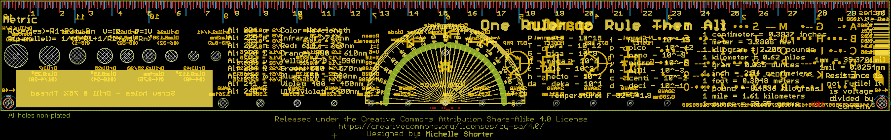
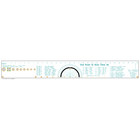
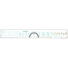
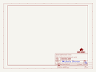
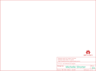

Contents
========

* [PRS15295 > SparkFun PCB Ruler](#prs15295--sparkfun-pcb-ruler)
	* [Schematic](#schematic)
	* [PCB](#pcb)
	* [Interactive BOM](#interactive-bom)
	* [OOMP Parts](#oomp-parts)
	* [Images](#images)
	* [Tags](#tags)

# PRS15295 > SparkFun PCB Ruler

- ID: PROJ-SPAR-15295-STAN-01
- Hex ID: PRS15295
- Name: Sparkfun
- Description: Sparkfun
- Long Link: [http://oom.lt/PROJ-SPAR-15295-STAN-01](http://oom.lt/PROJ-SPAR-15295-STAN-01)
- Short Link: [http://oom.lt/PRS15295](http://oom.lt/PRS15295)

## Schematic
  

## PCB
  

## Interactive BOM

- Interactive BOM page: [ibom.html](https://htmlpreview.github.io/?https://github.com/oomlout/oomlout_OOMP_projects/blob/main/PROJ-SPAR-15295-STAN-01/kicad/bom/ibom.html)

## OOMP Parts
  

|OOMP ID|Name|Identifier|
| :---: | :---: | :---: |
|UNMATCHED-UNMATCHED-X-UNMATCHED-01||@HOLE7, @HOLE5, @HOLE17, @HOLE22, @HOLE4, @HOLE9, @HOLE16, @HOLE6, @HOLE3, @HOLE0, @HOLE15, @HOLE10, @HOLE13, @HOLE21, @HOLE14, @HOLE20, @HOLE8, @HOLE1, @HOLE11, @HOLE12, @HOLE2, @HOLE19, @HOLE18, U$12, U$9, E$3, E$2, U$13, U$5, U$3, U$7, U$1, U$6, U$2, U$4, U$11|

## Images
  
  

|bominteractivefront|bominteractiveback|kicadSchem|eagleImage|eagleSchemImage|
| :---: | :---: | :---: | :---: | :---: |
||||||

## Tags

- hexID: PRS15295
- oompType: PROJ
- oompSize: SPAR
- oompColor: 15295
- oompDesc: STAN
- oompIndex: 01
- oompName: SparkFun PCB Ruler
- sources: All source files from https://github.com/sparkfun/SparkFun_PCB_Ruler (source licence details in srcLicense.md)
- linkBuyPage: https://www.sparkfun.com/products/15295
- oompID: PROJ-SPAR-15295-STAN-01
- oompParts: @HOLE7,UNMATCHED-UNMATCHED-X-UNMATCHED-01
- oompParts: @HOLE5,UNMATCHED-UNMATCHED-X-UNMATCHED-01
- oompParts: @HOLE17,UNMATCHED-UNMATCHED-X-UNMATCHED-01
- oompParts: @HOLE22,UNMATCHED-UNMATCHED-X-UNMATCHED-01
- oompParts: @HOLE4,UNMATCHED-UNMATCHED-X-UNMATCHED-01
- oompParts: @HOLE9,UNMATCHED-UNMATCHED-X-UNMATCHED-01
- oompParts: @HOLE16,UNMATCHED-UNMATCHED-X-UNMATCHED-01
- oompParts: @HOLE6,UNMATCHED-UNMATCHED-X-UNMATCHED-01
- oompParts: @HOLE3,UNMATCHED-UNMATCHED-X-UNMATCHED-01
- oompParts: @HOLE0,UNMATCHED-UNMATCHED-X-UNMATCHED-01
- oompParts: @HOLE15,UNMATCHED-UNMATCHED-X-UNMATCHED-01
- oompParts: @HOLE10,UNMATCHED-UNMATCHED-X-UNMATCHED-01
- oompParts: @HOLE13,UNMATCHED-UNMATCHED-X-UNMATCHED-01
- oompParts: @HOLE21,UNMATCHED-UNMATCHED-X-UNMATCHED-01
- oompParts: @HOLE14,UNMATCHED-UNMATCHED-X-UNMATCHED-01
- oompParts: @HOLE20,UNMATCHED-UNMATCHED-X-UNMATCHED-01
- oompParts: @HOLE8,UNMATCHED-UNMATCHED-X-UNMATCHED-01
- oompParts: @HOLE1,UNMATCHED-UNMATCHED-X-UNMATCHED-01
- oompParts: @HOLE11,UNMATCHED-UNMATCHED-X-UNMATCHED-01
- oompParts: @HOLE12,UNMATCHED-UNMATCHED-X-UNMATCHED-01
- oompParts: @HOLE2,UNMATCHED-UNMATCHED-X-UNMATCHED-01
- oompParts: @HOLE19,UNMATCHED-UNMATCHED-X-UNMATCHED-01
- oompParts: @HOLE18,UNMATCHED-UNMATCHED-X-UNMATCHED-01
- oompParts: U$12,UNMATCHED-UNMATCHED-X-UNMATCHED-01
- oompParts: U$9,UNMATCHED-UNMATCHED-X-UNMATCHED-01
- oompParts: E$3,UNMATCHED-UNMATCHED-X-UNMATCHED-01
- oompParts: E$2,UNMATCHED-UNMATCHED-X-UNMATCHED-01
- oompParts: U$13,UNMATCHED-UNMATCHED-X-UNMATCHED-01
- oompParts: U$5,UNMATCHED-UNMATCHED-X-UNMATCHED-01
- oompParts: U$3,UNMATCHED-UNMATCHED-X-UNMATCHED-01
- oompParts: U$7,UNMATCHED-UNMATCHED-X-UNMATCHED-01
- oompParts: U$1,UNMATCHED-UNMATCHED-X-UNMATCHED-01
- oompParts: U$6,UNMATCHED-UNMATCHED-X-UNMATCHED-01
- oompParts: U$2,UNMATCHED-UNMATCHED-X-UNMATCHED-01
- oompParts: U$4,UNMATCHED-UNMATCHED-X-UNMATCHED-01
- oompParts: U$11,UNMATCHED-UNMATCHED-X-UNMATCHED-01
- rawParts: FRAME1,FRAME-LETTER,FRAME-LETTER,CREATIVE_COMMONS,Schematic Frame - Letter,,
- rawParts: LOGO1,OSHW-LOGOM,OSHW-LOGOM,OSHW-LOGO-M,Open-Source Hardware (OSHW) Logo,,
