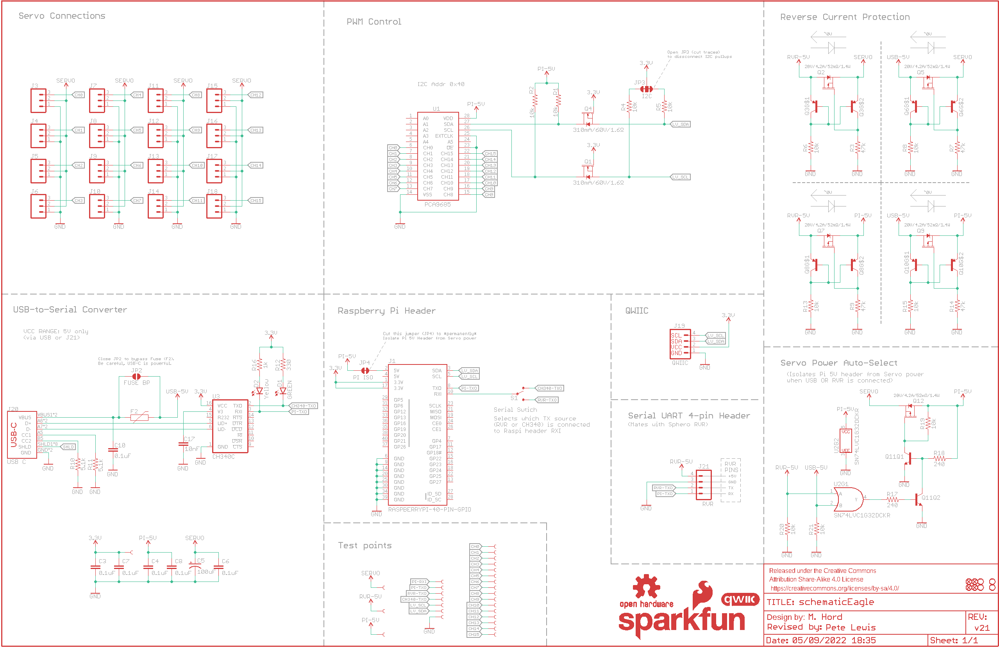
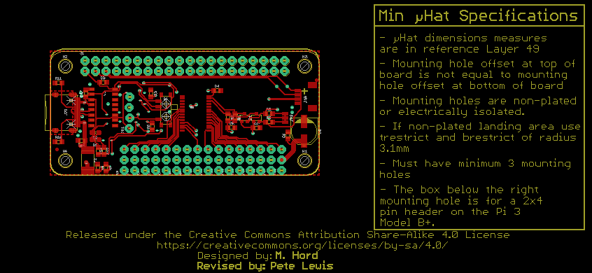
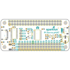
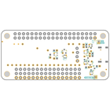
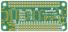
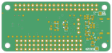

Contents
========

* [PRS15316 > Pi Servo Hat](#prs15316--pi-servo-hat)
	* [Schematic](#schematic)
	* [PCB](#pcb)
	* [Interactive BOM](#interactive-bom)
	* [Images](#images)
	* [Tags](#tags)
  
![][im]
# PRS15316 > Pi Servo Hat

- ID: PROJ-SPAR-15316-STAN-01
- Hex ID: PRS15316
- Name: Sparkfun
- Description: Sparkfun
- Long Link: [http://oom.lt/PROJ-SPAR-15316-STAN-01](http://oom.lt/PROJ-SPAR-15316-STAN-01)
- Short Link: [http://oom.lt/PRS15316](http://oom.lt/PRS15316)

## Schematic
  

## PCB
  

## Interactive BOM

- Interactive BOM page: [ibom.html](https://htmlpreview.github.io/?https://github.com/oomlout/oomlout_OOMP_projects/blob/main/PROJ-SPAR-15316-STAN-01/kicad/bom/ibom.html)

## Images
  
  

|bominteractivefront|bominteractiveback|kicadPcb3d|kicadPcb3dFront|kicadPcb3dBack|eagleImage|eagleSchemImage|pcbdraw|pcbdrawback|
| :---: | :---: | :---: | :---: | :---: | :---: | :---: | :---: | :---: |
||||||||||

## Tags

- hexID: PRS15316
- oompType: PROJ
- oompSize: SPAR
- oompColor: 15316
- oompDesc: STAN
- oompIndex: 01
- oompName: Pi Servo Hat
- sources: All source files from https://github.com/sparkfun/Pi_Servo_Hat (source licence details in srcLicense.md)
- linkBuyPage: https://www.sparkfun.com/products/15316
- oompID: PROJ-SPAR-15316-STAN-01
- rawParts: C3,0.1uF,0.1UF-0603-25V-(+80/-20%),0603,0.1µF ceramic capacitors,CAP-00810,,0.1uF,
- rawParts: C4,0.1uF,0.1UF-0603-25V-(+80/-20%),0603,0.1µF ceramic capacitors,CAP-00810,,0.1uF,
- rawParts: C5,100uF,100UF-POLAR-25V-20%(ELEC),PANASONIC_D,100µF polarized capacitors,CAP-12547,,100uF,
- rawParts: C6,0.1uF,0.1UF-0603-25V-(+80/-20%),0603,0.1µF ceramic capacitors,CAP-00810,,0.1uF,
- rawParts: C7,0.1uF,0.1UF-0603-25V-(+80/-20%),0603,0.1µF ceramic capacitors,CAP-00810,,0.1uF,
- rawParts: C8,0.1uF,0.1UF-0603-25V-(+80/-20%),0603,0.1µF ceramic capacitors,CAP-00810,,0.1uF,
- rawParts: C10,0.1uF,0.1UF-0603-25V-(+80/-20%),0603,0.1µF ceramic capacitors,CAP-00810,,0.1uF,
- rawParts: C17,10nF,10NF-0603-50V-10%,0603,0.01uF/10nF/10,000pF ceramic capacitors,CAP-00867,,10nF,
- rawParts: D1,GREEN,LED-GREEN0603,LED-0603,Green SMD LED,DIO-00821,,GREEN,
- rawParts: D2,Yellow,LED-YELLOW0603,LED-0603,Yellow SMD LED,DIO-09003,,Yellow,
- rawParts: F2,16V/2.5A(5A TRIP),PPTC_16V_2.5A,1812,Resettable Fuse PPTC,RES-14390,,16V/2.5A(5A TRIP),
- rawParts: FD1,FIDUCIALUFIDUCIAL,FIDUCIALUFIDUCIAL,FIDUCIAL-MICRO,Fiducial Alignment Points,,,,
- rawParts: FD2,FIDUCIALUFIDUCIAL,FIDUCIALUFIDUCIAL,FIDUCIAL-MICRO,Fiducial Alignment Points,,,,
- rawParts: FD3,FIDUCIALUFIDUCIAL,FIDUCIALUFIDUCIAL,FIDUCIAL-MICRO,Fiducial Alignment Points,,,,
- rawParts: FD4,FIDUCIALUFIDUCIAL,FIDUCIALUFIDUCIAL,FIDUCIAL-MICRO,Fiducial Alignment Points,,,,
- rawParts: FRAME2,FRAME-LEDGER,FRAME-LEDGER,CREATIVE_COMMONS,Schematic Frame - Ledger,,,,
- rawParts: H1,STAND-OFF,STAND-OFF,STAND-OFF,Stand Off,,,,
- rawParts: H2,STAND-OFF,STAND-OFF,STAND-OFF,Stand Off,,,,
- rawParts: H3,STAND-OFF,STAND-OFF,STAND-OFF,Stand Off,,,,
- rawParts: H4,STAND-OFF,STAND-OFF,STAND-OFF,Stand Off,,,,
- rawParts: J1,RASPBERRYPI-40-PIN-GPIO,RASPBERRYPI-40-PIN-GPIO_PTH_NO_SHROUD,2X20,Raspberry Pi GPIO Header,,,,
- rawParts: J3,,CONN_03,1X03,Multi connection point. Often used as Generic Header-pin footprint for 0.1 inch spaced/style header connections,XXX-00000,,455-1750-1-ND,
- rawParts: J4,,CONN_03,1X03,Multi connection point. Often used as Generic Header-pin footprint for 0.1 inch spaced/style header connections,XXX-00000,,455-1750-1-ND,
- rawParts: J5,,CONN_03,1X03,Multi connection point. Often used as Generic Header-pin footprint for 0.1 inch spaced/style header connections,XXX-00000,,455-1750-1-ND,
- rawParts: J6,,CONN_03,1X03,Multi connection point. Often used as Generic Header-pin footprint for 0.1 inch spaced/style header connections,XXX-00000,,455-1750-1-ND,
- rawParts: J7,,CONN_03,1X03,Multi connection point. Often used as Generic Header-pin footprint for 0.1 inch spaced/style header connections,XXX-00000,,455-1750-1-ND,
- rawParts: J8,,CONN_03,1X03,Multi connection point. Often used as Generic Header-pin footprint for 0.1 inch spaced/style header connections,XXX-00000,,455-1750-1-ND,
- rawParts: J9,,CONN_03,1X03,Multi connection point. Often used as Generic Header-pin footprint for 0.1 inch spaced/style header connections,XXX-00000,,455-1750-1-ND,
- rawParts: J10,,CONN_03,1X03,Multi connection point. Often used as Generic Header-pin footprint for 0.1 inch spaced/style header connections,XXX-00000,,455-1750-1-ND,
- rawParts: J11,,CONN_03,1X03,Multi connection point. Often used as Generic Header-pin footprint for 0.1 inch spaced/style header connections,XXX-00000,,455-1750-1-ND,
- rawParts: J12,,CONN_03,1X03,Multi connection point. Often used as Generic Header-pin footprint for 0.1 inch spaced/style header connections,XXX-00000,,455-1750-1-ND,
- rawParts: J13,,CONN_03,1X03,Multi connection point. Often used as Generic Header-pin footprint for 0.1 inch spaced/style header connections,XXX-00000,,455-1750-1-ND,
- rawParts: J14,,CONN_03,1X03,Multi connection point. Often used as Generic Header-pin footprint for 0.1 inch spaced/style header connections,XXX-00000,,455-1750-1-ND,
- rawParts: J15,,CONN_03,1X03,Multi connection point. Often used as Generic Header-pin footprint for 0.1 inch spaced/style header connections,XXX-00000,,455-1750-1-ND,
- rawParts: J16,,CONN_03,1X03,Multi connection point. Often used as Generic Header-pin footprint for 0.1 inch spaced/style header connections,XXX-00000,,455-1750-1-ND,
- rawParts: J17,,CONN_03,1X03,Multi connection point. Often used as Generic Header-pin footprint for 0.1 inch spaced/style header connections,XXX-00000,,455-1750-1-ND,
- rawParts: J18,,CONN_03,1X03,Multi connection point. Often used as Generic Header-pin footprint for 0.1 inch spaced/style header connections,XXX-00000,,455-1750-1-ND,
- rawParts: J19,QWIIC,QWIIC_CONNECTORJS-1MM,JST04_1MM_RA,SparkFun I2C Standard Qwiic Connector,CONN-13694,,,
- rawParts: J20,USB C,USB_C16PIN,USB-C-16P,USB Type C 16Pin Connector,CONN-14122,,,
- rawParts: J21,RVR,CONN_04LOCK,1X04_LOCK,Multi connection point. Often used as Generic Header-pin footprint for 0.1 inch spaced/style header connections,CONN-09696,,,
- rawParts: JP2,FUSE BP,JUMPER-SMT_2_NO_SILK,SMT-JUMPER_2_NO_SILK,Normally open jumper,,,,
- rawParts: JP3,I2C,JUMPER-SMT_3_2-NC_TRACE_SILK,SMT-JUMPER_3_2-NC_TRACE_SILK,Normally closed trace jumper (2 of 2 connections),,,,
- rawParts: JP4,PI ISO,JUMPER-SMT_2_NC_TRACE_SILK,SMT-JUMPER_2_NC_TRACE_SILK,Normally closed trace jumper,,,,
- rawParts: LOGO1,SFE_LOGO_NAME_FLAME.1_INCH,SFE_LOGO_NAME_FLAME.1_INCH,SFE_LOGO_NAME_FLAME_.1,SparkFun Font Logo w/ Flame,,,,
- rawParts: LOGO2,OSHW-LOGOS,OSHW-LOGOS,OSHW-LOGO-S,Open-Source Hardware (OSHW) Logo,,,,
- rawParts: Q1,310mA/60V/1.6Ω,MOSFET-NCH-2N7002PW,SOT323,N-channel MOSFETs,TRANS-11151,,310mA/60V/1.6Ω,
- rawParts: Q2,20V/4.2A/52mΩ/1.4W,MOSFET_PCH-DMG2305UX-7,SOT23-3,P-channel MOSFETs,TRAN-14388,,20V/4.2A/52mΩ/1.4W,
- rawParts: Q3,,TRANS_PNP_DUALSOT-363,SOT363_PHILIPS,Dual PNP Transistors in Single Package,TRAN-14386,,,
- rawParts: Q4,310mA/60V/1.6Ω,MOSFET-NCH-2N7002PW,SOT323,N-channel MOSFETs,TRANS-11151,,310mA/60V/1.6Ω,
- rawParts: Q5,20V/4.2A/52mΩ/1.4W,MOSFET_PCH-DMG2305UX-7,SOT23-3,P-channel MOSFETs,TRAN-14388,,20V/4.2A/52mΩ/1.4W,
- rawParts: Q6,,TRANS_PNP_DUALSOT-363,SOT363_PHILIPS,Dual PNP Transistors in Single Package,TRAN-14386,,,
- rawParts: Q7,20V/4.2A/52mΩ/1.4W,MOSFET_PCH-DMG2305UX-7,SOT23-3,P-channel MOSFETs,TRAN-14388,,20V/4.2A/52mΩ/1.4W,
- rawParts: Q8,,TRANS_PNP_DUALSOT-363,SOT363_PHILIPS,Dual PNP Transistors in Single Package,TRAN-14386,,,
- rawParts: Q9,20V/4.2A/52mΩ/1.4W,MOSFET_PCH-DMG2305UX-7,SOT23-3,P-channel MOSFETs,TRAN-14388,,20V/4.2A/52mΩ/1.4W,
- rawParts: Q10,,TRANS_PNP_DUALSOT-363,SOT363_PHILIPS,Dual PNP Transistors in Single Package,TRAN-14386,,,
- rawParts: Q11,,TRANS_NPN_DUAL-MBT3904DW1T1,SC70-6,Dual NPN Transistors in Single Package,TRANS-13337,,,
- rawParts: Q12,20V/4.2A/52mΩ/1.4W,MOSFET_PCH-DMG2305UX-7,SOT23-3,P-channel MOSFETs,TRAN-14388,,20V/4.2A/52mΩ/1.4W,
- rawParts: R1,10k,10KOHM-0603-1/10W-1%,0603,10kΩ resistor,RES-00824,,10k,
- rawParts: R2,10k,10KOHM-0603-1/10W-1%,0603,10kΩ resistor,RES-00824,,10k,
- rawParts: R3,47k,47KOHM-0603-1/10W-1%,0603,47kΩ resistor,RES-07871,,47k,
- rawParts: R4,10k,10KOHM-0603-1/10W-1%,0603,10kΩ resistor,RES-00824,,10k,
- rawParts: R5,10k,10KOHM-0603-1/10W-1%,0603,10kΩ resistor,RES-00824,,10k,
- rawParts: R6,10k,10KOHM-0603-1/10W-1%,0603,10kΩ resistor,RES-00824,,10k,
- rawParts: R7,47k,47KOHM-0603-1/10W-1%,0603,47kΩ resistor,RES-07871,,47k,
- rawParts: R8,10k,10KOHM-0603-1/10W-1%,0603,10kΩ resistor,RES-00824,,10k,
- rawParts: R9,47k,47KOHM-0603-1/10W-1%,0603,47kΩ resistor,RES-07871,,47k,
- rawParts: R10,5.1k,5.1KOHM5.1KOHM-0603-1/10W-1%,0603,,RES-12083,,5.1k,
- rawParts: R11,5.1k,5.1KOHM5.1KOHM-0603-1/10W-1%,0603,,RES-12083,,5.1k,
- rawParts: R12,330,330OHM-0603-1/10W-1%,0603,330Ω resistor,RES-00818,,330,
- rawParts: R13,10k,10KOHM-0603-1/10W-1%,0603,10kΩ resistor,RES-00824,,10k,
- rawParts: R14,47k,47KOHM-0603-1/10W-1%,0603,47kΩ resistor,RES-07871,,47k,
- rawParts: R15,10k,10KOHM-0603-1/10W-1%,0603,10kΩ resistor,RES-00824,,10k,
- rawParts: R16,1k,1KOHM-0603-1/10W-1%,0603,1kΩ resistor,RES-07856,,1k,
- rawParts: R17,240,240OHM-0603-1/10W-1%,0603,240Ω resistor,RES-07849,,240,
- rawParts: R18,240,240OHM-0603-1/10W-1%,0603,240Ω resistor,RES-07849,,240,
- rawParts: R19,10k,10KOHM-0603-1/10W-1%,0603,10kΩ resistor,RES-00824,,10k,
- rawParts: R20,10k,10KOHM-0603-1/10W-1%,0603,10kΩ resistor,RES-00824,,10k,
- rawParts: R21,10k,10KOHM-0603-1/10W-1%,0603,10kΩ resistor,RES-00824,,10k,
- rawParts: S1,,SWITCH-SPDT-SMD-RIGHT-ANGLE,SWITCH_SPST_SMD_A,Single Pole, Double Throw (SPDT) Switch,SWCH-10651,COM-10860,,
- rawParts: TP0,,TEST-POINT3X4,PAD.03X.04,SparkFun Test Points,,,,
- rawParts: TP1,,TEST-POINT3X4,PAD.03X.04,SparkFun Test Points,,,,
- rawParts: TP2,,TEST-POINT3X4,PAD.03X.04,SparkFun Test Points,,,,
- rawParts: TP3,,TEST-POINT3X4,PAD.03X.04,SparkFun Test Points,,,,
- rawParts: TP4,,TEST-POINT3X4,PAD.03X.04,SparkFun Test Points,,,,
- rawParts: TP5,,TEST-POINT3X4,PAD.03X.04,SparkFun Test Points,,,,
- rawParts: TP6,,TEST-POINT3X4,PAD.03X.04,SparkFun Test Points,,,,
- rawParts: TP7,,TEST-POINT3X4,PAD.03X.04,SparkFun Test Points,,,,
- rawParts: TP8,,TEST-POINT3X4,PAD.03X.04,SparkFun Test Points,,,,
- rawParts: TP9,,TEST-POINT3X4,PAD.03X.04,SparkFun Test Points,,,,
- rawParts: TP10,,TEST-POINT3X4,PAD.03X.04,SparkFun Test Points,,,,
- rawParts: TP11,,TEST-POINT3X4,PAD.03X.04,SparkFun Test Points,,,,
- rawParts: TP12,,TEST-POINT3X4,PAD.03X.04,SparkFun Test Points,,,,
- rawParts: TP13,,TEST-POINT3X4,PAD.03X.04,SparkFun Test Points,,,,
- rawParts: TP14,,TEST-POINT3X4,PAD.03X.04,SparkFun Test Points,,,,
- rawParts: TP15,,TEST-POINT3X4,PAD.03X.04,SparkFun Test Points,,,,
- rawParts: TP16,,TEST-POINT3X4,PAD.03X.04,SparkFun Test Points,,,,
- rawParts: TP17,,TEST-POINT3X4,PAD.03X.04,SparkFun Test Points,,,,
- rawParts: TP18,,TEST-POINTTP_15TH_THRU,TP_15TH,SparkFun Test Points,,,,
- rawParts: TP19,,TEST-POINTTP_15TH_THRU,TP_15TH,SparkFun Test Points,,,,
- rawParts: TP20,,TEST-POINT3X4,PAD.03X.04,SparkFun Test Points,,,,
- rawParts: TP21,,TEST-POINT3X4,PAD.03X.04,SparkFun Test Points,,,,
- rawParts: TP22,,TEST-POINT3X4,PAD.03X.04,SparkFun Test Points,,,,
- rawParts: TP23,,TEST-POINT3X4,PAD.03X.04,SparkFun Test Points,,,,
- rawParts: TP24,,TEST-POINT3X4,PAD.03X.04,SparkFun Test Points,,,,
- rawParts: TP25,,TEST-POINT3X4,PAD.03X.04,SparkFun Test Points,,,,
- rawParts: TP26,,TEST-POINT3X4,PAD.03X.04,SparkFun Test Points,,,,
- rawParts: U$1,QWIIC_LOGO_5MM,QWIIC_LOGO_5MM,QWIIC_5MM,Qwiic Logos for placement on schematic and PCB. The 5.5mm silk logo is best for placing next to Qwiic connector.,,,,
- rawParts: U1,PCA9685,PCA9685,TSSOP-28_4MM,16-channel 12-bit PWM,IC-12271,,PCA9685,
- rawParts: U2,SN74LVC1G32DCKR,7432,SOT353,Single OR gate,IC-10842,,SN74LVC1G32DCKR,
- rawParts: U3,CH340C,CH340C,SO016,,IC-14038,,,

[im]: kicadPcb3d_450.png
