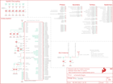

Contents
========

* [PRS15332 > SparkFun Artemis](#prs15332--sparkfun-artemis)
	* [Schematic](#schematic)
	* [PCB](#pcb)
	* [Interactive BOM](#interactive-bom)
	* [OOMP Parts](#oomp-parts)
	* [Images](#images)
	* [Tags](#tags)
  
![][im]
# PRS15332 > SparkFun Artemis

- ID: PROJ-SPAR-15332-STAN-01
- Hex ID: PRS15332
- Name: Sparkfun
- Description: Sparkfun
- Long Link: [http://oom.lt/PROJ-SPAR-15332-STAN-01](http://oom.lt/PROJ-SPAR-15332-STAN-01)
- Short Link: [http://oom.lt/PRS15332](http://oom.lt/PRS15332)

## Schematic
  

## PCB
  

## Interactive BOM

- Interactive BOM page: [ibom.html](https://htmlpreview.github.io/?https://github.com/oomlout/oomlout_OOMP_projects/blob/main/PROJ-SPAR-15332-STAN-01/kicad/bom/ibom.html)

## OOMP Parts
  

|OOMP ID|Name|Identifier|
| :---: | :---: | :---: |
|UNMATCHED-UNMATCHED-X-UNMATCHED-01||A1, U1, Y1|
|CAPC-0402-X-UF47-01||C1|
|[CAPC-0402-X-UF47D-V63D](https://github.com/oomlout/oomlout_OOMP_parts/tree/main/CAPC-0402-X-UF47D-V63D/)|[SMD (0402) 4.7 uF Capacitor (Ceramic) 6.3v](https://github.com/oomlout/oomlout_OOMP_parts/tree/main/CAPC-0402-X-UF47D-V63D/)|[C2](https://github.com/oomlout/oomlout_OOMP_parts/tree/main/CAPC-0402-X-UF47D-V63D/)|
|CAPC-0402-X-UF22D-01||C3, C5, C8, C16|
|CAPC-0402-X-UNMATCHED-01||C4, C12, C13, C14, C15|
|CAPC-0402-X-PF6-01||C6, C7|
|[CAPC-0402-X-NF47-V25](https://github.com/oomlout/oomlout_OOMP_parts/tree/main/CAPC-0402-X-NF47-V25/)|[SMD (0402) 47 nF Capacitor (Ceramic) 25v](https://github.com/oomlout/oomlout_OOMP_parts/tree/main/CAPC-0402-X-NF47-V25/)|[C11](https://github.com/oomlout/oomlout_OOMP_parts/tree/main/CAPC-0402-X-NF47-V25/)|
|CAPC-0402-X-NF500-01||C18|
|UNMATCHED-0805-X-UNMATCHED-01||L1, L2|
|UNMATCHED-0402-X-UNMATCHED-01||L3, L4|
|RESE-0402-X-UNMATCHED-01||R2|

## Images
  
  

|bominteractivefront|bominteractiveback|kicadPcb3d|kicadPcb3dFront|kicadPcb3dBack|eagleImage|eagleSchemImage|pcbdraw|pcbdrawback|
| :---: | :---: | :---: | :---: | :---: | :---: | :---: | :---: | :---: |
||||||||||

## Tags

- hexID: PRS15332
- oompType: PROJ
- oompSize: SPAR
- oompColor: 15332
- oompDesc: STAN
- oompIndex: 01
- oompName: SparkFun Artemis
- sources: All source files from https://github.com/sparkfun/SparkFun_Artemis (source licence details in srcLicense.md)
- linkBuyPage: https://www.sparkfun.com/products/15332
- oompID: PROJ-SPAR-15332-STAN-01
- oompParts: A1,UNMATCHED-UNMATCHED-X-UNMATCHED-01
- oompParts: C1,CAPC-0402-X-UF47-01
- oompParts: C2,CAPC-0402-X-UF47D-V63D
- oompParts: C3,CAPC-0402-X-UF22D-01
- oompParts: C4,CAPC-0402-X-UNMATCHED-01
- oompParts: C5,CAPC-0402-X-UF22D-01
- oompParts: C6,CAPC-0402-X-PF6-01
- oompParts: C7,CAPC-0402-X-PF6-01
- oompParts: C8,CAPC-0402-X-UF22D-01
- oompParts: C11,CAPC-0402-X-NF47-V25
- oompParts: C12,CAPC-0402-X-UNMATCHED-01
- oompParts: C13,CAPC-0402-X-UNMATCHED-01
- oompParts: C14,CAPC-0402-X-UNMATCHED-01
- oompParts: C15,CAPC-0402-X-UNMATCHED-01
- oompParts: C16,CAPC-0402-X-UF22D-01
- oompParts: C18,CAPC-0402-X-NF500-01
- oompParts: L1,UNMATCHED-0805-X-UNMATCHED-01
- oompParts: L2,UNMATCHED-0805-X-UNMATCHED-01
- oompParts: L3,UNMATCHED-0402-X-UNMATCHED-01
- oompParts: L4,UNMATCHED-0402-X-UNMATCHED-01
- oompParts: R2,RESE-0402-X-UNMATCHED-01
- oompParts: U1,UNMATCHED-UNMATCHED-X-UNMATCHED-01
- oompParts: Y1,UNMATCHED-UNMATCHED-X-UNMATCHED-01
- rawParts: A1,2.4GHZ-3.2X1.6MM,ANTENNA2.4GHZ-8.0X1.0MM,ANT-2.4GHZ-8.0X1.0MM,Single-ended Antennae,,ANT-14377,,,
- rawParts: C1,0.47uF,470NF-0402_TIGHT-6.3V-10%-X5R,0402-TIGHT,0.47uF/470nF ceramic capacitors,,CAP-14242,,0.47uF,
- rawParts: C2,4.7uF,4.7UF-0402_TIGHT-6.3V-20%-X5R,0402-TIGHT,4.7µF ceramic capacitors,,CAP-14240,,4.7uF,
- rawParts: C3,2.2uF,2.2UF-0402_TIGHT-10V-10%-X5R,0402-TIGHT,2.2µF ceramic capacitors,,CAP-14232,,2.2uF,
- rawParts: C4,1.0uF,1.0UF-0402-TIGHT-16V-10%,0402-TIGHT,1µF ceramic capacitors,,CAP-12417,,1.0uF,
- rawParts: C5,2.2uF,2.2UF-0402_TIGHT-10V-10%-X5R,0402-TIGHT,2.2µF ceramic capacitors,,CAP-14232,,2.2uF,
- rawParts: C6,6pF,6PF-0402-TIGHT-50V-0.5%,0402-TIGHT,6pF ceramic capacitors,,CAP-13455,,6pF,
- rawParts: C7,6pF,6PF-0402-TIGHT-50V-0.5%,0402-TIGHT,6pF ceramic capacitors,,CAP-13455,,6pF,
- rawParts: C8,2.2uF,2.2UF-0402_TIGHT-10V-10%-X5R,0402-TIGHT,2.2µF ceramic capacitors,,CAP-14232,,2.2uF,
- rawParts: C11,47nF,47NF-0402_TIGHT-25V-10%-X7R,0402-TIGHT,47nF ceramic capacitors,,CAP-14243,,47nF,
- rawParts: C12,1.0uF,1.0UF-0402-TIGHT-16V-10%,0402-TIGHT,1µF ceramic capacitors,,CAP-12417,,1.0uF,
- rawParts: C13,1.0uF,1.0UF-0402-TIGHT-16V-10%,0402-TIGHT,1µF ceramic capacitors,,CAP-12417,,1.0uF,
- rawParts: C14,1.0uF,1.0UF-0402-TIGHT-16V-10%,0402-TIGHT,1µF ceramic capacitors,,CAP-12417,,1.0uF,
- rawParts: C15,1.0uF,1.0UF-0402-TIGHT-16V-10%,0402-TIGHT,1µF ceramic capacitors,,CAP-12417,,1.0uF,
- rawParts: C16,2.2uF,2.2UF-0402_TIGHT-10V-10%-X5R,0402-TIGHT,2.2µF ceramic capacitors,,CAP-14232,,2.2uF,
- rawParts: C17,DNP,DNP-CAP-0402-TIGHT,0402-TIGHT,0.18µF ceramic capacitor,,,,DNP,
- rawParts: C18,0.5pF,0.5PF-0402_TIGHT-20V-PM0.05PF-NP0,0402-TIGHT,0.5pF ceramic capacitors,,CAP-14231,,0.5pF,
- rawParts: FD3,FIDUCIAL0.2MM,FIDUCIAL0.2MM,FIDUCIAL-0.2MM,Fiducial Alignment Points,,,,,
- rawParts: FD4,FIDUCIAL0.2MM,FIDUCIAL0.2MM,FIDUCIAL-0.2MM,Fiducial Alignment Points,,,,,
- rawParts: FRAME1,FRAME-LETTER,FRAME-LETTER,CREATIVE_COMMONS,Schematic Frame - Letter,,,,,
- rawParts: J1,PAD.4X.6,PAD.4X.6,MODULE_PAD,,,,,,
- rawParts: J2,PAD.4X.6,PAD.4X.6,MODULE_PAD,,,,,,
- rawParts: J3,PAD.4X.6,PAD.4X.6,MODULE_PAD,,,,,,
- rawParts: J4,PAD.4X.6,PAD.4X.6,MODULE_PAD,,,,,,
- rawParts: J5,PAD.4X.6,PAD.4X.6,MODULE_PAD,,,,,,
- rawParts: J6,PAD.4X.6,PAD.4X.6,MODULE_PAD,,,,,,
- rawParts: J7,PAD.4X.6,PAD.4X.6,MODULE_PAD,,,,,,
- rawParts: J8,PAD.4X.6,PAD.4X.6,MODULE_PAD,,,,,,
- rawParts: J9,PAD.4X.6,PAD.4X.6,MODULE_PAD,,,,,,
- rawParts: J10,PAD.4X.6,PAD.4X.6,MODULE_PAD,,,,,,
- rawParts: J11,PAD.4X.6,PAD.4X.6,MODULE_PAD,,,,,,
- rawParts: J12,PAD.4X.6,PAD.4X.6,MODULE_PAD,,,,,,
- rawParts: J13,PAD.4X.6,PAD.4X.6,MODULE_PAD,,,,,,
- rawParts: J14,PAD.4X.6,PAD.4X.6,MODULE_PAD,,,,,,
- rawParts: J15,PAD.4X.6,PAD.4X.6,MODULE_PAD,,,,,,
- rawParts: J16,PAD.4X.6,PAD.4X.6,MODULE_PAD,,,,,,
- rawParts: J17,PAD.4X.6,PAD.4X.6,MODULE_PAD,,,,,,
- rawParts: J18,PAD.4X.6,PAD.4X.6,MODULE_PAD,,,,,,
- rawParts: J19,PAD.4X.6,PAD.4X.6,MODULE_PAD,,,,,,
- rawParts: J20,PAD.4X.6,PAD.4X.6,MODULE_PAD,,,,,,
- rawParts: J21,PAD.4X.6,PAD.4X.6,MODULE_PAD,,,,,,
- rawParts: J22,PAD.35X.35,PAD.35X.35,MODULE_MINI_PAD,,,,,,
- rawParts: J23,PAD.4X.6,PAD.4X.6,MODULE_PAD,,,,,,
- rawParts: J24,PAD.4X.6,PAD.4X.6,MODULE_PAD,,,,,,
- rawParts: J25,PAD.4X.6,PAD.4X.6,MODULE_PAD,,,,,,
- rawParts: J26,PAD.4X.6,PAD.4X.6,MODULE_PAD,,,,,,
- rawParts: J27,PAD.4X.6,PAD.4X.6,MODULE_PAD,,,,,,
- rawParts: J28,PAD.4X.6,PAD.4X.6,MODULE_PAD,,,,,,
- rawParts: J29,PAD.4X.6,PAD.4X.6,MODULE_PAD,,,,,,
- rawParts: J30,PAD.4X.6,PAD.4X.6,MODULE_PAD,,,,,,
- rawParts: J31,PAD.4X.6,PAD.4X.6,MODULE_PAD,,,,,,
- rawParts: J32,PAD.4X.6,PAD.4X.6,MODULE_PAD,,,,,,
- rawParts: J33,PAD.4X.6,PAD.4X.6,MODULE_PAD,,,,,,
- rawParts: J34,PAD.4X.6,PAD.4X.6,MODULE_PAD,,,,,,
- rawParts: J35,PAD.4X.6,PAD.4X.6,MODULE_PAD,,,,,,
- rawParts: J36,PAD.4X.6,PAD.4X.6,MODULE_PAD,,,,,,
- rawParts: J37,PAD.4X.6,PAD.4X.6,MODULE_PAD,,,,,,
- rawParts: J38,PAD.35X.35,PAD.35X.35,MODULE_MINI_PAD,,,,,,
- rawParts: J39,PAD.4X.6,PAD.4X.6,MODULE_PAD,,,,,,
- rawParts: J40,PAD.4X.6,PAD.4X.6,MODULE_PAD,,,,,,
- rawParts: J41,PAD.4X.6,PAD.4X.6,MODULE_PAD,,,,,,
- rawParts: J42,PAD.4X.6,PAD.4X.6,MODULE_PAD,,,,,,
- rawParts: J43,PAD.4X.6,PAD.4X.6,MODULE_PAD,,,,,,
- rawParts: J44,PAD.4X.6,PAD.4X.6,MODULE_PAD,,,,,,
- rawParts: J45,PAD.4X.6,PAD.4X.6,MODULE_PAD,,,,,,
- rawParts: J46,PAD.4X.6,PAD.4X.6,MODULE_PAD,,,,,,
- rawParts: J47,PAD.4X.6,PAD.4X.6,MODULE_PAD,,,,,,
- rawParts: J48,PAD.4X.6,PAD.4X.6,MODULE_PAD,,,,,,
- rawParts: J49,PAD.4X.6,PAD.4X.6,MODULE_PAD,,,,,,
- rawParts: J50,PAD.4X.6,PAD.4X.6,MODULE_PAD,,,,,,
- rawParts: J51,PAD.4X.6,PAD.4X.6,MODULE_PAD,,,,,,
- rawParts: J52,PAD.4X.6,PAD.4X.6,MODULE_PAD,,,,,,
- rawParts: J53,PAD.4X.6,PAD.4X.6,MODULE_PAD,,,,,,
- rawParts: J54,PAD.4X.6,PAD.4X.6,MODULE_PAD,,,,,,
- rawParts: J55,PAD.4X.6,PAD.4X.6,MODULE_PAD,,,,,,
- rawParts: J56,PAD.4X.6,PAD.4X.6,MODULE_PAD,,,,,,
- rawParts: J57,PAD.4X.6,PAD.4X.6,MODULE_PAD,,,,,,
- rawParts: J58,PAD.4X.6,PAD.4X.6,MODULE_PAD,,,,,,
- rawParts: J59,PAD.4X.6,PAD.4X.6,MODULE_PAD,,,,,,
- rawParts: L1,2.2μH,2.2μH-0805_WIDE-2.2μH-1.7A-0.14OHM,0805-WIDE,2.2μH Inductor,,NDUC-14234,,2.2μH,
- rawParts: L2,1.0μH,1.0μH-0805_WIDE-1.0μH-1.45A-0.106OHM-1.0MM_H,0805-WIDE,1.0μH Inductor,,NDUC-14375,,1.0μH,
- rawParts: L3,2.7nH/?%/900mA/70mOhm,INDUCTOR-0402_TIGHT-2.7NH,0402-TIGHT,Inductors,,NDUC-14236,,2.7nH/?%/900mA/70mOhm,
- rawParts: L4,2nH/?%/200mA/300mOhm,INDUCTOR-0402_TIGHT-2.0NH,0402-TIGHT,Inductors,,NDUC-14238,,2nH/?%/200mA/300mOhm,
- rawParts: LOGO1,SFE_LOGO_FLAME.05_INCH_INTERNAL,SFE_LOGO_FLAME.05_INCH_INTERNAL,SFE_LOGO_FLAME_INTERNAL_0.05,SparkFun Flame Logo,,,,,
- rawParts: R2,0,0OHM-0402T-1/10W,0402-TIGHT,0Ω resistor,,RES-14244,,0,
- rawParts: U1,AMBIQ-APOLLO3KBR,AMBIQ-APOLLO3KBR,BGA-81-5X5MM,,,IC-14228,,,
- rawParts: Y1,32MHz,CRYSTAL-32MHZ-SMD-2.0X1.6MM,CRYSTAL-SMD-2.0X1.6MM,32MHz Crystal,,XTAL-13459,,32MHz,

[im]: kicadPcb3d_450.png
