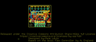
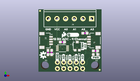
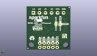
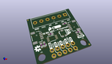

Contents
========

* [PROJ-SPAR-15334-STAN-01>SparkFun Qwiic 12 Bit ADC - 4 Channel ADS1015](#proj-spar-15334-stan-01sparkfun-qwiic-12-bit-adc---4-channel-ads1015)
	* [Images](#images)
	* [Interactive BOM](#interactive-bom)
	* [OOMP Parts](#oomp-parts)
	* [Tags](#tags)
  
![][im]
# PROJ-SPAR-15334-STAN-01>SparkFun Qwiic 12 Bit ADC - 4 Channel ADS1015

- ID: PROJ-SPAR-15334-STAN-01
- Hex ID: PRS15334
- Name: SparkFun Qwiic 12 Bit ADC - 4 Channel ADS1015
- Description: 

## Images
  
  

|eagleImage|kicadPcb3dFront|kicadPcb3dBack|kicadPcb3d|
| :---: | :---: | :---: | :---: |
|||||

## Interactive BOM

- Interactive BOM page: [ibom.html](kicad/bom/ibom.html)

## OOMP Parts
  

|OOMP Parts|
| :---: |
|<table><tr><td></td><td> C1</td><td>[CAPC-0603-X-NF100-V50 SMD (0603) 100 nF Capacitor (Ceramic) 50v](https://github.com/oomlout/oomlout_OOMP_parts/tree/main/CAPC-0603-X-NF100-V50/)</td><td>[C6N100](https://github.com/oomlout/oomlout_OOMP_parts/tree/main/CAPC-0603-X-NF100-V50/)</td></tr></table>|
|UNMATCHED-0603-X-UNMATCHED-01, D1, 22.9616, 7.0358, 0,D1, RED, LED-0603, SparkFun-LED, (0.904, 0.277), R0|
|UNMATCHED-UNMATCHED-X-UNMATCHED-01, J1, 20.32, 12.7, 90,J1, JST04_1MM_RA, SparkFun-Connectors, (0.8, 0.5), R90|
|UNMATCHED-UNMATCHED-X-UNMATCHED-01, J2, 5.08, 12.7, 270,J2, JST04_1MM_RA, SparkFun-Connectors, (0.2, 0.5), R270|
|UNMATCHED-UNMATCHED-X-UNMATCHED-01, J3, 17.779999999999998, 3.8099999999999996, 180,J3, 2X5_NOSILK, SparkFun-Connectors, (0.7, 0.15), R180|
|ERROR, J4 Screw Pin, 0, 0, 0,J4, Screw, Pin, SCREWTERMINAL-3.5MM-6, SparkFun-Connectors, (0.844, 0.85), R180|
|UNMATCHED-UNMATCHED-X-UNMATCHED-01, JP1, 3.302, 7.365999999999999, M0,JP1, JUMPER-SMT_3_2-NC_TRACE_NO-SILK, SMT-JUMPER_3_2-NC_TRACE_NO-SILK, SparkFun-Jumpers, (0.13, 0.29), MR0|
|UNMATCHED-UNMATCHED-X-UNMATCHED-01, JP2, 5.842, 15.112999999999998, M90,JP2, JUMPER-SMT_3_1-NC_TRACE_NO-SILK, SMT-JUMPER_3_1-NC_TRACE_NO-SILK, SparkFun-Jumpers, (0.23, 0.595), MR90|
|UNMATCHED-UNMATCHED-X-UNMATCHED-01, JP3, 8.382, 15.112999999999998, M270,JP3, JUMPER-SMT_3_NO_NO_SILK, SMT-JUMPER_3_0-NO_TRACE_NO-SILK, SparkFun-Jumpers, (0.33, 0.595), MR270|
|UNMATCHED-UNMATCHED-X-UNMATCHED-01, JP4, 17.51838127, 12.476481269999999, M180,JP4, SMT-JUMPER_2_NC_TRACE_SILK, SparkFun-Jumpers, (0.68970005, 0.49120005), MR180|
|RESE-0603-X-UNMATCHED-01, R1, 3.8353999999999995, 7.823199999999999, 270,R1, 4.7k, 0603, SparkFun-Resistors, (0.151, 0.308), R270|
|RESE-0603-X-UNMATCHED-01, R2, 5.298440508, 7.830818729999999, 270,R2, 4.7k, 0603, SparkFun-Resistors, (0.20860002, 0.30829995), R270|
|RESE-0603-X-UNMATCHED-01, R3, 18.727421777999997, 15.67941873, 0,R3, 4.7k, 0603, SparkFun-Resistors, (0.73730007, 0.61729995), R0|
|RESE-0603-X-UNMATCHED-01, R4, 22.9616, 8.4836, 0,R4, 1k, 0603, SparkFun-Resistors, (0.904, 0.334), R0|
|UNMATCHED-UNMATCHED-X-UNMATCHED-01, U1, 9.652, 9.524999999999999, 270,U1, ADS1015, MSOP10, SparkFun-IC-Conversion, (0.38, 0.375), R270|
|UNMATCHED-UNMATCHED-X-UNMATCHED-01, VR1, 15.620999999999999, 10.413999999999998, 0,VR1, 10k, TRIMPOT-SMD-3MM-CLOSED, SparkFun-Resistors, (0.615, 0.41), R0|

## Tags

- hexID: PRS15334
- oompType: PROJ
- oompSize: SPAR
- oompColor: 15334
- oompDesc: STAN
- oompIndex: 01
- oompName: SparkFun Qwiic 12 Bit ADC - 4 Channel ADS1015
- sources: All source files from https://github.com/sparkfun/SparkFun_Qwiic_12_Bit_ADC_-_4_Channel_ADS1015 (source licence details in srcLicense.md)
- linkBuyPage: https://www.sparkfun.com/products/15334
- oompPart: CAPC-0603-X-NF100-V50, C1, 9.652, 12.065, 0
- oompPart: UNMATCHED-0603-X-UNMATCHED-01, D1, 22.9616, 7.0358, 0
- oompPart: SKIP-UNMATCHED-X-UNMATCHED-01, FD1, 24.637999999999998, 0.7619999999999999, 0
- oompPart: SKIP-UNMATCHED-X-UNMATCHED-01, FD2, 24.637999999999998, 0.7619999999999999, M0
- oompPart: SKIP-UNMATCHED-X-UNMATCHED-01, FD3, 0.635, 24.764999999999997, 0
- oompPart: SKIP-UNMATCHED-X-UNMATCHED-01, FD4, 0.635, 24.764999999999997, M0
- oompPart: UNMATCHED-UNMATCHED-X-UNMATCHED-01, J1, 20.32, 12.7, 90
- oompPart: UNMATCHED-UNMATCHED-X-UNMATCHED-01, J2, 5.08, 12.7, 270
- oompPart: UNMATCHED-UNMATCHED-X-UNMATCHED-01, J3, 17.779999999999998, 3.8099999999999996, 180
- oompPart: ERROR, J4 Screw Pin, 0, 0, 0
- oompPart: UNMATCHED-UNMATCHED-X-UNMATCHED-01, JP1, 3.302, 7.365999999999999, M0
- oompPart: UNMATCHED-UNMATCHED-X-UNMATCHED-01, JP2, 5.842, 15.112999999999998, M90
- oompPart: UNMATCHED-UNMATCHED-X-UNMATCHED-01, JP3, 8.382, 15.112999999999998, M270
- oompPart: UNMATCHED-UNMATCHED-X-UNMATCHED-01, JP4, 17.51838127, 12.476481269999999, M180
- oompPart: RESE-0603-X-UNMATCHED-01, R1, 3.8353999999999995, 7.823199999999999, 270
- oompPart: RESE-0603-X-UNMATCHED-01, R2, 5.298440508, 7.830818729999999, 270
- oompPart: RESE-0603-X-UNMATCHED-01, R3, 18.727421777999997, 15.67941873, 0
- oompPart: RESE-0603-X-UNMATCHED-01, R4, 22.9616, 8.4836, 0
- oompPart: UNMATCHED-UNMATCHED-X-UNMATCHED-01, U1, 9.652, 9.524999999999999, 270
- oompPart: UNMATCHED-UNMATCHED-X-UNMATCHED-01, VR1, 15.620999999999999, 10.413999999999998, 0
- rawPart: C1, 0.1uF, 0603, SparkFun-Capacitors, (0.38, 0.475), R0
- rawPart: D1, RED, LED-0603, SparkFun-LED, (0.904, 0.277), R0
- rawPart: FD1, FIDUCIALUFIDUCIAL, FIDUCIAL-MICRO, SparkFun-Aesthetics, (0.97, 0.03), R0
- rawPart: FD2, FIDUCIALUFIDUCIAL, FIDUCIAL-MICRO, SparkFun-Aesthetics, (0.97, 0.03), MR0
- rawPart: FD3, FIDUCIALUFIDUCIAL, FIDUCIAL-MICRO, SparkFun-Aesthetics, (0.025, 0.975), R0
- rawPart: FD4, FIDUCIALUFIDUCIAL, FIDUCIAL-MICRO, SparkFun-Aesthetics, (0.025, 0.975), MR0
- rawPart: J1, JST04_1MM_RA, SparkFun-Connectors, (0.8, 0.5), R90
- rawPart: J2, JST04_1MM_RA, SparkFun-Connectors, (0.2, 0.5), R270
- rawPart: J3, 2X5_NOSILK, SparkFun-Connectors, (0.7, 0.15), R180
- rawPart: J4, Screw, Pin, SCREWTERMINAL-3.5MM-6, SparkFun-Connectors, (0.844, 0.85), R180
- rawPart: JP1, JUMPER-SMT_3_2-NC_TRACE_NO-SILK, SMT-JUMPER_3_2-NC_TRACE_NO-SILK, SparkFun-Jumpers, (0.13, 0.29), MR0
- rawPart: JP2, JUMPER-SMT_3_1-NC_TRACE_NO-SILK, SMT-JUMPER_3_1-NC_TRACE_NO-SILK, SparkFun-Jumpers, (0.23, 0.595), MR90
- rawPart: JP3, JUMPER-SMT_3_NO_NO_SILK, SMT-JUMPER_3_0-NO_TRACE_NO-SILK, SparkFun-Jumpers, (0.33, 0.595), MR270
- rawPart: JP4, SMT-JUMPER_2_NC_TRACE_SILK, SparkFun-Jumpers, (0.68970005, 0.49120005), MR180
- rawPart: R1, 4.7k, 0603, SparkFun-Resistors, (0.151, 0.308), R270
- rawPart: R2, 4.7k, 0603, SparkFun-Resistors, (0.20860002, 0.30829995), R270
- rawPart: R3, 4.7k, 0603, SparkFun-Resistors, (0.73730007, 0.61729995), R0
- rawPart: R4, 1k, 0603, SparkFun-Resistors, (0.904, 0.334), R0
- rawPart: U1, ADS1015, MSOP10, SparkFun-IC-Conversion, (0.38, 0.375), R270
- rawPart: VR1, 10k, TRIMPOT-SMD-3MM-CLOSED, SparkFun-Resistors, (0.615, 0.41), R0
- oompID: PROJ-SPAR-15334-STAN-01

[im]: kicadPcb3d_450.png
