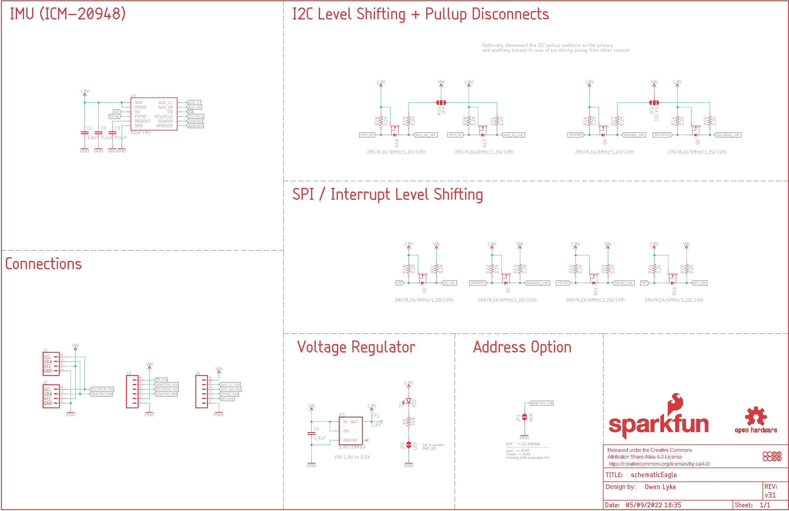
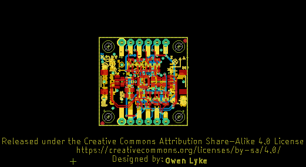
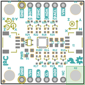
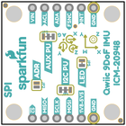
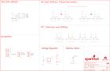
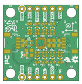
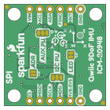

Contents
========

* [PRS15335 > SparkFun Qwiic 9DoF IMU Breakout](#prs15335--sparkfun-qwiic-9dof-imu-breakout)
	* [Schematic](#schematic)
	* [PCB](#pcb)
	* [Interactive BOM](#interactive-bom)
	* [OOMP Parts](#oomp-parts)
	* [Images](#images)
	* [Tags](#tags)
  
![][im]
# PRS15335 > SparkFun Qwiic 9DoF IMU Breakout

- ID: PROJ-SPAR-15335-STAN-01
- Hex ID: PRS15335
- Name: Sparkfun
- Description: Sparkfun
- Long Link: [http://oom.lt/PROJ-SPAR-15335-STAN-01](http://oom.lt/PROJ-SPAR-15335-STAN-01)
- Short Link: [http://oom.lt/PRS15335](http://oom.lt/PRS15335)

## Schematic
  

## PCB
  

## Interactive BOM

- Interactive BOM page: [ibom.html](https://htmlpreview.github.io/?https://github.com/oomlout/oomlout_OOMP_projects/blob/main/PROJ-SPAR-15335-STAN-01/kicad/bom/ibom.html)

## OOMP Parts
  

|OOMP ID|Name|Identifier|
| :---: | :---: | :---: |
|CAPC-0603-X-UNMATCHED-01||C1, C4|
|[CAPC-0603-X-NF100-V50](https://github.com/oomlout/oomlout_OOMP_parts/tree/main/CAPC-0603-X-NF100-V50/)|[SMD (0603) 100 nF Capacitor (Ceramic) 50v](https://github.com/oomlout/oomlout_OOMP_parts/tree/main/CAPC-0603-X-NF100-V50/)|[C2, C3](https://github.com/oomlout/oomlout_OOMP_parts/tree/main/CAPC-0603-X-NF100-V50/)|
|[LEDS-0603-R-STAN-01](https://github.com/oomlout/oomlout_OOMP_parts/tree/main/LEDS-0603-R-STAN-01/)|[SMD (0603) Red LED](https://github.com/oomlout/oomlout_OOMP_parts/tree/main/LEDS-0603-R-STAN-01/)|[D1](https://github.com/oomlout/oomlout_OOMP_parts/tree/main/LEDS-0603-R-STAN-01/)|
|UNMATCHED-UNMATCHED-X-UNMATCHED-01||J1, J2, JP2, JP3, JP4, JP5, TP1, U2, U3|
|[HEAD-I01-X-PI06-01](https://github.com/oomlout/oomlout_OOMP_parts/tree/main/HEAD-I01-X-PI06-01/)|[2.54 mm 6 Pin Header](https://github.com/oomlout/oomlout_OOMP_parts/tree/main/HEAD-I01-X-PI06-01/)|[J3, J4](https://github.com/oomlout/oomlout_OOMP_parts/tree/main/HEAD-I01-X-PI06-01/)|
|MOSN-UNMATCHED-X-UNMATCHED-01||Q2, Q4, Q6, Q8, Q10, Q12, Q14, Q16|
|[RESE-0603-X-O221-01](https://github.com/oomlout/oomlout_OOMP_parts/tree/main/RESE-0603-X-O221-01/)|[SMD (0603) 220 Ohm Resistor](https://github.com/oomlout/oomlout_OOMP_parts/tree/main/RESE-0603-X-O221-01/)|[R9](https://github.com/oomlout/oomlout_OOMP_parts/tree/main/RESE-0603-X-O221-01/)|
|[RESE-0402-X-O222-01](https://github.com/oomlout/oomlout_OOMP_parts/tree/main/RESE-0402-X-O222-01/)|[SMD (0402) 2.2k Ohm Resistor](https://github.com/oomlout/oomlout_OOMP_parts/tree/main/RESE-0402-X-O222-01/)|[R10, R11, R12, R13, R14, R15, R16, R17, R18, R19, R20, R21, R22, R23, R24, R25](https://github.com/oomlout/oomlout_OOMP_parts/tree/main/RESE-0402-X-O222-01/)|

## Images
  
  

|bominteractivefront|bominteractiveback|kicadPcb3d|kicadPcb3dFront|kicadPcb3dBack|eagleImage|eagleSchemImage|pcbdraw|pcbdrawback|
| :---: | :---: | :---: | :---: | :---: | :---: | :---: | :---: | :---: |
||||||||||

## Tags

- hexID: PRS15335
- oompType: PROJ
- oompSize: SPAR
- oompColor: 15335
- oompDesc: STAN
- oompIndex: 01
- oompName: SparkFun Qwiic 9DoF IMU Breakout
- sources: All source files from https://github.com/sparkfun/SparkFun_Qwiic_9DoF_IMU_Breakout (source licence details in srcLicense.md)
- linkBuyPage: https://www.sparkfun.com/products/15335
- oompID: PROJ-SPAR-15335-STAN-01
- oompParts: C1,CAPC-0603-X-UNMATCHED-01
- oompParts: C2,CAPC-0603-X-NF100-V50
- oompParts: C3,CAPC-0603-X-NF100-V50
- oompParts: C4,CAPC-0603-X-UNMATCHED-01
- oompParts: D1,LEDS-0603-R-STAN-01
- oompParts: J1,UNMATCHED-UNMATCHED-X-UNMATCHED-01
- oompParts: J2,UNMATCHED-UNMATCHED-X-UNMATCHED-01
- oompParts: J3,HEAD-I01-X-PI06-01
- oompParts: J4,HEAD-I01-X-PI06-01
- oompParts: JP2,UNMATCHED-UNMATCHED-X-UNMATCHED-01
- oompParts: JP3,UNMATCHED-UNMATCHED-X-UNMATCHED-01
- oompParts: JP4,UNMATCHED-UNMATCHED-X-UNMATCHED-01
- oompParts: JP5,UNMATCHED-UNMATCHED-X-UNMATCHED-01
- oompParts: Q2,MOSN-UNMATCHED-X-UNMATCHED-01
- oompParts: Q4,MOSN-UNMATCHED-X-UNMATCHED-01
- oompParts: Q6,MOSN-UNMATCHED-X-UNMATCHED-01
- oompParts: Q8,MOSN-UNMATCHED-X-UNMATCHED-01
- oompParts: Q10,MOSN-UNMATCHED-X-UNMATCHED-01
- oompParts: Q12,MOSN-UNMATCHED-X-UNMATCHED-01
- oompParts: Q14,MOSN-UNMATCHED-X-UNMATCHED-01
- oompParts: Q16,MOSN-UNMATCHED-X-UNMATCHED-01
- oompParts: R9,RESE-0603-X-O221-01
- oompParts: R10,RESE-0402-X-O222-01
- oompParts: R11,RESE-0402-X-O222-01
- oompParts: R12,RESE-0402-X-O222-01
- oompParts: R13,RESE-0402-X-O222-01
- oompParts: R14,RESE-0402-X-O222-01
- oompParts: R15,RESE-0402-X-O222-01
- oompParts: R16,RESE-0402-X-O222-01
- oompParts: R17,RESE-0402-X-O222-01
- oompParts: R18,RESE-0402-X-O222-01
- oompParts: R19,RESE-0402-X-O222-01
- oompParts: R20,RESE-0402-X-O222-01
- oompParts: R21,RESE-0402-X-O222-01
- oompParts: R22,RESE-0402-X-O222-01
- oompParts: R23,RESE-0402-X-O222-01
- oompParts: R24,RESE-0402-X-O222-01
- oompParts: R25,RESE-0402-X-O222-01
- oompParts: TP1,UNMATCHED-UNMATCHED-X-UNMATCHED-01
- oompParts: U2,UNMATCHED-UNMATCHED-X-UNMATCHED-01
- oompParts: U3,UNMATCHED-UNMATCHED-X-UNMATCHED-01
- rawParts: C1,1.0uF,1.0UF-0603-16V-10%-X7R,0603,1µF ceramic capacitors,,CAP-13930,,1.0uF,
- rawParts: C2,0.1uF,0.1UF-0603-25V-5%,0603,0.1µF ceramic capacitors,,CAP-08604,,0.1uF,
- rawParts: C3,0.1uF,0.1UF-0603-25V-5%,0603,0.1µF ceramic capacitors,,CAP-08604,,0.1uF,
- rawParts: C4,1.0uF,1.0UF-0603-16V-10%-X7R,0603,1µF ceramic capacitors,,CAP-13930,,1.0uF,
- rawParts: D1,RED,LED-RED0603,LED-0603,Red SMD LED,,DIO-00819,,RED,
- rawParts: FD1,FIDUCIAL1X2,FIDUCIAL1X2,FIDUCIAL-1X2,Fiducial Alignment Points,,,,,
- rawParts: FD2,FIDUCIAL1X2,FIDUCIAL1X2,FIDUCIAL-1X2,Fiducial Alignment Points,,,,,
- rawParts: FD3,FIDUCIAL1X2,FIDUCIAL1X2,FIDUCIAL-1X2,Fiducial Alignment Points,,,,,
- rawParts: FD4,FIDUCIAL1X2,FIDUCIAL1X2,FIDUCIAL-1X2,Fiducial Alignment Points,,,,,
- rawParts: FRAME2,FRAME-LEDGER,FRAME-LEDGER,CREATIVE_COMMONS,Schematic Frame - Ledger,Owen Lyke,,v31,,
- rawParts: H1,STAND-OFF,STAND-OFF,STAND-OFF,Stand Off,,,,,
- rawParts: H2,STAND-OFF,STAND-OFF,STAND-OFF,Stand Off,,,,,
- rawParts: H3,STAND-OFF,STAND-OFF,STAND-OFF,Stand Off,,,,,
- rawParts: H4,STAND-OFF,STAND-OFF,STAND-OFF,Stand Off,,,,,
- rawParts: J1,,QWIIC_CONNECTORJS-1MM,JST04_1MM_RA,SparkFun I2C Standard Qwiic Connector,,CONN-13694,,,
- rawParts: J2,,QWIIC_CONNECTORJS-1MM,JST04_1MM_RA,SparkFun I2C Standard Qwiic Connector,,CONN-13694,,,
- rawParts: J3,,CONN_06NO_SILK_NO_POP,1X06_NO_SILK,Multi connection point. Often used as Generic Header-pin footprint for 0.1 inch spaced/style header connections,,,,,
- rawParts: J4,,CONN_06NO_SILK_NO_POP,1X06_NO_SILK,Multi connection point. Often used as Generic Header-pin footprint for 0.1 inch spaced/style header connections,,,,,
- rawParts: JP2,ADR,JUMPER-SMT_2_NO_SILK,SMT-JUMPER_2_NO_SILK,Normally open jumper,,,,,
- rawParts: JP3,AUX,JUMPER-SMT_3_2-NC_TRACE_SILK,SMT-JUMPER_3_2-NC_TRACE_SILK,Normally closed trace jumper (2 of 2 connections),,,,,
- rawParts: JP4,I2C PU,JUMPER-SMT_3_2-NC_TRACE_SILK,SMT-JUMPER_3_2-NC_TRACE_SILK,Normally closed trace jumper (2 of 2 connections),,,,,
- rawParts: JP5,LED,JUMPER-SMT_2_NC_TRACE_SILK,SMT-JUMPER_2_NC_TRACE_SILK,Normally closed trace jumper,,,,,
- rawParts: LOGO1,SFE_LOGO_NAME_FLAME.1_INCH,SFE_LOGO_NAME_FLAME.1_INCH,SFE_LOGO_NAME_FLAME_.1,SparkFun Font Logo w/ Flame,,,,,
- rawParts: LOGO2,OSHW-LOGOMINI,OSHW-LOGOMINI,OSHW-LOGO-MINI,Open-Source Hardware (OSHW) Logo,,,,,
- rawParts: Q2,20V/0.2A/8MHz/1.2Ω/1Vth,MOSFET-NCH-RE1C002UN,SOT-416FL,N-channel MOSFETs,,TRANS_14399,,20V/0.2A/8MHz/1.2Ω/1Vth,
- rawParts: Q4,20V/0.2A/8MHz/1.2Ω/1Vth,MOSFET-NCH-RE1C002UN,SOT-416FL,N-channel MOSFETs,,TRANS_14399,,20V/0.2A/8MHz/1.2Ω/1Vth,
- rawParts: Q6,20V/0.2A/8MHz/1.2Ω/1Vth,MOSFET-NCH-RE1C002UN,SOT-416FL,N-channel MOSFETs,,TRANS_14399,,20V/0.2A/8MHz/1.2Ω/1Vth,
- rawParts: Q8,20V/0.2A/8MHz/1.2Ω/1Vth,MOSFET-NCH-RE1C002UN,SOT-416FL,N-channel MOSFETs,,TRANS_14399,,20V/0.2A/8MHz/1.2Ω/1Vth,
- rawParts: Q10,20V/0.2A/8MHz/1.2Ω/1Vth,MOSFET-NCH-RE1C002UN,SOT-416FL,N-channel MOSFETs,,TRANS_14399,,20V/0.2A/8MHz/1.2Ω/1Vth,
- rawParts: Q12,20V/0.2A/8MHz/1.2Ω/1Vth,MOSFET-NCH-RE1C002UN,SOT-416FL,N-channel MOSFETs,,TRANS_14399,,20V/0.2A/8MHz/1.2Ω/1Vth,
- rawParts: Q14,20V/0.2A/8MHz/1.2Ω/1Vth,MOSFET-NCH-RE1C002UN,SOT-416FL,N-channel MOSFETs,,TRANS_14399,,20V/0.2A/8MHz/1.2Ω/1Vth,
- rawParts: Q16,20V/0.2A/8MHz/1.2Ω/1Vth,MOSFET-NCH-RE1C002UN,SOT-416FL,N-channel MOSFETs,,TRANS_14399,,20V/0.2A/8MHz/1.2Ω/1Vth,
- rawParts: R9,220,220OHM-0603-1/10W-1%,0603,220Ω resistor,,RES-07861,,220,
- rawParts: R10,2.2k,2.2KOHM-0402T-1/16W-1%,0402-TIGHT,2.2kΩ resistor,,RES-14341,,2.2k,
- rawParts: R11,2.2k,2.2KOHM-0402T-1/16W-1%,0402-TIGHT,2.2kΩ resistor,,RES-14341,,2.2k,
- rawParts: R12,2.2k,2.2KOHM-0402T-1/16W-1%,0402-TIGHT,2.2kΩ resistor,,RES-14341,,2.2k,
- rawParts: R13,2.2k,2.2KOHM-0402T-1/16W-1%,0402-TIGHT,2.2kΩ resistor,,RES-14341,,2.2k,
- rawParts: R14,2.2k,2.2KOHM-0402T-1/16W-1%,0402-TIGHT,2.2kΩ resistor,,RES-14341,,2.2k,
- rawParts: R15,2.2k,2.2KOHM-0402T-1/16W-1%,0402-TIGHT,2.2kΩ resistor,,RES-14341,,2.2k,
- rawParts: R16,2.2k,2.2KOHM-0402T-1/16W-1%,0402-TIGHT,2.2kΩ resistor,,RES-14341,,2.2k,
- rawParts: R17,2.2k,2.2KOHM-0402T-1/16W-1%,0402-TIGHT,2.2kΩ resistor,,RES-14341,,2.2k,
- rawParts: R18,2.2k,2.2KOHM-0402T-1/16W-1%,0402-TIGHT,2.2kΩ resistor,,RES-14341,,2.2k,
- rawParts: R19,2.2k,2.2KOHM-0402T-1/16W-1%,0402-TIGHT,2.2kΩ resistor,,RES-14341,,2.2k,
- rawParts: R20,2.2k,2.2KOHM-0402T-1/16W-1%,0402-TIGHT,2.2kΩ resistor,,RES-14341,,2.2k,
- rawParts: R21,2.2k,2.2KOHM-0402T-1/16W-1%,0402-TIGHT,2.2kΩ resistor,,RES-14341,,2.2k,
- rawParts: R22,2.2k,2.2KOHM-0402T-1/16W-1%,0402-TIGHT,2.2kΩ resistor,,RES-14341,,2.2k,
- rawParts: R23,2.2k,2.2KOHM-0402T-1/16W-1%,0402-TIGHT,2.2kΩ resistor,,RES-14341,,2.2k,
- rawParts: R24,2.2k,2.2KOHM-0402T-1/16W-1%,0402-TIGHT,2.2kΩ resistor,,RES-14341,,2.2k,
- rawParts: R25,2.2k,2.2KOHM-0402T-1/16W-1%,0402-TIGHT,2.2kΩ resistor,,RES-14341,,2.2k,
- rawParts: TP1,1.8V,TEST-POINT3,PAD.03X.03,SparkFun Test Points,,,,,
- rawParts: U2,9DoF IMU,ICM-20948,QFN24-3X3,ICM-20948 9 Degree of Freedom IMU,,IC-14247,,9DoF IMU,
- rawParts: U3,1.8V/100mA,V_REG_SP6214-1.8V,SC70,Voltage Regulator - SP6214,,VREG-08428,,1.8V/100mA,

[im]: kicadPcb3d_450.png
