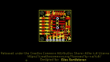
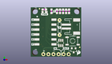
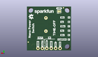
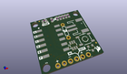

Contents
========

* [PROJ-SPAR-15353-STAN-01>SparkFun TPL5110 Nano Power Timer](#proj-spar-15353-stan-01sparkfun-tpl5110-nano-power-timer)
	* [Images](#images)
	* [Interactive BOM](#interactive-bom)
	* [OOMP Parts](#oomp-parts)
	* [Tags](#tags)
  
![][im]
# PROJ-SPAR-15353-STAN-01>SparkFun TPL5110 Nano Power Timer

- ID: PROJ-SPAR-15353-STAN-01
- Hex ID: PRS15353
- Name: SparkFun TPL5110 Nano Power Timer
- Description: 

## Images
  
  

|eagleImage|kicadPcb3dFront|kicadPcb3dBack|kicadPcb3d|
| :---: | :---: | :---: | :---: |
|||||

## Interactive BOM

- Interactive BOM page: [ibom.html](kicad/bom/ibom.html)

## OOMP Parts
  

|OOMP Parts|
| :---: |
|UNMATCHED-0603-X-UNMATCHED-01, D1, 6.8072, 23.0124, 0,D1, RED, LED-0603, SparkFun-LED, (0.268, 0.906), R0|
|UNMATCHED-UNMATCHED-X-UNMATCHED-01, J1, 21.59, 15.493999999999998, 270,J1, JST-2-SMD, SparkFun-Connectors, (0.85, 0.61), R270|
|UNMATCHED-UNMATCHED-X-UNMATCHED-01, J2, 19.049999999999997, 1.27, 180,J2, 1X06_NO_SILK, SparkFun-Connectors, (0.75, 0.05), R180|
|UNMATCHED-UNMATCHED-X-UNMATCHED-01, JP2, 6.858, 22.605999999999998, M180,JP2, LED, SMT-JUMPER_2_NC_TRACE_SILK, SparkFun-Jumpers, (0.27, 0.89), MR180|
|UNMATCHED-UNMATCHED-X-UNMATCHED-01, Q1, 21.59, 3.3274, 180,Q1, 1.1A/60V/600m?, SOT23-3, SparkFun-DiscreteSemi, (0.85, 0.131), R180|
|RESE-0603-X-UNMATCHED-01, R1, 19.2786, 23.368, 90,R1, 16.2k, 0603, SparkFun-Resistors, (0.759, 0.92), R90|
|<table><tr><td></td><td> R2</td><td>[RESE-0603-X-O223-01 SMD (0603) 22k Ohm Resistor](https://github.com/oomlout/oomlout_OOMP_parts/tree/main/RESE-0603-X-O223-01/)</td><td>[R6223](https://github.com/oomlout/oomlout_OOMP_parts/tree/main/RESE-0603-X-O223-01/)</td></tr></table>|
|RESE-0603-X-UNMATCHED-01, R3, 16.256, 23.368, 90,R3, 93.1k, 0603, SparkFun-Resistors, (0.64, 0.92), R90|
|RESE-0603-X-UNMATCHED-01, R4, 14.731999999999998, 23.368, 90,R4, 124k, 0603, SparkFun-Resistors, (0.58, 0.92), R90|
|RESE-0603-X-UNMATCHED-01, R5, 13.208, 23.368, 90,R5, 169K, 0603, SparkFun-Resistors, (0.52, 0.92), R90|
|RESE-0603-X-UNMATCHED-01, R6, 6.8326, 24.2824, 0,R6, 1k, 0603, SparkFun-Resistors, (0.269, 0.956), R0|
|RESE-0603-X-UNMATCHED-01, R7, 10.413999999999998, 23.368, 270,R7, 0603, SparkFun-Resistors, (0.41, 0.92), R270|
|RESE-UNMATCHED-X-UNMATCHED-01, R8, 14.477999999999998, 14.985999999999999, 90,R8, AXIAL-0.3, SparkFun-Resistors, (0.57, 0.59), R90|
|UNMATCHED-UNMATCHED-X-UNMATCHED-01, S1, 21.0566, 8.0772, 0,S1, MOMENTARY-SWITCH-SPST-SMD-5.2MM-TALL, TACTILE_SWITCH_SMD_5.2MM, SparkFun-Switches, (0.829, 0.318), R0|
|UNMATCHED-UNMATCHED-X-UNMATCHED-01, SW1, 7.365999999999999, 12.7, 270,SW1, DIP-06, DIPSWITCH-06-SMD, SparkFun-Switches, (0.29, 0.5), R270|
|UNMATCHED-UNMATCHED-X-UNMATCHED-01, U1, 15.112999999999998, 7.0612, 0,U1, TPL5110, SOT23-6, SparkFun-IC-Power, (0.595, 0.278), R0|

## Tags

- hexID: PRS15353
- oompType: PROJ
- oompSize: SPAR
- oompColor: 15353
- oompDesc: STAN
- oompIndex: 01
- oompName: SparkFun TPL5110 Nano Power Timer
- sources: All source files from https://github.com/sparkfun/SparkFun_TPL5110_Nano_Power_Timer (source licence details in srcLicense.md)
- linkBuyPage: https://www.sparkfun.com/products/15353
- oompPart: UNMATCHED-0603-X-UNMATCHED-01, D1, 6.8072, 23.0124, 0
- oompPart: SKIP-UNMATCHED-X-UNMATCHED-01, FD1, 4.3942, 24.688799999999997, M0
- oompPart: SKIP-UNMATCHED-X-UNMATCHED-01, FD2, 4.3942, 24.688799999999997, 0
- oompPart: SKIP-UNMATCHED-X-UNMATCHED-01, FD3, 24.637999999999998, 4.826, M0
- oompPart: SKIP-UNMATCHED-X-UNMATCHED-01, FD4, 24.637999999999998, 4.826, 0
- oompPart: UNMATCHED-UNMATCHED-X-UNMATCHED-01, J1, 21.59, 15.493999999999998, 270
- oompPart: UNMATCHED-UNMATCHED-X-UNMATCHED-01, J2, 19.049999999999997, 1.27, 180
- oompPart: UNMATCHED-UNMATCHED-X-UNMATCHED-01, JP2, 6.858, 22.605999999999998, M180
- oompPart: UNMATCHED-UNMATCHED-X-UNMATCHED-01, Q1, 21.59, 3.3274, 180
- oompPart: RESE-0603-X-UNMATCHED-01, R1, 19.2786, 23.368, 90
- oompPart: RESE-0603-X-O223-01, R2, 17.779999999999998, 23.368, 90
- oompPart: RESE-0603-X-UNMATCHED-01, R3, 16.256, 23.368, 90
- oompPart: RESE-0603-X-UNMATCHED-01, R4, 14.731999999999998, 23.368, 90
- oompPart: RESE-0603-X-UNMATCHED-01, R5, 13.208, 23.368, 90
- oompPart: RESE-0603-X-UNMATCHED-01, R6, 6.8326, 24.2824, 0
- oompPart: RESE-0603-X-UNMATCHED-01, R7, 10.413999999999998, 23.368, 270
- oompPart: RESE-UNMATCHED-X-UNMATCHED-01, R8, 14.477999999999998, 14.985999999999999, 90
- oompPart: UNMATCHED-UNMATCHED-X-UNMATCHED-01, S1, 21.0566, 8.0772, 0
- oompPart: UNMATCHED-UNMATCHED-X-UNMATCHED-01, SW1, 7.365999999999999, 12.7, 270
- oompPart: UNMATCHED-UNMATCHED-X-UNMATCHED-01, U1, 15.112999999999998, 7.0612, 0
- rawPart: D1, RED, LED-0603, SparkFun-LED, (0.268, 0.906), R0
- rawPart: FD1, FIDUCIALUFIDUCIAL, FIDUCIAL-MICRO, SparkFun-Aesthetics, (0.173, 0.972), MR0
- rawPart: FD2, FIDUCIALUFIDUCIAL, FIDUCIAL-MICRO, SparkFun-Aesthetics, (0.173, 0.972), R0
- rawPart: FD3, FIDUCIALUFIDUCIAL, FIDUCIAL-MICRO, SparkFun-Aesthetics, (0.97, 0.19), MR0
- rawPart: FD4, FIDUCIALUFIDUCIAL, FIDUCIAL-MICRO, SparkFun-Aesthetics, (0.97, 0.19), R0
- rawPart: J1, JST-2-SMD, SparkFun-Connectors, (0.85, 0.61), R270
- rawPart: J2, 1X06_NO_SILK, SparkFun-Connectors, (0.75, 0.05), R180
- rawPart: JP2, LED, SMT-JUMPER_2_NC_TRACE_SILK, SparkFun-Jumpers, (0.27, 0.89), MR180
- rawPart: Q1, 1.1A/60V/600m?, SOT23-3, SparkFun-DiscreteSemi, (0.85, 0.131), R180
- rawPart: R1, 16.2k, 0603, SparkFun-Resistors, (0.759, 0.92), R90
- rawPart: R2, 22k, 0603, SparkFun-Resistors, (0.7, 0.92), R90
- rawPart: R3, 93.1k, 0603, SparkFun-Resistors, (0.64, 0.92), R90
- rawPart: R4, 124k, 0603, SparkFun-Resistors, (0.58, 0.92), R90
- rawPart: R5, 169K, 0603, SparkFun-Resistors, (0.52, 0.92), R90
- rawPart: R6, 1k, 0603, SparkFun-Resistors, (0.269, 0.956), R0
- rawPart: R7, 0603, SparkFun-Resistors, (0.41, 0.92), R270
- rawPart: R8, AXIAL-0.3, SparkFun-Resistors, (0.57, 0.59), R90
- rawPart: S1, MOMENTARY-SWITCH-SPST-SMD-5.2MM-TALL, TACTILE_SWITCH_SMD_5.2MM, SparkFun-Switches, (0.829, 0.318), R0
- rawPart: SW1, DIP-06, DIPSWITCH-06-SMD, SparkFun-Switches, (0.29, 0.5), R270
- rawPart: U1, TPL5110, SOT23-6, SparkFun-IC-Power, (0.595, 0.278), R0
- oompID: PROJ-SPAR-15353-STAN-01

[im]: kicadPcb3d_450.png
