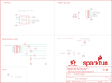

Contents
========

* [PRS15353 > SparkFun TPL5110 Nano Power Timer](#prs15353--sparkfun-tpl5110-nano-power-timer)
	* [Schematic](#schematic)
	* [PCB](#pcb)
	* [Interactive BOM](#interactive-bom)
	* [OOMP Parts](#oomp-parts)
	* [Images](#images)
	* [Tags](#tags)
  
![][im]
# PRS15353 > SparkFun TPL5110 Nano Power Timer

- ID: PROJ-SPAR-15353-STAN-01
- Hex ID: PRS15353
- Name: Sparkfun
- Description: Sparkfun
- Long Link: [http://oom.lt/PROJ-SPAR-15353-STAN-01](http://oom.lt/PROJ-SPAR-15353-STAN-01)
- Short Link: [http://oom.lt/PRS15353](http://oom.lt/PRS15353)

## Schematic
  

## PCB
  

## Interactive BOM

- Interactive BOM page: [ibom.html](https://htmlpreview.github.io/?https://github.com/oomlout/oomlout_OOMP_projects/blob/main/PROJ-SPAR-15353-STAN-01/kicad/bom/ibom.html)

## OOMP Parts
  

|OOMP ID|Name|Identifier|
| :---: | :---: | :---: |
|[LEDS-0603-R-STAN-01](https://github.com/oomlout/oomlout_OOMP_parts/tree/main/LEDS-0603-R-STAN-01/)|[SMD (0603) Red LED](https://github.com/oomlout/oomlout_OOMP_parts/tree/main/LEDS-0603-R-STAN-01/)|[D1](https://github.com/oomlout/oomlout_OOMP_parts/tree/main/LEDS-0603-R-STAN-01/)|
|UNMATCHED-UNMATCHED-X-UNMATCHED-01||J1, JP2, S1, SW1|
|[HEAD-I01-X-PI06-01](https://github.com/oomlout/oomlout_OOMP_parts/tree/main/HEAD-I01-X-PI06-01/)|[2.54 mm 6 Pin Header](https://github.com/oomlout/oomlout_OOMP_parts/tree/main/HEAD-I01-X-PI06-01/)|[J2](https://github.com/oomlout/oomlout_OOMP_parts/tree/main/HEAD-I01-X-PI06-01/)|
|MOSP-SO23-X-UNMATCHED-01||Q1|
|RESE-0603-X-UNMATCHED-01||R1, R3, R7|
|[RESE-0603-X-O223-01](https://github.com/oomlout/oomlout_OOMP_parts/tree/main/RESE-0603-X-O223-01/)|[SMD (0603) 22k Ohm Resistor](https://github.com/oomlout/oomlout_OOMP_parts/tree/main/RESE-0603-X-O223-01/)|[R2](https://github.com/oomlout/oomlout_OOMP_parts/tree/main/RESE-0603-X-O223-01/)|
|RESE-0603-X-O1243-01||R4|
|RESE-0603-X-O1693-01||R5|
|[RESE-0603-X-O102-01](https://github.com/oomlout/oomlout_OOMP_parts/tree/main/RESE-0603-X-O102-01/)|[SMD (0603) 1k Ohm Resistor](https://github.com/oomlout/oomlout_OOMP_parts/tree/main/RESE-0603-X-O102-01/)|[R6](https://github.com/oomlout/oomlout_OOMP_parts/tree/main/RESE-0603-X-O102-01/)|
|RESE-UNMATCHED-X-UNMATCHED-01||R8|
|UNMATCHED-SO23-X-UNMATCHED-01||U1|

## Images
  
  

|bominteractivefront|bominteractiveback|kicadPcb3d|kicadPcb3dFront|kicadPcb3dBack|eagleImage|eagleSchemImage|pcbdraw|pcbdrawback|
| :---: | :---: | :---: | :---: | :---: | :---: | :---: | :---: | :---: |
||||||||||

## Tags

- hexID: PRS15353
- oompType: PROJ
- oompSize: SPAR
- oompColor: 15353
- oompDesc: STAN
- oompIndex: 01
- oompName: SparkFun TPL5110 Nano Power Timer
- sources: All source files from https://github.com/sparkfun/SparkFun_TPL5110_Nano_Power_Timer (source licence details in srcLicense.md)
- linkBuyPage: https://www.sparkfun.com/products/15353
- oompID: PROJ-SPAR-15353-STAN-01
- oompParts: D1,LEDS-0603-R-STAN-01
- oompParts: J1,UNMATCHED-UNMATCHED-X-UNMATCHED-01
- oompParts: J2,HEAD-I01-X-PI06-01
- oompParts: JP2,UNMATCHED-UNMATCHED-X-UNMATCHED-01
- oompParts: Q1,MOSP-SO23-X-UNMATCHED-01
- oompParts: R1,RESE-0603-X-UNMATCHED-01
- oompParts: R2,RESE-0603-X-O223-01
- oompParts: R3,RESE-0603-X-UNMATCHED-01
- oompParts: R4,RESE-0603-X-O1243-01
- oompParts: R5,RESE-0603-X-O1693-01
- oompParts: R6,RESE-0603-X-O102-01
- oompParts: R7,RESE-0603-X-UNMATCHED-01
- oompParts: R8,RESE-UNMATCHED-X-UNMATCHED-01
- oompParts: S1,UNMATCHED-UNMATCHED-X-UNMATCHED-01
- oompParts: SW1,UNMATCHED-UNMATCHED-X-UNMATCHED-01
- oompParts: U1,UNMATCHED-SO23-X-UNMATCHED-01
- rawParts: D1,RED,LED-RED0603,LED-0603,Red SMD LED,,DIO-00819,,,RED,
- rawParts: FD1,FIDUCIALUFIDUCIAL,FIDUCIALUFIDUCIAL,FIDUCIAL-MICRO,Fiducial Alignment Points,,,,,,
- rawParts: FD2,FIDUCIALUFIDUCIAL,FIDUCIALUFIDUCIAL,FIDUCIAL-MICRO,Fiducial Alignment Points,,,,,,
- rawParts: FD3,FIDUCIALUFIDUCIAL,FIDUCIALUFIDUCIAL,FIDUCIAL-MICRO,Fiducial Alignment Points,,,,,,
- rawParts: FD4,FIDUCIALUFIDUCIAL,FIDUCIALUFIDUCIAL,FIDUCIAL-MICRO,Fiducial Alignment Points,,,,,,
- rawParts: FRAME1,FRAME-LETTER,FRAME-LETTER,CREATIVE_COMMONS,Schematic Frame - Letter,,,,,,
- rawParts: H1,STAND-OFFTIGHT,STAND-OFFTIGHT,STAND-OFF-TIGHT,Stand Off,,,,,,
- rawParts: H2,STAND-OFFTIGHT,STAND-OFFTIGHT,STAND-OFF-TIGHT,Stand Off,,,,,,
- rawParts: H4,STAND-OFFTIGHT,STAND-OFFTIGHT,STAND-OFF-TIGHT,Stand Off,,,,,,
- rawParts: J1,,JST_2MM_MALE,JST-2-SMD,JST 2MM MALE RA CONNECTOR,,CONN-11443,,PRT-08612,,
- rawParts: J2,,CONN_06NO_SILK_NO_POP,1X06_NO_SILK,Multi connection point. Often used as Generic Header-pin footprint for 0.1 inch spaced/style header connections,,,,,,
- rawParts: JP2,LED,JUMPER-SMT_2_NC_TRACE_SILK,SMT-JUMPER_2_NC_TRACE_SILK,Normally closed trace jumper,,,,,,
- rawParts: LOGO1,SFE_LOGO_NAME.1_INCH,SFE_LOGO_NAME.1_INCH,SFE_LOGO_NAME_.1,SparkFun Font Logo,,,,,,
- rawParts: LOGO2,OSHW-LOGOS,OSHW-LOGOS,OSHW-LOGO-S,Open-Source Hardware (OSHW) Logo,,,,,,
- rawParts: LOGO3,SFE_LOGO_FLAME.1_INCH,SFE_LOGO_FLAME.1_INCH,SFE_LOGO_FLAME_.1,SparkFun Flame Logo,,,,,,
- rawParts: Q1,1.1A/60V/600mΩ,MOSFET_PCH-SI2309DS,SOT23-3,P-channel MOSFETs,,TRANS-08285,,,1.1A/60V/600mΩ,
- rawParts: R1,16.2k,16.2KOHM-0603-1/10W-1%,0603,16.2kΩ resistor,,RES-12187,,,16.2k,
- rawParts: R2,22k,22KOHM-0603-1/10W-1%,0603,22kΩ resistor,,RES-07853,,,22k,
- rawParts: R3,93.1k,93.1KOHM,0603,93.1kΩ resistor,,RES-14393,,,93.1k,
- rawParts: R4,124k,124KOHM,0603,124kΩ resistor,,RES-14395,,,124k,
- rawParts: R5,169K,169KOHM,0603,169kΩ resistor,,RES-14394,,,169K,
- rawParts: R6,1k,1KOHM-0603-1/10W-1%,0603,1kΩ resistor,,RES-07856,,,1k,
- rawParts: R7, ,RESISTOR0603,0603,Generic Resistor Package,, ,,, ,
- rawParts: R8, ,RESISTORAXIAL-0.3,AXIAL-0.3,Generic Resistor Package,, ,,, ,
- rawParts: S1,MOMENTARY-SWITCH-SPST-SMD-5.2MM-TALL,MOMENTARY-SWITCH-SPST-SMD-5.2MM-TALL,TACTILE_SWITCH_SMD_5.2MM,Momentary Switch (Pushbutton) - SPST,,SWCH-14139,,,,
- rawParts: SW1,DIP-06,DIP-06,DIPSWITCH-06-SMD,,,--------,,,,
- rawParts: U1,TPL5110,TPL5110,SOT23-6,TPL5110 Nano-Power System Timer for Power Gating,,IC-14387,,,,

[im]: kicadPcb3d_450.png
