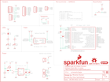

Contents
========

* [PRS15423 > SparkFun Qwiic Micro SAMD21E](#prs15423--sparkfun-qwiic-micro-samd21e)
	* [Schematic](#schematic)
	* [PCB](#pcb)
	* [Interactive BOM](#interactive-bom)
	* [Images](#images)
	* [Tags](#tags)
  
![][im]
# PRS15423 > SparkFun Qwiic Micro SAMD21E

- ID: PROJ-SPAR-15423-STAN-01
- Hex ID: PRS15423
- Name: Sparkfun
- Description: Sparkfun
- Long Link: [http://oom.lt/PROJ-SPAR-15423-STAN-01](http://oom.lt/PROJ-SPAR-15423-STAN-01)
- Short Link: [http://oom.lt/PRS15423](http://oom.lt/PRS15423)

## Schematic
  

## PCB
  

## Interactive BOM

- Interactive BOM page: [ibom.html](https://htmlpreview.github.io/?https://github.com/oomlout/oomlout_OOMP_projects/blob/main/PROJ-SPAR-15423-STAN-01/kicad/bom/ibom.html)

## Images
  
  

|bominteractivefront|bominteractiveback|kicadPcb3d|kicadPcb3dFront|kicadPcb3dBack|eagleImage|eagleSchemImage|pcbdraw|pcbdrawback|
| :---: | :---: | :---: | :---: | :---: | :---: | :---: | :---: | :---: |
||||||||||

## Tags

- hexID: PRS15423
- oompType: PROJ
- oompSize: SPAR
- oompColor: 15423
- oompDesc: STAN
- oompIndex: 01
- oompName: SparkFun Qwiic Micro SAMD21E
- sources: All source files from https://github.com/sparkfun/SparkFun_Qwiic_Micro_SAMD21E (source licence details in srcLicense.md)
- linkBuyPage: https://www.sparkfun.com/products/15423
- oompID: PROJ-SPAR-15423-STAN-01
- rawParts: C1,10uF,10UF-0603-6.3V-20%,0603,10.0µF ceramic capacitors,,CAP-11015,,,,10uF,
- rawParts: C2,1.0uF,1.0UF-0402-16V-10%,0402,1µF ceramic capacitors,,CAP-12417,,,,1.0uF,
- rawParts: C3,10uF,10UF-0603-6.3V-20%,0603,10.0µF ceramic capacitors,,CAP-11015,,,,10uF,
- rawParts: C4,1.0uF,1.0UF-0402-16V-10%,0402,1µF ceramic capacitors,,CAP-12417,,,,1.0uF,
- rawParts: D1,1A/23V/620mV,DIODE-SCHOTTKY-BAT20J,SOD-323,Schottky diode,,DIO-11623,,,,1A/23V/620mV,
- rawParts: D2,BLUE,LED-BLUE0603,LED-0603,Blue SMD LED,,DIO-08575,,,,BLUE,
- rawParts: D3,RED,LED-RED0603,LED-0603,Red SMD LED,,DIO-00819,,,,RED,
- rawParts: FD1,FIDUCIALUFIDUCIAL,FIDUCIALUFIDUCIAL,FIDUCIAL-MICRO,Fiducial Alignment Points,,,,,,,
- rawParts: FD2,FIDUCIALUFIDUCIAL,FIDUCIALUFIDUCIAL,FIDUCIAL-MICRO,Fiducial Alignment Points,,,,,,,
- rawParts: FD3,FIDUCIALUFIDUCIAL,FIDUCIALUFIDUCIAL,FIDUCIAL-MICRO,Fiducial Alignment Points,,,,,,,
- rawParts: FD4,FIDUCIALUFIDUCIAL,FIDUCIALUFIDUCIAL,FIDUCIAL-MICRO,Fiducial Alignment Points,,,,,,,
- rawParts: FRAME1,FRAME-LETTER,FRAME-LETTER,CREATIVE_COMMONS,Schematic Frame - Letter,,,,,,,
- rawParts: H1,STAND-OFF,STAND-OFF,STAND-OFF,Stand Off,,,,,,,
- rawParts: H2,STAND-OFF,STAND-OFF,STAND-OFF,Stand Off,,,,,,,
- rawParts: H3,STAND-OFF,STAND-OFF,STAND-OFF,Stand Off,,,,,,,
- rawParts: J1,QWIIC_RIGHT_ANGLE,QWIIC_CONNECTORJS-1MM,JST04_1MM_RA,SparkFun I2C Standard Qwiic Connector,,CONN-13694,,,,QWIIC_RIGHT_ANGLE,
- rawParts: J2,,CONN_041X04_NO_SILK,1X04_NO_SILK,Multi connection point. Often used as Generic Header-pin footprint for 0.1 inch spaced/style header connections,,CONN-09696,,,,,
- rawParts: J3,,CONN_07NO_SILK,1X07_NO_SILK,Multi connection point. Often used as Generic Header-pin footprint for 0.1 inch spaced/style header connections,,,,,,,
- rawParts: J4,,CONN_041.27MM_NO_SILK,1X04_1.27MM_NO_SILK,Multi connection point. Often used as Generic Header-pin footprint for 0.1 inch spaced/style header connections,,,,,,,
- rawParts: J5,,USB_MICRO-B_HALF_PTH_MILL,USB-MICROB-PTH-MILL,USB Type Micro-B Connector,,CONN-13711,,,,,
- rawParts: J6,,JST_2MM_MALE,JST-2-SMD,JST 2MM MALE RA CONNECTOR,,CONN-11443,,PRT-08612,,,
- rawParts: J7,,CONN_021X02_NO_SILK,1X02_NO_SILK,Multi connection point. Often used as Generic Header-pin footprint for 0.1 inch spaced/style header connections,,,,,,,
- rawParts: JP1,LED,JUMPER-SMT_2_NC_TRACE_SILK,SMT-JUMPER_2_NC_TRACE_SILK,Normally closed trace jumper,,,,,,,
- rawParts: LOGO1,SFE_LOGO_NAME.1_INCH,SFE_LOGO_NAME.1_INCH,SFE_LOGO_NAME_.1,SparkFun Font Logo,,,,,,,
- rawParts: LOGO2,SFE_LOGO_FLAME.2_INCH,SFE_LOGO_FLAME.2_INCH,SFE_LOGO_FLAME_.2,SparkFun Flame Logo,,,,,,,
- rawParts: LOGO3,OSHW-LOGOS,OSHW-LOGOS,OSHW-LOGO-S,Open-Source Hardware (OSHW) Logo,,,,,,,
- rawParts: LOGO4,QWIIC_LOGO_3MM,QWIIC_LOGO_3MM,QWIIC_3MM,Qwiic Logos for placement on schematic and PCB. The 5.5mm silk logo is best for placing next to Qwiic connector.,,,,,,,
- rawParts: Q1,3.1A/30V/105mΩ,MOSFET_PCH-DMG2307L,SOT23-3,P-channel MOSFETs,,TRANS-11308,,,,3.1A/30V/105mΩ,
- rawParts: R1,10k,10KOHM-0402-1/16W-1%,0402,10kΩ resistor,,RES-14241,,,,10k,
- rawParts: R2,10k,10KOHM-0402-1/16W-1%,0402,10kΩ resistor,,RES-14241,,,,10k,
- rawParts: R3,1K,1KOHM-0402-1/16W-1%,0402,1kΩ resistor,,RES-14342,,,,,
- rawParts: R4,10k,10KOHM-0402-1/16W-1%,0402,10kΩ resistor,,RES-14241,,,,10k,
- rawParts: R5,1K,1KOHM-0402-1/16W-1%,0402,1kΩ resistor,,RES-14342,,,,,
- rawParts: S1,,SWITCH-SPDT-SMD-RIGHT-ANGLE,SWITCH_SPST_SMD_A,Single Pole, Double Throw (SPDT) Switch,,SWCH-10651,,,COM-10860,,
- rawParts: S2,MOMENTARY-SWITCH-SPST-SMD-4.6X2.8MM,MOMENTARY-SWITCH-SPST-SMD-4.6X2.8MM,TACTILE_SWITCH_SMD_4.6X2.8MM,Momentary Switch (Pushbutton) - SPST,,SWCH-15606,,,,,
- rawParts: TP1,TEST-POINTTP_15TH_THRU,TEST-POINTTP_15TH_THRU,TP_15TH,SparkFun Test Points,,,,,,,
- rawParts: TP2,TEST-POINTTP_15TH_THRU,TEST-POINTTP_15TH_THRU,TP_15TH,SparkFun Test Points,,,,,,,
- rawParts: TP3,TEST-POINTTP_15TH_THRU,TEST-POINTTP_15TH_THRU,TP_15TH,SparkFun Test Points,,,,,,,
- rawParts: U1,3.3V,V_REG_AP2112K-3.3V,SOT23-5,AP2112 - 600mA CMOS LDO Regulator w/ Enable,,VREG-12457,,,,3.3V,
- rawParts: U2,W25Q32FV,W25Q32FVSS,SOIC-8,W25Q32FV 32Mb (4MB) Serial Flash Memory,,IC-13229,,,,W25Q32FV,
- rawParts: U3,ATSAMD21E18A-U,ATSAMD21E18A-U,QFN-32_SAMD,SAM D21E 32-Pin QFN,,IC-14428,,,,,

[im]: kicadPcb3d_450.png
