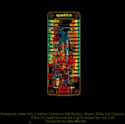
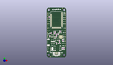
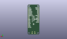
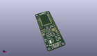

Contents
========

* [PROJ-SPAR-15435-STAN-01>XBee3 Thing Plus](#proj-spar-15435-stan-01xbee3-thing-plus)
	* [Images](#images)
	* [Interactive BOM](#interactive-bom)
	* [OOMP Parts](#oomp-parts)
	* [Tags](#tags)
  
![][im]
# PROJ-SPAR-15435-STAN-01>XBee3 Thing Plus

- ID: PROJ-SPAR-15435-STAN-01
- Hex ID: PRS15435
- Name: XBee3 Thing Plus
- Description: 

## Images
  
  

|eagleImage|kicadPcb3dFront|kicadPcb3dBack|kicadPcb3d|
| :---: | :---: | :---: | :---: |
|||||

## Interactive BOM

- Interactive BOM page: [ibom.html](kicad/bom/ibom.html)

## OOMP Parts
  

|OOMP Parts|
| :---: |
|CAPC-0603-X-UNMATCHED-01, C1, 3.175, 47.117, 270,C1, 1.0uF, 0603, SparkFun-Capacitors, (0.125, 1.855), R270|
|CAPC-0603-X-UNMATCHED-01, C2, 9.524999999999999, 29.717999999999996, 0,C2, 10uF, 0603, SparkFun-Capacitors, (0.375, 1.17), R0|
|CAPC-0603-X-UNMATCHED-01, C6, 3.8099999999999996, 25.273, 90,C6, 4.7uF, 0603, SparkFun-Capacitors, (0.15, 0.995), R90|
|CAPC-0603-X-UNMATCHED-01, C7, 11.937999999999999, 25.019, 90,C7, 1.0uF, 0603, SparkFun-Capacitors, (0.47, 0.985), R90|
|CAPC-0402-X-UNMATCHED-01, C10, 9.143999999999998, 28.194000000000003, 0,C10, 1.0uF, 0402, SparkFun-Capacitors, (0.36, 1.11), R0|
|CAPC-0603-X-UNMATCHED-01, C19, 14.604999999999999, 19.049999999999997, 270,C19, 4.7uF, 0603, SparkFun-Capacitors, (0.575, 0.75), R270|
|UNMATCHED-0603-X-UNMATCHED-01, D1, 16.509999999999998, 2.54, 90,D1, Yellow, LED-0603, SparkFun-LED, (0.65, 0.1), R90|
|UNMATCHED-UNMATCHED-X-UNMATCHED-01, D2, 10.413999999999998, 18.415, 270,D2, 1A/620mV, SOD-323, SparkFun-DiscreteSemi, (0.41, 0.725), R270|
|UNMATCHED-0603-X-UNMATCHED-01, D3, 15.875, 28.955999999999996, 0,D3, BLUE, LED-0603, SparkFun-LED, (0.625, 1.14), R0|
|UNMATCHED-0603-X-UNMATCHED-01, D4, 6.35, 2.54, 270,D4, RED, LED-0603, SparkFun-LED, (0.25, 0.1), R270|
|UNMATCHED-UNMATCHED-X-UNMATCHED-01, J1, 1.27, 24.13, 90,J1, 1X12_SM_SQ_NOSILK, SparkFun-Connectors, (0.05, 0.95), R90|
|UNMATCHED-UNMATCHED-X-UNMATCHED-01, J2, 21.59, 13.97, 90,J2, 1X16_SM_SQ_NOSILK, SparkFun-Connectors, (0.85, 0.55), R90|
|UNMATCHED-UNMATCHED-X-UNMATCHED-01, J3, 5.08, 9.398, 270,J3, JST04_1MM_RA, SparkFun-Connectors, (0.2, 0.37), R270|
|UNMATCHED-UNMATCHED-X-UNMATCHED-01, J4, 3.4798, 17.779999999999998, 90,J4, JST-2-SMD, SparkFun-Connectors, (0.137, 0.7), R90|
|UNMATCHED-UNMATCHED-X-UNMATCHED-01, J5, 11.43, 5.08, 0,J5, USB-MICROB-PTH-MILL, SparkFun-Connectors, (0.45, 0.2), R0|
|UNMATCHED-UNMATCHED-X-UNMATCHED-01, Q1, 12.065, 20.955, 90,Q1, 2.5A/30V, SOT23-3@1, SparkFun-DiscreteSemi, (0.475, 0.825), R90|
|RESE-0603-X-UNMATCHED-01, R1, 12.827, 27.558999999999997, 0,R1, 1k, 0603, SparkFun-Resistors, (0.505, 1.085), R0|
|RESE-0603-X-UNMATCHED-01, R2, 18.668999999999997, 19.812, 90,R2, 10, 0603, SparkFun-Resistors, (0.735, 0.78), R90|
|RESE-0603-X-UNMATCHED-01, R3, 18.415, 10.413999999999998, 270,R3, 1k, 0603, SparkFun-Resistors, (0.725, 0.41), R270|
|RESE-0603-X-UNMATCHED-01, R4, 15.875, 30.353, 180,R4, 1k, 0603, SparkFun-Resistors, (0.625, 1.195), R180|
|<table><tr><td></td><td> R5</td><td>[RESE-0603-X-O103-01 SMD (0603) 10k Ohm Resistor](https://github.com/oomlout/oomlout_OOMP_parts/tree/main/RESE-0603-X-O103-01/)</td><td>[R6103](https://github.com/oomlout/oomlout_OOMP_parts/tree/main/RESE-0603-X-O103-01/)</td></tr></table>|
|RESE-0603-X-UNMATCHED-01, R6, 5.08, 28.575, 0,R6, 2.0k, 0603, SparkFun-Resistors, (0.2, 1.125), R0|
|<table><tr><td></td><td> R7</td><td>[RESE-0603-X-O103-01 SMD (0603) 10k Ohm Resistor](https://github.com/oomlout/oomlout_OOMP_parts/tree/main/RESE-0603-X-O103-01/)</td><td>[R6103](https://github.com/oomlout/oomlout_OOMP_parts/tree/main/RESE-0603-X-O103-01/)</td></tr></table>|
|<table><tr><td></td><td> R8</td><td>[RESE-0402-X-O104-01 SMD (0402) 110k Ohm Resistor](https://github.com/oomlout/oomlout_OOMP_parts/tree/main/RESE-0402-X-O104-01/)</td><td>[R42104](https://github.com/oomlout/oomlout_OOMP_parts/tree/main/RESE-0402-X-O104-01/)</td></tr></table>|
|RESE-0603-X-UNMATCHED-01, R9, 14.604999999999999, 16.509999999999998, 180,R9, 1k, 0603, SparkFun-Resistors, (0.575, 0.65), R180|
|UNMATCHED-UNMATCHED-X-UNMATCHED-01, S1, 16.002, 10.413999999999998, 270,S1, RESET, TACTILE_SWITCH_SMD_4.6X2.8MM, SparkFun-Switches, (0.63, 0.41), R270|
|UNMATCHED-UNMATCHED-X-UNMATCHED-01, S2, 9.398, 10.413999999999998, 270,S2, 5, TACTILE_SWITCH_SMD_4.6X2.8MM, SparkFun-Switches, (0.37, 0.41), R270|
|UNMATCHED-UNMATCHED-X-UNMATCHED-01, U1, 11.43, 44.069, 0,U1, XBEE3_Micro, XBEE3, SparkFun-RF, (0.45, 1.735), R0|
|UNMATCHED-UNMATCHED-X-UNMATCHED-01, U2, 6.35, 25.4, 180,U2, MCP73831, SOT23-5, SparkFun-PowerIC, (0.25, 1), R180|
|UNMATCHED-UNMATCHED-X-UNMATCHED-01, U3, 9.524999999999999, 25.4, 0,U3, AP2112K-3.3V, SOT23-5, SparkFun-PowerIC, (0.375, 1), R0|
|UNMATCHED-UNMATCHED-X-UNMATCHED-01, U4, 16.509999999999998, 24.13, 90,U4, CP210X, QFN24, SparkFun-IC-Comms, (0.65, 0.95), R90|

## Tags

- hexID: PRS15435
- oompType: PROJ
- oompSize: SPAR
- oompColor: 15435
- oompDesc: STAN
- oompIndex: 01
- oompName: XBee3 Thing Plus
- sources: All source files from https://github.com/sparkfun/XBee3_Thing_Plus (source licence details in srcLicense.md)
- linkBuyPage: https://www.sparkfun.com/products/15435
- oompID: PROJ-SPAR-15435-STAN-01
- oompPart: CAPC-0603-X-UNMATCHED-01, C1, 3.175, 47.117, 270
- oompPart: CAPC-0603-X-UNMATCHED-01, C2, 9.524999999999999, 29.717999999999996, 0
- oompPart: CAPC-0603-X-UNMATCHED-01, C6, 3.8099999999999996, 25.273, 90
- oompPart: CAPC-0603-X-UNMATCHED-01, C7, 11.937999999999999, 25.019, 90
- oompPart: CAPC-0402-X-UNMATCHED-01, C10, 9.143999999999998, 28.194000000000003, 0
- oompPart: CAPC-0603-X-UNMATCHED-01, C19, 14.604999999999999, 19.049999999999997, 270
- oompPart: UNMATCHED-0603-X-UNMATCHED-01, D1, 16.509999999999998, 2.54, 90
- oompPart: UNMATCHED-UNMATCHED-X-UNMATCHED-01, D2, 10.413999999999998, 18.415, 270
- oompPart: UNMATCHED-0603-X-UNMATCHED-01, D3, 15.875, 28.955999999999996, 0
- oompPart: UNMATCHED-0603-X-UNMATCHED-01, D4, 6.35, 2.54, 270
- oompPart: SKIP-UNMATCHED-X-UNMATCHED-01, FD1, 4.444999999999999, 0.7619999999999999, 0
- oompPart: SKIP-UNMATCHED-X-UNMATCHED-01, FD2, 4.444999999999999, 0.7619999999999999, M0
- oompPart: SKIP-UNMATCHED-X-UNMATCHED-01, FD3, 18.415, 57.785, 0
- oompPart: SKIP-UNMATCHED-X-UNMATCHED-01, FD4, 18.415, 57.785, M0
- oompPart: UNMATCHED-UNMATCHED-X-UNMATCHED-01, J1, 1.27, 24.13, 90
- oompPart: UNMATCHED-UNMATCHED-X-UNMATCHED-01, J2, 21.59, 13.97, 90
- oompPart: UNMATCHED-UNMATCHED-X-UNMATCHED-01, J3, 5.08, 9.398, 270
- oompPart: UNMATCHED-UNMATCHED-X-UNMATCHED-01, J4, 3.4798, 17.779999999999998, 90
- oompPart: UNMATCHED-UNMATCHED-X-UNMATCHED-01, J5, 11.43, 5.08, 0
- oompPart: UNMATCHED-UNMATCHED-X-UNMATCHED-01, Q1, 12.065, 20.955, 90
- oompPart: RESE-0603-X-UNMATCHED-01, R1, 12.827, 27.558999999999997, 0
- oompPart: RESE-0603-X-UNMATCHED-01, R2, 18.668999999999997, 19.812, 90
- oompPart: RESE-0603-X-UNMATCHED-01, R3, 18.415, 10.413999999999998, 270
- oompPart: RESE-0603-X-UNMATCHED-01, R4, 15.875, 30.353, 180
- oompPart: RESE-0603-X-O103-01, R5, 19.939, 10.413999999999998, 90
- oompPart: RESE-0603-X-UNMATCHED-01, R6, 5.08, 28.575, 0
- oompPart: RESE-0603-X-O103-01, R7, 11.937999999999999, 16.509999999999998, 90
- oompPart: RESE-0402-X-O104-01, R8, 9.270999999999999, 22.098, 0
- oompPart: RESE-0603-X-UNMATCHED-01, R9, 14.604999999999999, 16.509999999999998, 180
- oompPart: UNMATCHED-UNMATCHED-X-UNMATCHED-01, S1, 16.002, 10.413999999999998, 270
- oompPart: UNMATCHED-UNMATCHED-X-UNMATCHED-01, S2, 9.398, 10.413999999999998, 270
- oompPart: UNMATCHED-UNMATCHED-X-UNMATCHED-01, U1, 11.43, 44.069, 0
- oompPart: UNMATCHED-UNMATCHED-X-UNMATCHED-01, U2, 6.35, 25.4, 180
- oompPart: UNMATCHED-UNMATCHED-X-UNMATCHED-01, U3, 9.524999999999999, 25.4, 0
- oompPart: UNMATCHED-UNMATCHED-X-UNMATCHED-01, U4, 16.509999999999998, 24.13, 90
- rawPart: C1, 1.0uF, 0603, SparkFun-Capacitors, (0.125, 1.855), R270
- rawPart: C2, 10uF, 0603, SparkFun-Capacitors, (0.375, 1.17), R0
- rawPart: C6, 4.7uF, 0603, SparkFun-Capacitors, (0.15, 0.995), R90
- rawPart: C7, 1.0uF, 0603, SparkFun-Capacitors, (0.47, 0.985), R90
- rawPart: C10, 1.0uF, 0402, SparkFun-Capacitors, (0.36, 1.11), R0
- rawPart: C19, 4.7uF, 0603, SparkFun-Capacitors, (0.575, 0.75), R270
- rawPart: D1, Yellow, LED-0603, SparkFun-LED, (0.65, 0.1), R90
- rawPart: D2, 1A/620mV, SOD-323, SparkFun-DiscreteSemi, (0.41, 0.725), R270
- rawPart: D3, BLUE, LED-0603, SparkFun-LED, (0.625, 1.14), R0
- rawPart: D4, RED, LED-0603, SparkFun-LED, (0.25, 0.1), R270
- rawPart: FD1, FIDUCIALUFIDUCIAL, FIDUCIAL-MICRO, SparkFun-Aesthetics, (0.175, 0.03), R0
- rawPart: FD2, FIDUCIALUFIDUCIAL, FIDUCIAL-MICRO, SparkFun-Aesthetics, (0.175, 0.03), MR0
- rawPart: FD3, FIDUCIALUFIDUCIAL, FIDUCIAL-MICRO, SparkFun-Aesthetics, (0.725, 2.275), R0
- rawPart: FD4, FIDUCIALUFIDUCIAL, FIDUCIAL-MICRO, SparkFun-Aesthetics, (0.725, 2.275), MR0
- rawPart: J1, 1X12_SM_SQ_NOSILK, SparkFun-Connectors, (0.05, 0.95), R90
- rawPart: J2, 1X16_SM_SQ_NOSILK, SparkFun-Connectors, (0.85, 0.55), R90
- rawPart: J3, JST04_1MM_RA, SparkFun-Connectors, (0.2, 0.37), R270
- rawPart: J4, JST-2-SMD, SparkFun-Connectors, (0.137, 0.7), R90
- rawPart: J5, USB-MICROB-PTH-MILL, SparkFun-Connectors, (0.45, 0.2), R0
- rawPart: Q1, 2.5A/30V, SOT23-3@1, SparkFun-DiscreteSemi, (0.475, 0.825), R90
- rawPart: R1, 1k, 0603, SparkFun-Resistors, (0.505, 1.085), R0
- rawPart: R2, 10, 0603, SparkFun-Resistors, (0.735, 0.78), R90
- rawPart: R3, 1k, 0603, SparkFun-Resistors, (0.725, 0.41), R270
- rawPart: R4, 1k, 0603, SparkFun-Resistors, (0.625, 1.195), R180
- rawPart: R5, 10k, 0603, SparkFun-Resistors, (0.785, 0.41), R90
- rawPart: R6, 2.0k, 0603, SparkFun-Resistors, (0.2, 1.125), R0
- rawPart: R7, 10k, 0603, SparkFun-Resistors, (0.47, 0.65), R90
- rawPart: R8, 100K, 0402, SparkFun-Resistors, (0.365, 0.87), R0
- rawPart: R9, 1k, 0603, SparkFun-Resistors, (0.575, 0.65), R180
- rawPart: S1, RESET, TACTILE_SWITCH_SMD_4.6X2.8MM, SparkFun-Switches, (0.63, 0.41), R270
- rawPart: S2, 5, TACTILE_SWITCH_SMD_4.6X2.8MM, SparkFun-Switches, (0.37, 0.41), R270
- rawPart: U1, XBEE3_Micro, XBEE3, SparkFun-RF, (0.45, 1.735), R0
- rawPart: U2, MCP73831, SOT23-5, SparkFun-PowerIC, (0.25, 1), R180
- rawPart: U3, AP2112K-3.3V, SOT23-5, SparkFun-PowerIC, (0.375, 1), R0
- rawPart: U4, CP210X, QFN24, SparkFun-IC-Comms, (0.65, 0.95), R90

[im]: kicadPcb3d_450.png
