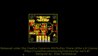
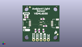
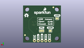
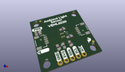

Contents
========

* [PROJ-SPAR-15436-STAN-01>SparkFun Ambient Sensor VEML6030](#proj-spar-15436-stan-01sparkfun-ambient-sensor-veml6030)
	* [Images](#images)
	* [Interactive BOM](#interactive-bom)
	* [OOMP Parts](#oomp-parts)
	* [Tags](#tags)
  
![][im]
# PROJ-SPAR-15436-STAN-01>SparkFun Ambient Sensor VEML6030

- ID: PROJ-SPAR-15436-STAN-01
- Hex ID: PRS15436
- Name: SparkFun Ambient Sensor VEML6030
- Description: 

## Images
  
  

|eagleImage|kicadPcb3dFront|kicadPcb3dBack|kicadPcb3d|
| :---: | :---: | :---: | :---: |
|||||

## Interactive BOM

- Interactive BOM page: [ibom.html](kicad/bom/ibom.html)

## OOMP Parts
  

|OOMP Parts|
| :---: |
|<table><tr><td></td><td> C1</td><td>[CAPC-0603-X-NF100-V50 SMD (0603) 100 nF Capacitor (Ceramic) 50v](https://github.com/oomlout/oomlout_OOMP_parts/tree/main/CAPC-0603-X-NF100-V50/)</td><td>[C6N100](https://github.com/oomlout/oomlout_OOMP_parts/tree/main/CAPC-0603-X-NF100-V50/)</td></tr></table>|
|UNMATCHED-0603-X-UNMATCHED-01, D1, 2.4638, 18.313399999999998, 0,D1, RED, LED-0603, SparkFun-LED, (0.097, 0.721), R0|
|UNMATCHED-UNMATCHED-X-UNMATCHED-01, J1, 20.32, 12.7, 90,J1, JST04_1MM_RA, SparkFun-Connectors, (0.8, 0.5), R90|
|UNMATCHED-UNMATCHED-X-UNMATCHED-01, J2, 5.08, 12.7, 270,J2, JST04_1MM_RA, SparkFun-Connectors, (0.2, 0.5), R270|
|UNMATCHED-UNMATCHED-X-UNMATCHED-01, J3, 7.619999999999999, 1.27, 0,J3, 1X05_NO_SILK, SparkFun-Connectors, (0.3, 0.05), R0|
|UNMATCHED-UNMATCHED-X-UNMATCHED-01, JP1, 2.54, 16.509999999999998, M0,JP1, LED, SMT-JUMPER_2_NC_TRACE_SILK, SparkFun-Jumpers, (0.1, 0.65), MR0|
|UNMATCHED-UNMATCHED-X-UNMATCHED-01, JP2, 7.112, 8.001, M0,JP2, ADDR, SMT-JUMPER_2_NO_SILK, SparkFun-Jumpers, (0.28, 0.315), MR0|
|UNMATCHED-UNMATCHED-X-UNMATCHED-01, JP3, 12.953999999999999, 8.001, M0,JP3, I2C_PU, SMT-JUMPER_3_2-NC_TRACE_SILK, SparkFun-Jumpers, (0.51, 0.315), MR0|
|RESE-0603-X-UNMATCHED-01, R1, 11.43, 7.619999999999999, 90,R1, 4.7k, 0603, SparkFun-Resistors, (0.45, 0.3), R90|
|RESE-0603-X-UNMATCHED-01, R2, 14.350999999999997, 7.619999999999999, 270,R2, 4.7k, 0603, SparkFun-Resistors, (0.565, 0.3), R270|
|<table><tr><td></td><td> R3</td><td>[RESE-0603-X-O103-01 SMD (0603) 10k Ohm Resistor](https://github.com/oomlout/oomlout_OOMP_parts/tree/main/RESE-0603-X-O103-01/)</td><td>[R6103](https://github.com/oomlout/oomlout_OOMP_parts/tree/main/RESE-0603-X-O103-01/)</td></tr></table>|
|RESE-0603-X-UNMATCHED-01, R4, 2.5907999999999998, 17.018, 0,R4, 1k, 0603, SparkFun-Resistors, (0.102, 0.67), R0|
|<table><tr><td></td><td> R5</td><td>[RESE-0603-X-O103-01 SMD (0603) 10k Ohm Resistor](https://github.com/oomlout/oomlout_OOMP_parts/tree/main/RESE-0603-X-O103-01/)</td><td>[R6103](https://github.com/oomlout/oomlout_OOMP_parts/tree/main/RESE-0603-X-O103-01/)</td></tr></table>|
|UNMATCHED-UNMATCHED-X-UNMATCHED-01, U1, 12.7, 12.7, 270,U1, VEML6030, VEML6030, SparkFun-Sensors, (0.5, 0.5), R270|

## Tags

- hexID: PRS15436
- oompType: PROJ
- oompSize: SPAR
- oompColor: 15436
- oompDesc: STAN
- oompIndex: 01
- oompName: SparkFun Ambient Sensor VEML6030
- sources: All source files from https://github.com/sparkfun/SparkFun_Ambient_Sensor_VEML6030 (source licence details in srcLicense.md)
- linkBuyPage: https://www.sparkfun.com/products/15436
- oompPart: CAPC-0603-X-NF100-V50, C1, 15.493999999999998, 10.921999999999999, 0
- oompPart: UNMATCHED-0603-X-UNMATCHED-01, D1, 2.4638, 18.313399999999998, 0
- oompPart: SKIP-UNMATCHED-X-UNMATCHED-01, FD1, 24.13, 5.08, M0
- oompPart: SKIP-UNMATCHED-X-UNMATCHED-01, FD2, 5.08, 24.13, M0
- oompPart: SKIP-UNMATCHED-X-UNMATCHED-01, FD3, 5.08, 24.13, 0
- oompPart: SKIP-UNMATCHED-X-UNMATCHED-01, FD4, 24.13, 5.08, 0
- oompPart: UNMATCHED-UNMATCHED-X-UNMATCHED-01, J1, 20.32, 12.7, 90
- oompPart: UNMATCHED-UNMATCHED-X-UNMATCHED-01, J2, 5.08, 12.7, 270
- oompPart: UNMATCHED-UNMATCHED-X-UNMATCHED-01, J3, 7.619999999999999, 1.27, 0
- oompPart: UNMATCHED-UNMATCHED-X-UNMATCHED-01, JP1, 2.54, 16.509999999999998, M0
- oompPart: UNMATCHED-UNMATCHED-X-UNMATCHED-01, JP2, 7.112, 8.001, M0
- oompPart: UNMATCHED-UNMATCHED-X-UNMATCHED-01, JP3, 12.953999999999999, 8.001, M0
- oompPart: RESE-0603-X-UNMATCHED-01, R1, 11.43, 7.619999999999999, 90
- oompPart: RESE-0603-X-UNMATCHED-01, R2, 14.350999999999997, 7.619999999999999, 270
- oompPart: RESE-0603-X-O103-01, R3, 8.889999999999999, 7.619999999999999, 270
- oompPart: RESE-0603-X-UNMATCHED-01, R4, 2.5907999999999998, 17.018, 0
- oompPart: RESE-0603-X-O103-01, R5, 13.7668, 15.798799999999998, 0
- oompPart: UNMATCHED-UNMATCHED-X-UNMATCHED-01, U1, 12.7, 12.7, 270
- rawPart: C1, 0.1uF, 0603, SparkFun-Capacitors, (0.61, 0.43), R0
- rawPart: D1, RED, LED-0603, SparkFun-LED, (0.097, 0.721), R0
- rawPart: FD1, FIDUCIAL1X2, FIDUCIAL-1X2, SparkFun-Aesthetics, (0.95, 0.2), MR0
- rawPart: FD2, FIDUCIAL1X2, FIDUCIAL-1X2, SparkFun-Aesthetics, (0.2, 0.95), MR0
- rawPart: FD3, FIDUCIAL1X2, FIDUCIAL-1X2, SparkFun-Aesthetics, (0.2, 0.95), R0
- rawPart: FD4, FIDUCIAL1X2, FIDUCIAL-1X2, SparkFun-Aesthetics, (0.95, 0.2), R0
- rawPart: J1, JST04_1MM_RA, SparkFun-Connectors, (0.8, 0.5), R90
- rawPart: J2, JST04_1MM_RA, SparkFun-Connectors, (0.2, 0.5), R270
- rawPart: J3, 1X05_NO_SILK, SparkFun-Connectors, (0.3, 0.05), R0
- rawPart: JP1, LED, SMT-JUMPER_2_NC_TRACE_SILK, SparkFun-Jumpers, (0.1, 0.65), MR0
- rawPart: JP2, ADDR, SMT-JUMPER_2_NO_SILK, SparkFun-Jumpers, (0.28, 0.315), MR0
- rawPart: JP3, I2C_PU, SMT-JUMPER_3_2-NC_TRACE_SILK, SparkFun-Jumpers, (0.51, 0.315), MR0
- rawPart: R1, 4.7k, 0603, SparkFun-Resistors, (0.45, 0.3), R90
- rawPart: R2, 4.7k, 0603, SparkFun-Resistors, (0.565, 0.3), R270
- rawPart: R3, 10k, 0603, SparkFun-Resistors, (0.35, 0.3), R270
- rawPart: R4, 1k, 0603, SparkFun-Resistors, (0.102, 0.67), R0
- rawPart: R5, 10k, 0603, SparkFun-Resistors, (0.542, 0.622), R0
- rawPart: U1, VEML6030, VEML6030, SparkFun-Sensors, (0.5, 0.5), R270
- oompID: PROJ-SPAR-15436-STAN-01

[im]: kicadPcb3d_450.png
