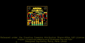
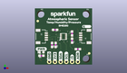
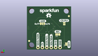
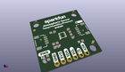

Contents
========

* [PROJ-SPAR-15440-STAN-01>Qwiic Atmospheric Sensor Breakout BME280](#proj-spar-15440-stan-01qwiic-atmospheric-sensor-breakout-bme280)
	* [Images](#images)
	* [Interactive BOM](#interactive-bom)
	* [OOMP Parts](#oomp-parts)
	* [Tags](#tags)
  
![][im]
# PROJ-SPAR-15440-STAN-01>Qwiic Atmospheric Sensor Breakout BME280

- ID: PROJ-SPAR-15440-STAN-01
- Hex ID: PRS15440
- Name: Qwiic Atmospheric Sensor Breakout BME280
- Description: 

## Images
  
  

|eagleImage|kicadPcb3dFront|kicadPcb3dBack|kicadPcb3d|
| :---: | :---: | :---: | :---: |
|||||

## Interactive BOM

- Interactive BOM page: [ibom.html](kicad/bom/ibom.html)

## OOMP Parts
  

|OOMP Parts|
| :---: |
|CAPE-0603-X-NF100-01, C1, 16.509999999999998, 10.8204, 270,C1, 0.1uF, 0603, SparkFun-Capacitors, (0.65, 0.426), R270|
|CAPE-0603-X-NF100-01, C2, 16.509999999999998, 14.0716, 90,C2, 0.1uF, 0603, SparkFun-Capacitors, (0.65, 0.554), R90|
|UNMATCHED-0603-X-UNMATCHED-01, D1, 2.921, 5.6133999999999995, 180,D1, RED, LED-0603, SparkFun-LED, (0.115, 0.221), R180|
|UNMATCHED-UNMATCHED-X-UNMATCHED-01, FD1, 1.27, 19.685, 0,FD1, FIDUCIAL1X2, FIDUCIAL-1X2, SparkFun-Aesthetics, (0.05, 0.775), R0|
|UNMATCHED-UNMATCHED-X-UNMATCHED-01, FD2, 24.13, 5.08, 0,FD2, FIDUCIAL1X2, FIDUCIAL-1X2, SparkFun-Aesthetics, (0.95, 0.2), R0|
|UNMATCHED-UNMATCHED-X-UNMATCHED-01, FD3, 24.13, 5.08, M0,FD3, FIDUCIAL1X2, FIDUCIAL-1X2, SparkFun-Aesthetics, (0.95, 0.2), MR0|
|UNMATCHED-UNMATCHED-X-UNMATCHED-01, FD4, 1.27, 19.685, M0,FD4, FIDUCIAL1X2, FIDUCIAL-1X2, SparkFun-Aesthetics, (0.05, 0.775), MR0|
|UNMATCHED-UNMATCHED-X-UNMATCHED-01, J1, 20.32, 12.7, 90,J1, QWIIC, JST04_1MM_RA, SparkFun-Connectors, (0.8, 0.5), R90|
|UNMATCHED-UNMATCHED-X-UNMATCHED-01, J2, 5.08, 12.7, 270,J2, QWIIC, JST04_1MM_RA, SparkFun-Connectors, (0.2, 0.5), R270|
|UNMATCHED-UNMATCHED-X-UNMATCHED-01, J3, 6.35, 1.27, 0,J3, PTH, 1X04_NO_SILK, SparkFun-Connectors, (0.25, 0.05), R0|
|UNMATCHED-UNMATCHED-X-UNMATCHED-01, J4, 16.509999999999998, 1.27, 0,J4, 1X02_NO_SILK, SparkFun-Connectors, (0.65, 0.05), R0|
|UNMATCHED-UNMATCHED-X-UNMATCHED-01, JP1, 2.7685999999999997, 3.2512, M90,JP1, SMT-JUMPER_2_NC_TRACE_NO-SILK, SparkFun-Jumpers, (0.109, 0.128), MR90|
|ERROR, JP2 EN I2C, 0, 0, 0,JP2, EN, I2C, MODE, PAD-JUMPER-2-NC_BY_TRACE_NO_SILK, SparkFun-Passives, (0.154, 0.599), MR270|
|ERROR, JP3 EN ADR, 0, 0, 0,JP3, EN, ADR, PU, SMT-JUMPER_3_1-NC_TRACE_NO-SILK, SparkFun-Jumpers, (0.65, 0.6), MR180|
|UNMATCHED-UNMATCHED-X-UNMATCHED-01, JP4, 7.619999999999999, 8.889999999999999, M180,JP4, SMT-JUMPER_3_2-NC_TRACE_NO-SILK, SparkFun-Jumpers, (0.3, 0.35), MR180|
|RESE-0603-X-UNMATCHED-01, R1, 8.966199999999999, 15.697199999999999, 180,R1, 4.7k, 0603, SparkFun-Resistors, (0.353, 0.618), R180|
|RESE-0603-X-UNMATCHED-01, R2, 19.0754, 7.010400000000001, 180,R2, 4.7k, 0603, SparkFun-Resistors, (0.751, 0.276), R180|
|RESE-0603-X-UNMATCHED-01, R3, 9.220199999999998, 8.889999999999999, 270,R3, 4.7k, 0603, SparkFun-Resistors, (0.363, 0.35), R270|
|RESE-0603-X-UNMATCHED-01, R4, 7.619999999999999, 8.889999999999999, 270,R4, 4.7k, 0603, SparkFun-Resistors, (0.3, 0.35), R270|
|RESE-0603-X-UNMATCHED-01, R5, 2.921, 4.0386, 180,R5, 1k, 0603, SparkFun-Resistors, (0.115, 0.159), R180|
|UNMATCHED-UNMATCHED-X-UNMATCHED-01, U1, 12.7, 12.7, 90,U1, BME280, LGA-8-2.5X2.5, SparkFun-Sensors, (0.5, 0.5), R90|

## Tags

- hexID: PRS15440
- oompType: PROJ
- oompSize: SPAR
- oompColor: 15440
- oompDesc: STAN
- oompIndex: 01
- oompName: Qwiic Atmospheric Sensor Breakout BME280
- sources: All source files from https://github.com/sparkfun/Qwiic_Atmospheric_Sensor_Breakout_BME280 (source licence details in srcLicense.md)
- linkBuyPage: https://www.sparkfun.com/products/15440
- oompPart: CAPE-0603-X-NF100-01, C1, 16.509999999999998, 10.8204, 270
- oompPart: CAPE-0603-X-NF100-01, C2, 16.509999999999998, 14.0716, 90
- oompPart: UNMATCHED-0603-X-UNMATCHED-01, D1, 2.921, 5.6133999999999995, 180
- oompPart: UNMATCHED-UNMATCHED-X-UNMATCHED-01, FD1, 1.27, 19.685, 0
- oompPart: UNMATCHED-UNMATCHED-X-UNMATCHED-01, FD2, 24.13, 5.08, 0
- oompPart: UNMATCHED-UNMATCHED-X-UNMATCHED-01, FD3, 24.13, 5.08, M0
- oompPart: UNMATCHED-UNMATCHED-X-UNMATCHED-01, FD4, 1.27, 19.685, M0
- oompPart: UNMATCHED-UNMATCHED-X-UNMATCHED-01, J1, 20.32, 12.7, 90
- oompPart: UNMATCHED-UNMATCHED-X-UNMATCHED-01, J2, 5.08, 12.7, 270
- oompPart: UNMATCHED-UNMATCHED-X-UNMATCHED-01, J3, 6.35, 1.27, 0
- oompPart: UNMATCHED-UNMATCHED-X-UNMATCHED-01, J4, 16.509999999999998, 1.27, 0
- oompPart: UNMATCHED-UNMATCHED-X-UNMATCHED-01, JP1, 2.7685999999999997, 3.2512, M90
- oompPart: ERROR, JP2 EN I2C, 0, 0, 0
- oompPart: ERROR, JP3 EN ADR, 0, 0, 0
- oompPart: UNMATCHED-UNMATCHED-X-UNMATCHED-01, JP4, 7.619999999999999, 8.889999999999999, M180
- oompPart: RESE-0603-X-UNMATCHED-01, R1, 8.966199999999999, 15.697199999999999, 180
- oompPart: RESE-0603-X-UNMATCHED-01, R2, 19.0754, 7.010400000000001, 180
- oompPart: RESE-0603-X-UNMATCHED-01, R3, 9.220199999999998, 8.889999999999999, 270
- oompPart: RESE-0603-X-UNMATCHED-01, R4, 7.619999999999999, 8.889999999999999, 270
- oompPart: RESE-0603-X-UNMATCHED-01, R5, 2.921, 4.0386, 180
- oompPart: UNMATCHED-UNMATCHED-X-UNMATCHED-01, U1, 12.7, 12.7, 90
- rawPart: C1, 0.1uF, 0603, SparkFun-Capacitors, (0.65, 0.426), R270
- rawPart: C2, 0.1uF, 0603, SparkFun-Capacitors, (0.65, 0.554), R90
- rawPart: D1, RED, LED-0603, SparkFun-LED, (0.115, 0.221), R180
- rawPart: FD1, FIDUCIAL1X2, FIDUCIAL-1X2, SparkFun-Aesthetics, (0.05, 0.775), R0
- rawPart: FD2, FIDUCIAL1X2, FIDUCIAL-1X2, SparkFun-Aesthetics, (0.95, 0.2), R0
- rawPart: FD3, FIDUCIAL1X2, FIDUCIAL-1X2, SparkFun-Aesthetics, (0.95, 0.2), MR0
- rawPart: FD4, FIDUCIAL1X2, FIDUCIAL-1X2, SparkFun-Aesthetics, (0.05, 0.775), MR0
- rawPart: J1, QWIIC, JST04_1MM_RA, SparkFun-Connectors, (0.8, 0.5), R90
- rawPart: J2, QWIIC, JST04_1MM_RA, SparkFun-Connectors, (0.2, 0.5), R270
- rawPart: J3, PTH, 1X04_NO_SILK, SparkFun-Connectors, (0.25, 0.05), R0
- rawPart: J4, 1X02_NO_SILK, SparkFun-Connectors, (0.65, 0.05), R0
- rawPart: JP1, SMT-JUMPER_2_NC_TRACE_NO-SILK, SparkFun-Jumpers, (0.109, 0.128), MR90
- rawPart: JP2, EN, I2C, MODE, PAD-JUMPER-2-NC_BY_TRACE_NO_SILK, SparkFun-Passives, (0.154, 0.599), MR270
- rawPart: JP3, EN, ADR, PU, SMT-JUMPER_3_1-NC_TRACE_NO-SILK, SparkFun-Jumpers, (0.65, 0.6), MR180
- rawPart: JP4, SMT-JUMPER_3_2-NC_TRACE_NO-SILK, SparkFun-Jumpers, (0.3, 0.35), MR180
- rawPart: R1, 4.7k, 0603, SparkFun-Resistors, (0.353, 0.618), R180
- rawPart: R2, 4.7k, 0603, SparkFun-Resistors, (0.751, 0.276), R180
- rawPart: R3, 4.7k, 0603, SparkFun-Resistors, (0.363, 0.35), R270
- rawPart: R4, 4.7k, 0603, SparkFun-Resistors, (0.3, 0.35), R270
- rawPart: R5, 1k, 0603, SparkFun-Resistors, (0.115, 0.159), R180
- rawPart: U1, BME280, LGA-8-2.5X2.5, SparkFun-Sensors, (0.5, 0.5), R90

[im]: kicadPcb3d_450.png
