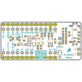
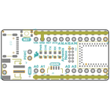
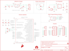
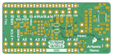
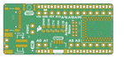

Contents
========

* [PRS15443 > RedBoard Artemis Nano](#prs15443--redboard-artemis-nano)
	* [Schematic](#schematic)
	* [PCB](#pcb)
	* [Interactive BOM](#interactive-bom)
	* [Images](#images)
	* [Tags](#tags)
  
![][im]
# PRS15443 > RedBoard Artemis Nano

- ID: PROJ-SPAR-15443-STAN-01
- Hex ID: PRS15443
- Name: Sparkfun
- Description: Sparkfun
- Long Link: [http://oom.lt/PROJ-SPAR-15443-STAN-01](http://oom.lt/PROJ-SPAR-15443-STAN-01)
- Short Link: [http://oom.lt/PRS15443](http://oom.lt/PRS15443)

## Schematic
  

## PCB
  

## Interactive BOM

- Interactive BOM page: [ibom.html](https://htmlpreview.github.io/?https://github.com/oomlout/oomlout_OOMP_projects/blob/main/PROJ-SPAR-15443-STAN-01/kicad/bom/ibom.html)

## Images
  
  

|bominteractivefront|bominteractiveback|kicadPcb3d|kicadPcb3dFront|kicadPcb3dBack|eagleImage|eagleSchemImage|pcbdraw|pcbdrawback|
| :---: | :---: | :---: | :---: | :---: | :---: | :---: | :---: | :---: |
||||||||||

## Tags

- hexID: PRS15443
- oompType: PROJ
- oompSize: SPAR
- oompColor: 15443
- oompDesc: STAN
- oompIndex: 01
- oompName: RedBoard Artemis Nano
- sources: All source files from https://github.com/sparkfun/RedBoard_Artemis_Nano (source licence details in srcLicense.md)
- linkBuyPage: https://www.sparkfun.com/products/15443
- oompID: PROJ-SPAR-15443-STAN-01
- rawParts: C1,0.1uF,0.1UF-0402T-16V-10%,0402-TIGHT,0.1µF ceramic capacitors,,CAP-12416,,,0.1uF,,
- rawParts: C5,4.7uF,4.7UF-0603-6.3V-(10%),0603,4.7µF ceramic capacitors,,CAP-08280,,,4.7uF,,
- rawParts: C6,4.7uF,4.7UF-0603-6.3V-(10%),0603,4.7µF ceramic capacitors,,CAP-08280,,,4.7uF,,
- rawParts: C8,1.0uF,1.0UF-0402T-16V-10%,0402-TIGHT,1µF ceramic capacitors,,CAP-12417,,,1.0uF,,
- rawParts: C9,1.0uF,1.0UF-0402T-16V-10%,0402-TIGHT,1µF ceramic capacitors,,CAP-12417,,,1.0uF,,
- rawParts: C12,15pF,15PF-0603-50V-5%,0603,15pF ceramic capacitors,,CAP-07881,,,15pF,,
- rawParts: C13,15pF,15PF-0603-50V-5%,0603,15pF ceramic capacitors,,CAP-07881,,,15pF,,
- rawParts: C17,10nF,10NF-0603-50V-10%,0603,0.01uF/10nF/10,000pF ceramic capacitors,,CAP-00867,,,10nF,,
- rawParts: C18,0.1uF,0.1UF-0603-25V-(+80/-20%),0603,0.1µF ceramic capacitors,,CAP-00810,,,0.1uF,,
- rawParts: C19,0.1uF,0.1UF-0402T-16V-10%,0402-TIGHT,0.1µF ceramic capacitors,,CAP-12416,,,0.1uF,,
- rawParts: C20,0.1uF,0.1UF-0603-25V-5%,0603,0.1µF ceramic capacitors,,CAP-08604,,,0.1uF,,
- rawParts: C21,0.1uF,0.1UF-0603-25V-5%,0603,0.1µF ceramic capacitors,,CAP-08604,,,0.1uF,,
- rawParts: C22,10uF,10UF-0603-6.3V-20%,0603,10.0µF ceramic capacitors,,CAP-11015,,,10uF,,
- rawParts: C23,1.0uF,1.0UF-0402T-16V-10%,0402-TIGHT,1µF ceramic capacitors,,CAP-12417,,,1.0uF,,
- rawParts: C28,1nF,1.0NF/1000PF-0603-50V-10%,0603,1nF/1,000pF ceramic capacitors,,CAP-07886,,,1nF,,
- rawParts: D1,BLUE,LED-BLUE0603,LED-0603,Blue SMD LED,,DIO-08575,,,BLUE,,
- rawParts: D2,Yellow,LED-YELLOW0603,LED-0603,Yellow SMD LED,,DIO-09003,,,Yellow,,
- rawParts: D3,1A/23V/620mV,DIODE-SCHOTTKY-BAT20J,SOD-323,Schottky diode,,DIO-11623,,,1A/23V/620mV,,
- rawParts: D4,1A/23V/620mV,DIODE-SCHOTTKY-BAT20J,SOD-323,Schottky diode,,DIO-11623,,,1A/23V/620mV,,
- rawParts: D5,Yellow,LED-YELLOW0603,LED-0603,Yellow SMD LED,,DIO-09003,,,Yellow,,
- rawParts: D6,RED,LED-RED0603,LED-0603,Red SMD LED,,DIO-00819,,,RED,,
- rawParts: D7,GREEN,LED-GREEN0603,LED-0603,Green SMD LED,,DIO-00821,,,GREEN,,
- rawParts: E1,SPH0641LM4H,SPH0641LM4H-1_MICROPHONE,SPH0641LM4H-1_MICROPHONE,SPH0641LM4H-1 Microphone,,IC-14361,,,SPH0641LM4H-1,,
- rawParts: FD1,FIDUCIALUFIDUCIAL,FIDUCIALUFIDUCIAL,FIDUCIAL-MICRO,Fiducial Alignment Points,,,,,,,
- rawParts: FD2,FIDUCIALUFIDUCIAL,FIDUCIALUFIDUCIAL,FIDUCIAL-MICRO,Fiducial Alignment Points,,,,,,,
- rawParts: FD3,FIDUCIALUFIDUCIAL,FIDUCIALUFIDUCIAL,FIDUCIAL-MICRO,Fiducial Alignment Points,,,,,,,
- rawParts: FD4,FIDUCIALUFIDUCIAL,FIDUCIALUFIDUCIAL,FIDUCIAL-MICRO,Fiducial Alignment Points,,,,,,,
- rawParts: FRAME1,FRAME-LETTER,FRAME-LETTER,CREATIVE_COMMONS,Schematic Frame - Letter,,,,,,,
- rawParts: FRAME2,FRAME-LETTERNO_PACKAGE,FRAME-LETTERNO_PACKAGE,DUMMY,Schematic Frame - Letter,Nobody,,,,,v01,
- rawParts: J1,,JST_2MM_MALE,JST-2-SMD,JST 2MM MALE RA CONNECTOR,,CONN-11443,,PRT-08612,,,
- rawParts: J2,,CONN_12NO_SILK,1X12_NO_SILK,Multi connection point. Often used as Generic Header-pin footprint for 0.1 inch spaced/style header connections,,,,,,,
- rawParts: J3,,QWIIC_CONNECTORJS-1MM,JST04_1MM_RA,SparkFun I2C Standard Qwiic Connector,,CONN-13694,,,,,
- rawParts: J4,,CONN_021X02_NO_SILK,1X02_NO_SILK,Multi connection point. Often used as Generic Header-pin footprint for 0.1 inch spaced/style header connections,,,,,,,
- rawParts: J5,,CONN_021X02_NO_SILK,1X02_NO_SILK,Multi connection point. Often used as Generic Header-pin footprint for 0.1 inch spaced/style header connections,,,,,,,
- rawParts: J7,,CONN_07NO_SILK,1X07_NO_SILK,Multi connection point. Often used as Generic Header-pin footprint for 0.1 inch spaced/style header connections,,,,,,,
- rawParts: J9,,CONN_07NO_SILK,1X07_NO_SILK,Multi connection point. Often used as Generic Header-pin footprint for 0.1 inch spaced/style header connections,,,,,,,
- rawParts: J10,USB Female Type C Connector,USB_C4-LAYER-ISOLATED,USB-C-16P-4LAYER-ISOLATED,USB Type C 16Pin Connector,,CONN-14122,,,USB Female Type C Connector,,
- rawParts: J11,CORTEX_DEBUG,CORTEX_JTAG_DEBUG_MINIMUM_PTH_NS,2X5-PTH-1.27MM-NO_SILK,Cortex Debug Connector - 10 pin,,,,,,,
- rawParts: J12,,CONN_021X02_NO_SILK,1X02_NO_SILK,Multi connection point. Often used as Generic Header-pin footprint for 0.1 inch spaced/style header connections,,,,,,,
- rawParts: J13,,CONN_12NO_SILK,1X12_NO_SILK,Multi connection point. Often used as Generic Header-pin footprint for 0.1 inch spaced/style header connections,,,,,,,
- rawParts: J14,,CONN_021X02_NO_SILK,1X02_NO_SILK,Multi connection point. Often used as Generic Header-pin footprint for 0.1 inch spaced/style header connections,,,,,,,
- rawParts: LOGO1,SFE_LOGO_FLAME.1_INCH,SFE_LOGO_FLAME.1_INCH,SFE_LOGO_FLAME_.1,SparkFun Flame Logo,,,,,,,
- rawParts: LOGO2,OSHW-LOGONO_SILK,OSHW-LOGONO_SILK,DUMMY,Open-Source Hardware (OSHW) Logo,,,,,,,
- rawParts: LOGO4,SFE_LOGO_FLAME.1_INCH,SFE_LOGO_FLAME.1_INCH,SFE_LOGO_FLAME_.1,SparkFun Flame Logo,,,,,,,
- rawParts: R1,10k,10KOHM-0603-1/10W-1%,0603,10kΩ resistor,,RES-00824,,,10k,,
- rawParts: R3,1k,1KOHM-0603-1/10W-1%,0603,1kΩ resistor,,RES-07856,,,1k,,
- rawParts: R5,2.0k,2.0KOHM-0603-1/10W-5%,0603,2kΩ resistor,,RES-08296,,,2.0k,,
- rawParts: R6,1k,1KOHM-0603-1/10W-1%,0603,1kΩ resistor,,RES-07856,,,1k,,
- rawParts: R10,1k,1KOHM-0603-1/10W-1%,0603,1kΩ resistor,,RES-07856,,,1k,,
- rawParts: R11,5.1k,5.1KOHM5.1KOHM-0603-1/10W-1%,0603,,,RES-12083,,,5.1k,,
- rawParts: R12,1k,1KOHM-0603-1/10W-1%,0603,1kΩ resistor,,RES-07856,,,1k,,
- rawParts: R13,5.1k,5.1KOHM5.1KOHM-0603-1/10W-1%,0603,,,RES-12083,,,5.1k,,
- rawParts: R14,100k,100KOHM-0603-1/10W-1%,0603,100kΩ resistor,,RES-07828,,,100k,,
- rawParts: R15,220k,220KOHM-0603-1/10W-1%,0603,220kΩ resistor,,RES-08969,,,220k,,
- rawParts: R16,1k,1KOHM-0603-1/10W-1%,0603,1kΩ resistor,,RES-07856,,,1k,,
- rawParts: R17,DNP,RESISTOR0603,0603,Generic Resistor Package,, ,,, ,,
- rawParts: S1,RESET,MOMENTARY-SWITCH-SPST-SMD-4.6X2.8MM,TACTILE_SWITCH_SMD_4.6X2.8MM,Momentary Switch (Pushbutton) - SPST,,SWCH-13065,,,,,
- rawParts: TP1,,TEST-POINT3X5,PAD.03X.05,SparkFun Test Points,,,,,,,
- rawParts: TP2,,TEST-POINT3X5,PAD.03X.05,SparkFun Test Points,,,,,,,
- rawParts: TP3,TEST-POINT3X5,TEST-POINT3X5,PAD.03X.05,SparkFun Test Points,,,,,,,
- rawParts: TP4,TEST-POINT3X5,TEST-POINT3X5,PAD.03X.05,SparkFun Test Points,,,,,,,
- rawParts: TP5,TEST-POINT3X5,TEST-POINT3X5,PAD.03X.05,SparkFun Test Points,,,,,,,
- rawParts: TP6,TEST-POINT3X5,TEST-POINT3X5,PAD.03X.05,SparkFun Test Points,,,,,,,
- rawParts: U1,ARTEMIS_MODULESMD,ARTEMIS_MODULESMD,ARTEMIS_FP,Description: The Artemis Module from SparkFun is a Cortex-M4F with BLE 5.0 running up to 96MHz and with as low power as 6uA per MHz (less than 5mW). This is the worlds first module to bridge the market between hobbyists and consumer products. Weve packaged all the power of a modern microcontroller into a module that is both extremely easy to use but is mass-market ready.,,SUB-14415,,,,,
- rawParts: U2,MCP73831,MCP73831,SOT23-5,MCP73831T Li-Ion, Li-Pol Controller,,IC-09995,,,,,
- rawParts: U3,3.3V,V_REG_AP2112K-3.3V,SOT23-5,AP2112 - 600mA CMOS LDO Regulator w/ Enable,,VREG-12457,,,3.3V,,
- rawParts: U6,CH340E_MSOP10,CH340E_MSOP10,MSOP10,,,IC-14135,,,,,
- rawParts: Y2,32.768kHz,CRYSTAL-32.768KHZSMD-3.2X1.5,CRYSTAL-SMD-3.2X1.5MM,32.768kHz Crystal,,XTAL-13062,,,32.768kHz,,

[im]: kicadPcb3d_450.png
