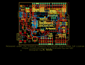
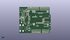
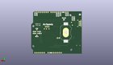
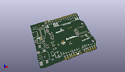

Contents
========

* [PROJ-SPAR-15444-STAN-01>RedBoard Artemis](#proj-spar-15444-stan-01redboard-artemis)
	* [Images](#images)
	* [Interactive BOM](#interactive-bom)
	* [OOMP Parts](#oomp-parts)
	* [Tags](#tags)
  
![][im]
# PROJ-SPAR-15444-STAN-01>RedBoard Artemis

- ID: PROJ-SPAR-15444-STAN-01
- Hex ID: PRS15444
- Name: RedBoard Artemis
- Description: 

## Images
  
  

|eagleImage|kicadPcb3dFront|kicadPcb3dBack|kicadPcb3d|
| :---: | :---: | :---: | :---: |
|||||

## Interactive BOM

- Interactive BOM page: [ibom.html](kicad/bom/ibom.html)

## OOMP Parts
  

|OOMP Parts|
| :---: |
|UNMATCHED-UNMATCHED-X-UNMATCHED-01, BT1, 21.59, 29.209999999999997, M90,BT1, CR2032, BATTCON_20MM_4LEGS_OVERPASTE, SparkFun-Batteries, (0.85, 1.15), MR90|
|UNMATCHED-UNMATCHED-X-UNMATCHED-01, BYP, 8.762999999999998, 35.433, 270,BYP, SMT-JUMPER_2_NO_SILK, SparkFun-Jumpers, (0.345, 1.395), R270|
|<table><tr><td></td><td> C1</td><td>[CAPC-0603-X-NF100-V50 SMD (0603) 100 nF Capacitor (Ceramic) 50v](https://github.com/oomlout/oomlout_OOMP_parts/tree/main/CAPC-0603-X-NF100-V50/)</td><td>[C6N100](https://github.com/oomlout/oomlout_OOMP_parts/tree/main/CAPC-0603-X-NF100-V50/)</td></tr></table>|
|<table><tr><td></td><td> C2</td><td>[CAPC-0603-X-NF100-V50 SMD (0603) 100 nF Capacitor (Ceramic) 50v](https://github.com/oomlout/oomlout_OOMP_parts/tree/main/CAPC-0603-X-NF100-V50/)</td><td>[C6N100](https://github.com/oomlout/oomlout_OOMP_parts/tree/main/CAPC-0603-X-NF100-V50/)</td></tr></table>|
|CAPC-UNMATCHED-X-UNMATCHED-01, C3, 20.32, 16.002, 180,C3, 10uF, EIA3216, SparkFun-Capacitors, (0.8, 0.63), R180|
|<table><tr><td></td><td> C4</td><td>[CAPC-0603-X-NF100-V50 SMD (0603) 100 nF Capacitor (Ceramic) 50v](https://github.com/oomlout/oomlout_OOMP_parts/tree/main/CAPC-0603-X-NF100-V50/)</td><td>[C6N100](https://github.com/oomlout/oomlout_OOMP_parts/tree/main/CAPC-0603-X-NF100-V50/)</td></tr></table>|
|CAPE-UNMATCHED-X-UNMATCHED-01, C5, 21.59, 8.382, 90,C5, 47uF, PANASONIC_D, SparkFun-Capacitors, (0.85, 0.33), R90|
|CAPC-UNMATCHED-X-UNMATCHED-01, C6, 20.32, 24.892, 0,C6, 10uF, EIA3216, SparkFun-Capacitors, (0.8, 0.98), R0|
|CAPC-0603-X-UNMATCHED-01, C7, 51.815999999999995, 23.241, 180,C7, 10uF, 0603, SparkFun-Capacitors, (2.04, 0.915), R180|
|<table><tr><td></td><td> C8</td><td>[CAPC-0603-X-NF100-V50 SMD (0603) 100 nF Capacitor (Ceramic) 50v](https://github.com/oomlout/oomlout_OOMP_parts/tree/main/CAPC-0603-X-NF100-V50/)</td><td>[C6N100](https://github.com/oomlout/oomlout_OOMP_parts/tree/main/CAPC-0603-X-NF100-V50/)</td></tr></table>|
|CAPC-0603-X-UNMATCHED-01, C9, 51.815999999999995, 21.59, 180,C9, 1.0uF, 0603, SparkFun-Capacitors, (2.04, 0.85), R180|
|<table><tr><td></td><td> C10</td><td>[CAPC-0603-X-NF100-V50 SMD (0603) 100 nF Capacitor (Ceramic) 50v](https://github.com/oomlout/oomlout_OOMP_parts/tree/main/CAPC-0603-X-NF100-V50/)</td><td>[C6N100](https://github.com/oomlout/oomlout_OOMP_parts/tree/main/CAPC-0603-X-NF100-V50/)</td></tr></table>|
|CAPC-0603-X-UNMATCHED-01, C11, 51.815999999999995, 31.369, 0,C11, 15pF, 0603, SparkFun-Capacitors, (2.04, 1.235), R0|
|<table><tr><td></td><td> C12</td><td>[CAPC-0603-X-NF100-V50 SMD (0603) 100 nF Capacitor (Ceramic) 50v](https://github.com/oomlout/oomlout_OOMP_parts/tree/main/CAPC-0603-X-NF100-V50/)</td><td>[C6N100](https://github.com/oomlout/oomlout_OOMP_parts/tree/main/CAPC-0603-X-NF100-V50/)</td></tr></table>|
|CAPC-0603-X-UNMATCHED-01, C13, 51.815999999999995, 26.288999999999998, 0,C13, 15pF, 0603, SparkFun-Capacitors, (2.04, 1.035), R0|
|CAPC-UNMATCHED-X-UNMATCHED-01, C15, 10.668, 33.019999999999996, 180,C15, 10uF, EIA3216, SparkFun-Capacitors, (0.42, 1.3), R180|
|CAPC-0603-X-UNMATCHED-01, C16, 20.32, 22.86, 180,C16, 1.0uF, 0603, SparkFun-Capacitors, (0.8, 0.9), R180|
|CAPC-0603-X-UNMATCHED-01, C17, 12.7, 35.559999999999995, 0,C17, 10nF, 0603, SparkFun-Capacitors, (0.5, 1.4), R0|
|<table><tr><td></td><td> C18</td><td>[CAPC-0603-X-NF100-V50 SMD (0603) 100 nF Capacitor (Ceramic) 50v](https://github.com/oomlout/oomlout_OOMP_parts/tree/main/CAPC-0603-X-NF100-V50/)</td><td>[C6N100](https://github.com/oomlout/oomlout_OOMP_parts/tree/main/CAPC-0603-X-NF100-V50/)</td></tr></table>|
|<table><tr><td></td><td> C19</td><td>[CAPC-0603-X-NF100-V50 SMD (0603) 100 nF Capacitor (Ceramic) 50v](https://github.com/oomlout/oomlout_OOMP_parts/tree/main/CAPC-0603-X-NF100-V50/)</td><td>[C6N100](https://github.com/oomlout/oomlout_OOMP_parts/tree/main/CAPC-0603-X-NF100-V50/)</td></tr></table>|
|CAPC-0603-X-UNMATCHED-01, C28, 16.002, 49.784, 0,C28, 1nF, 0603, SparkFun-Capacitors, (0.63, 1.96), R0|
|UNMATCHED-UNMATCHED-X-UNMATCHED-01, D1, 16.002, 10.921999999999999, 90,D1, 1A/40V/500mV, SMA-DIODE, SparkFun-DiscreteSemi, (0.63, 0.43), R90|
|UNMATCHED-UNMATCHED-X-UNMATCHED-01, D2, 21.59, 34.29, 180,D2, GREEN, LED-1206, SparkFun-LED, (0.85, 1.35), R180|
|UNMATCHED-UNMATCHED-X-UNMATCHED-01, D3, 21.59, 30.479999999999997, 180,D3, Yellow, LED-1206, SparkFun-LED, (0.85, 1.2), R180|
|UNMATCHED-UNMATCHED-X-UNMATCHED-01, D4, 25.4, 19.049999999999997, 270,D4, 3A/10V/280mV, SOD-323, SparkFun-DiscreteSemi, (1, 0.75), R270|
|UNMATCHED-UNMATCHED-X-UNMATCHED-01, E1, 58.419999999999995, 20.32, 90,E1, SPH0641LM4H-1, SPH0641LM4H-1_MICROPHONE, SparkFun-Sensors, (2.3, 0.8), R90|
|UNMATCHED-1210-X-UNMATCHED-01, F2, 5.715, 33.019999999999996, 0,F2, 6V/2A, 1210, SparkFun-Fuses, (0.225, 1.3), R0|
|UNMATCHED-UNMATCHED-X-UNMATCHED-01, IC3, 7.619999999999999, 24.13, 90,IC3, LM1117, SOT223-ALT1, Testing, (0.3, 0.95), R90|
|UNMATCHED-UNMATCHED-X-UNMATCHED-01, J1, 33.019999999999996, 21.59, 180,J1, 1X02_NO_SILK, SparkFun-Connectors, (1.3, 0.85), R180|
|UNMATCHED-UNMATCHED-X-UNMATCHED-01, J2, 46.99, 37.337999999999994, 180,J2, CORTEX_DEBUG, 2X5-PTH-1.27MM-NO_SILK, SparkFun-Connectors, (1.85, 1.47), R180|
|UNMATCHED-UNMATCHED-X-UNMATCHED-01, J3, 2.032, 11.176, 0,J3, POWER_JACKTOE, POWER_JACK_SMD_OVERPASTE_TOE, SparkFun-Connectors, (0.08, 0.44), R0|
|UNMATCHED-UNMATCHED-X-UNMATCHED-01, J4, 63.5, 19.049999999999997, 90,J4, JST04_1MM_RA, SparkFun-Connectors, (2.5, 0.75), R90|
|UNMATCHED-UNMATCHED-X-UNMATCHED-01, J5, 6.35, 41.91, 270,J5, USB-C, USB-C-16P, SparkFun-Connectors, (0.25, 1.65), R270|
|UNMATCHED-UNMATCHED-X-UNMATCHED-01, J7, 12.7, 50.8, 180,J7, 1X02_NO_SILK, SparkFun-Connectors, (0.5, 2), R180|
|<table><tr><td></td><td> JP2</td><td>[HEAD-I01-X-PI10-01 2.54 mm 10 Pin Header](https://github.com/oomlout/oomlout_OOMP_parts/tree/main/HEAD-I01-X-PI10-01/)</td><td>[H10](https://github.com/oomlout/oomlout_OOMP_parts/tree/main/HEAD-I01-X-PI10-01/)</td></tr></table>|
|HEAD-I01-X-PI2-01, JP8, 65.913, 6.858, 0,JP8, FIDUCIAL1X2, FIDUCIAL-1X2, SparkFun, (2.595, 0.27), R0|
|HEAD-I01-X-PI2-01, JP9, 11.43, 54.60999999999999, 0,JP9, FIDUCIAL1X2, FIDUCIAL-1X2, SparkFun, (0.45, 2.15), R0|
|<table><tr><td></td><td> JP10</td><td>[HEAD-I01-X-PI08-01 2.54 mm 8 Pin Header](https://github.com/oomlout/oomlout_OOMP_parts/tree/main/HEAD-I01-X-PI08-01/)</td><td>[H08](https://github.com/oomlout/oomlout_OOMP_parts/tree/main/HEAD-I01-X-PI08-01/)</td></tr></table>|
|<table><tr><td></td><td> JP11</td><td>[HEAD-I01-X-PI08-01 2.54 mm 8 Pin Header](https://github.com/oomlout/oomlout_OOMP_parts/tree/main/HEAD-I01-X-PI08-01/)</td><td>[H08](https://github.com/oomlout/oomlout_OOMP_parts/tree/main/HEAD-I01-X-PI08-01/)</td></tr></table>|
|<table><tr><td></td><td> JP12</td><td>[HEAD-I01-X-PI10-01 2.54 mm 10 Pin Header](https://github.com/oomlout/oomlout_OOMP_parts/tree/main/HEAD-I01-X-PI10-01/)</td><td>[H10](https://github.com/oomlout/oomlout_OOMP_parts/tree/main/HEAD-I01-X-PI10-01/)</td></tr></table>|
|<table><tr><td></td><td> JP13</td><td>[HEAD-I01-X-PI06-01 2.54 mm 6 Pin Header](https://github.com/oomlout/oomlout_OOMP_parts/tree/main/HEAD-I01-X-PI06-01/)</td><td>[H06](https://github.com/oomlout/oomlout_OOMP_parts/tree/main/HEAD-I01-X-PI06-01/)</td></tr></table>|
|HEAD-I01-X-PI08@1-01, JP15, 45.72, 1.27, 180,JP15, 1X08_NO_SILK@1, SparkFun-Connectors, (1.8, 0.05), R180|
|UNMATCHED-UNMATCHED-X-UNMATCHED-01, JP16, 24.13, 46.99, M90,JP16, SMT-JUMPER_2_NC_TRACE_SILK, SparkFun-Jumpers, (0.95, 1.85), MR90|
|UNMATCHED-UNMATCHED-X-UNMATCHED-01, JP17, 31.75, 17.779999999999998, 0,JP17, MEAS, SMT-JUMPER_2_NC_TRACE_SILK, SparkFun-Jumpers, (1.25, 0.7), R0|
|HEAD-I01-X-PI06@1-01, JP18, 50.8, 1.27, 0,JP18, 1X06_NO_SILK@1, SparkFun-Connectors, (2, 0.05), R0|
|<table><tr><td></td><td> JP19</td><td>[HEAD-I01-X-PI08-01 2.54 mm 8 Pin Header](https://github.com/oomlout/oomlout_OOMP_parts/tree/main/HEAD-I01-X-PI08-01/)</td><td>[H08](https://github.com/oomlout/oomlout_OOMP_parts/tree/main/HEAD-I01-X-PI08-01/)</td></tr></table>|
|UNMATCHED-UNMATCHED-X-UNMATCHED-01, LED1, 21.59, 38.099999999999994, 180,LED1, BLUE, LED-1206, SparkFun-LED, (0.85, 1.5), R180|
|UNMATCHED-UNMATCHED-X-UNMATCHED-01, LED2, 39.37, 15.239999999999998, 0,LED2, GREEN, LED-1206, SparkFun-LED, (1.55, 0.6), R0|
|UNMATCHED-UNMATCHED-X-UNMATCHED-01, Q1, 6.35, 29.463999999999995, 270,Q1, 2.5A/30V/105m?, SOT23-3, SparkFun-DiscreteSemi, (0.25, 1.16), R270|
|RESE-0603-X-UNMATCHED-01, R1, 21.59, 36.195, 0,R1, 4.7k, 0603, SparkFun-Resistors, (0.85, 1.425), R0|
|<table><tr><td></td><td> R2</td><td>[RESE-0603-X-O103-01 SMD (0603) 10k Ohm Resistor](https://github.com/oomlout/oomlout_OOMP_parts/tree/main/RESE-0603-X-O103-01/)</td><td>[R6103](https://github.com/oomlout/oomlout_OOMP_parts/tree/main/RESE-0603-X-O103-01/)</td></tr></table>|
|<table><tr><td></td><td> R3</td><td>[RESE-0603-X-O104-01 SMD (0603) 100k Ohm Resistor](https://github.com/oomlout/oomlout_OOMP_parts/tree/main/RESE-0603-X-O104-01/)</td><td>[R6104](https://github.com/oomlout/oomlout_OOMP_parts/tree/main/RESE-0603-X-O104-01/)</td></tr></table>|
|<table><tr><td></td><td> R4</td><td>[RESE-0603-X-O103-01 SMD (0603) 10k Ohm Resistor](https://github.com/oomlout/oomlout_OOMP_parts/tree/main/RESE-0603-X-O103-01/)</td><td>[R6103](https://github.com/oomlout/oomlout_OOMP_parts/tree/main/RESE-0603-X-O103-01/)</td></tr></table>|
|RESE-0603-X-UNMATCHED-01, R5, 19.049999999999997, 43.18, 180,R5, 0603, SparkFun-Resistors, (0.75, 1.7), R180|
|RESE-0603-X-UNMATCHED-01, R7, 1.778, 33.909, 0,R7, 5.1k, 0603, SparkFun-Resistors, (0.07, 1.335), R0|
|RESE-0603-X-UNMATCHED-01, R8, 9.398, 48.26, 180,R8, 5.1k, 0603, SparkFun-Resistors, (0.37, 1.9), R180|
|<table><tr><td></td><td> R9</td><td>[RESE-0603-X-O224-01 SMD (0603) 220k Ohm Resistor](https://github.com/oomlout/oomlout_OOMP_parts/tree/main/RESE-0603-X-O224-01/)</td><td>[R6224](https://github.com/oomlout/oomlout_OOMP_parts/tree/main/RESE-0603-X-O224-01/)</td></tr></table>|
|RESE-0603-X-UNMATCHED-01, R12, 21.59, 28.575, 180,R12, 4.7k, 0603, SparkFun-Resistors, (0.85, 1.125), R180|
|RESE-0603-X-UNMATCHED-01, R14, 13.334999999999999, 19.812, 180,R14, 715, 0603, SparkFun-Resistors, (0.525, 0.78), R180|
|RESE-0603-X-UNMATCHED-01, R15, 13.334999999999999, 22.352, 0,R15, 240, 0603, SparkFun-Resistors, (0.525, 0.88), R0|
|RESE-0603-X-UNMATCHED-01, R16, 21.59, 32.385, 180,R16, 4.7k, 0603, SparkFun-Resistors, (0.85, 1.275), R180|
|UNMATCHED-UNMATCHED-X-UNMATCHED-01, S1, 5.08, 52.06999999999999, 180,S1, TACTILE_SWITCH_SMD_5.2MM, SparkFun-Switches, (0.2, 2.05), R180|
|UNMATCHED-UNMATCHED-X-UNMATCHED-01, U1, 60.57899999999999, 29.209999999999997, 0,U1, ARTEMIS_MODULESMD, ARTEMIS_FP, SparkFun-IC-Microcontroller, (2.385, 1.15), R0|
|UNMATCHED-UNMATCHED-X-UNMATCHED-01, U3, 20.32, 20.32, 270,U3, AP2112-3.3V, SOT23-5, SparkFun-PowerIC, (0.8, 0.8), R270|
|UNMATCHED-UNMATCHED-X-UNMATCHED-01, U5, 12.7, 41.91, 270,U5, CH340C, SO016, SparkFun-IC-Comms, (0.5, 1.65), R270|
|UNMATCHED-UNMATCHED-X-UNMATCHED-01, Y1, 51.815999999999995, 28.828999999999997, 90,Y1, 32.768kHz, CRYSTAL-SMD-3.2X1.5MM, SparkFun-Clocks, (2.04, 1.135), R90|

## Tags

- hexID: PRS15444
- oompType: PROJ
- oompSize: SPAR
- oompColor: 15444
- oompDesc: STAN
- oompIndex: 01
- oompName: RedBoard Artemis
- sources: All source files from https://github.com/sparkfun/RedBoard_Artemis (source licence details in srcLicense.md)
- linkBuyPage: https://www.sparkfun.com/products/15444
- oompID: PROJ-SPAR-15444-STAN-01
- oompPart: UNMATCHED-UNMATCHED-X-UNMATCHED-01, BT1, 21.59, 29.209999999999997, M90
- oompPart: UNMATCHED-UNMATCHED-X-UNMATCHED-01, BYP, 8.762999999999998, 35.433, 270
- oompPart: CAPC-0603-X-NF100-V50, C1, 19.049999999999997, 41.65599999999999, 0
- oompPart: CAPC-0603-X-NF100-V50, C2, 51.815999999999995, 24.764999999999997, 0
- oompPart: CAPC-UNMATCHED-X-UNMATCHED-01, C3, 20.32, 16.002, 180
- oompPart: CAPC-0603-X-NF100-V50, C4, 10.16, 28.701999999999995, 0
- oompPart: CAPE-UNMATCHED-X-UNMATCHED-01, C5, 21.59, 8.382, 90
- oompPart: CAPC-UNMATCHED-X-UNMATCHED-01, C6, 20.32, 24.892, 0
- oompPart: CAPC-0603-X-UNMATCHED-01, C7, 51.815999999999995, 23.241, 180
- oompPart: CAPC-0603-X-NF100-V50, C8, 19.049999999999997, 44.704, 0
- oompPart: CAPC-0603-X-UNMATCHED-01, C9, 51.815999999999995, 21.59, 180
- oompPart: CAPC-0603-X-NF100-V50, C10, 1.778, 32.13099999999999, 180
- oompPart: CAPC-0603-X-UNMATCHED-01, C11, 51.815999999999995, 31.369, 0
- oompPart: CAPC-0603-X-NF100-V50, C12, 10.16, 30.225999999999996, 0
- oompPart: CAPC-0603-X-UNMATCHED-01, C13, 51.815999999999995, 26.288999999999998, 0
- oompPart: CAPC-UNMATCHED-X-UNMATCHED-01, C15, 10.668, 33.019999999999996, 180
- oompPart: CAPC-0603-X-UNMATCHED-01, C16, 20.32, 22.86, 180
- oompPart: CAPC-0603-X-UNMATCHED-01, C17, 12.7, 35.559999999999995, 0
- oompPart: CAPC-0603-X-NF100-V50, C18, 12.7, 48.26, 180
- oompPart: CAPC-0603-X-NF100-V50, C19, 55.498999999999995, 20.32, 90
- oompPart: CAPC-0603-X-UNMATCHED-01, C28, 16.002, 49.784, 0
- oompPart: UNMATCHED-UNMATCHED-X-UNMATCHED-01, D1, 16.002, 10.921999999999999, 90
- oompPart: UNMATCHED-UNMATCHED-X-UNMATCHED-01, D2, 21.59, 34.29, 180
- oompPart: UNMATCHED-UNMATCHED-X-UNMATCHED-01, D3, 21.59, 30.479999999999997, 180
- oompPart: UNMATCHED-UNMATCHED-X-UNMATCHED-01, D4, 25.4, 19.049999999999997, 270
- oompPart: UNMATCHED-UNMATCHED-X-UNMATCHED-01, E1, 58.419999999999995, 20.32, 90
- oompPart: UNMATCHED-1210-X-UNMATCHED-01, F2, 5.715, 33.019999999999996, 0
- oompPart: UNMATCHED-UNMATCHED-X-UNMATCHED-01, IC3, 7.619999999999999, 24.13, 90
- oompPart: UNMATCHED-UNMATCHED-X-UNMATCHED-01, J1, 33.019999999999996, 21.59, 180
- oompPart: UNMATCHED-UNMATCHED-X-UNMATCHED-01, J2, 46.99, 37.337999999999994, 180
- oompPart: UNMATCHED-UNMATCHED-X-UNMATCHED-01, J3, 2.032, 11.176, 0
- oompPart: UNMATCHED-UNMATCHED-X-UNMATCHED-01, J4, 63.5, 19.049999999999997, 90
- oompPart: UNMATCHED-UNMATCHED-X-UNMATCHED-01, J5, 6.35, 41.91, 270
- oompPart: UNMATCHED-UNMATCHED-X-UNMATCHED-01, J7, 12.7, 50.8, 180
- oompPart: HEAD-I01-X-PI10-01, JP2, 18.796, 53.339999999999996, 0
- oompPart: HEAD-I01-X-PI2-01, JP8, 65.913, 6.858, 0
- oompPart: HEAD-I01-X-PI2-01, JP9, 11.43, 54.60999999999999, 0
- oompPart: HEAD-I01-X-PI08-01, JP10, 27.94, 5.08, 180
- oompPart: HEAD-I01-X-PI08-01, JP11, 45.72, 53.339999999999996, 180
- oompPart: HEAD-I01-X-PI10-01, JP12, 18.796, 57.15, 0
- oompPart: HEAD-I01-X-PI06-01, JP13, 50.8, 5.08, 0
- oompPart: SKIP-UNMATCHED-X-UNMATCHED-01, JP14, 1.9049999999999998, 41.91, M0
- oompPart: HEAD-I01-X-PI08@1-01, JP15, 45.72, 1.27, 180
- oompPart: UNMATCHED-UNMATCHED-X-UNMATCHED-01, JP16, 24.13, 46.99, M90
- oompPart: UNMATCHED-UNMATCHED-X-UNMATCHED-01, JP17, 31.75, 17.779999999999998, 0
- oompPart: HEAD-I01-X-PI06@1-01, JP18, 50.8, 1.27, 0
- oompPart: HEAD-I01-X-PI08-01, JP19, 63.5, 57.15, 180
- oompPart: UNMATCHED-UNMATCHED-X-UNMATCHED-01, LED1, 21.59, 38.099999999999994, 180
- oompPart: UNMATCHED-UNMATCHED-X-UNMATCHED-01, LED2, 39.37, 15.239999999999998, 0
- oompPart: UNMATCHED-UNMATCHED-X-UNMATCHED-01, Q1, 6.35, 29.463999999999995, 270
- oompPart: RESE-0603-X-UNMATCHED-01, R1, 21.59, 36.195, 0
- oompPart: RESE-0603-X-O103-01, R2, 39.37, 17.272000000000002, 0
- oompPart: RESE-0603-X-O104-01, R3, 16.002, 48.26, 180
- oompPart: RESE-0603-X-O103-01, R4, 3.8099999999999996, 29.337, 270
- oompPart: RESE-0603-X-UNMATCHED-01, R5, 19.049999999999997, 43.18, 180
- oompPart: RESE-0603-X-UNMATCHED-01, R7, 1.778, 33.909, 0
- oompPart: RESE-0603-X-UNMATCHED-01, R8, 9.398, 48.26, 180
- oompPart: RESE-0603-X-O224-01, R9, 19.049999999999997, 40.132, 0
- oompPart: RESE-0603-X-UNMATCHED-01, R12, 21.59, 28.575, 180
- oompPart: RESE-0603-X-UNMATCHED-01, R14, 13.334999999999999, 19.812, 180
- oompPart: RESE-0603-X-UNMATCHED-01, R15, 13.334999999999999, 22.352, 0
- oompPart: RESE-0603-X-UNMATCHED-01, R16, 21.59, 32.385, 180
- oompPart: UNMATCHED-UNMATCHED-X-UNMATCHED-01, S1, 5.08, 52.06999999999999, 180
- oompPart: SKIP-UNMATCHED-X-UNMATCHED-01, TP1, 48.00599999999999, 34.29, M90
- oompPart: SKIP-UNMATCHED-X-UNMATCHED-01, TP2, 50.8, 34.29, M90
- oompPart: SKIP-UNMATCHED-X-UNMATCHED-01, TP3, 44.449999999999996, 34.29, M0
- oompPart: SKIP-UNMATCHED-X-UNMATCHED-01, TP5, 13.97, 43.18, M90
- oompPart: SKIP-UNMATCHED-X-UNMATCHED-01, TP6, 12.7, 39.37, M90
- oompPart: SKIP-UNMATCHED-X-UNMATCHED-01, TP8, 60.959999999999994, 25.4, M270
- oompPart: SKIP-UNMATCHED-X-UNMATCHED-01, TP9, 59.69, 27.94, M270
- oompPart: SKIP-UNMATCHED-X-UNMATCHED-01, TP11, 62.230000000000004, 27.94, M0
- oompPart: SKIP-UNMATCHED-X-UNMATCHED-01, TP12, 59.69, 30.479999999999997, M0
- oompPart: SKIP-UNMATCHED-X-UNMATCHED-01, TP13, 62.230000000000004, 30.479999999999997, M0
- oompPart: SKIP-UNMATCHED-X-UNMATCHED-01, TP14, 60.959999999999994, 33.019999999999996, M0
- oompPart: UNMATCHED-UNMATCHED-X-UNMATCHED-01, U1, 60.57899999999999, 29.209999999999997, 0
- oompPart: UNMATCHED-UNMATCHED-X-UNMATCHED-01, U3, 20.32, 20.32, 270
- oompPart: UNMATCHED-UNMATCHED-X-UNMATCHED-01, U5, 12.7, 41.91, 270
- oompPart: UNMATCHED-UNMATCHED-X-UNMATCHED-01, Y1, 51.815999999999995, 28.828999999999997, 90
- rawPart: BT1, CR2032, BATTCON_20MM_4LEGS_OVERPASTE, SparkFun-Batteries, (0.85, 1.15), MR90
- rawPart: BYP, SMT-JUMPER_2_NO_SILK, SparkFun-Jumpers, (0.345, 1.395), R270
- rawPart: C1, 0.1uF, 0603, SparkFun-Capacitors, (0.75, 1.64), R0
- rawPart: C2, 0.1uF, 0603, SparkFun-Capacitors, (2.04, 0.975), R0
- rawPart: C3, 10uF, EIA3216, SparkFun-Capacitors, (0.8, 0.63), R180
- rawPart: C4, 0.1uF, 0603, SparkFun-Capacitors, (0.4, 1.13), R0
- rawPart: C5, 47uF, PANASONIC_D, SparkFun-Capacitors, (0.85, 0.33), R90
- rawPart: C6, 10uF, EIA3216, SparkFun-Capacitors, (0.8, 0.98), R0
- rawPart: C7, 10uF, 0603, SparkFun-Capacitors, (2.04, 0.915), R180
- rawPart: C8, 0.1uF, 0603, SparkFun-Capacitors, (0.75, 1.76), R0
- rawPart: C9, 1.0uF, 0603, SparkFun-Capacitors, (2.04, 0.85), R180
- rawPart: C10, 0.1uF, 0603, SparkFun-Capacitors, (0.07, 1.265), R180
- rawPart: C11, 15pF, 0603, SparkFun-Capacitors, (2.04, 1.235), R0
- rawPart: C12, 0.1uF, 0603, SparkFun-Capacitors, (0.4, 1.19), R0
- rawPart: C13, 15pF, 0603, SparkFun-Capacitors, (2.04, 1.035), R0
- rawPart: C15, 10uF, EIA3216, SparkFun-Capacitors, (0.42, 1.3), R180
- rawPart: C16, 1.0uF, 0603, SparkFun-Capacitors, (0.8, 0.9), R180
- rawPart: C17, 10nF, 0603, SparkFun-Capacitors, (0.5, 1.4), R0
- rawPart: C18, 0.1uF, 0603, SparkFun-Capacitors, (0.5, 1.9), R180
- rawPart: C19, 0.1uF, 0603, SparkFun-Capacitors, (2.185, 0.8), R90
- rawPart: C28, 1nF, 0603, SparkFun-Capacitors, (0.63, 1.96), R0
- rawPart: D1, 1A/40V/500mV, SMA-DIODE, SparkFun-DiscreteSemi, (0.63, 0.43), R90
- rawPart: D2, GREEN, LED-1206, SparkFun-LED, (0.85, 1.35), R180
- rawPart: D3, Yellow, LED-1206, SparkFun-LED, (0.85, 1.2), R180
- rawPart: D4, 3A/10V/280mV, SOD-323, SparkFun-DiscreteSemi, (1, 0.75), R270
- rawPart: E1, SPH0641LM4H-1, SPH0641LM4H-1_MICROPHONE, SparkFun-Sensors, (2.3, 0.8), R90
- rawPart: F2, 6V/2A, 1210, SparkFun-Fuses, (0.225, 1.3), R0
- rawPart: IC3, LM1117, SOT223-ALT1, Testing, (0.3, 0.95), R90
- rawPart: J1, 1X02_NO_SILK, SparkFun-Connectors, (1.3, 0.85), R180
- rawPart: J2, CORTEX_DEBUG, 2X5-PTH-1.27MM-NO_SILK, SparkFun-Connectors, (1.85, 1.47), R180
- rawPart: J3, POWER_JACKTOE, POWER_JACK_SMD_OVERPASTE_TOE, SparkFun-Connectors, (0.08, 0.44), R0
- rawPart: J4, JST04_1MM_RA, SparkFun-Connectors, (2.5, 0.75), R90
- rawPart: J5, USB-C, USB-C-16P, SparkFun-Connectors, (0.25, 1.65), R270
- rawPart: J7, 1X02_NO_SILK, SparkFun-Connectors, (0.5, 2), R180
- rawPart: JP2, M10SMD_COMBO, 1X10_SMD_COMBINED, SparkFun-Connectors, (0.74, 2.1), R0
- rawPart: JP8, FIDUCIAL1X2, FIDUCIAL-1X2, SparkFun, (2.595, 0.27), R0
- rawPart: JP9, FIDUCIAL1X2, FIDUCIAL-1X2, SparkFun, (0.45, 2.15), R0
- rawPart: JP10, 1X08_SMD_COMBINED_NC, SparkFun-Connectors, (1.1, 0.2), R180
- rawPart: JP11, JP11, 1X08_SMD_COMBINED_NC, SparkFun-Connectors, (1.8, 2.1), R180
- rawPart: JP12, M10NO_SILK, 1X10_NO_SILK, SparkFun-Connectors, (0.74, 2.25), R0
- rawPart: JP13, 1X06_SMD_STRAIGHT_COMBO, SparkFun-Connectors, (2, 0.2), R0
- rawPart: JP14, USB_SOLDER_PADS, USB-SOLDER-PADS, SparkFun-Connectors, (0.075, 1.65), MR0
- rawPart: JP15, 1X08_NO_SILK@1, SparkFun-Connectors, (1.8, 0.05), R180
- rawPart: JP16, SMT-JUMPER_2_NC_TRACE_SILK, SparkFun-Jumpers, (0.95, 1.85), MR90
- rawPart: JP17, MEAS, SMT-JUMPER_2_NC_TRACE_SILK, SparkFun-Jumpers, (1.25, 0.7), R0
- rawPart: JP18, 1X06_NO_SILK@1, SparkFun-Connectors, (2, 0.05), R0
- rawPart: JP19, 1X08_NO_SILK, SparkFun-Connectors, (2.5, 2.25), R180
- rawPart: LED1, BLUE, LED-1206, SparkFun-LED, (0.85, 1.5), R180
- rawPart: LED2, GREEN, LED-1206, SparkFun-LED, (1.55, 0.6), R0
- rawPart: Q1, 2.5A/30V/105m?, SOT23-3, SparkFun-DiscreteSemi, (0.25, 1.16), R270
- rawPart: R1, 4.7k, 0603, SparkFun-Resistors, (0.85, 1.425), R0
- rawPart: R2, 10k, 0603, SparkFun-Resistors, (1.55, 0.68), R0
- rawPart: R3, 100k, 0603, SparkFun-Resistors, (0.63, 1.9), R180
- rawPart: R4, 10k, 0603, SparkFun-Resistors, (0.15, 1.155), R270
- rawPart: R5, 0603, SparkFun-Resistors, (0.75, 1.7), R180
- rawPart: R7, 5.1k, 0603, SparkFun-Resistors, (0.07, 1.335), R0
- rawPart: R8, 5.1k, 0603, SparkFun-Resistors, (0.37, 1.9), R180
- rawPart: R9, 220k, 0603, SparkFun-Resistors, (0.75, 1.58), R0
- rawPart: R12, 4.7k, 0603, SparkFun-Resistors, (0.85, 1.125), R180
- rawPart: R14, 715, 0603, SparkFun-Resistors, (0.525, 0.78), R180
- rawPart: R15, 240, 0603, SparkFun-Resistors, (0.525, 0.88), R0
- rawPart: R16, 4.7k, 0603, SparkFun-Resistors, (0.85, 1.275), R180
- rawPart: S1, TACTILE_SWITCH_SMD_5.2MM, SparkFun-Switches, (0.2, 2.05), R180
- rawPart: TP1, PAD.03X.05, SparkFun-Connectors, (1.89, 1.35), MR90
- rawPart: TP2, PAD.03X.05, SparkFun-Connectors, (2, 1.35), MR90
- rawPart: TP3, PAD.03X.05, SparkFun-Connectors, (1.75, 1.35), MR0
- rawPart: TP5, TEST-POINT3X5, PAD.03X.05, SparkFun-Connectors, (0.55, 1.7), MR90
- rawPart: TP6, TEST-POINT3X5, PAD.03X.05, SparkFun-Connectors, (0.5, 1.55), MR90
- rawPart: TP8, PAD.03X.05, SparkFun-Connectors, (2.4, 1), MR270
- rawPart: TP9, PAD.03X.05, SparkFun-Connectors, (2.35, 1.1), MR270
- rawPart: TP11, PAD.03X.05, SparkFun-Connectors, (2.45, 1.1), MR0
- rawPart: TP12, PAD.03X.05, SparkFun-Connectors, (2.35, 1.2), MR0
- rawPart: TP13, PAD.03X.05, SparkFun-Connectors, (2.45, 1.2), MR0
- rawPart: TP14, PAD.03X.05, SparkFun-Connectors, (2.4, 1.3), MR0
- rawPart: U1, ARTEMIS_MODULESMD, ARTEMIS_FP, SparkFun-IC-Microcontroller, (2.385, 1.15), R0
- rawPart: U3, AP2112-3.3V, SOT23-5, SparkFun-PowerIC, (0.8, 0.8), R270
- rawPart: U5, CH340C, SO016, SparkFun-IC-Comms, (0.5, 1.65), R270
- rawPart: Y1, 32.768kHz, CRYSTAL-SMD-3.2X1.5MM, SparkFun-Clocks, (2.04, 1.135), R90

[im]: kicadPcb3d_450.png
