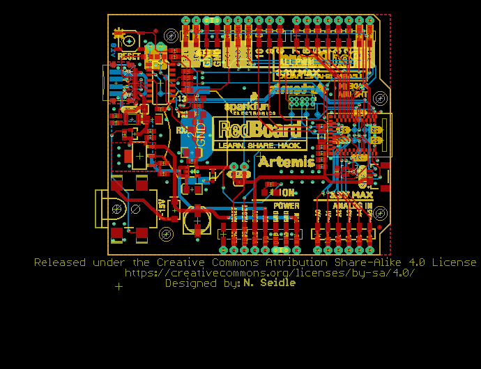
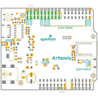
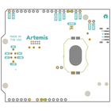
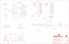
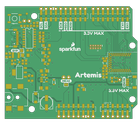
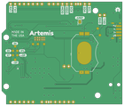

Contents
========

* [PRS15444 > RedBoard Artemis](#prs15444--redboard-artemis)
	* [Schematic](#schematic)
	* [PCB](#pcb)
	* [Interactive BOM](#interactive-bom)
	* [Images](#images)
	* [Tags](#tags)
  
![][im]
# PRS15444 > RedBoard Artemis

- ID: PROJ-SPAR-15444-STAN-01
- Hex ID: PRS15444
- Name: Sparkfun
- Description: Sparkfun
- Long Link: [http://oom.lt/PROJ-SPAR-15444-STAN-01](http://oom.lt/PROJ-SPAR-15444-STAN-01)
- Short Link: [http://oom.lt/PRS15444](http://oom.lt/PRS15444)

## Schematic
  

## PCB
  

## Interactive BOM

- Interactive BOM page: [ibom.html](https://htmlpreview.github.io/?https://github.com/oomlout/oomlout_OOMP_projects/blob/main/PROJ-SPAR-15444-STAN-01/kicad/bom/ibom.html)

## Images
  
  

|bominteractivefront|bominteractiveback|kicadPcb3d|kicadPcb3dFront|kicadPcb3dBack|eagleImage|eagleSchemImage|pcbdraw|pcbdrawback|
| :---: | :---: | :---: | :---: | :---: | :---: | :---: | :---: | :---: |
||||||||||

## Tags

- hexID: PRS15444
- oompType: PROJ
- oompSize: SPAR
- oompColor: 15444
- oompDesc: STAN
- oompIndex: 01
- oompName: RedBoard Artemis
- sources: All source files from https://github.com/sparkfun/RedBoard_Artemis (source licence details in srcLicense.md)
- linkBuyPage: https://www.sparkfun.com/products/15444
- oompID: PROJ-SPAR-15444-STAN-01
- rawParts: BT1,CR2032,BATTERY-20MM_SMD_4LEGS_OVERPASTE,BATTCON_20MM_4LEGS_OVERPASTE,Battery - Single Cell,,PRT-11892 ,,,BATT-10373,,
- rawParts: BYP,,JUMPER-SMT_2_NO_SILK,SMT-JUMPER_2_NO_SILK,Normally open jumper,,,,,,,
- rawParts: C1,0.1uF,0.1UF-0603-25V-5%,0603,0.1µF ceramic capacitors,,CAP-08604,,,,0.1uF,
- rawParts: C2,0.1uF,0.1UF-0603-25V-(+80/-20%),0603,0.1µF ceramic capacitors,,CAP-00810,,,,0.1uF,
- rawParts: C3,10uF,10UF-POLAR-EIA3216-16V-10%(TANT),EIA3216,10.0µF polarized capacitors,,CAP-00811,,,,10uF,
- rawParts: C4,0.1uF,0.1UF-0603-25V-(+80/-20%),0603,0.1µF ceramic capacitors,,CAP-00810,,,,0.1uF,
- rawParts: C5,47uF,47UF-POLAR-PANASONIC_D-35V-20%,PANASONIC_D,47µF polarized capacitors,,CAP-08478,,,,47uF,
- rawParts: C6,10uF,10UF-POLAR-EIA3216-16V-10%(TANT),EIA3216,10.0µF polarized capacitors,,CAP-00811,,,,10uF,
- rawParts: C7,10uF,10UF-0603-6.3V-20%,0603,10.0µF ceramic capacitors,,CAP-11015,,,,10uF,
- rawParts: C8,0.1uF,0.1UF-0603-25V-5%,0603,0.1µF ceramic capacitors,,CAP-08604,,,,0.1uF,
- rawParts: C9,1.0uF,1.0UF-0603-16V-10%,0603,1µF ceramic capacitors,,CAP-00868,,,,1.0uF,
- rawParts: C10,0.1uF,0.1UF-0603-25V-(+80/-20%),0603,0.1µF ceramic capacitors,,CAP-00810,,,,0.1uF,
- rawParts: C11,15pF,15PF-0603-50V-5%,0603,15pF ceramic capacitors,,CAP-07881,,,,15pF,
- rawParts: C12,0.1uF,0.1UF-0603-25V-(+80/-20%),0603,0.1µF ceramic capacitors,,CAP-00810,,,,0.1uF,
- rawParts: C13,15pF,15PF-0603-50V-5%,0603,15pF ceramic capacitors,,CAP-07881,,,,15pF,
- rawParts: C15,10uF,10UF-POLAR-EIA3216-16V-10%(TANT),EIA3216,10.0µF polarized capacitors,,CAP-00811,,,,10uF,
- rawParts: C16,1.0uF,1.0UF-0603-16V-10%,0603,1µF ceramic capacitors,,CAP-00868,,,,1.0uF,
- rawParts: C17,10nF,10NF-0603-50V-10%,0603,0.01uF/10nF/10,000pF ceramic capacitors,,CAP-00867,,,,10nF,
- rawParts: C18,0.1uF,0.1UF-0603-25V-(+80/-20%),0603,0.1µF ceramic capacitors,,CAP-00810,,,,0.1uF,
- rawParts: C19,0.1uF,0.1UF-0603-25V-(+80/-20%),0603,0.1µF ceramic capacitors,,CAP-00810,,,,0.1uF,
- rawParts: C28,1nF,1.0NF/1000PF-0603-50V-10%,0603,1nF/1,000pF ceramic capacitors,,CAP-07886,,,,1nF,
- rawParts: D1,1A/40V/500mV,DIODE-SCHOTTKY-SS14,SMA-DIODE,Schottky diode,,DIO-08053,,,,1A/40V/500mV,
- rawParts: D2,GREEN,LED-GREENLILYPAD,LED-1206,Green SMD LED,,DIO-09910,,,,GREEN,
- rawParts: D3,Yellow,LED-YELLOWLILYPAD,LED-1206,Yellow SMD LED,,DIO-09909,,,,Yellow,
- rawParts: D4,3A/10V/280mV,DIODE-SCHOTTKY-BAT60A,SOD-323,Schottky diode,,DIO-14072,,,,3A/10V/280mV,
- rawParts: E1,SPH0641LM4H-1,SPH0641LM4H-1_MICROPHONE,SPH0641LM4H-1_MICROPHONE,SPH0641LM4H-1 Microphone,,IC-14361,,,,SPH0641LM4H-1,
- rawParts: F2,6V/2A,PPTC_6V2A,1210,Resettable Fuse PPTC,,RES-14313,,,,6V/2A,
- rawParts: FRAME3,FRAME-LEDGER,FRAME-LEDGER,CREATIVE_COMMONS,Schematic Frame - Ledger,,,,,,,
- rawParts: IC3,LM1117,V_REG_LM1117ALT1,SOT223-ALT1,Voltage Regulator LM1117,,VREG-08170,,,,,
- rawParts: J1,,CONN_021X02_NO_SILK,1X02_NO_SILK,Multi connection point. Often used as Generic Header-pin footprint for 0.1 inch spaced/style header connections,,,,,,,
- rawParts: J2,CORTEX_DEBUG,CORTEX_DEBUG_MINIMUM_PTH_NS,2X5-PTH-1.27MM-NO_SILK,Cortex Debug Connector - 10 pin,,,,,,,
- rawParts: J3,POWER_JACKTOE,POWER_JACKTOE,POWER_JACK_SMD_OVERPASTE_TOE,Power Jack Connector,,CONN-08106,,PRT-12748,,,
- rawParts: J4,,QWIIC_CONNECTORJS-1MM,JST04_1MM_RA,SparkFun I2C Standard Qwiic Connector,,CONN-13694,,,,,
- rawParts: J5,USB-C,USB_C2-LAYER,USB-C-16P,USB Type C 16Pin Connector,,CONN-14122,,,,,
- rawParts: J7,,CONN_021X02_NO_SILK,1X02_NO_SILK,Multi connection point. Often used as Generic Header-pin footprint for 0.1 inch spaced/style header connections,,,,,,,
- rawParts: JP1,SFE_LOGO_NAME.1_INCH,SFE_LOGO_NAME.1_INCH,SFE_LOGO_NAME_.1,SparkFun Font Logo,,,,,,,
- rawParts: JP2,M10SMD_COMBO,M10SMD_COMBO,1X10_SMD_COMBINED,Header 10,,CONN-11219,,,,,
- rawParts: JP3,STAND-OFF,STAND-OFF,STAND-OFF,Stand Off,,,,,,,
- rawParts: JP4,STAND-OFF,STAND-OFF,STAND-OFF,Stand Off,,,,,,,
- rawParts: JP5,STAND-OFF,STAND-OFF,STAND-OFF,Stand Off,,,,,,,
- rawParts: JP6,STAND-OFF,STAND-OFF,STAND-OFF,Stand Off,,,,,,,
- rawParts: JP7,SFE_LOGO_FLAME.1_INCH,SFE_LOGO_FLAME.1_INCH,SFE_LOGO_FLAME_.1,SparkFun Flame Logo,,,,,,,
- rawParts: JP8,FIDUCIAL1X2,FIDUCIAL1X2,FIDUCIAL-1X2,Fiducial Alignment Points,,,,,,,
- rawParts: JP9,FIDUCIAL1X2,FIDUCIAL1X2,FIDUCIAL-1X2,Fiducial Alignment Points,,,,,,,
- rawParts: JP10,,CONN_08SMD-COMBO-FEMALE_NC,1X08_SMD_COMBINED_NC,Multi connection point. Often used as Generic Header-pin footprint for 0.1 inch spaced/style header connections,,CONN-10204,,,,,
- rawParts: JP11,JP11,CONN_08SMD-COMBO-FEMALE_NC,1X08_SMD_COMBINED_NC,Multi connection point. Often used as Generic Header-pin footprint for 0.1 inch spaced/style header connections,,CONN-10204,,,,,
- rawParts: JP12,M10NO_SILK,M10NO_SILK,1X10_NO_SILK,Header 10,,CONN-11219,,,,,
- rawParts: JP13,,M06SMD-STRAIGHT-COMBO,1X06_SMD_STRAIGHT_COMBO,Header 6,,CONN-10203,,,,,
- rawParts: JP14,USB_SOLDER_PADS,USB_SOLDER_PADS,USB-SOLDER-PADS,Solder pad access to USB pins. Helpful to expose on PCBs so user can attach external USB connector if necessary.,,,,,,,
- rawParts: JP15,,M08NO_SILK,1X08_NO_SILK@1,Header 8,,CONN-10204,,,,,
- rawParts: JP16,,JUMPER-SMT_2_NC_TRACE_SILK,SMT-JUMPER_2_NC_TRACE_SILK,Normally closed trace jumper,,,,,,,
- rawParts: JP17,MEAS,JUMPER-SMT_2_NC_TRACE_SILK,SMT-JUMPER_2_NC_TRACE_SILK,Normally closed trace jumper,,,,,,,
- rawParts: JP18,,M06NO_SILK,1X06_NO_SILK@1,Header 6,,CONN-10203,,,,,
- rawParts: JP19,,CONN_08NO_SILK_FEMALE_PTH,1X08_NO_SILK,Multi connection point. Often used as Generic Header-pin footprint for 0.1 inch spaced/style header connections,,CONN-08438,,,,,
- rawParts: LED1,BLUE,LED-BLUE1206,LED-1206,Blue SMD LED,,DIO-09911,,,,BLUE,
- rawParts: LED2,GREEN,LED-GREENLILYPAD,LED-1206,Green SMD LED,,DIO-09910,,,,GREEN,
- rawParts: Q1,2.5A/30V/105mΩ,MOSFET_PCH-DMG2307L,SOT23-3,P-channel MOSFETs,,TRANS-11308,,,,2.5A/30V/105mΩ,
- rawParts: R1,4.7k,4.7KOHM-0603-1/10W-1%,0603,4.7kΩ resistor,,RES-07857,,,,4.7k,
- rawParts: R2,10k,10KOHM-0603-1/10W-1%,0603,10kΩ resistor,,RES-00824,,,,10k,
- rawParts: R3,100k,100KOHM-0603-1/10W-1%,0603,100kΩ resistor,,RES-07828,,,,100k,
- rawParts: R4,10k,10KOHM-0603-1/10W-1%,0603,10kΩ resistor,,RES-00824,,,,10k,
- rawParts: R5, ,RESISTOR0603,0603,Generic Resistor Package,, ,,,, ,
- rawParts: R7,5.1k,5.1KOHM5.1KOHM-0603-1/10W-1%,0603,,,RES-12083,,,,5.1k,
- rawParts: R8,5.1k,5.1KOHM5.1KOHM-0603-1/10W-1%,0603,,,RES-12083,,,,5.1k,
- rawParts: R9,220k,220KOHM-0603-1/10W-1%,0603,220kΩ resistor,,RES-08969,,,,220k,
- rawParts: R12,4.7k,4.7KOHM-0603-1/10W-1%,0603,4.7kΩ resistor,,RES-07857,,,,4.7k,
- rawParts: R14,715,715OHM-0603-1/10W-1%,0603,715Ω resistor,,RES-07850,,,,715,
- rawParts: R15,240,240OHM-0603-1/10W-1%,0603,240Ω resistor,,RES-07849,,,,240,
- rawParts: R16,4.7k,4.7KOHM-0603-1/10W-1%,0603,4.7kΩ resistor,,RES-07857,,,,4.7k,
- rawParts: S1,,MOMENTARY-SWITCH-SPST-SMD-5.2-TALL-REDUNDANT,TACTILE_SWITCH_SMD_5.2MM,Momentary Switch (Pushbutton) - SPST,,SWCH-14139,,,,,
- rawParts: TP1,,TEST-POINT3X5,PAD.03X.05,SparkFun Test Points,,,,,,,
- rawParts: TP2,,TEST-POINT3X5,PAD.03X.05,SparkFun Test Points,,,,,,,
- rawParts: TP3,,TEST-POINT3X5,PAD.03X.05,SparkFun Test Points,,,,,,,
- rawParts: TP5,TEST-POINT3X5,TEST-POINT3X5,PAD.03X.05,SparkFun Test Points,,,,,,,
- rawParts: TP6,TEST-POINT3X5,TEST-POINT3X5,PAD.03X.05,SparkFun Test Points,,,,,,,
- rawParts: TP8,,TEST-POINT3X5,PAD.03X.05,SparkFun Test Points,,,,,,,
- rawParts: TP9,,TEST-POINT3X5,PAD.03X.05,SparkFun Test Points,,,,,,,
- rawParts: TP11,,TEST-POINT3X5,PAD.03X.05,SparkFun Test Points,,,,,,,
- rawParts: TP12,,TEST-POINT3X5,PAD.03X.05,SparkFun Test Points,,,,,,,
- rawParts: TP13,,TEST-POINT3X5,PAD.03X.05,SparkFun Test Points,,,,,,,
- rawParts: TP14,,TEST-POINT3X5,PAD.03X.05,SparkFun Test Points,,,,,,,
- rawParts: U$16,OSHW-LOGOS,OSHW-LOGOS,OSHW-LOGO-S,Open-Source Hardware (OSHW) Logo,,,,,,,
- rawParts: U1,ARTEMIS_MODULESMD,ARTEMIS_MODULESMD,ARTEMIS_FP,Description: The Artemis Module from SparkFun is a Cortex-M4F with BLE 5.0 running up to 96MHz and with as low power as 6uA per MHz (less than 5mW). This is the worlds first module to bridge the market between hobbyists and consumer products. Weve packaged all the power of a modern microcontroller into a module that is both extremely easy to use but is mass-market ready.,,SUB-14415,,,,,
- rawParts: U3,AP2112-3.3V,V_REG_AP2112K-3.3V,SOT23-5,AP2112 - 600mA CMOS LDO Regulator w/ Enable,,VREG-12457,,,,3.3V,
- rawParts: U5,CH340C,CH340C,SO016,,,IC-14038,,,,,
- rawParts: Y1,32.768kHz,CRYSTAL-32.768KHZSMD-3.2X1.5,CRYSTAL-SMD-3.2X1.5MM,32.768kHz Crystal,,XTAL-13062,,,,32.768kHz,

[im]: kicadPcb3d_450.png
