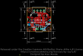
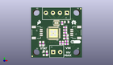
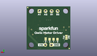
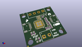

Contents
========

* [PROJ-SPAR-15451-STAN-01>Qwiic Motor Driver](#proj-spar-15451-stan-01qwiic-motor-driver)
	* [Images](#images)
	* [Interactive BOM](#interactive-bom)
	* [OOMP Parts](#oomp-parts)
	* [Tags](#tags)
  
![][im]
# PROJ-SPAR-15451-STAN-01>Qwiic Motor Driver

- ID: PROJ-SPAR-15451-STAN-01
- Hex ID: PRS15451
- Name: Qwiic Motor Driver
- Description: 

## Images
  
  

|eagleImage|kicadPcb3dFront|kicadPcb3dBack|kicadPcb3d|
| :---: | :---: | :---: | :---: |
|||||

## Interactive BOM

- Interactive BOM page: [ibom.html](kicad/bom/ibom.html)

## OOMP Parts
  

|OOMP Parts|
| :---: |
|CAPC-0805-X-UNMATCHED-01, C1, 17.779999999999998, 18.034, 0,C1, 10uF, 0805, SparkFun-Capacitors, (0.7, 0.71), R0|
|CAPC-0402-X-NF100-V50, C2, 15.493999999999998, 17.525999999999996, 270,C2, 0.1uF, 0402, SparkFun-Capacitors, (0.61, 0.69), R270|
|CAPC-0402-X-UNMATCHED-01, C3, 17.779999999999998, 8.254999999999999, 0,C3, 1.0uF, 0402, SparkFun-Capacitors, (0.7, 0.325), R0|
|CAPC-0402-X-NF100-V50, C4, 17.779999999999998, 6.858, 0,C4, 0.1uF, 0402, SparkFun-Capacitors, (0.7, 0.27), R0|
|CAPC-0402-X-UNMATCHED-01, C5, 17.018, 12.572999999999999, 0,C5, 1.0uF, 0402, SparkFun-Capacitors, (0.67, 0.495), R0|
|CAPC-0402-X-NF100-V50, C6, 17.018, 13.9446, 0,C6, 0.1uF, 0402, SparkFun-Capacitors, (0.67, 0.549), R0|
|CAPC-0402-X-UNMATCHED-01, C7, 17.018, 15.316199999999998, 0,C7, 1.0uF, 0402, SparkFun-Capacitors, (0.67, 0.603), R0|
|CAPC-0402-X-UNMATCHED-01, C8, 15.875, 7.492999999999999, 270,C8, 1.0uF, 0402, SparkFun-Capacitors, (0.625, 0.295), R270|
|CAPC-0402-X-NF100-V50, C9, 14.477999999999998, 7.492999999999999, 270,C9, 0.1uF, 0402, SparkFun-Capacitors, (0.57, 0.295), R270|
|UNMATCHED-0603-X-UNMATCHED-01, D1, 6.35, 2.1590000000000003, 90,D1, BLUE, LED-0603, SparkFun-LED, (0.25, 0.085), R90|
|ERROR, J1 Power In, 0, 0, 0,J1, Power, In, SCREWTERMINAL-3.5MM-2, SparkFun-Connectors, (0.435, 0.11), R0|
|ERROR, J2 Motor Connections, 0, 0, 0,J2, Motor, Connections, SCREWTERMINAL-3.5MM-4, SparkFun-Connectors, (0.705, 0.89), R180|
|UNMATCHED-UNMATCHED-X-UNMATCHED-01, J3, 5.08, 12.7, 270,J3, Qwiic, JST04_1MM_RA, SparkFun-Connectors, (0.2, 0.5), R270|
|UNMATCHED-UNMATCHED-X-UNMATCHED-01, J4, 20.32, 12.7, 90,J4, Qwiic, JST04_1MM_RA, SparkFun-Connectors, (0.8, 0.5), R90|
|UNMATCHED-UNMATCHED-X-UNMATCHED-01, JP1, 7.492999999999999, 6.095999999999999, M90,JP1, JUMPER-PAD-2, SMT-JUMPER_2_NO_NO-SILK, SparkFun-Jumpers, (0.295, 0.24), MR90|
|UNMATCHED-UNMATCHED-X-UNMATCHED-01, JP2, 9.779, 6.095999999999999, M90,JP2, JUMPER-PAD-2, SMT-JUMPER_2_NO_NO-SILK, SparkFun-Jumpers, (0.385, 0.24), MR90|
|UNMATCHED-UNMATCHED-X-UNMATCHED-01, JP3, 12.065, 6.095999999999999, M90,JP3, JUMPER-PAD-2, SMT-JUMPER_2_NO_NO-SILK, SparkFun-Jumpers, (0.475, 0.24), MR90|
|UNMATCHED-UNMATCHED-X-UNMATCHED-01, JP4, 14.350999999999997, 6.223, M90,JP4, JUMPER-PAD-2, SMT-JUMPER_2_NC_TRACE_NO-SILK, SparkFun-Jumpers, (0.565, 0.245), MR90|
|UNMATCHED-UNMATCHED-X-UNMATCHED-01, JP6, 2.2859999999999996, 7.238999999999999, M90,JP6, JUMPER-SMT_3_2-NC_TRACE_NO-SILK, SMT-JUMPER_3_2-NC_TRACE_NO-SILK, SparkFun-Jumpers, (0.09, 0.285), MR90|
|RESE-0603-X-UNMATCHED-01, R1, 7.874, 2.1590000000000003, 270,R1, 470, 0603, SparkFun-Resistors, (0.31, 0.085), R270|
|RESE-0603-X-UNMATCHED-01, R2, 4.571999999999999, 6.985, 270,R2, 4.7k, 0603, SparkFun-Resistors, (0.18, 0.275), R270|
|RESE-0603-X-UNMATCHED-01, R3, 6.095999999999999, 6.985, 270,R3, 4.7k, 0603, SparkFun-Resistors, (0.24, 0.275), R270|
|RESE-0603-X-UNMATCHED-01, R4, 17.399, 9.6774, 0,R4, 1, 0603, SparkFun-Resistors, (0.685, 0.381), R0|
|RESE-0603-X-UNMATCHED-01, R5, 17.399, 11.150599999999999, 0,R5, 1, 0603, SparkFun-Resistors, (0.685, 0.439), R0|
|UNMATCHED-UNMATCHED-X-UNMATCHED-01, U1, 12.7, 17.525999999999996, 180,U1, DRV8835, WSON-12, SparkFun-IC-Special-Function, (0.5, 0.69), R180|
|UNMATCHED-UNMATCHED-X-UNMATCHED-01, U2, 11.2014, 12.318999999999999, 180,U2, CY8C4245LQI-483, QFN-40, SparkFun-IC-Microcontroller, (0.441, 0.485), R180|

## Tags

- hexID: PRS15451
- oompType: PROJ
- oompSize: SPAR
- oompColor: 15451
- oompDesc: STAN
- oompIndex: 01
- oompName: Qwiic Motor Driver
- sources: All source files from https://github.com/sparkfun/Qwiic_Motor_Driver (source licence details in srcLicense.md)
- linkBuyPage: https://www.sparkfun.com/products/15451
- oompID: PROJ-SPAR-15451-STAN-01
- oompPart: CAPC-0805-X-UNMATCHED-01, C1, 17.779999999999998, 18.034, 0
- oompPart: CAPC-0402-X-NF100-V50, C2, 15.493999999999998, 17.525999999999996, 270
- oompPart: CAPC-0402-X-UNMATCHED-01, C3, 17.779999999999998, 8.254999999999999, 0
- oompPart: CAPC-0402-X-NF100-V50, C4, 17.779999999999998, 6.858, 0
- oompPart: CAPC-0402-X-UNMATCHED-01, C5, 17.018, 12.572999999999999, 0
- oompPart: CAPC-0402-X-NF100-V50, C6, 17.018, 13.9446, 0
- oompPart: CAPC-0402-X-UNMATCHED-01, C7, 17.018, 15.316199999999998, 0
- oompPart: CAPC-0402-X-UNMATCHED-01, C8, 15.875, 7.492999999999999, 270
- oompPart: CAPC-0402-X-NF100-V50, C9, 14.477999999999998, 7.492999999999999, 270
- oompPart: UNMATCHED-0603-X-UNMATCHED-01, D1, 6.35, 2.1590000000000003, 90
- oompPart: SKIP-UNMATCHED-X-UNMATCHED-01, FD1, 0.635, 0.635, 0
- oompPart: SKIP-UNMATCHED-X-UNMATCHED-01, FD2, 0.635, 0.635, M0
- oompPart: SKIP-UNMATCHED-X-UNMATCHED-01, FD3, 24.764999999999997, 24.764999999999997, 0
- oompPart: SKIP-UNMATCHED-X-UNMATCHED-01, FD4, 24.764999999999997, 24.764999999999997, M0
- oompPart: ERROR, J1 Power In, 0, 0, 0
- oompPart: ERROR, J2 Motor Connections, 0, 0, 0
- oompPart: UNMATCHED-UNMATCHED-X-UNMATCHED-01, J3, 5.08, 12.7, 270
- oompPart: UNMATCHED-UNMATCHED-X-UNMATCHED-01, J4, 20.32, 12.7, 90
- oompPart: UNMATCHED-UNMATCHED-X-UNMATCHED-01, JP1, 7.492999999999999, 6.095999999999999, M90
- oompPart: UNMATCHED-UNMATCHED-X-UNMATCHED-01, JP2, 9.779, 6.095999999999999, M90
- oompPart: UNMATCHED-UNMATCHED-X-UNMATCHED-01, JP3, 12.065, 6.095999999999999, M90
- oompPart: UNMATCHED-UNMATCHED-X-UNMATCHED-01, JP4, 14.350999999999997, 6.223, M90
- oompPart: UNMATCHED-UNMATCHED-X-UNMATCHED-01, JP6, 2.2859999999999996, 7.238999999999999, M90
- oompPart: RESE-0603-X-UNMATCHED-01, R1, 7.874, 2.1590000000000003, 270
- oompPart: RESE-0603-X-UNMATCHED-01, R2, 4.571999999999999, 6.985, 270
- oompPart: RESE-0603-X-UNMATCHED-01, R3, 6.095999999999999, 6.985, 270
- oompPart: RESE-0603-X-UNMATCHED-01, R4, 17.399, 9.6774, 0
- oompPart: RESE-0603-X-UNMATCHED-01, R5, 17.399, 11.150599999999999, 0
- oompPart: SKIP-UNMATCHED-X-UNMATCHED-01, TP1, 3.8099999999999996, 13.208, 0
- oompPart: SKIP-UNMATCHED-X-UNMATCHED-01, TP2, 0.7619999999999999, 13.334999999999999, 0
- oompPart: SKIP-UNMATCHED-X-UNMATCHED-01, TP3, 2.54, 11.43, 0
- oompPart: SKIP-UNMATCHED-X-UNMATCHED-01, TP4, 14.604999999999999, 9.143999999999998, 0
- oompPart: SKIP-UNMATCHED-X-UNMATCHED-01, TP5, 21.843999999999998, 8.889999999999999, 0
- oompPart: SKIP-UNMATCHED-X-UNMATCHED-01, TP6, 22.605999999999998, 11.811, 0
- oompPart: UNMATCHED-UNMATCHED-X-UNMATCHED-01, U1, 12.7, 17.525999999999996, 180
- oompPart: UNMATCHED-UNMATCHED-X-UNMATCHED-01, U2, 11.2014, 12.318999999999999, 180
- rawPart: C1, 10uF, 0805, SparkFun-Capacitors, (0.7, 0.71), R0
- rawPart: C2, 0.1uF, 0402, SparkFun-Capacitors, (0.61, 0.69), R270
- rawPart: C3, 1.0uF, 0402, SparkFun-Capacitors, (0.7, 0.325), R0
- rawPart: C4, 0.1uF, 0402, SparkFun-Capacitors, (0.7, 0.27), R0
- rawPart: C5, 1.0uF, 0402, SparkFun-Capacitors, (0.67, 0.495), R0
- rawPart: C6, 0.1uF, 0402, SparkFun-Capacitors, (0.67, 0.549), R0
- rawPart: C7, 1.0uF, 0402, SparkFun-Capacitors, (0.67, 0.603), R0
- rawPart: C8, 1.0uF, 0402, SparkFun-Capacitors, (0.625, 0.295), R270
- rawPart: C9, 0.1uF, 0402, SparkFun-Capacitors, (0.57, 0.295), R270
- rawPart: D1, BLUE, LED-0603, SparkFun-LED, (0.25, 0.085), R90
- rawPart: FD1, FIDUCIALUFIDUCIAL, FIDUCIAL-MICRO, SparkFun-Aesthetics, (0.025, 0.025), R0
- rawPart: FD2, FIDUCIALUFIDUCIAL, FIDUCIAL-MICRO, SparkFun-Aesthetics, (0.025, 0.025), MR0
- rawPart: FD3, FIDUCIALUFIDUCIAL, FIDUCIAL-MICRO, SparkFun-Aesthetics, (0.975, 0.975), R0
- rawPart: FD4, FIDUCIALUFIDUCIAL, FIDUCIAL-MICRO, SparkFun-Aesthetics, (0.975, 0.975), MR0
- rawPart: J1, Power, In, SCREWTERMINAL-3.5MM-2, SparkFun-Connectors, (0.435, 0.11), R0
- rawPart: J2, Motor, Connections, SCREWTERMINAL-3.5MM-4, SparkFun-Connectors, (0.705, 0.89), R180
- rawPart: J3, Qwiic, JST04_1MM_RA, SparkFun-Connectors, (0.2, 0.5), R270
- rawPart: J4, Qwiic, JST04_1MM_RA, SparkFun-Connectors, (0.8, 0.5), R90
- rawPart: JP1, JUMPER-PAD-2, SMT-JUMPER_2_NO_NO-SILK, SparkFun-Jumpers, (0.295, 0.24), MR90
- rawPart: JP2, JUMPER-PAD-2, SMT-JUMPER_2_NO_NO-SILK, SparkFun-Jumpers, (0.385, 0.24), MR90
- rawPart: JP3, JUMPER-PAD-2, SMT-JUMPER_2_NO_NO-SILK, SparkFun-Jumpers, (0.475, 0.24), MR90
- rawPart: JP4, JUMPER-PAD-2, SMT-JUMPER_2_NC_TRACE_NO-SILK, SparkFun-Jumpers, (0.565, 0.245), MR90
- rawPart: JP6, JUMPER-SMT_3_2-NC_TRACE_NO-SILK, SMT-JUMPER_3_2-NC_TRACE_NO-SILK, SparkFun-Jumpers, (0.09, 0.285), MR90
- rawPart: R1, 470, 0603, SparkFun-Resistors, (0.31, 0.085), R270
- rawPart: R2, 4.7k, 0603, SparkFun-Resistors, (0.18, 0.275), R270
- rawPart: R3, 4.7k, 0603, SparkFun-Resistors, (0.24, 0.275), R270
- rawPart: R4, 1, 0603, SparkFun-Resistors, (0.685, 0.381), R0
- rawPart: R5, 1, 0603, SparkFun-Resistors, (0.685, 0.439), R0
- rawPart: TP1, TP_15TH, SparkFun-Connectors, (0.15, 0.52), R0
- rawPart: TP2, TP_15TH, SparkFun-Connectors, (0.03, 0.525), R0
- rawPart: TP3, TP_15TH, SparkFun-Connectors, (0.1, 0.45), R0
- rawPart: TP4, TP_15TH, SparkFun-Connectors, (0.575, 0.36), R0
- rawPart: TP5, TP_15TH, SparkFun-Connectors, (0.86, 0.35), R0
- rawPart: TP6, TP_15TH, SparkFun-Connectors, (0.89, 0.465), R0
- rawPart: U1, DRV8835, WSON-12, SparkFun-IC-Special-Function, (0.5, 0.69), R180
- rawPart: U2, CY8C4245LQI-483, QFN-40, SparkFun-IC-Microcontroller, (0.441, 0.485), R180

[im]: kicadPcb3d_450.png
