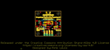
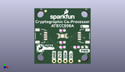
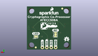
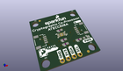

Contents
========

* [PROJ-SPAR-15573-STAN-01>SparkFun Cryptographic Co-Processor Breakout ATECC508A Qwiic](#proj-spar-15573-stan-01sparkfun-cryptographic-co-processor-breakout-atecc508a-qwiic)
	* [Images](#images)
	* [Interactive BOM](#interactive-bom)
	* [OOMP Parts](#oomp-parts)
	* [Tags](#tags)
  
![][im]
# PROJ-SPAR-15573-STAN-01>SparkFun Cryptographic Co-Processor Breakout ATECC508A Qwiic

- ID: PROJ-SPAR-15573-STAN-01
- Hex ID: PRS15573
- Name: SparkFun Cryptographic Co-Processor Breakout ATECC508A Qwiic
- Description: 

## Images
  
  

|eagleImage|kicadPcb3dFront|kicadPcb3dBack|kicadPcb3d|
| :---: | :---: | :---: | :---: |
|||||

## Interactive BOM

- Interactive BOM page: [ibom.html](kicad/bom/ibom.html)

## OOMP Parts
  

|OOMP Parts|
| :---: |
|CAPE-0603-X-NF100-01, C1, 12.7, 15.239999999999998, 180,C1, 0.1uF, 0603, SparkFun-Capacitors, (0.5, 0.6), R180|
|UNMATCHED-0603-X-UNMATCHED-01, D1, 22.5806, 7.619999999999999, 0,D1, RED, LED-0603, SparkFun-LED, (0.889, 0.3), R0|
|UNMATCHED-UNMATCHED-X-UNMATCHED-01, FD1, 5.08, 24.13, 0,FD1, FIDUCIAL1X2, FIDUCIAL-1X2, SparkFun-Aesthetics, (0.2, 0.95), R0|
|UNMATCHED-UNMATCHED-X-UNMATCHED-01, FD2, 20.32, 1.27, 0,FD2, FIDUCIAL1X2, FIDUCIAL-1X2, SparkFun-Aesthetics, (0.8, 0.05), R0|
|UNMATCHED-UNMATCHED-X-UNMATCHED-01, FD3, 20.32, 1.27, M0,FD3, FIDUCIAL1X2, FIDUCIAL-1X2, SparkFun-Aesthetics, (0.8, 0.05), MR0|
|UNMATCHED-UNMATCHED-X-UNMATCHED-01, FD4, 5.08, 24.13, M0,FD4, FIDUCIAL1X2, FIDUCIAL-1X2, SparkFun-Aesthetics, (0.2, 0.95), MR0|
|UNMATCHED-UNMATCHED-X-UNMATCHED-01, I2C, 8.889999999999999, 8.889999999999999, M90,I2C, SMT-JUMPER_3_2-NC_TRACE_SILK, SparkFun-Jumpers, (0.35, 0.35), MR90|
|UNMATCHED-UNMATCHED-X-UNMATCHED-01, J1, 20.32, 12.7, 90,J1, QWIIC, JST04_1MM_RA, SparkFun-Connectors, (0.8, 0.5), R90|
|UNMATCHED-UNMATCHED-X-UNMATCHED-01, J2, 5.08, 12.7, 270,J2, QWIIC, JST04_1MM_RA, SparkFun-Connectors, (0.2, 0.5), R270|
|UNMATCHED-UNMATCHED-X-UNMATCHED-01, J3, 8.889999999999999, 1.27, 0,J3, PTH, 1X04_NO_SILK, SparkFun-Connectors, (0.35, 0.05), R0|
|UNMATCHED-UNMATCHED-X-UNMATCHED-01, LED, 20.1676, 7.6453999999999995, M180,LED, SMT-JUMPER_2_NC_TRACE_SILK, SparkFun-Jumpers, (0.794, 0.301), MR180|
|RESE-0603-X-UNMATCHED-01, R1, 12.7, 9.8298, 180,R1, 4.7k, 0603, SparkFun-Resistors, (0.5, 0.387), R180|
|RESE-0603-X-UNMATCHED-01, R2, 12.7, 7.619999999999999, 180,R2, 4.7k, 0603, SparkFun-Resistors, (0.5, 0.3), R180|
|RESE-0603-X-UNMATCHED-01, R3, 19.049999999999997, 7.619999999999999, 180,R3, 1k, 0603, SparkFun-Resistors, (0.75, 0.3), R180|
|UNMATCHED-UNMATCHED-X-UNMATCHED-01, U1, 12.7, 12.7, 270,U1, ATECC508A, UDFN_2X3MM, SparkFun-IC-Special-Function, (0.5, 0.5), R270|

## Tags

- hexID: PRS15573
- oompType: PROJ
- oompSize: SPAR
- oompColor: 15573
- oompDesc: STAN
- oompIndex: 01
- oompName: SparkFun Cryptographic Co-Processor Breakout ATECC508A Qwiic
- sources: All source files from https://github.com/sparkfun/SparkFun_Cryptographic_Co-Processor_Breakout_ATECC508A_Qwiic (source licence details in srcLicense.md)
- linkBuyPage: https://www.sparkfun.com/products/15573
- oompPart: CAPE-0603-X-NF100-01, C1, 12.7, 15.239999999999998, 180
- oompPart: UNMATCHED-0603-X-UNMATCHED-01, D1, 22.5806, 7.619999999999999, 0
- oompPart: UNMATCHED-UNMATCHED-X-UNMATCHED-01, FD1, 5.08, 24.13, 0
- oompPart: UNMATCHED-UNMATCHED-X-UNMATCHED-01, FD2, 20.32, 1.27, 0
- oompPart: UNMATCHED-UNMATCHED-X-UNMATCHED-01, FD3, 20.32, 1.27, M0
- oompPart: UNMATCHED-UNMATCHED-X-UNMATCHED-01, FD4, 5.08, 24.13, M0
- oompPart: UNMATCHED-UNMATCHED-X-UNMATCHED-01, I2C, 8.889999999999999, 8.889999999999999, M90
- oompPart: UNMATCHED-UNMATCHED-X-UNMATCHED-01, J1, 20.32, 12.7, 90
- oompPart: UNMATCHED-UNMATCHED-X-UNMATCHED-01, J2, 5.08, 12.7, 270
- oompPart: UNMATCHED-UNMATCHED-X-UNMATCHED-01, J3, 8.889999999999999, 1.27, 0
- oompPart: UNMATCHED-UNMATCHED-X-UNMATCHED-01, LED, 20.1676, 7.6453999999999995, M180
- oompPart: RESE-0603-X-UNMATCHED-01, R1, 12.7, 9.8298, 180
- oompPart: RESE-0603-X-UNMATCHED-01, R2, 12.7, 7.619999999999999, 180
- oompPart: RESE-0603-X-UNMATCHED-01, R3, 19.049999999999997, 7.619999999999999, 180
- oompPart: UNMATCHED-UNMATCHED-X-UNMATCHED-01, U1, 12.7, 12.7, 270
- rawPart: C1, 0.1uF, 0603, SparkFun-Capacitors, (0.5, 0.6), R180
- rawPart: D1, RED, LED-0603, SparkFun-LED, (0.889, 0.3), R0
- rawPart: FD1, FIDUCIAL1X2, FIDUCIAL-1X2, SparkFun-Aesthetics, (0.2, 0.95), R0
- rawPart: FD2, FIDUCIAL1X2, FIDUCIAL-1X2, SparkFun-Aesthetics, (0.8, 0.05), R0
- rawPart: FD3, FIDUCIAL1X2, FIDUCIAL-1X2, SparkFun-Aesthetics, (0.8, 0.05), MR0
- rawPart: FD4, FIDUCIAL1X2, FIDUCIAL-1X2, SparkFun-Aesthetics, (0.2, 0.95), MR0
- rawPart: I2C, SMT-JUMPER_3_2-NC_TRACE_SILK, SparkFun-Jumpers, (0.35, 0.35), MR90
- rawPart: J1, QWIIC, JST04_1MM_RA, SparkFun-Connectors, (0.8, 0.5), R90
- rawPart: J2, QWIIC, JST04_1MM_RA, SparkFun-Connectors, (0.2, 0.5), R270
- rawPart: J3, PTH, 1X04_NO_SILK, SparkFun-Connectors, (0.35, 0.05), R0
- rawPart: LED, SMT-JUMPER_2_NC_TRACE_SILK, SparkFun-Jumpers, (0.794, 0.301), MR180
- rawPart: R1, 4.7k, 0603, SparkFun-Resistors, (0.5, 0.387), R180
- rawPart: R2, 4.7k, 0603, SparkFun-Resistors, (0.5, 0.3), R180
- rawPart: R3, 1k, 0603, SparkFun-Resistors, (0.75, 0.3), R180
- rawPart: U1, ATECC508A, UDFN_2X3MM, SparkFun-IC-Special-Function, (0.5, 0.5), R270

[im]: kicadPcb3d_450.png
