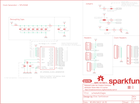

Contents
========

* [PRS15734 > SparkFun Clock Generator 5P49V60](#prs15734--sparkfun-clock-generator-5p49v60)
	* [Schematic](#schematic)
	* [PCB](#pcb)
	* [Interactive BOM](#interactive-bom)
	* [OOMP Parts](#oomp-parts)
	* [Images](#images)
	* [Tags](#tags)
  
![][im]
# PRS15734 > SparkFun Clock Generator 5P49V60

- ID: PROJ-SPAR-15734-STAN-01
- Hex ID: PRS15734
- Name: Sparkfun
- Description: Sparkfun
- Long Link: [http://oom.lt/PROJ-SPAR-15734-STAN-01](http://oom.lt/PROJ-SPAR-15734-STAN-01)
- Short Link: [http://oom.lt/PRS15734](http://oom.lt/PRS15734)

## Schematic
  

## PCB
  

## Interactive BOM

- Interactive BOM page: [ibom.html](https://htmlpreview.github.io/?https://github.com/oomlout/oomlout_OOMP_projects/blob/main/PROJ-SPAR-15734-STAN-01/kicad/bom/ibom.html)

## OOMP Parts
  

|OOMP ID|Name|Identifier|
| :---: | :---: | :---: |
|[CAPC-0402-X-NF100-V10](https://github.com/oomlout/oomlout_OOMP_parts/tree/main/CAPC-0402-X-NF100-V10/)|[SMD (0402) 100 nF Capacitor (Ceramic) 10v](https://github.com/oomlout/oomlout_OOMP_parts/tree/main/CAPC-0402-X-NF100-V10/)|[C1, C2, C3, C4, C5, C6, C7](https://github.com/oomlout/oomlout_OOMP_parts/tree/main/CAPC-0402-X-NF100-V10/)|
|CAPC-0402-X-UNMATCHED-01||C8|
|[CAPC-0603-X-UF10-V63D](https://github.com/oomlout/oomlout_OOMP_parts/tree/main/CAPC-0603-X-UF10-V63D/)|[SMD (0603) 10 uF Capacitor (Ceramic) 6.3v](https://github.com/oomlout/oomlout_OOMP_parts/tree/main/CAPC-0603-X-UF10-V63D/)|[C9](https://github.com/oomlout/oomlout_OOMP_parts/tree/main/CAPC-0603-X-UF10-V63D/)|
|[CAPC-0402-X-PF12-V50](https://github.com/oomlout/oomlout_OOMP_parts/tree/main/CAPC-0402-X-PF12-V50/)|[SMD (0402) 12 pF Capacitor (Ceramic) 50v](https://github.com/oomlout/oomlout_OOMP_parts/tree/main/CAPC-0402-X-PF12-V50/)|[C10, C12](https://github.com/oomlout/oomlout_OOMP_parts/tree/main/CAPC-0402-X-PF12-V50/)|
|[LEDS-0603-R-STAN-01](https://github.com/oomlout/oomlout_OOMP_parts/tree/main/LEDS-0603-R-STAN-01/)|[SMD (0603) Red LED](https://github.com/oomlout/oomlout_OOMP_parts/tree/main/LEDS-0603-R-STAN-01/)|[D1](https://github.com/oomlout/oomlout_OOMP_parts/tree/main/LEDS-0603-R-STAN-01/)|
|FERB-0402-X-UNMATCHED-01||FB1|
|UNMATCHED-UNMATCHED-X-UNMATCHED-01||J1, J2, U1, Y1|
|[HEAD-I01-X-PI08-01](https://github.com/oomlout/oomlout_OOMP_parts/tree/main/HEAD-I01-X-PI08-01/)|[2.54 mm 8 Pin Header](https://github.com/oomlout/oomlout_OOMP_parts/tree/main/HEAD-I01-X-PI08-01/)|[J3, J5](https://github.com/oomlout/oomlout_OOMP_parts/tree/main/HEAD-I01-X-PI08-01/)|
|[HEAD-I01-X-PI05-01](https://github.com/oomlout/oomlout_OOMP_parts/tree/main/HEAD-I01-X-PI05-01/)|[2.54 mm 5 Pin Header](https://github.com/oomlout/oomlout_OOMP_parts/tree/main/HEAD-I01-X-PI05-01/)|[J4](https://github.com/oomlout/oomlout_OOMP_parts/tree/main/HEAD-I01-X-PI05-01/)|
|HEAD-I01-X-PI01-01||J7, J8|
|[RESE-0402-X-O103-01](https://github.com/oomlout/oomlout_OOMP_parts/tree/main/RESE-0402-X-O103-01/)|[SMD (0402) 10k Ohm Resistor](https://github.com/oomlout/oomlout_OOMP_parts/tree/main/RESE-0402-X-O103-01/)|[R1, R2, R5](https://github.com/oomlout/oomlout_OOMP_parts/tree/main/RESE-0402-X-O103-01/)|
|RESE-0402-X-UNMATCHED-01||R3|
|RESE-0603-X-UNMATCHED-01||R4|

## Images
  
  

|bominteractivefront|bominteractiveback|kicadPcb3d|kicadPcb3dFront|kicadPcb3dBack|eagleImage|eagleSchemImage|pcbdraw|pcbdrawback|
| :---: | :---: | :---: | :---: | :---: | :---: | :---: | :---: | :---: |
||||||||||

## Tags

- hexID: PRS15734
- oompType: PROJ
- oompSize: SPAR
- oompColor: 15734
- oompDesc: STAN
- oompIndex: 01
- oompName: SparkFun Clock Generator 5P49V60
- sources: All source files from https://github.com/sparkfun/SparkFun_Clock_Generator_5P49V60 (source licence details in srcLicense.md)
- linkBuyPage: https://www.sparkfun.com/products/15734
- oompID: PROJ-SPAR-15734-STAN-01
- oompParts: C1,CAPC-0402-X-NF100-V10
- oompParts: C2,CAPC-0402-X-NF100-V10
- oompParts: C3,CAPC-0402-X-NF100-V10
- oompParts: C4,CAPC-0402-X-NF100-V10
- oompParts: C5,CAPC-0402-X-NF100-V10
- oompParts: C6,CAPC-0402-X-NF100-V10
- oompParts: C7,CAPC-0402-X-NF100-V10
- oompParts: C8,CAPC-0402-X-UNMATCHED-01
- oompParts: C9,CAPC-0603-X-UF10-V63D
- oompParts: C10,CAPC-0402-X-PF12-V50
- oompParts: C12,CAPC-0402-X-PF12-V50
- oompParts: D1,LEDS-0603-R-STAN-01
- oompParts: FB1,FERB-0402-X-UNMATCHED-01
- oompParts: J1,UNMATCHED-UNMATCHED-X-UNMATCHED-01
- oompParts: J2,UNMATCHED-UNMATCHED-X-UNMATCHED-01
- oompParts: J3,HEAD-I01-X-PI08-01
- oompParts: J4,HEAD-I01-X-PI05-01
- oompParts: J5,HEAD-I01-X-PI08-01
- oompParts: J7,HEAD-I01-X-PI01-01
- oompParts: J8,HEAD-I01-X-PI01-01
- oompParts: R1,RESE-0402-X-O103-01
- oompParts: R2,RESE-0402-X-O103-01
- oompParts: R3,RESE-0402-X-UNMATCHED-01
- oompParts: R4,RESE-0603-X-UNMATCHED-01
- oompParts: R5,RESE-0402-X-O103-01
- oompParts: U1,UNMATCHED-UNMATCHED-X-UNMATCHED-01
- oompParts: Y1,UNMATCHED-UNMATCHED-X-UNMATCHED-01
- rawParts: C1,0.1uF,0.1UF-0402-16V-10%,0402,0.1µF ceramic capacitors,,,CAP-12416,,0.1uF,
- rawParts: C2,0.1uF,0.1UF-0402-16V-10%,0402,0.1µF ceramic capacitors,,,CAP-12416,,0.1uF,
- rawParts: C3,0.1uF,0.1UF-0402-16V-10%,0402,0.1µF ceramic capacitors,,,CAP-12416,,0.1uF,
- rawParts: C4,0.1uF,0.1UF-0402-16V-10%,0402,0.1µF ceramic capacitors,,,CAP-12416,,0.1uF,
- rawParts: C5,0.1uF,0.1UF-0402-16V-10%,0402,0.1µF ceramic capacitors,,,CAP-12416,,0.1uF,
- rawParts: C6,0.1uF,0.1UF-0402-16V-10%,0402,0.1µF ceramic capacitors,,,CAP-12416,,0.1uF,
- rawParts: C7,0.1uF,0.1UF-0402-16V-10%,0402,0.1µF ceramic capacitors,,,CAP-12416,,0.1uF,
- rawParts: C8,1.0uF,1.0UF-0402-16V-10%,0402,1µF ceramic capacitors,,,CAP-12417,,1.0uF,
- rawParts: C9,10uF,10UF-0603-6.3V-20%,0603,10.0µF ceramic capacitors,,,CAP-11015,,10uF,
- rawParts: C10,12pF,12PF-0402-50V-5%,0402,12pF ceramic capacitors,,,CAP-14665,,12pF,
- rawParts: C12,12pF,12PF-0402-50V-5%,0402,12pF ceramic capacitors,,,CAP-14665,,12pF,
- rawParts: D1,RED,LED-RED0603,LED-0603,Red SMD LED,,,DIO-00819,,RED,
- rawParts: FB1,FERRITE_BEAD-120_OHM-0402,FERRITE_BEAD-120_OHM-0402,0402,Ferrite Bead (blocks, cores, rings, chokes, etc.),,BLM15HB121SN1D,NDUC-14206,,,
- rawParts: FD1,FIDUCIALUFIDUCIAL,FIDUCIALUFIDUCIAL,FIDUCIAL-MICRO,Fiducial Alignment Points,,,,,,
- rawParts: FD2,FIDUCIALUFIDUCIAL,FIDUCIALUFIDUCIAL,FIDUCIAL-MICRO,Fiducial Alignment Points,,,,,,
- rawParts: FD3,FIDUCIALUFIDUCIAL,FIDUCIALUFIDUCIAL,FIDUCIAL-MICRO,Fiducial Alignment Points,,,,,,
- rawParts: FD4,FIDUCIALUFIDUCIAL,FIDUCIALUFIDUCIAL,FIDUCIAL-MICRO,Fiducial Alignment Points,,,,,,
- rawParts: FRAME1,FRAME-LETTER,FRAME-LETTER,CREATIVE_COMMONS,Schematic Frame - Letter,,,,,,
- rawParts: H1,STAND-OFFTIGHT,STAND-OFFTIGHT,STAND-OFF-TIGHT,Stand Off,,,,,,
- rawParts: H2,STAND-OFFTIGHT,STAND-OFFTIGHT,STAND-OFF-TIGHT,Stand Off,,,,,,
- rawParts: J1,QWIIC_RIGHT_ANGLE,QWIIC_CONNECTORJS-1MM,JST04_1MM_RA,SparkFun I2C Standard Qwiic Connector,,,CONN-13694,,QWIIC_RIGHT_ANGLE,
- rawParts: J2,QWIIC_RIGHT_ANGLE,QWIIC_CONNECTORJS-1MM,JST04_1MM_RA,SparkFun I2C Standard Qwiic Connector,,,CONN-13694,,QWIIC_RIGHT_ANGLE,
- rawParts: J3,,CONN_08NO_SILK_FEMALE_PTH,1X08_NO_SILK,Multi connection point. Often used as Generic Header-pin footprint for 0.1 inch spaced/style header connections,,,CONN-08438,,,
- rawParts: J4,,CONN_05NO_SILK,1X05_NO_SILK,Multi connection point. Often used as Generic Header-pin footprint for 0.1 inch spaced/style header connections,,,,,,
- rawParts: J5,,CONN_08NO_SILK_FEMALE_PTH,1X08_NO_SILK,Multi connection point. Often used as Generic Header-pin footprint for 0.1 inch spaced/style header connections,,,CONN-08438,,,
- rawParts: J7,,CONN_01PTH_NO_SILK_SMALL,1X01_SMALL,Single connection point. Often used as Generic Header-pin footprint for 0.1 inch spaced/style header connections,,,,,,
- rawParts: J8,,CONN_01PTH_NO_SILK_SMALL,1X01_SMALL,Single connection point. Often used as Generic Header-pin footprint for 0.1 inch spaced/style header connections,,,,,,
- rawParts: JP1,JUMPER-SMT_3_2-NC_TRACE_SILK,JUMPER-SMT_3_2-NC_TRACE_SILK,SMT-JUMPER_3_2-NC_TRACE_SILK,Normally closed trace jumper (2 of 2 connections),,,,,,
- rawParts: JP2,JUMPER-SMT_2_NO_SILK,JUMPER-SMT_2_NO_SILK,SMT-JUMPER_2_NO_SILK,Normally open jumper,,,,,,
- rawParts: LED,JUMPER-SMT_2_NC_TRACE_SILK,JUMPER-SMT_2_NC_TRACE_SILK,SMT-JUMPER_2_NC_TRACE_SILK,Normally closed trace jumper,,,,,,
- rawParts: LOGO1,SFE_LOGO_NAME.1_INCH,SFE_LOGO_NAME.1_INCH,SFE_LOGO_NAME_.1,SparkFun Font Logo,,,,,,
- rawParts: LOGO2,OSHW-LOGOS,OSHW-LOGOS,OSHW-LOGO-S,Open-Source Hardware (OSHW) Logo,,,,,,
- rawParts: LOGO3,QWIIC_LOGO_4MM,QWIIC_LOGO_4MM,QWIIC_4MM,Qwiic Logos for placement on schematic and PCB. The 5.5mm silk logo is best for placing next to Qwiic connector.,,,,,,
- rawParts: R1,10k,10KOHM-0402-1/16W-1%,0402,10kΩ resistor,,,RES-14241,,10k,
- rawParts: R2,10k,10KOHM-0402-1/16W-1%,0402,10kΩ resistor,,,RES-14241,,10k,
- rawParts: R3,1KOHM-0402-1/16W-1%,1KOHM-0402-1/16W-1%,0402,1kΩ resistor,,,RES-14342,,,
- rawParts: R4,2.2,2.2OHM-0603-1/10W-5%,0603,2.2Ω resistor,,,RES-07823,,2.2,
- rawParts: R5,10k,10KOHM-0402-1/16W-1%,0402,10kΩ resistor,,,RES-14241,,10k,
- rawParts: U1,IDT_5P49V60_CLOCK_GENERATOR,IDT_5P49V60_CLOCK_GENERATOR,VFQFPN-24,Clock Generator 5P49V60,,,IC-14612,,,
- rawParts: Y1,16MHz,CRYSTAL-16MHZ_SMALL,CRYSTAL-SMD-2X2.5MM,16 MHz Crystal,,,XTAL-14664,,16MHz,

[im]: kicadPcb3d_450.png
