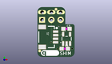
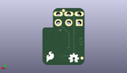
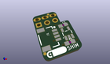

Contents
========

* [PROJ-SPAR-15794-STAN-01>Qwiic Pi SHIM](#proj-spar-15794-stan-01qwiic-pi-shim)
	* [Images](#images)
	* [Interactive BOM](#interactive-bom)
	* [OOMP Parts](#oomp-parts)
	* [Tags](#tags)
  
![][im]
# PROJ-SPAR-15794-STAN-01>Qwiic Pi SHIM

- ID: PROJ-SPAR-15794-STAN-01
- Hex ID: PRS15794
- Name: Qwiic Pi SHIM
- Description: 

## Images
  
  

|eagleImage|kicadPcb3dFront|kicadPcb3dBack|kicadPcb3d|
| :---: | :---: | :---: | :---: |
|||||

## Interactive BOM

- Interactive BOM page: [ibom.html](kicad/bom/ibom.html)

## OOMP Parts
  

|OOMP Parts|
| :---: |
|CAPC-0603-X-UNMATCHED-01, C1, 7.492999999999999, 2.3114, 0,C1, 1.0uF, 0603, SparkFun-Capacitors, (0.295, 0.091), R0|
|CAPC-0603-X-UNMATCHED-01, C3, 7.9502, 7.874, 0,C3, 1.0uF, 0603, SparkFun-Capacitors, (0.313, 0.31), R0|
|ERROR, J1 Qwiic Right, 0, 0, 0,J1, Qwiic, Right, Angle, 1X04_1MM_RA, SparkFun-Connectors, (0.196, 0.22), R270|
|ERROR, J9 SPARKFUN-CONNECTORS_2X3-NS_PISHIM_LOCKING_SLOTS-4MILS Qwiic, 0, 0, 0,J9, SPARKFUN-CONNECTORS_2X3-NS_PISHIM_LOCKING_SLOTS-4MILS, Qwiic, Pi, SHIM, (0.15, 0.45), R0|
|UNMATCHED-UNMATCHED-X-UNMATCHED-01, U2, 7.9756, 5.0546, 0,U2, 3.3V/600mA, SOT23-5, SparkFun-IC-Power, (0.314, 0.199), R0|

## Tags

- hexID: PRS15794
- oompType: PROJ
- oompSize: SPAR
- oompColor: 15794
- oompDesc: STAN
- oompIndex: 01
- oompName: Qwiic Pi SHIM
- sources: All source files from https://github.com/sparkfun/Qwiic_Pi_SHIM (source licence details in srcLicense.md)
- linkBuyPage: https://www.sparkfun.com/products/15794
- oompPart: CAPC-0603-X-UNMATCHED-01, C1, 7.492999999999999, 2.3114, 0
- oompPart: CAPC-0603-X-UNMATCHED-01, C3, 7.9502, 7.874, 0
- oompPart: SKIP-UNMATCHED-X-UNMATCHED-01, FD1, 5.08, 13.3604, 180
- oompPart: SKIP-UNMATCHED-X-UNMATCHED-01, FD2, 0.6096, 1.6764, 180
- oompPart: SKIP-UNMATCHED-X-UNMATCHED-01, FD3, 0.6096, 1.6764, M0
- oompPart: SKIP-UNMATCHED-X-UNMATCHED-01, FD4, 5.08, 13.3604, M0
- oompPart: ERROR, J1 Qwiic Right, 0, 0, 0
- oompPart: ERROR, J9 SPARKFUN-CONNECTORS_2X3-NS_PISHIM_LOCKING_SLOTS-4MILS Qwiic, 0, 0, 0
- oompPart: UNMATCHED-UNMATCHED-X-UNMATCHED-01, U2, 7.9756, 5.0546, 0
- rawPart: C1, 1.0uF, 0603, SparkFun-Capacitors, (0.295, 0.091), R0
- rawPart: C3, 1.0uF, 0603, SparkFun-Capacitors, (0.313, 0.31), R0
- rawPart: FD1, FIDUCIALUFIDUCIAL, FIDUCIAL-MICRO, SparkFun-Aesthetics, (0.2, 0.526), R180
- rawPart: FD2, FIDUCIALUFIDUCIAL, FIDUCIAL-MICRO, SparkFun-Aesthetics, (0.024, 0.066), R180
- rawPart: FD3, FIDUCIALUFIDUCIAL, FIDUCIAL-MICRO, SparkFun-Aesthetics, (0.024, 0.066), MR0
- rawPart: FD4, FIDUCIALUFIDUCIAL, FIDUCIAL-MICRO, SparkFun-Aesthetics, (0.2, 0.526), MR0
- rawPart: J1, Qwiic, Right, Angle, 1X04_1MM_RA, SparkFun-Connectors, (0.196, 0.22), R270
- rawPart: J9, SPARKFUN-CONNECTORS_2X3-NS_PISHIM_LOCKING_SLOTS-4MILS, Qwiic, Pi, SHIM, (0.15, 0.45), R0
- rawPart: U2, 3.3V/600mA, SOT23-5, SparkFun-IC-Power, (0.314, 0.199), R0
- oompID: PROJ-SPAR-15794-STAN-01

[im]: kicadPcb3d_450.png
